# UBOS v5.6.5 Audio/Video Synchronization and Master Audio

## Purpose

UBOS v5.6.5 establishes the authoritative synchronization and master-audio boundary between final video publication and future encoding. It normalizes Program, Preview, AUX, Clean Feed, Monitor, Record, and Stream media references to the existing FrameTick-driven master timeline, measures skew and drift, selects explicit bounded corrections, processes master audio metadata, and publishes immutable correlation snapshots. It does not encode, mux, record, stream, resample, time-stretch, pitch-shift, interpolate video, own pixels, own PCM, create another clock, or run an independent loop.

## Architectural position

v5.6.5 runs after v5.6.1 Audio Mixer, v5.6.2 Channel Strip/Routing, v5.6.3 EQ/Dynamics, and v5.6.4 Loudness/Metering have produced authoritative metadata. It runs before the v5.6.6 Media Encoder Foundation.

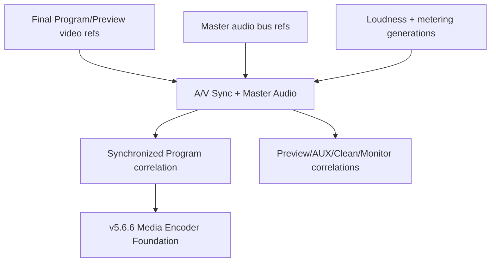

## Relationship to v5.6.1-v5.6.4

The master-audio bus consumes metadata from mixer, channel-strip routing, EQ/dynamics, and loudness/metering foundations. Limiter and metering generations are validated as metadata and surfaced in snapshots so duplicate limiter processing and stale metering state are observable.

## Time model, master timeline, and rational time bases

The engine uses the existing FrameTick as the only runtime driver. All video PTS and audio sample positions are converted through rational time bases to the master timeline time base. Conversion is deterministic and O(1).

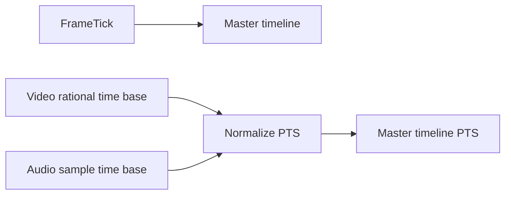

## Clock domains and clock correlation

Clock domains are metadata-only descriptors for video, audio, and master authority. Correlations contain generation, offset, drift ppm, selected authority, and safe metadata.

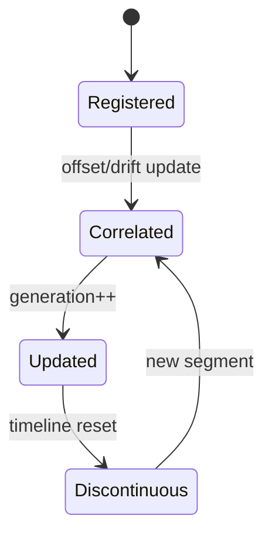

## A/V sync state, tolerances, and modes

Sync state is `LOCKED`, `AUDIO_LEADS`, `VIDEO_LEADS`, `DRIFTING`, `DISCONTINUITY`, `DEGRADED`, or `FAILED`. Tolerances are explicit per request. Modes include strict publication, bounded audio delay, bounded video hold, and degraded metadata-only publication.

## Correction policies

Corrections are explicit and bounded: none, delay audio, hold video, drop late optional input, insert silence metadata, or mark degraded. No hidden correction is allowed.

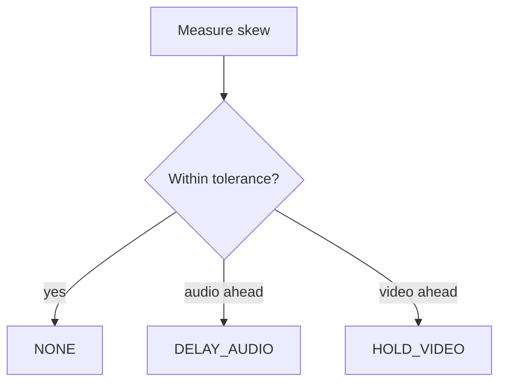

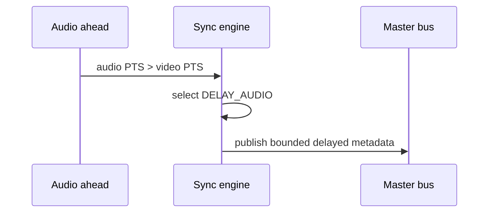

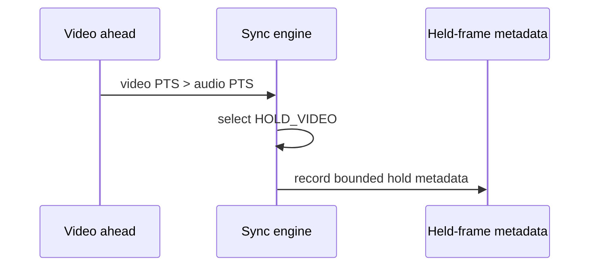

## Drift detection and recovery

Drift is derived deterministically from repeated skew observations. Abrupt discontinuity starts a new segment and clears stale correlation state.

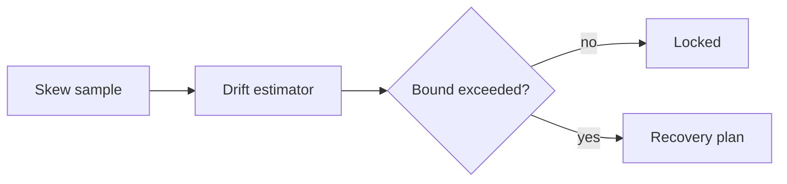

## Discontinuities and timeline resets

Discontinuities increment segment generation and reset last accepted video/audio monotonic tracking so stale held output cannot be mislabeled current.

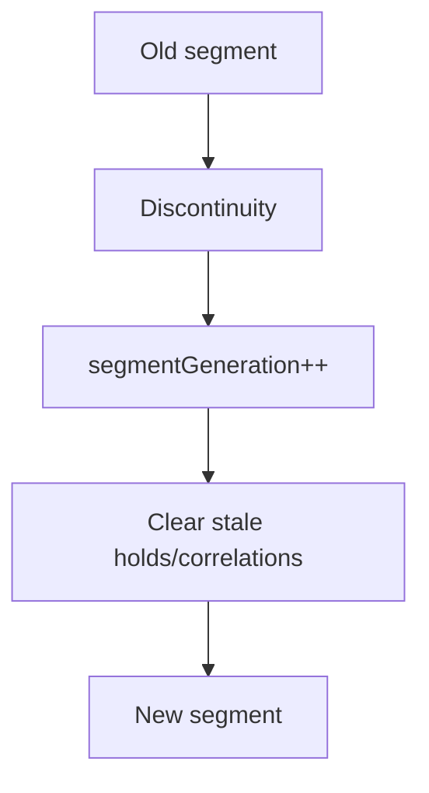

## Requests, plans, and results

A sync request references video/audio metadata and expected generations. A plan contains normalized timestamps, skew, drift, selected authority, correction policy, and operation count. A result publishes synchronized metadata only when valid or explicitly degraded.

## Master audio bus and processing order

Master buses exist for Program, Preview, AUX, Clean Feed, Monitor, Record, and Stream. Processing order is sync plan, master bus processing, limiter/meter generation validation, correlation publish, telemetry/watchdog update, and expired hold release.

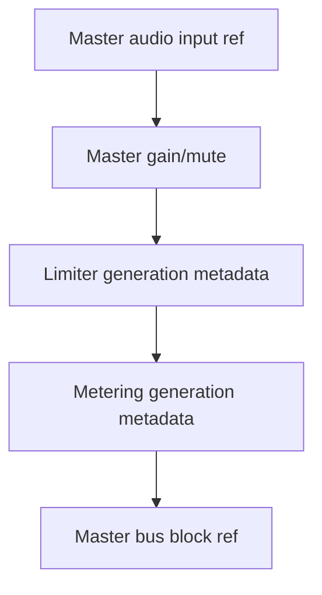

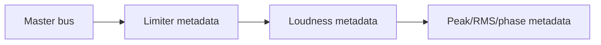

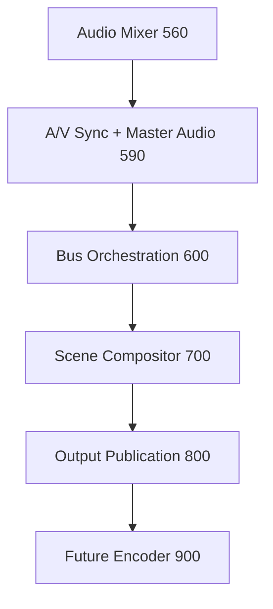

## Program/Preview/AUX/Clean Feed/Monitor/Record/Stream masters

Program is strict and cannot publish partial master audio or mixed-tick A/V. Preview and optional roles may degrade independently without corrupting Program. Record and Stream are synchronized metadata foundations only.

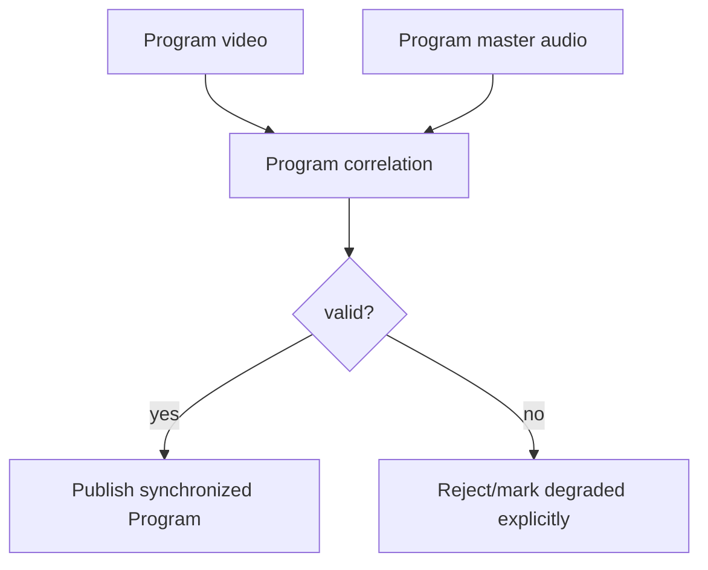

## Backend abstractions

The public synthetic sync backend performs deterministic timestamp normalization and skew measurement. The synthetic master-audio backend emits metadata-only master block references with no PCM payload exposure.

## Configuration transactions

Configuration commits are generation-protected and must occur at explicit boundaries; failure preserves the previous valid configuration.

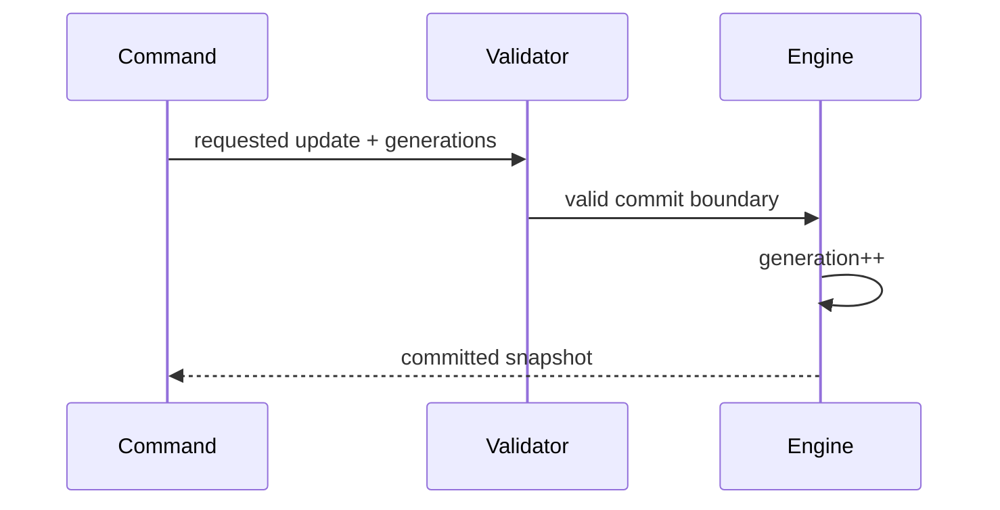

## Failure preservation and shutdown

Invalid input is rejected, Program output is preserved, optional roles may degrade, and shutdown releases held resources and clears bounded histories.

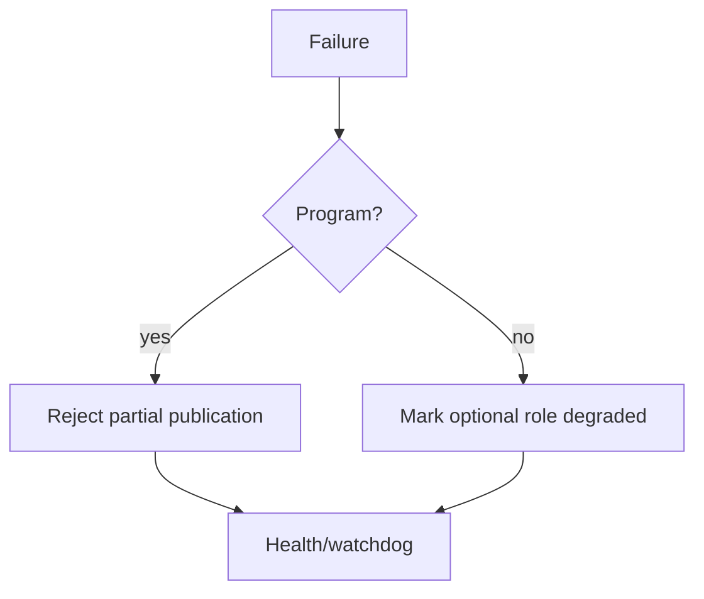

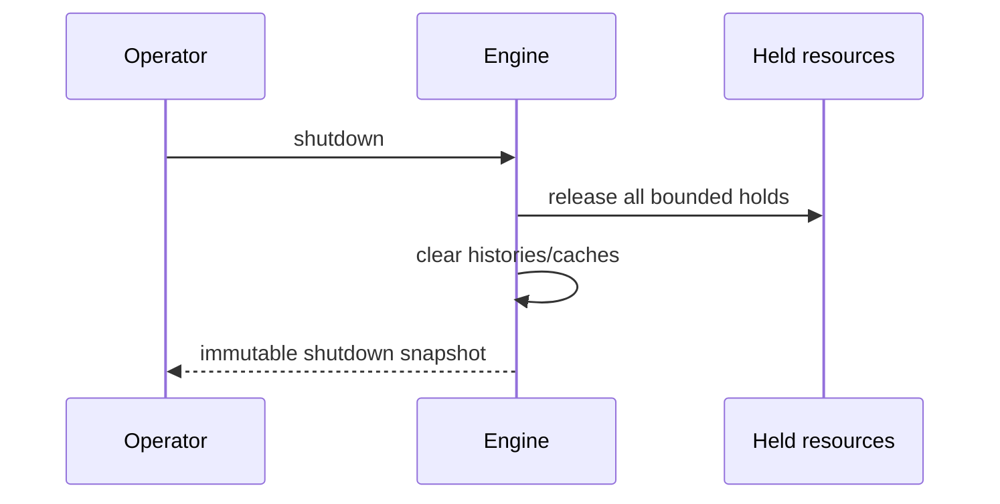

## Output registry, commands, events, health, telemetry, watchdog, and Source Graph

The processor publishes timeline, correlations, master bus states, Program/Preview correlations, health, telemetry, watchdog incidents, and Source Graph-safe metadata. Commands and events are metadata-only and never carry pixels, PCM, credentials, URLs, native handles, or backend resources.

## Security and production safety

All snapshots are JSON-safe, immutable, bounded, and redacted. The foundation guarantees no second master clock, no independent loop, no duplicate Program master output, no timestamp/sample regression acceptance, no hidden correction, no unbounded hold, no Program/Preview alias, no raw media exposure, and no encoding/muxing/recording/streaming claim.

## Invariants, long-run validation, determinism replay, and performance

Validation covers 100,000 simulated ticks, multiple frame rates, multiple sample rates, Program/Preview/AUX/Clean/Monitor/Record/Stream buses, audio/video lead, drift, discontinuities, source restarts, route changes, holds, drops, stale generations, backend failures, cancellation, shutdown under load, deterministic replay, complexity counters, and invariant checks. Expected complexity is O(1) for lookups/conversions/skew/drift/correction and O(active buses) for multi-bus processing.

## Limitations and v5.6.6 handoff

This foundation does not encode, mux, write files, stream, transmit packets, or integrate hardware clocks/codecs. It hands synchronized metadata and master audio references to UBOS v5.6.6 Production-Safe Media Encoder Foundation.
