# UBOS v5.6.6 — Production-Safe Media Encoder Foundation

## Purpose

UBOS v5.6.6 establishes the authoritative encoding boundary between synchronized Program/Preview/AUX/Clean Feed/Record/Stream media references and future muxing, recording, and streaming systems. The foundation creates deterministic encode plans and synthetic encoded-packet references only. It does **not** perform real codec compression, muxing, file writing, recording, streaming, transport, replay, native codec integration, pixel readback, or PCM exposure.

## Architectural position and relationship to v5.6.5

The encoder consumes synchronized media references from v5.6.5 Audio/Video Synchronization and Master Audio. It reuses v5.1 `TickProcessor` execution, existing `FrameTick` timing, and output publication patterns. Synchronized PTS remains authoritative; no encoder clock, runtime loop, scheduler, or frame-memory manager is introduced.

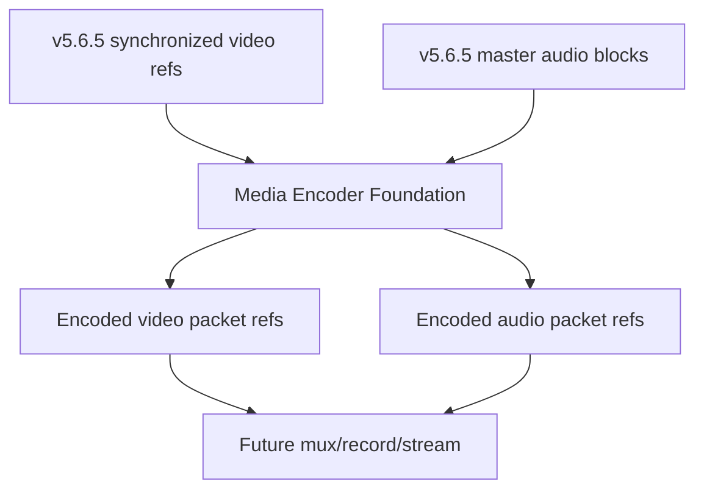

## Media types, codecs, profiles, levels, bitrate modes, and quality tiers

Supported media types are `VIDEO`, `AUDIO`, `DATA_METADATA`, and `CUSTOM`; v5.6.6 executes only synthetic `VIDEO` and `AUDIO`. Video codec identifiers include H.264, H.265, AV1, VP9, MPEG-2 video, ProRes metadata, DNxHR metadata, raw video metadata, and custom typed codecs. Audio codec identifiers include AAC, Opus, MP3 metadata, AC-3 metadata, E-AC-3 metadata, FLAC metadata, PCM metadata variants, and custom typed codecs. Profiles and levels are explicit and validated; hidden fallback, hidden profile substitution, hidden level selection, and hidden format conversion are rejected. Bitrate modes include CBR, VBR, constrained VBR, constant quality, lossless metadata, and custom. Quality tiers are planning metadata unless a validated backend implements real behavior.

## Encoder configurations

`VideoEncoderConfiguration` and `AudioEncoderConfiguration` are immutable, generation-protected, JSON-safe contracts. Video configuration validates dimensions, frame rate, codec time base, pixel format, color metadata, bitrate ordering, GOP, keyframe intervals, B-frame count, reference frames, low-latency metadata, output role, backend preference, and extradata policy. Audio configuration validates sample rate, sample format, channel layout/count, bitrate, codec time base, frame sample count, priming, delay, output role, and backend preference.

## Sessions and lifecycle

`MediaEncoderSessionDefinition` binds one media type and output role to one source bus and configuration. Registration does not start encoding. Valid lifecycle states include created, ready, running, paused, draining, flushing, stopped, resetting, failed, destroyed, and shutdown. Failed or destroyed sessions cannot silently encode.

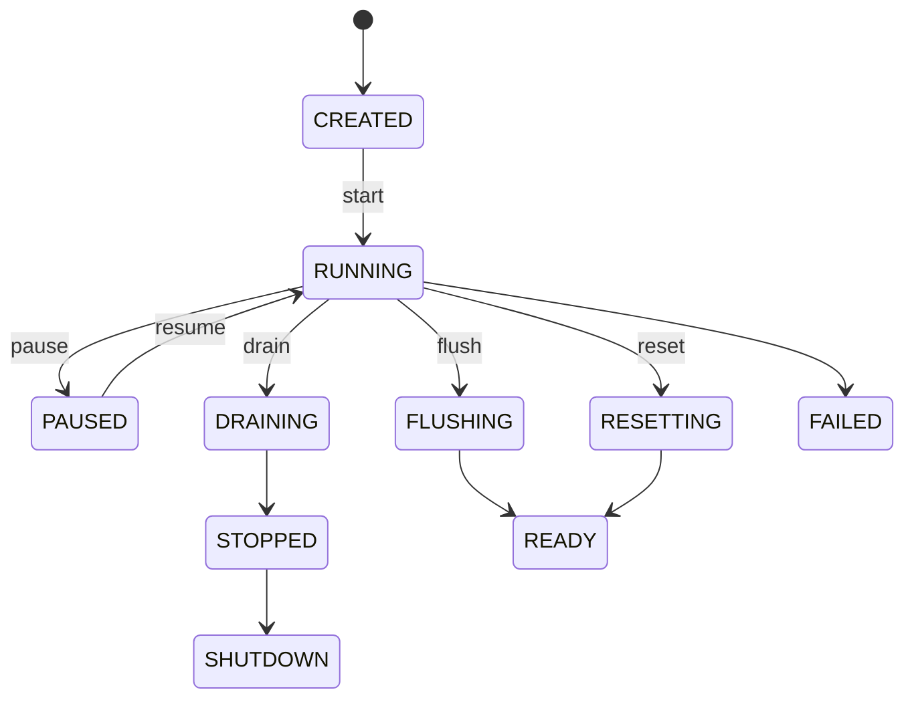

## Input frame/block contracts and requests/plans

`VideoEncodeInputFrame` and `AudioEncodeInputBlock` snapshots carry identities, generations, timing, ownership, and safe metadata only. They never contain pixels or PCM. `MediaEncodeRequest` carries expected session/config/sync/output/backend generations and cancellation metadata. `MediaEncodePlan` records normalized PTS/DTS/duration, input summary, frame classification, keyframe decision, GOP position, rate-control summary, codec-config requirement, operation order, deterministic score, estimated bytes, and warnings.

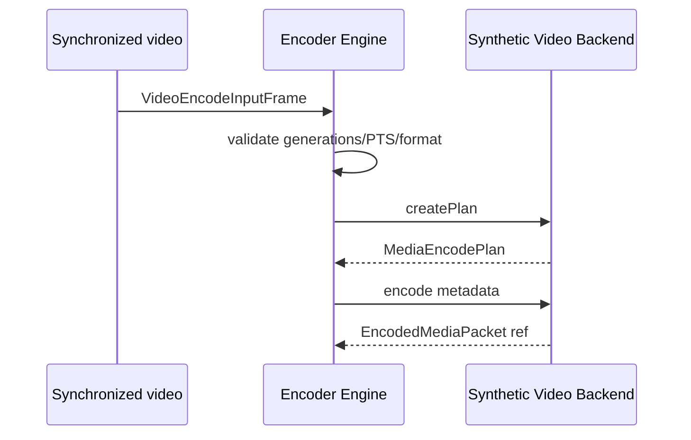

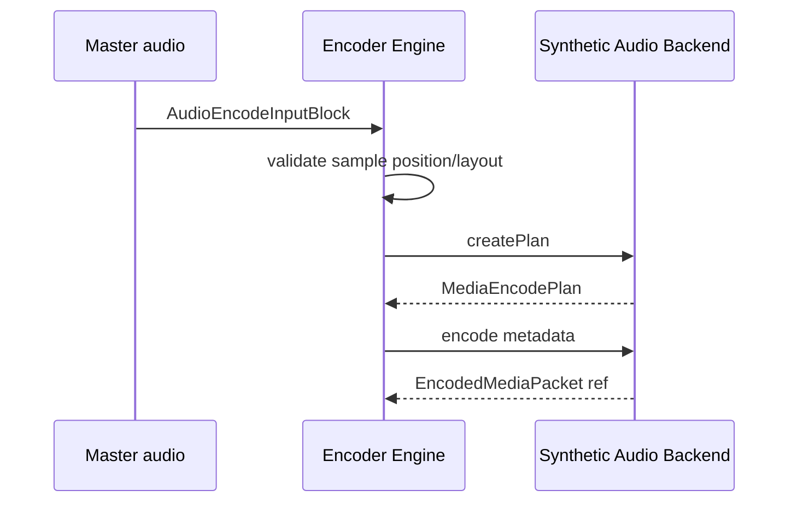

## Keyframe scheduling and GOP state

The synthetic video backend deterministically handles output-start, manual, fixed-interval, and discontinuity keyframes while respecting minimum and maximum intervals. GOP state is bounded and generation-tagged.

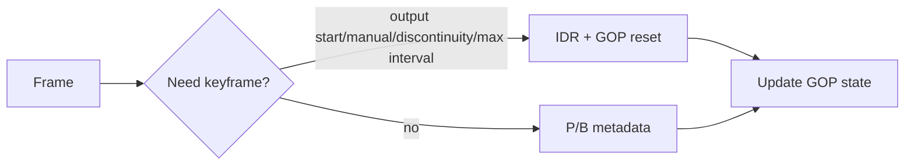

## Encoded packets, packet ownership, codec-config packets, and rate-control foundation

`EncodedMediaPacket` is an immutable opaque payload reference with deterministic packet ID, sequence, PTS, DTS, duration, checksum, signature, codec-config flag, EOS flag, owner, backend ID, and safe metadata. No encoded bitstream bytes are exposed. `EncodedPacketLease` models exact-once release. Codec configuration packets are metadata-only references for H.264 SPS/PPS, H.265 VPS/SPS/PPS, AV1 sequence header, VP9 private metadata, AAC AudioSpecificConfig, OpusHead/OpusTags, and custom initialization data. Rate control tracks synthetic estimates only; it makes no bitrate guarantee.

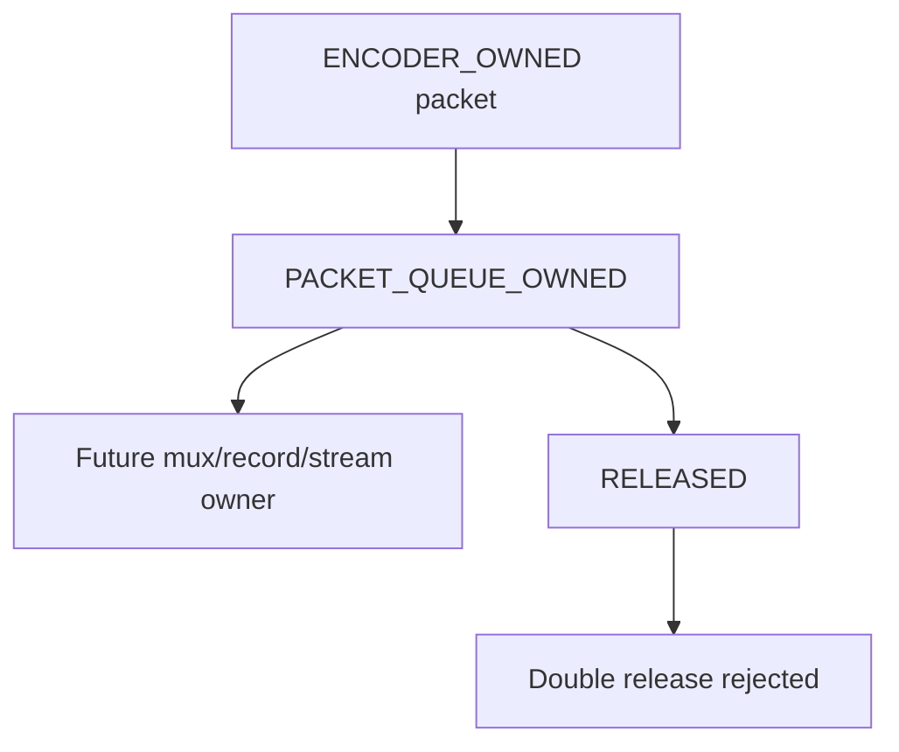

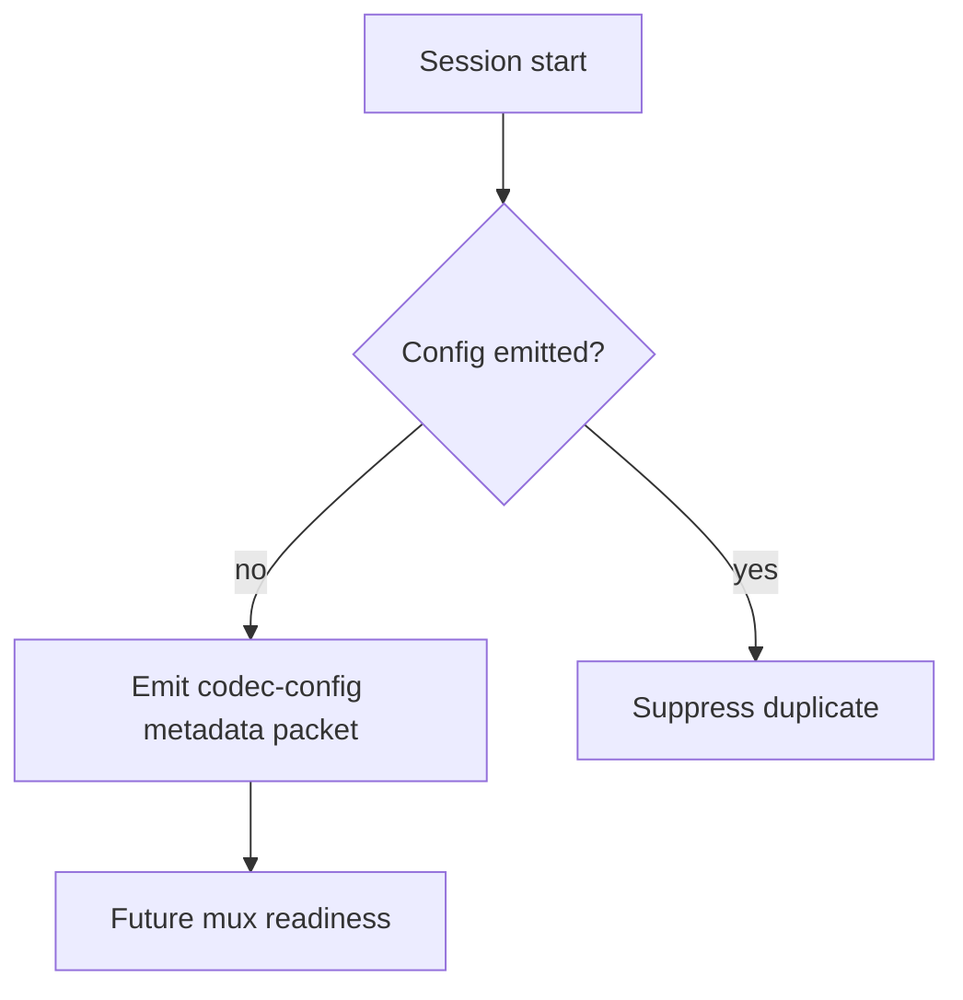

## Input queues, packet queues, and backpressure

Each session owns bounded input and packet queues. Queue policies specify count, duration, bytes, latency, and overflow policy. Backpressure states are immutable observable snapshots: none, soft, hard, critical, or failed.

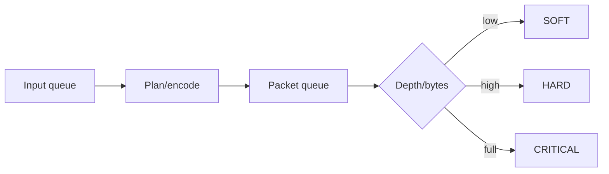

## Drain, flush, reset, reconfiguration, and transactions

Drain emits at most one EOS metadata packet and stops the session. Flush releases queued state and returns to ready. Reset clears input/packet sequencing, GOP state, codec-config state, plan cache, and timing state. Reconfiguration is transaction-scaffolded and generation-checked; no partial configuration is applied.

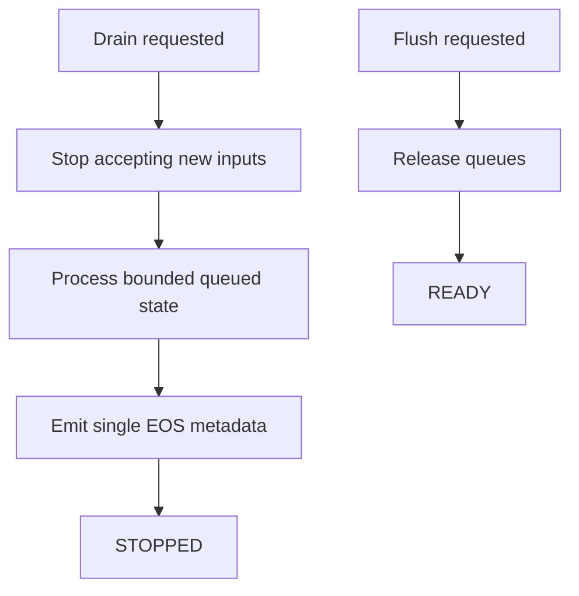

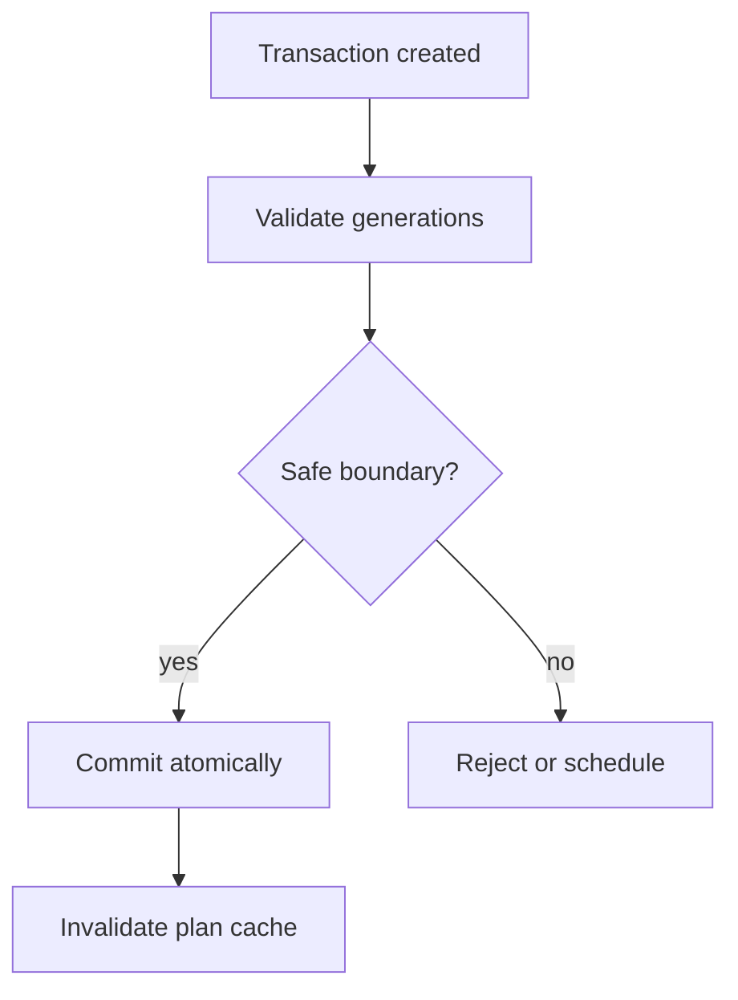

## Video and audio backends

`SyntheticVideoEncoderBackend` and `SyntheticAudioEncoderBackend` advertise deterministic synthetic behavior, `realVideoEncoding: false`, `realAudioEncoding: false`, no hardware acceleration, no media upload, and no native handles. They validate input/config compatibility, create deterministic plans, generate deterministic packet IDs/checksums/signatures/sizes/durations, emit codec-config metadata packets, model B-frame reorder metadata, model audio priming/delay/padding metadata, and can deterministically simulate allocation failure, timeout, backend failure, queue pressure, and device-generation loss.

## Output-role bindings and role foundations

`MediaEncoderOutputBinding` explicitly binds video/audio sessions to PROGRAM, PREVIEW, HORIZONTAL_PROGRAM, VERTICAL_PROGRAM, SQUARE_PROGRAM, CLEAN_FEED, AUXILIARY, RECORD, STREAM, or CUSTOM. Bindings contain no URLs, stream keys, credentials, or destination secrets. Record and Stream are marked encoder-only foundations.

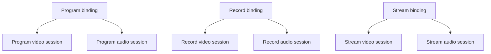

## Encoded A/V correlation

`EncodedAudioVideoCorrelationSnapshot` tracks one bounded role correlation with latest video/audio packet sequences, PTS, skew, discontinuity, codec-config readiness, synchronization status, future mux eligibility, and health. No muxing occurs.

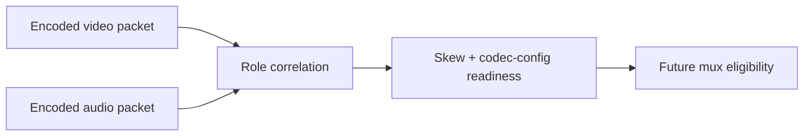

## Processor order and output registry

`MediaEncoderFoundationProcessor` runs at order 900, after A/V sync/master audio and after final synchronized media publication points. It has no loop; it executes once per authoritative `FrameTick` and publishes typed registry keys for encoded packets, codec-config packets, correlations, health, telemetry, and backend state.

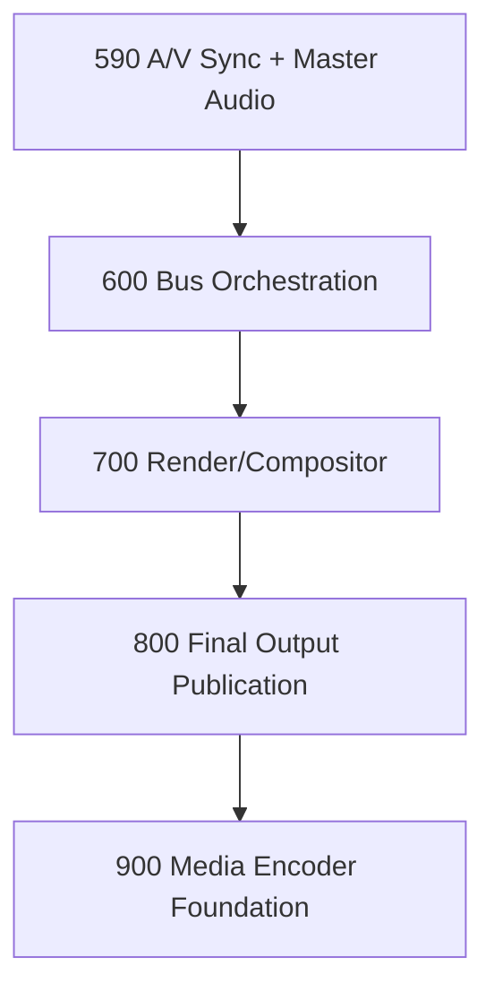

## Commands, events, health, telemetry, and watchdog

Commands use v5.1 `RuntimeCommandHandler` records and carry metadata only. Events are typed and high-frequency event history is bounded. Health reports backend/config/session counts, Program sessions, submissions, encoded packets, codec-config packets, keyframes, drops, duplicate/stale/timing rejections, queue bytes, temporary bytes, last PTS, last success, and last failure. Telemetry tracks bounded counters for registrations, sessions, bindings, submissions, plans, packets, queues, backpressure, rejects, failures, byte estimates, active request IDs, and active session IDs. Watchdog incidents cover stalled requests, duplicates, stale generations, timestamp/sample regressions, unsupported formats, invalid GOP, queue pressure, packet sequence/timestamp errors, Program A/V mismatch, backend/device/allocation/ownership failures, registry/source graph mismatch, and invariant failure.

## Source Graph and security/redaction

Source Graph integration is metadata-only: session IDs, media type, output role, codec/profile/level summaries, bitrate summaries, state, packet sequence summaries, latest PTS/DTS, GOP state, queue summaries, backpressure, codec-config readiness, mux eligibility, health, and routing eligibility. Snapshots, telemetry, events, and errors are bounded, immutable, sanitized, and free of pixels, PCM, bitstream bytes, codec private bytes, native handles, file paths, endpoints, URLs, stream keys, credentials, mutable leases, and destination secrets.

## Production safety and invariants

The engine enforces no second timing loop, no new media clock, no duplicate submission, no duplicate packet publication, generation checks, timestamp/sample monotonicity, explicit codec/profile/level/format choices, no silent conversion, no false real-encoding claim, bounded queues, finite backpressure, no packet after terminal states, exact-once ownership release, no Program/Preview alias, no raw media exposure, and shutdown cleanup. `assertInvariants()` verifies unique IDs, monotonic packet sequence, bounded queues, active ownership state, and clean shutdown.

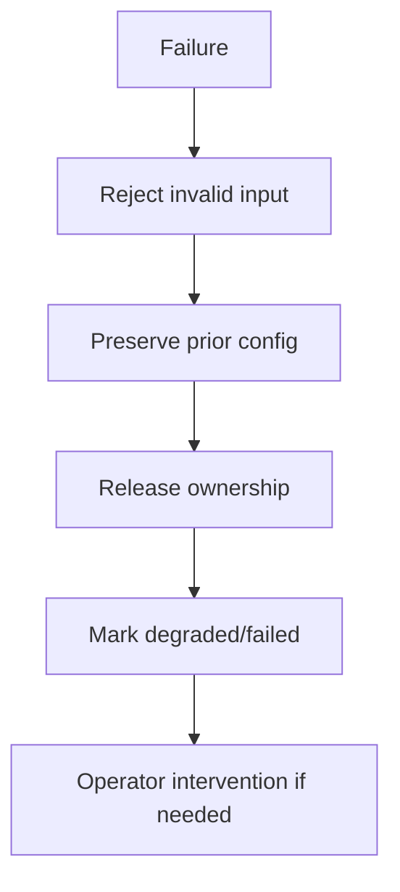

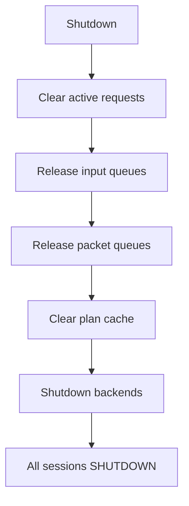

## Long-run validation, determinism replay, and performance

Validation uses fake frame ticks, deterministic synchronized references, deterministic PTS/DTS, synthetic backends, bounded queues, and no wall-clock thresholds. Replay compares canonical packet IDs, sequences, PTS/DTS, signatures, codec-config packets, correlations, health, telemetry, and final state. Expected complexity: O(1) backend/config/session/binding lookup, O(1) queue enqueue/dequeue, O(1) timestamp validation, O(1) keyframe/GOP update, O(1) planning plus bounded backend selection, O(active sessions) processor orchestration, O(1) packet correlation per role, O(configurations + sessions + bounded state) snapshots, and O(active + bounded incidents) watchdog.

## Limitations and v5.6.7 handoff

This phase intentionally does not implement real H.264/H.265/AV1/VP9/AAC/Opus encoding, muxing, file writing, recording, streaming, transport, segmenting, hardware acceleration, replay, native FFmpeg/libav integrations, or UI redesign. The next phase is **UBOS v5.6.7 — Production-Safe Muxing and Media Packaging Engine**.
