# UBOS v5.6.8 — Production-Safe Recording Engine

## Purpose and architectural position

UBOS v5.6.8 adds the authoritative recording-session foundation after the v5.6.7 muxing/media packaging layer. It consumes packaged media metadata, validates recording profiles/sessions/destinations/generations/ownership, and produces deterministic synthetic recording artifacts. It does **not** write real files, open OS handles, upload to cloud/network targets, invoke FFmpeg/libav/native recorders, or claim real persistence.

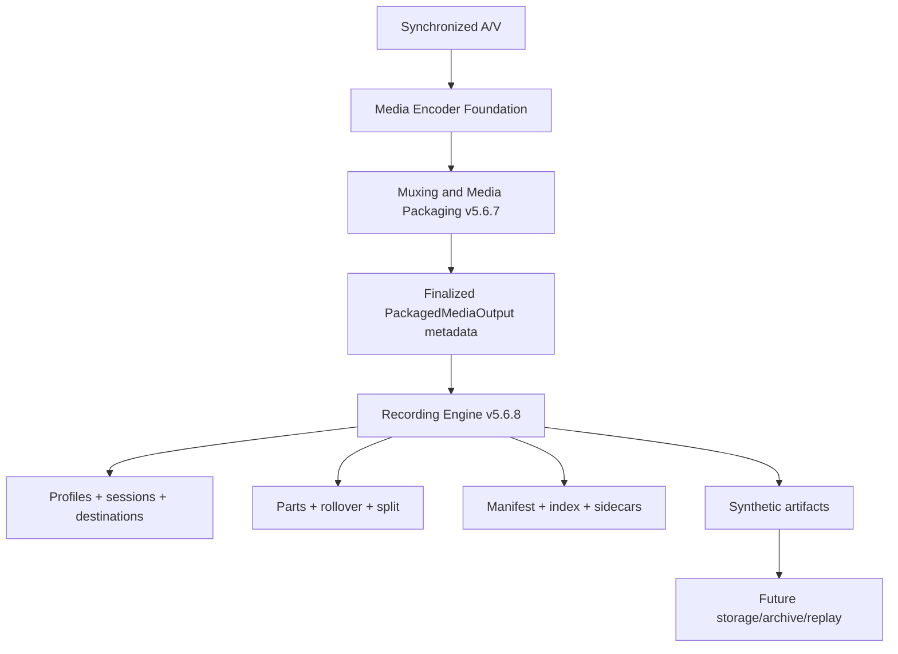

## Relationship to v5.6.7

The engine treats packaged output PTS, package-session generation, package-output generation, and timeline generation as authoritative. It adds no media clock, no FrameTick source, no encoder, no muxer, and no scheduler.

## Recording types, profiles, and destinations

Supported recording types are Program, Preview metadata, Clean Feed, AUX, ISO video, ISO audio, ISO A/V, Multitrack, Proxy metadata, Archive foundation, and Custom typed. Each immutable profile declares output role, package profile reference, expected container metadata format, source package sessions, destination, filename policy, rollover policy, split policy, sidecar policy, recovery policy, storage policy, queue policy, finalization policy, retention metadata, failure policy, backend preference, and criticality.

Destinations are explicit. Only `SYNTHETIC_MEMORY_REFERENCE` is executable in this phase; local/removable/network/cloud/archive/custom destinations remain redacted metadata only. Storage classes include Temporary, Standard, High Performance, Removable, Network, Cloud, Archive, Synthetic, and Custom.

## Session definitions and lifecycle

Sessions bind a profile generation to a destination generation and remain immutable after registration. Active lifecycle states are explicit and terminal states reject package input.

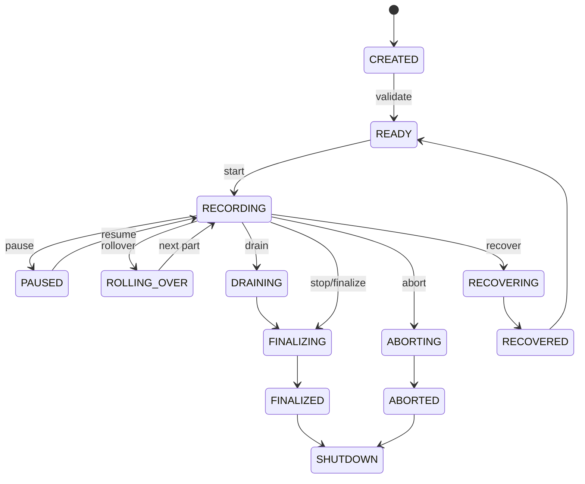

## Policies

Start, pause/resume, stop, rollover, split, filename, collision, storage, quota, recovery, and queue policies are explicit. Program defaults wait for package readiness, initialization package, video keyframe metadata, and all critical tracks. Pause occurs at package boundaries. Stop is bounded through drain/finalize or abort policy.

## Source bindings and recording paths

Source bindings are explicit and generation validated. Program, Preview, Clean Feed, AUX, ISO, and Multitrack sessions have independent parts/manifests/artifacts and no writable artifact aliasing.

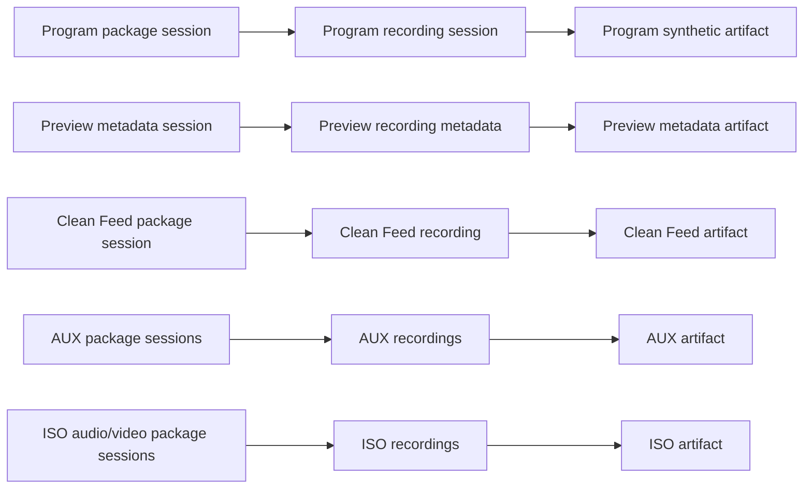

## Package input, requests, and plans

`RecordingPackageInput` contains IDs, generations, output role, container format, package type, segment/fragment/init IDs, PTS, duration, discontinuity generation, finalization flag, ownership, estimated bytes, checksum, timeline generation, and safe metadata only. `RecordingWriteRequest` adds expected session/profile/destination/package/timeline generations, frame, deadline, cancellation reference, and correlation ID. `RecordingWritePlan` deterministically resolves part, filename metadata, collision action, synthetic reservation action, rollover/split decisions, manifest/index action, sidecar action, recovery action, and ownership transfer order.

## Recording parts and ownership

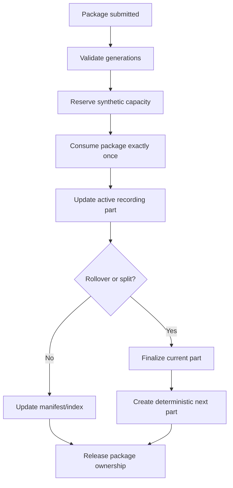

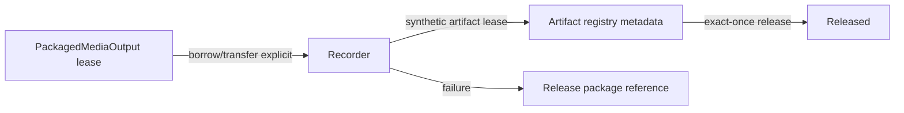

Parts track sequence, synthetic filename reference, container format, runtime frames, PTS, duration, package/segment/fragment/init counts, estimated/reserved bytes, discontinuity generation, finalization, recoverability, and checksum. Part sequences are monotonic per session.

## Rollover and split recording

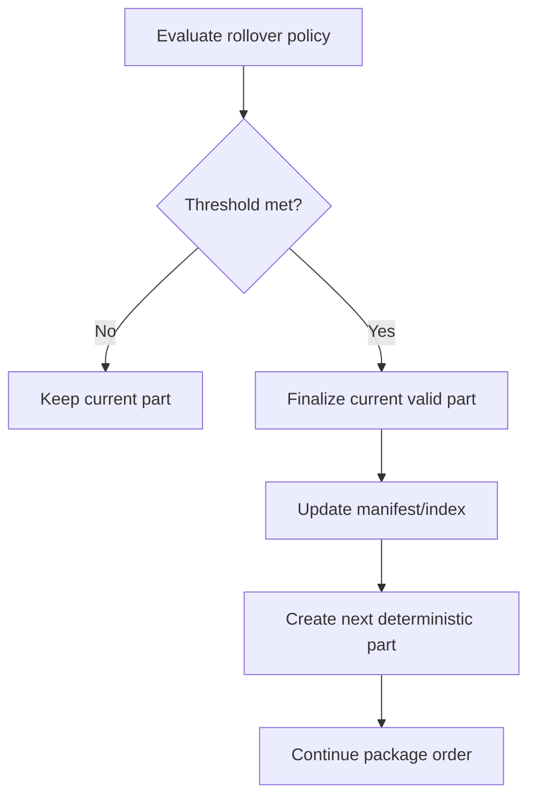

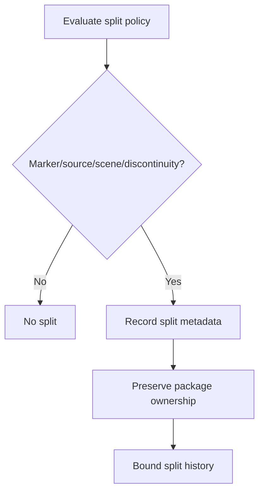

## Storage reservations, pressure, quotas, queues, and backpressure

The synthetic backend models reservations only against destination metadata. It never polls OS storage. Pressure states are deterministic from registered capacity metadata. Queue snapshots are bounded by count/bytes; overflow is observable through telemetry/watchdog.

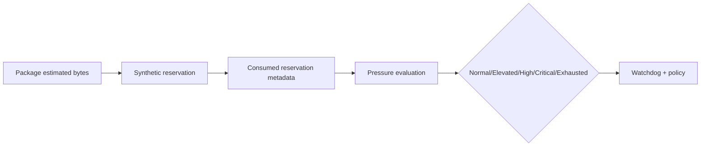

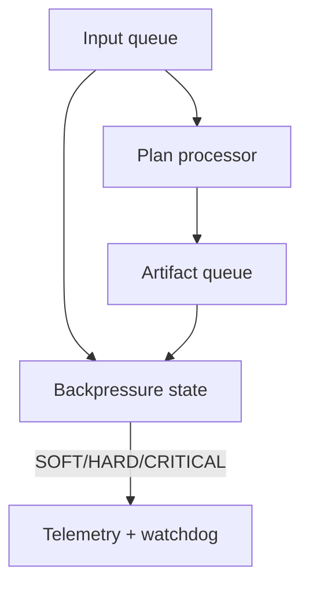

## Manifests, indexes, and sidecars

Manifests are immutable snapshots with deterministic part order, counts, byte estimates, rollovers, splits, recovery state, finalization state, and checksums. Indexes track timeline entries, part/segment boundaries, discontinuities, and bounded metadata markers. Sidecars are metadata-only for JSON summaries, chapters, markers, scene/source changes, tally/loudness/health summaries, checksums, and custom typed metadata.

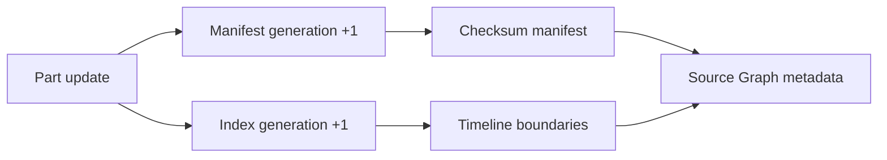

## Pause, resume, drain, finalization, abort, and recovery

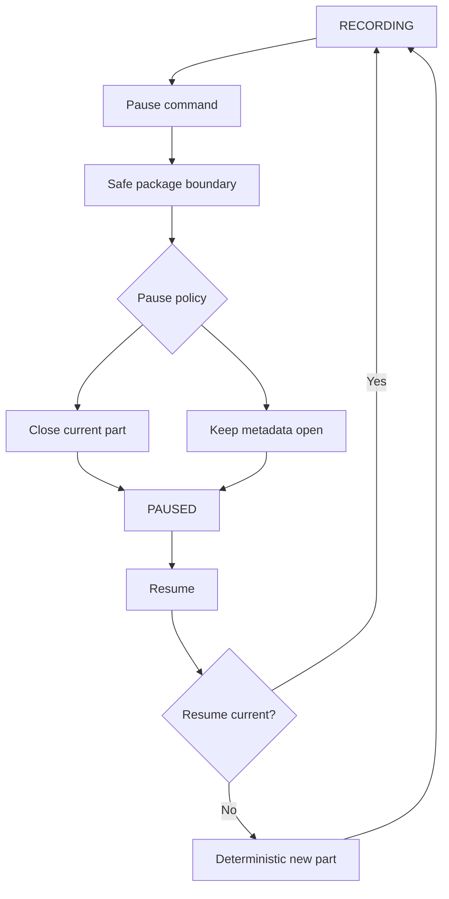

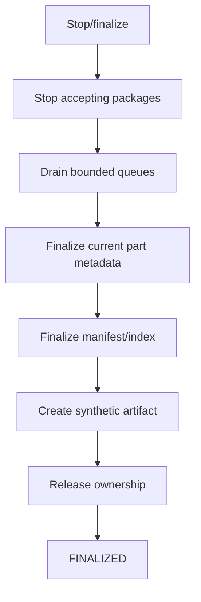

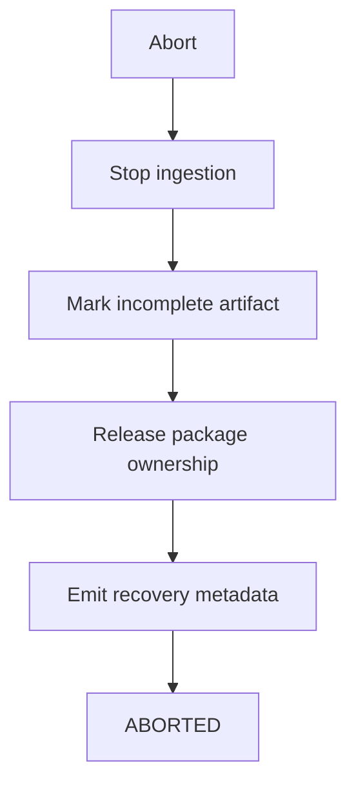

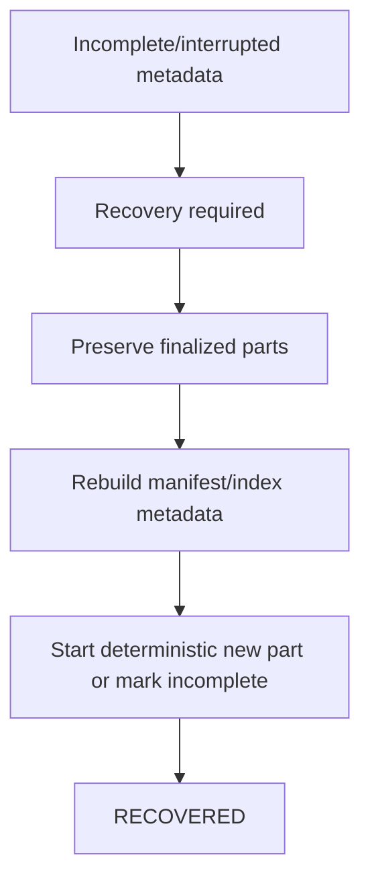

## Backend abstraction and synthetic backend

The backend contract provides descriptors, capabilities, planning, part creation/finalization, pause/resume, rollover, drain, finalize, abort, recover, reset, reconfigure, and shutdown. The synthetic backend is deterministic, non-persistent, non-file-output, metadata-only, and safe for replay.

## Command integration, processor order, and output registry

Commands are typed runtime-command handlers and do not mutate macros directly. The processor uses TickProcessorFramework at order `1000`, after encoder `900` and packaging `950` conventions.

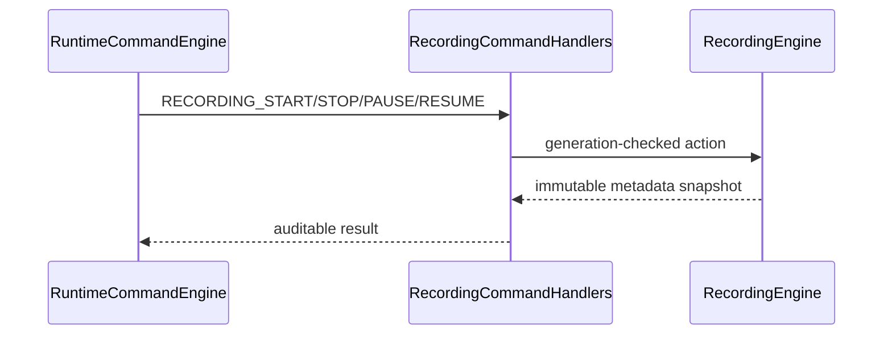

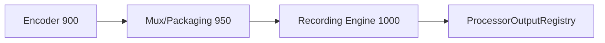

## Health, telemetry, watchdog, and Source Graph

Health summarizes state counts, package/part/artifact counts, failures, pressure, queue bytes, retained bytes, and last artifact/PTS. Telemetry includes bounded counters for registrations, lifecycle operations, plans/cache, parts, rollovers, splits, manifests/indexes, markers, artifacts, reservations, pressure, quota, drains, finalizations, aborts, recoveries, queues, backpressure, duplicate/stale/incompatible rejects, backend/timeouts/allocation/ownership failures, byte estimates, averages/maxima, current request IDs, active sessions, last event, and health summary. Watchdog incidents are bounded and include safe recovery steps. Source Graph exposes only redacted bounded metadata.

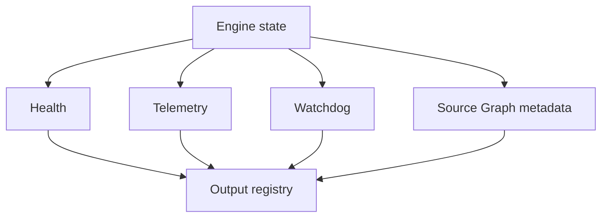

## Security, redaction, and production safety

Snapshots are JSON-safe, immutable, deterministic, bounded, and redacted. Observability excludes package bytes, file bytes, raw paths, URLs, cloud bucket names, credentials, source secrets, browser URLs, endpoints, native handles, mutable leases, and private operator/source metadata.

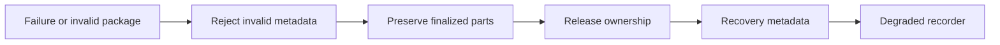

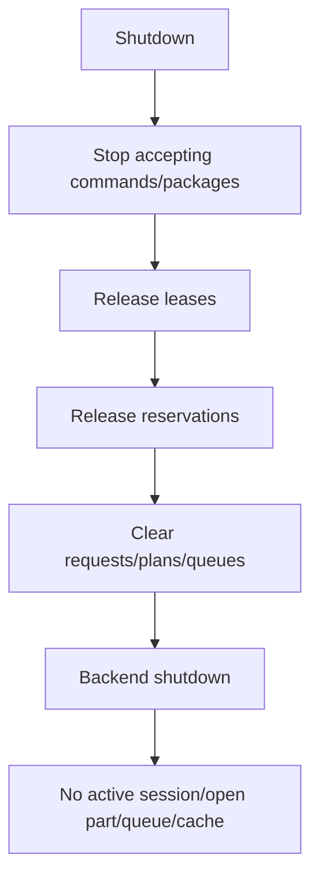

## Invariants, validation, determinism, and performance

`assertInvariants()` verifies unique IDs, valid references, one active writable part per session, monotonic sequences, non-negative reservations, bounded histories, and clean shutdown conditions. Validation uses fake FrameTicks, deterministic package metadata, synthetic destinations/backend, bounded queues, explicit ownership, determinism replay, long-run package/tick simulation, and operation-count complexity assertions. Expected complexity is O(1) for lookups/queue/package/storage/rollover/split operations, O(active sessions) for processor orchestration, and O(registry + bounded state) for snapshots/watchdog.

## Limitations and v5.6.9 handoff

v5.6.8 remains a foundation: no real MP4/TS/MKV writing, no disk persistence, no cloud/network delivery, no replay, no encryption/DRM, no editing, no proxy/thumbnail/transcription. v5.6.9 should certify the integrated audio, encoding, packaging, and recording chain end-to-end.
