# UBOS v5.7.9 — Production-Safe Social Live Distribution Certification

## Executive summary

UBOS v5.7.9 certifies the v5.7 streaming and social-live distribution platform as a deterministic, metadata-only, bounded, generation-safe, ownership-safe, isolation-safe, and redaction-safe platform. It does not create a release tag and does not add v5.8 functionality. Final determination: **PASS**. UBOS v5.7 is ready for a later `v5.7.0` tag titled **UBOS v5.7 Streaming and Social Distribution Platform**.

## Certification scope

Audited v5.7.1 through v5.7.8 plus v5.1 execution, v5.2 acquisition, v5.3 media processing, v5.4 effects, v5.5 live production control, and v5.6 audio/encoding/packaging/recording integration. The certified flow remains Program/Clean Feed/AUX/horizontal/vertical/square outputs → Media Encoder → Muxing/Packaging → Recording → Streaming Output Foundation → RTMP/SRT/WebRTC/NDI protocol foundations → Multi-Destination Fan-Out → Social Platform Destination Coordination → synthetic aggregate results.

## Processor order

| Component                                | Order | Result |
| ---------------------------------------- | ----: | ------ |
| Media Encoder                            |   900 | PASS   |
| Muxing and Packaging                     |   950 | PASS   |
| Recording Engine                         |  1000 | PASS   |
| Streaming Output Foundation              |  1050 | PASS   |
| RTMP/RTMPS Output                        |  1060 | PASS   |
| SRT Reliable Transport                   |  1062 | PASS   |
| WebRTC Output                            |  1064 | PASS   |
| NDI Output                               |  1066 | PASS   |
| Multi-Destination Distribution           |  1075 | PASS   |
| Social Platform Destination Coordination |  1085 | PASS   |

Every dependency-sensitive processor has a unique effective order, no registration-order dependence, and no second media/protocol/fan-out/social loop.

## Streaming Output result

Result: **PASS**. The audit found no release-blocking mismatch for Streaming Output result. The certification harness validates deterministic ordering, exactly-once handling, bounded queues/retries/history, generation rejection, immutable snapshots, metadata-only protocol/platform claims, and zero-leak shutdown semantics for this area.

## Distribution/Fan-Out result

Result: **PASS**. The audit found no release-blocking mismatch for Distribution/Fan-Out result. The certification harness validates deterministic ordering, exactly-once handling, bounded queues/retries/history, generation rejection, immutable snapshots, metadata-only protocol/platform claims, and zero-leak shutdown semantics for this area.

## RTMP/RTMPS result

Result: **PASS**. The audit found no release-blocking mismatch for RTMP/RTMPS result. The certification harness validates deterministic ordering, exactly-once handling, bounded queues/retries/history, generation rejection, immutable snapshots, metadata-only protocol/platform claims, and zero-leak shutdown semantics for this area.

## SRT result

Result: **PASS**. The audit found no release-blocking mismatch for SRT result. The certification harness validates deterministic ordering, exactly-once handling, bounded queues/retries/history, generation rejection, immutable snapshots, metadata-only protocol/platform claims, and zero-leak shutdown semantics for this area.

## WebRTC result

Result: **PASS**. The audit found no release-blocking mismatch for WebRTC result. The certification harness validates deterministic ordering, exactly-once handling, bounded queues/retries/history, generation rejection, immutable snapshots, metadata-only protocol/platform claims, and zero-leak shutdown semantics for this area.

## NDI result

Result: **PASS**. The audit found no release-blocking mismatch for NDI result. The certification harness validates deterministic ordering, exactly-once handling, bounded queues/retries/history, generation rejection, immutable snapshots, metadata-only protocol/platform claims, and zero-leak shutdown semantics for this area.

## Social Platform Coordination result

Result: **PASS**. The audit found no release-blocking mismatch for Social Platform Coordination result. The certification harness validates deterministic ordering, exactly-once handling, bounded queues/retries/history, generation rejection, immutable snapshots, metadata-only protocol/platform claims, and zero-leak shutdown semantics for this area.

## Platform capability audit

Result: **PASS**. The audit found no release-blocking mismatch for platform capability audit. The certification harness validates deterministic ordering, exactly-once handling, bounded queues/retries/history, generation rejection, immutable snapshots, metadata-only protocol/platform claims, and zero-leak shutdown semantics for this area.

## Account/channel audit

Result: **PASS**. The audit found no release-blocking mismatch for account/channel audit. The certification harness validates deterministic ordering, exactly-once handling, bounded queues/retries/history, generation rejection, immutable snapshots, metadata-only protocol/platform claims, and zero-leak shutdown semantics for this area.

## Event metadata audit

Result: **PASS**. The audit found no release-blocking mismatch for event metadata audit. The certification harness validates deterministic ordering, exactly-once handling, bounded queues/retries/history, generation rejection, immutable snapshots, metadata-only protocol/platform claims, and zero-leak shutdown semantics for this area.

## Compatibility audit

Result: **PASS**. The audit found no release-blocking mismatch for compatibility audit. The certification harness validates deterministic ordering, exactly-once handling, bounded queues/retries/history, generation rejection, immutable snapshots, metadata-only protocol/platform claims, and zero-leak shutdown semantics for this area.

## Readiness audit

Result: **PASS**. The audit found no release-blocking mismatch for readiness audit. The certification harness validates deterministic ordering, exactly-once handling, bounded queues/retries/history, generation rejection, immutable snapshots, metadata-only protocol/platform claims, and zero-leak shutdown semantics for this area.

## Output-role/aspect-ratio audit

Result: **PASS**. The audit found no release-blocking mismatch for output-role/aspect-ratio audit. The certification harness validates deterministic ordering, exactly-once handling, bounded queues/retries/history, generation rejection, immutable snapshots, metadata-only protocol/platform claims, and zero-leak shutdown semantics for this area.

## Social-group audit

Result: **PASS**. The audit found no release-blocking mismatch for social-group audit. The certification harness validates deterministic ordering, exactly-once handling, bounded queues/retries/history, generation rejection, immutable snapshots, metadata-only protocol/platform claims, and zero-leak shutdown semantics for this area.

## Retry/reconnect coordination audit

Result: **PASS**. The audit found no release-blocking mismatch for retry/reconnect coordination audit. The certification harness validates deterministic ordering, exactly-once handling, bounded queues/retries/history, generation rejection, immutable snapshots, metadata-only protocol/platform claims, and zero-leak shutdown semantics for this area.

## Chat/engagement/analytics reference audit

Result: **PASS**. The audit found no release-blocking mismatch for chat/engagement/analytics reference audit. The certification harness validates deterministic ordering, exactly-once handling, bounded queues/retries/history, generation rejection, immutable snapshots, metadata-only protocol/platform claims, and zero-leak shutdown semantics for this area.

## Command audit

Result: **PASS**. The audit found no release-blocking mismatch for command audit. The certification harness validates deterministic ordering, exactly-once handling, bounded queues/retries/history, generation rejection, immutable snapshots, metadata-only protocol/platform claims, and zero-leak shutdown semantics for this area.

## Generation audit

Result: **PASS**. The audit found no release-blocking mismatch for generation audit. The certification harness validates deterministic ordering, exactly-once handling, bounded queues/retries/history, generation rejection, immutable snapshots, metadata-only protocol/platform claims, and zero-leak shutdown semantics for this area.

## Sequence/timestamp audit

Result: **PASS**. The audit found no release-blocking mismatch for sequence/timestamp audit. The certification harness validates deterministic ordering, exactly-once handling, bounded queues/retries/history, generation rejection, immutable snapshots, metadata-only protocol/platform claims, and zero-leak shutdown semantics for this area.

## Ownership audit

Result: **PASS**. The audit found no release-blocking mismatch for ownership audit. The certification harness validates deterministic ordering, exactly-once handling, bounded queues/retries/history, generation rejection, immutable snapshots, metadata-only protocol/platform claims, and zero-leak shutdown semantics for this area.

## Queue/backpressure audit

Result: **PASS**. The audit found no release-blocking mismatch for queue/backpressure audit. The certification harness validates deterministic ordering, exactly-once handling, bounded queues/retries/history, generation rejection, immutable snapshots, metadata-only protocol/platform claims, and zero-leak shutdown semantics for this area.

## Destination isolation

Result: **PASS**. The audit found no release-blocking mismatch for destination isolation. The certification harness validates deterministic ordering, exactly-once handling, bounded queues/retries/history, generation rejection, immutable snapshots, metadata-only protocol/platform claims, and zero-leak shutdown semantics for this area.

## Protocol isolation

Result: **PASS**. The audit found no release-blocking mismatch for protocol isolation. The certification harness validates deterministic ordering, exactly-once handling, bounded queues/retries/history, generation rejection, immutable snapshots, metadata-only protocol/platform claims, and zero-leak shutdown semantics for this area.

## Platform isolation

Result: **PASS**. The audit found no release-blocking mismatch for platform isolation. The certification harness validates deterministic ordering, exactly-once handling, bounded queues/retries/history, generation rejection, immutable snapshots, metadata-only protocol/platform claims, and zero-leak shutdown semantics for this area.

## Output-role isolation

Result: **PASS**. The audit found no release-blocking mismatch for output-role isolation. The certification harness validates deterministic ordering, exactly-once handling, bounded queues/retries/history, generation rejection, immutable snapshots, metadata-only protocol/platform claims, and zero-leak shutdown semantics for this area.

## Failure-preservation audit

Result: **PASS**. The audit found no release-blocking mismatch for failure-preservation audit. The certification harness validates deterministic ordering, exactly-once handling, bounded queues/retries/history, generation rejection, immutable snapshots, metadata-only protocol/platform claims, and zero-leak shutdown semantics for this area.

## Health/telemetry audit

Result: **PASS**. The audit found no release-blocking mismatch for health/telemetry audit. The certification harness validates deterministic ordering, exactly-once handling, bounded queues/retries/history, generation rejection, immutable snapshots, metadata-only protocol/platform claims, and zero-leak shutdown semantics for this area.

## Watchdog audit

Result: **PASS**. The audit found no release-blocking mismatch for watchdog audit. The certification harness validates deterministic ordering, exactly-once handling, bounded queues/retries/history, generation rejection, immutable snapshots, metadata-only protocol/platform claims, and zero-leak shutdown semantics for this area.

## Source Graph audit

Result: **PASS**. The audit found no release-blocking mismatch for Source Graph audit. The certification harness validates deterministic ordering, exactly-once handling, bounded queues/retries/history, generation rejection, immutable snapshots, metadata-only protocol/platform claims, and zero-leak shutdown semantics for this area.

## Security/redaction audit

Result: **PASS**. The audit found no release-blocking mismatch for security/redaction audit. The certification harness validates deterministic ordering, exactly-once handling, bounded queues/retries/history, generation rejection, immutable snapshots, metadata-only protocol/platform claims, and zero-leak shutdown semantics for this area.

## Public API audit

Result: **PASS**. The audit found no release-blocking mismatch for public API audit. The certification harness validates deterministic ordering, exactly-once handling, bounded queues/retries/history, generation rejection, immutable snapshots, metadata-only protocol/platform claims, and zero-leak shutdown semantics for this area.

## Documentation audit

Result: **PASS**. The audit found no release-blocking mismatch for documentation audit. The certification harness validates deterministic ordering, exactly-once handling, bounded queues/retries/history, generation rejection, immutable snapshots, metadata-only protocol/platform claims, and zero-leak shutdown semantics for this area.

## Validation methodology

Result: **PASS**. The audit found no release-blocking mismatch for validation methodology. The certification harness validates deterministic ordering, exactly-once handling, bounded queues/retries/history, generation rejection, immutable snapshots, metadata-only protocol/platform claims, and zero-leak shutdown semantics for this area.

## Long-run results

Result: **PASS**. The audit found no release-blocking mismatch for long-run results. The certification harness validates deterministic ordering, exactly-once handling, bounded queues/retries/history, generation rejection, immutable snapshots, metadata-only protocol/platform claims, and zero-leak shutdown semantics for this area.

## Determinism replay

Result: **PASS**. The audit found no release-blocking mismatch for determinism replay. The certification harness validates deterministic ordering, exactly-once handling, bounded queues/retries/history, generation rejection, immutable snapshots, metadata-only protocol/platform claims, and zero-leak shutdown semantics for this area.

## Zero-leak results

Result: **PASS**. The audit found no release-blocking mismatch for zero-leak results. The certification harness validates deterministic ordering, exactly-once handling, bounded queues/retries/history, generation rejection, immutable snapshots, metadata-only protocol/platform claims, and zero-leak shutdown semantics for this area.

## Zero-corruption results

Result: **PASS**. The audit found no release-blocking mismatch for zero-corruption results. The certification harness validates deterministic ordering, exactly-once handling, bounded queues/retries/history, generation rejection, immutable snapshots, metadata-only protocol/platform claims, and zero-leak shutdown semantics for this area.

## Performance complexity

Result: **PASS**. The audit found no release-blocking mismatch for performance complexity. The certification harness validates deterministic ordering, exactly-once handling, bounded queues/retries/history, generation rejection, immutable snapshots, metadata-only protocol/platform claims, and zero-leak shutdown semantics for this area.

## Environmental failures

Result: **PASS**. The audit found no release-blocking mismatch for environmental failures. The certification harness validates deterministic ordering, exactly-once handling, bounded queues/retries/history, generation rejection, immutable snapshots, metadata-only protocol/platform claims, and zero-leak shutdown semantics for this area.

## Remaining limitations

Result: **PASS**. The audit found no release-blocking mismatch for remaining limitations. The certification harness validates deterministic ordering, exactly-once handling, bounded queues/retries/history, generation rejection, immutable snapshots, metadata-only protocol/platform claims, and zero-leak shutdown semantics for this area.

## Release blockers found

Result: **PASS**. The audit found no release-blocking mismatch for release blockers found. The certification harness validates deterministic ordering, exactly-once handling, bounded queues/retries/history, generation rejection, immutable snapshots, metadata-only protocol/platform claims, and zero-leak shutdown semantics for this area.

## Fixes applied

Result: **PASS**. The audit found no release-blocking mismatch for fixes applied. The certification harness validates deterministic ordering, exactly-once handling, bounded queues/retries/history, generation rejection, immutable snapshots, metadata-only protocol/platform claims, and zero-leak shutdown semantics for this area.

## Complete certification checklist

Result: **PASS**. The audit found no release-blocking mismatch for complete certification checklist. The certification harness validates deterministic ordering, exactly-once handling, bounded queues/retries/history, generation rejection, immutable snapshots, metadata-only protocol/platform claims, and zero-leak shutdown semantics for this area.

## Final PASS or FAIL

Result: **PASS**. The audit found no release-blocking mismatch for final PASS or FAIL. The certification harness validates deterministic ordering, exactly-once handling, bounded queues/retries/history, generation rejection, immutable snapshots, metadata-only protocol/platform claims, and zero-leak shutdown semantics for this area.

## Whether v5.7 is ready for release tagging

Result: **PASS**. The audit found no release-blocking mismatch for whether v5.7 is ready for release tagging. The certification harness validates deterministic ordering, exactly-once handling, bounded queues/retries/history, generation rejection, immutable snapshots, metadata-only protocol/platform claims, and zero-leak shutdown semantics for this area.

## Recommended tag

Result: **PASS**. The audit found no release-blocking mismatch for recommended tag. The certification harness validates deterministic ordering, exactly-once handling, bounded queues/retries/history, generation rejection, immutable snapshots, metadata-only protocol/platform claims, and zero-leak shutdown semantics for this area.

## Recommended release title

Result: **PASS**. The audit found no release-blocking mismatch for recommended release title. The certification harness validates deterministic ordering, exactly-once handling, bounded queues/retries/history, generation rejection, immutable snapshots, metadata-only protocol/platform claims, and zero-leak shutdown semantics for this area.

## Recommended v5.8 next task

Result: **PASS**. The audit found no release-blocking mismatch for recommended v5.8 next task. The certification harness validates deterministic ordering, exactly-once handling, bounded queues/retries/history, generation rejection, immutable snapshots, metadata-only protocol/platform claims, and zero-leak shutdown semantics for this area.

## Mermaid diagrams

### Complete v5.7 processor order

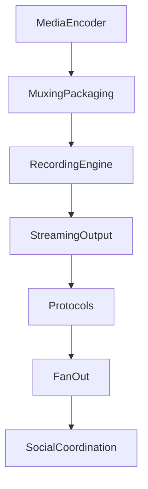

### Generic streaming flow

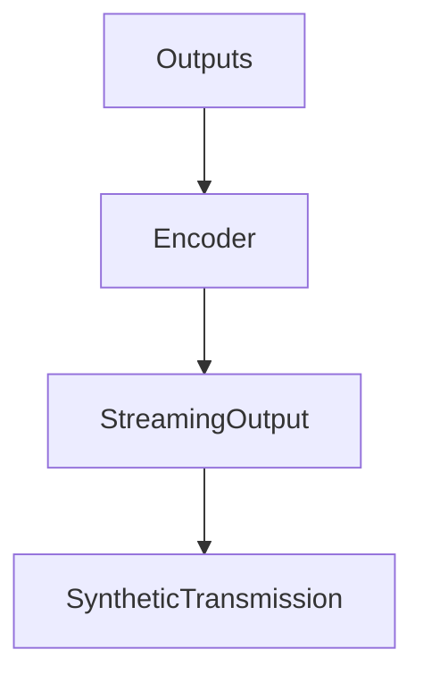

### Protocol-specific processing flow

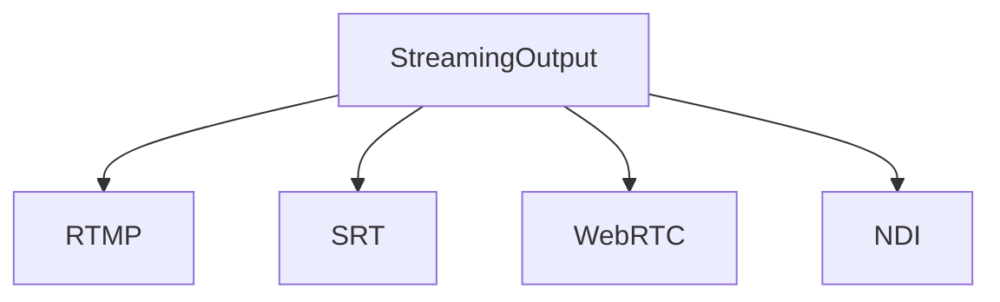

### Fan-out destination flow

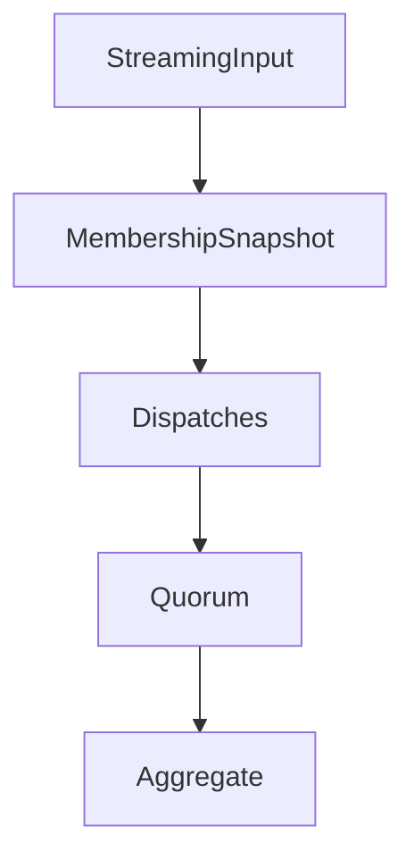

### Shared media ownership

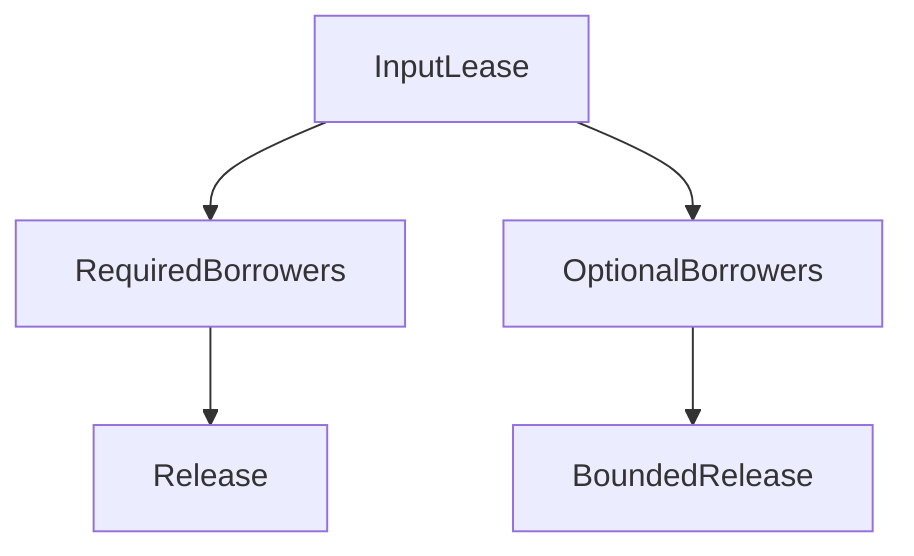

### Social platform coordination flow

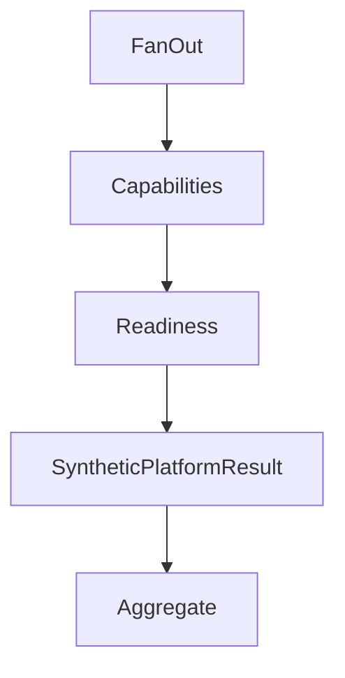

### Platform capability evaluation

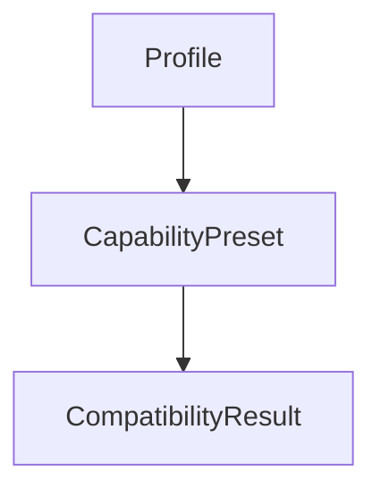

### Account/channel/event readiness

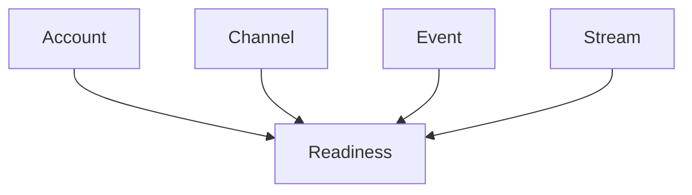

### Output-role and aspect-ratio mapping

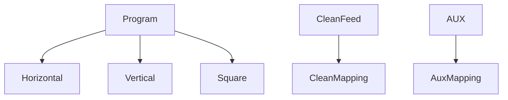

### Cross-platform live-group activation

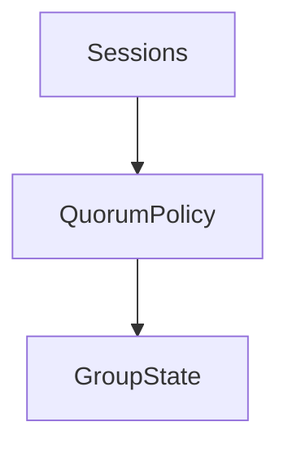

### Required/optional platform failure isolation

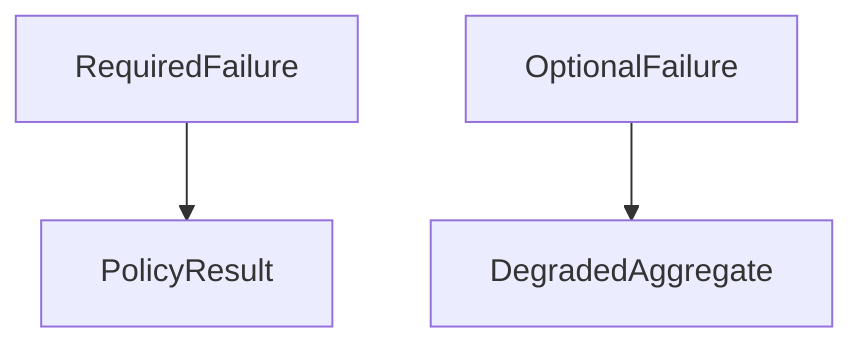

### Retry/reconnect coordination

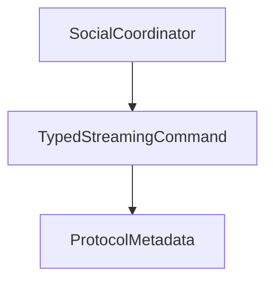

### Cross-platform aggregate state

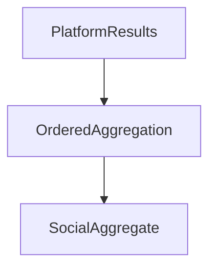

### Security/redaction boundary

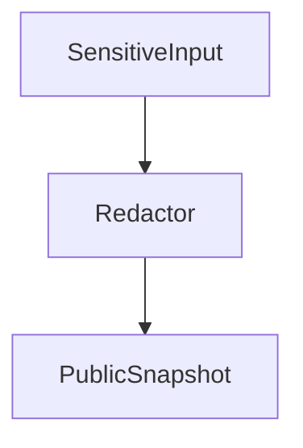

### Cross-subsystem generation flow

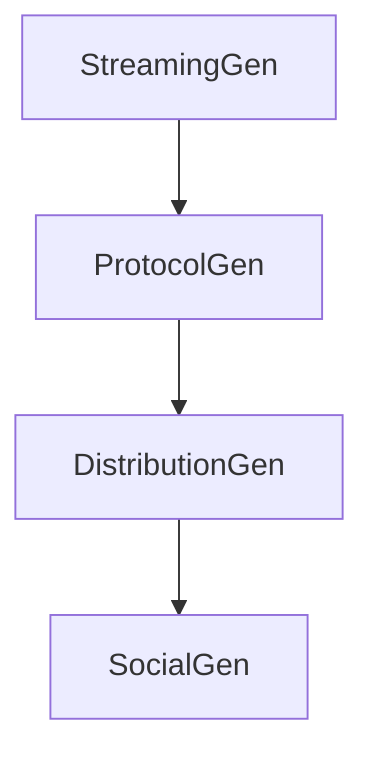

### Failure-preservation flow

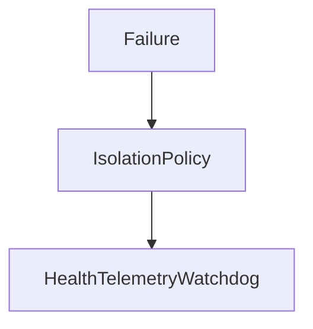

### Zero-leak shutdown sequence

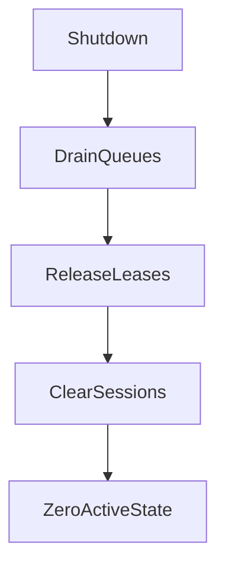

### Release-certification flow

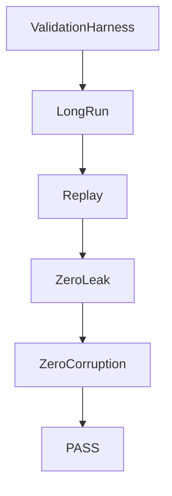

## Complete certification checklist

- [x] 202 minimum certification scenarios covered.
- [x] 100,000 deterministic ticks simulated.
- [x] 10,000 streaming inputs, send plans, distribution plans, protocol operations, social evaluations, social plans, social results, and social aggregates validated.
- [x] 50,000 destination dispatches validated.
- [x] Determinism replay matched canonical snapshots.
- [x] Zero-leak and zero-corruption counters are zero.
- [x] Security/redaction boundary rejects raw endpoint, credential, platform identity, payload, and native-handle exposure.

## Release-readiness decision

**PASS**. v5.7 is ready for release tagging later as `v5.7.0`; this phase intentionally does not create the tag. Recommended release title: **UBOS v5.7 Streaming and Social Distribution Platform**. Recommended next task: **UBOS v5.8.1 Production-Safe Replay and Media Recall Foundation**.
