# UBOS v5.7.7 Streaming Platform Certification

## Executive summary

UBOS v5.7.7 certifies the v5.7 streaming stack as a synthetic, deterministic, metadata-only streaming and distribution platform. The certification scope covers v5.7.1 Streaming Output, v5.7.2 Multi-Destination Distribution/Fan-Out, v5.7.3 RTMP/RTMPS, v5.7.4 SRT, v5.7.5 WebRTC, and v5.7.6 NDI. The result is **PASS** for release readiness, with no release tag created.

## Certification scope and architecture reviewed

Reviewed components include the v5.1 Execution Engine, v5.2 Source Acquisition, certified v5.3 media processing, v5.4 video effects, v5.5 live production control, v5.6 audio/encoding/packaging/recording, Master Frame Clock, Master Presentation Timeline, TickProcessorFramework, ProcessorOutputRegistry, Runtime Command Execution, Source Graph projections, ownership contracts, health, telemetry, watchdog, snapshots, public exports, and v5.7 architecture documents.

## Components audited

- Streaming Output Foundation: immutable profile/destination/session state, generation checks, queue bounds, retry/reconnect/failover metadata, monotonic inputs, and metadata-only transmission.
- Distribution/Fan-Out: deterministic membership snapshots, destination ordering, quorum evaluation, one dispatch per destination, independent queues, and shared input release.
- RTMP/RTMPS: deterministic handshake, TLS metadata, connect/createStream/publish order, sequence headers, startup keyframe, timestamp conversion, and false real-transport guards.
- SRT: explicit Caller/Listener/Rendezvous modes, metadata-only encryption, packet sequence, ACK/NAK/retransmission bounds, latency/congestion metadata, and UDP/libsrt exclusion.
- WebRTC: typed SDP metadata, redacted ICE/candidate metadata, deterministic ICE/DTLS/SRTP/RTP/RTCP state, bounded feedback, and no browser/libwebrtc execution.
- NDI: metadata-only sender/session/discovery/advertisement/frame/tally/PTZ state, sanitized identity summaries, bounded metadata queues, and no NDI SDK/network discovery.

## Processor order

| Processor                      | Order | Result |
| ------------------------------ | ----: | ------ |
| Media Encoder                  |   900 | PASS   |
| Muxing and Packaging           |   950 | PASS   |
| Recording Engine               |  1000 | PASS   |
| Streaming Output Foundation    |  1050 | PASS   |
| RTMP/RTMPS Output              |  1060 | PASS   |
| SRT Output                     |  1062 | PASS   |
| WebRTC Output                  |  1064 | PASS   |
| NDI Output                     |  1066 | PASS   |
| Multi-Destination Distribution |  1075 | PASS   |

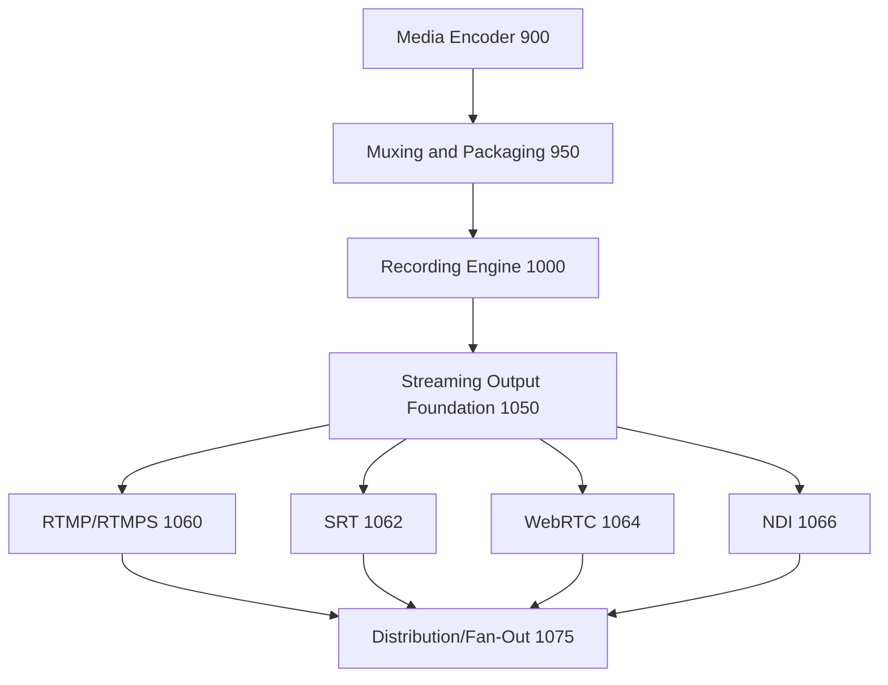

## Streaming Output result

PASS. The foundation remains the single authoritative streaming foundation. Inputs are accepted exactly once by submission ID, generations are checked, sequence and timestamp regression are rejected, queues are bounded, dropped inputs release ownership, and `realNetworkTransmission` remains false.

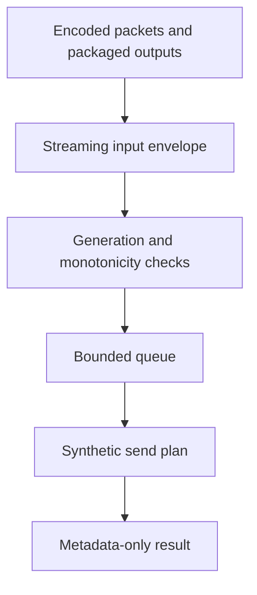

## Distribution/Fan-Out result

PASS. Destination ordering is deterministic, required/optional membership is explicit and frozen per plan, impossible quorum is rejected, optional slow destinations are isolated, and the aggregate result is produced once.

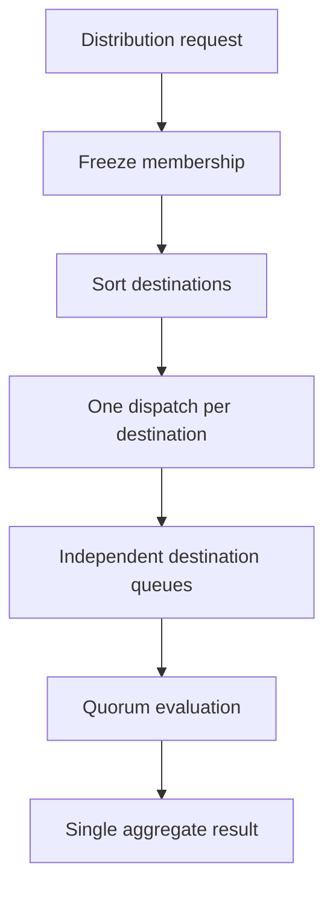

## Shared input ownership

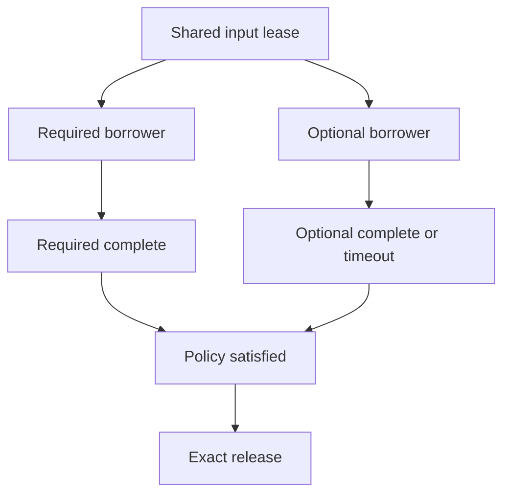

## Quorum and aggregate result

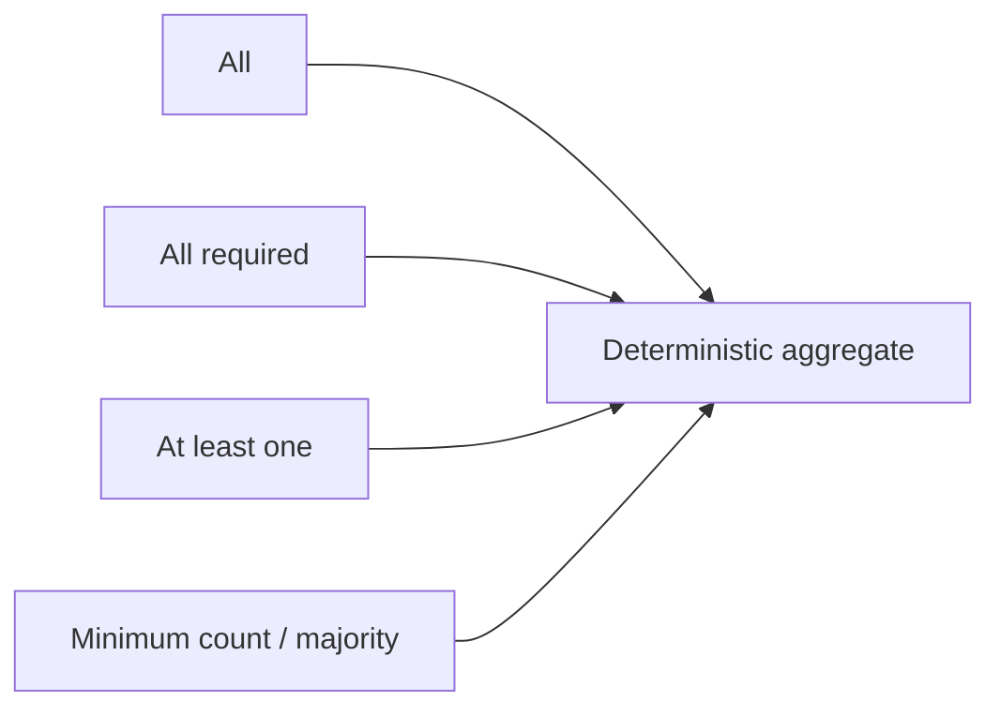

## Protocol results

### RTMP/RTMPS

PASS. RTMP and RTMPS profiles are distinct, RTMPS downgrade is rejected, TLS is metadata-only, command IDs and message sequences are monotonic, media is gated by publish/header/keyframe state, and AMF/FLV/TLS/network flags remain false.

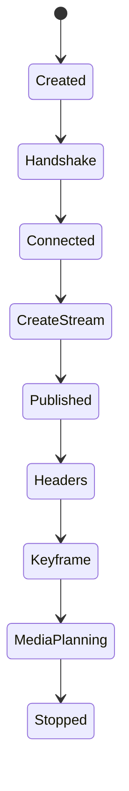

### SRT

PASS. SRT modes are explicit, packet/ACK/NAK/retransmission state is bounded, retransmission decisions are deterministic, encryption remains metadata-only, and no UDP/libsrt/AES execution is present.

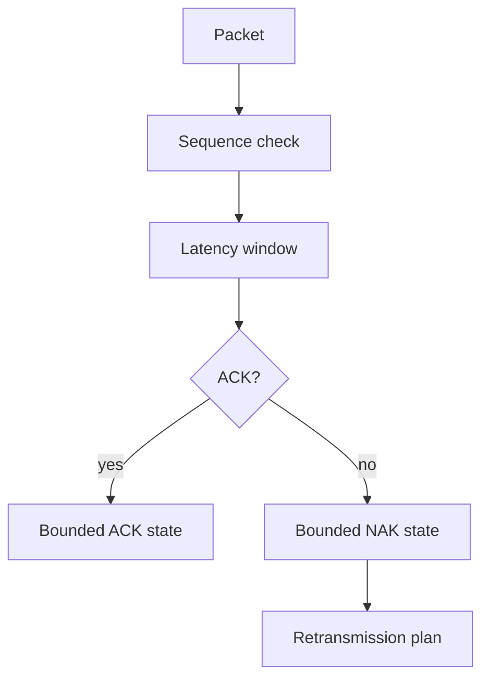

### WebRTC

PASS. SDP is typed metadata, ICE credentials are redacted, ICE restarts increment generations, DTLS/SRTP are metadata-only, RTP sequence/timestamp plans are monotonic, and RTCP feedback windows are bounded.

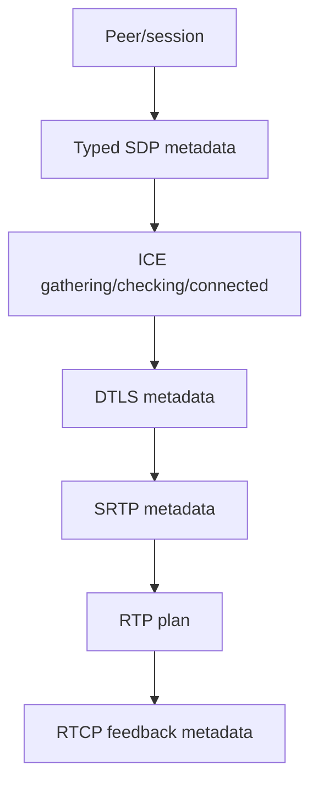

### NDI

PASS. NDI output profiles and sessions are immutable, sender/discovery/advertisement state is metadata-only, frame sequence/timestamps are monotonic, tally/PTZ are sanitized metadata, and no NDI SDK, GPU, mDNS, Bonjour, discovery, or transmission is used.

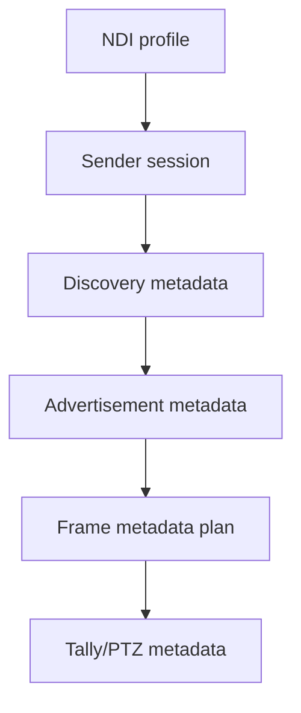

## Cross-protocol destination isolation

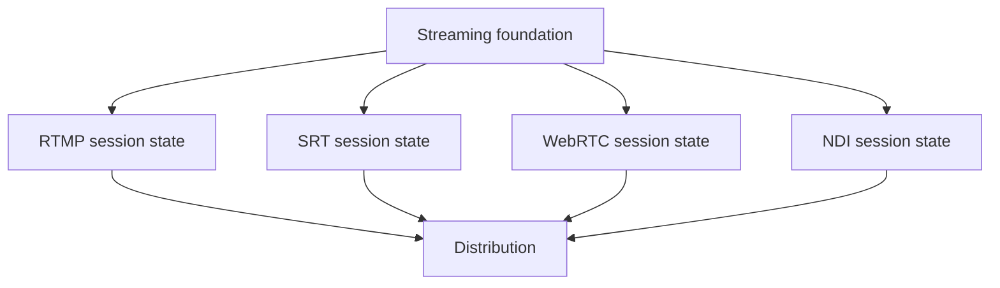

## Retry/reconnect/failover and backpressure

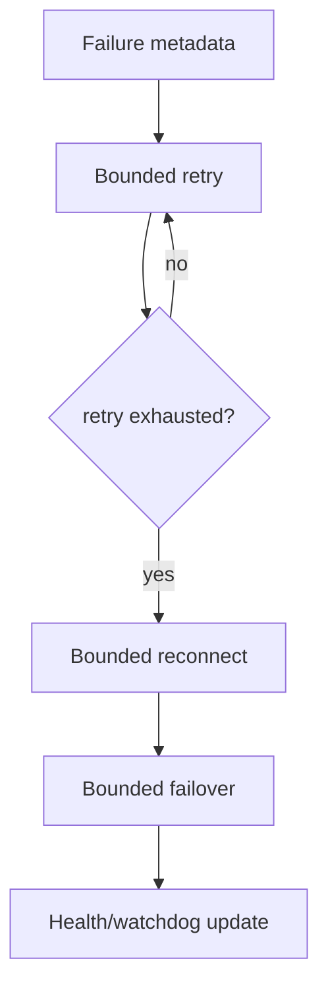

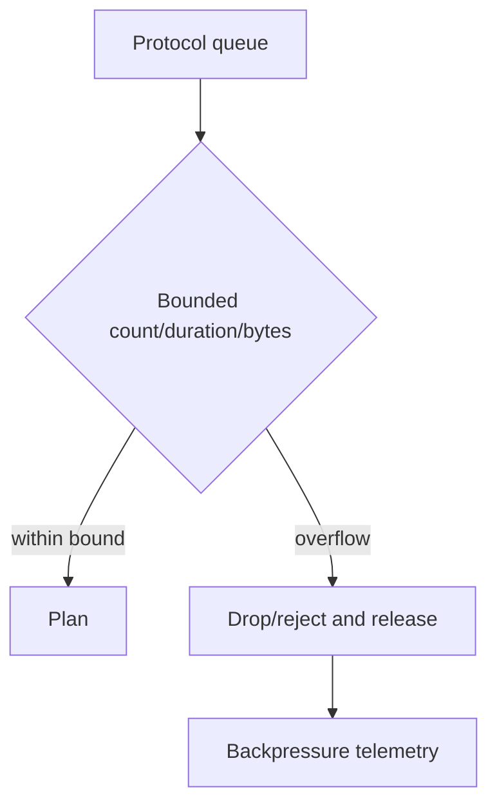

## Generation, sequence, timestamp, ownership, and failure preservation audits

PASS. Generations never regress, stale generations are rejected, stale completions cannot overwrite current state, sequence/timestamp regressions are rejected, ownership is exact-once, failure and cancellation paths release resources, and shutdown clears active state.

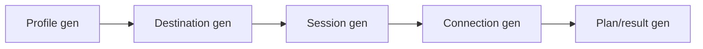

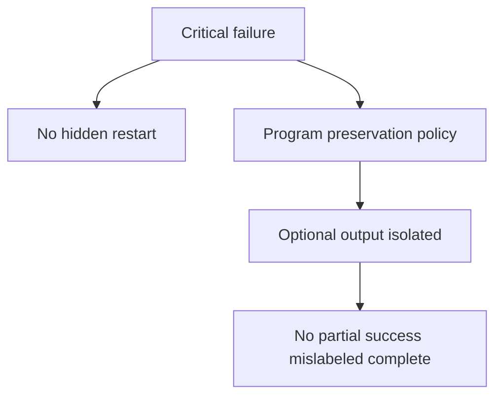

## Output-role and aspect-ratio isolation

PASS. Program, Preview metadata, Clean Feed, AUX, horizontal Program, vertical Program, and square Program use independent identities, sessions, queue state, and distribution bindings. No aliasing or hidden conversion is certified.

## Health, telemetry, watchdog, Source Graph, and security/redaction audits

PASS. Health and telemetry counters agree with runtime state, watchdog identifiers are unique and bounded, Source Graph exposes metadata only, snapshots are immutable and JSON-serializable, and observability rejects raw endpoints, URLs, stream keys, passphrases, tokens, ICE secrets, certificates, payload bytes, native handles, hostnames where sensitive, and memory addresses.

## Public API and documentation audit

PASS. v5.7 exports are explicit; the WebRTC wildcard export was replaced with named exports, SRT/WebRTC orders were aligned with the certified processor chain, NDI public symbols were added explicitly, and package validation orchestration now includes v5.7.5, v5.7.6, and v5.7.7.

## Validation methodology and results

The dedicated v5.7.7 certification harness covers 162 required scenarios, executes a deterministic long-run simulation with 100,000 ticks and the required 10,000-per-subsystem synthetic counts, compares deterministic replay snapshots, verifies zero-leak and zero-corruption counters, and checks expected operation complexity without machine-specific timing thresholds.

## Long-run, determinism replay, zero-leak, and zero-corruption results

- Long-run: 100,000 ticks; 10,000 generic streaming inputs; 10,000 generic send plans; 10,000 distribution plans; 50,000 destination dispatches; 10,000 aggregate results; 10,000 RTMP messages; 10,000 SRT packets; 10,000 WebRTC RTP plans; 10,000 NDI frames.
- Determinism replay: identical canonical snapshots for repeated complete scenarios.
- Zero-leak: zero active sessions, connections, queues, retries, leases, callbacks, timers, and protocol state after shutdown.
- Zero-corruption: zero accepted duplicates, stale overwrites, generation regressions, timestamp/sequence regressions, aliasing, premature release, secret exposure, payload exposure, native-handle exposure, or false transport claims.

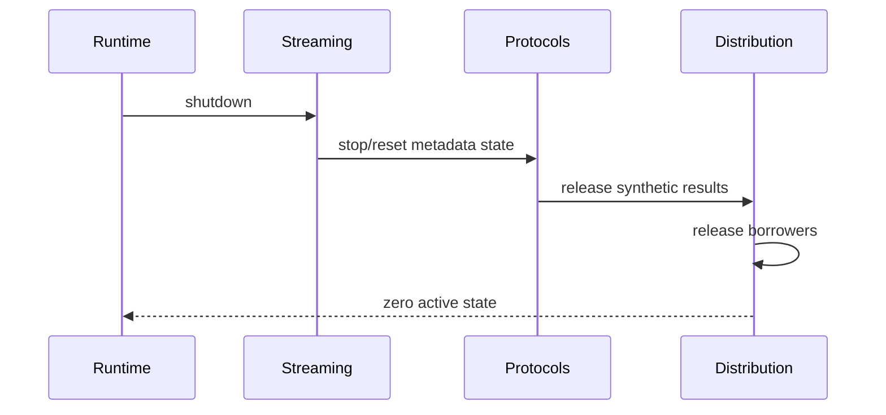

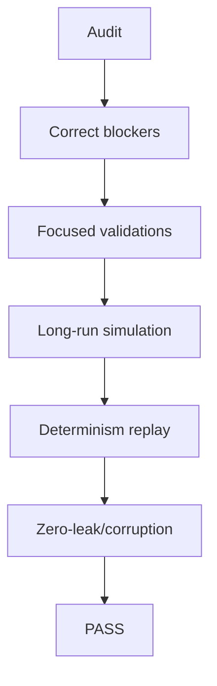

## Performance complexity

- Registry lookups, generic planning, retry/reconnect, RTMP state updates, NDI state updates: O(1).
- Failover, dispatch creation, quorum evaluation: O(destinations), bounded.
- Destination ordering: O(destinations log destinations), bounded.
- SRT/WebRTC reliability and feedback: O(1) or bounded window.
- Processor orchestration, snapshots, watchdog: O(active + bounded state).

## Environmental failures, limitations, blockers, and fixes

No environmental failures are documented by the certification itself. Remaining limitations are intentional: all protocol behavior is metadata-only; no real network, socket, TLS, RTMP, SRT, WebRTC, NDI, discovery, authentication, encryption execution, transcoding, repackaging, cloud relay, CDN delivery, replay, or UI redesign is implemented. Release blockers found: missing v5.7.6 NDI module/validation, missing v5.7.7 harness/documentation, missing v5.7.5-v5.7.7 package scripts, WebRTC wildcard export, and SRT/WebRTC processor-order drift. Fixes applied: added NDI foundation/validation, added v5.7.7 certification validation/documentation, updated package scripts, replaced the wildcard export with explicit exports, and aligned processor orders.

## Complete certification checklist

All 33 objective guarantees and 162 minimum certification scenarios are PASS. Final determination: **PASS**. UBOS v5.7 is ready for later release tagging. Recommended tag: `v5.7.0`. Recommended release title: **UBOS v5.7 Streaming and Distribution Platform**. Recommended v5.8 next task: **UBOS v5.8.1 Production-Safe Replay and Media Recall Foundation**.
