# UBOS v5.7.1 Streaming Output Foundation

## Purpose and architectural position
UBOS v5.7.1 adds a production-safe, synthetic-only Streaming Output Foundation after the v5.6 audio, encoding, packaging, and recording platform. Encoded packets and packaged outputs remain authoritative; the foundation validates session/profile/destination generations, protocol compatibility, sequence and PTS monotonicity, then creates deterministic synthetic transmission plans and results. It does not render, mix, encode, mux, record, authenticate, resolve DNS, open sockets, host playlists, or perform protocol handshakes.

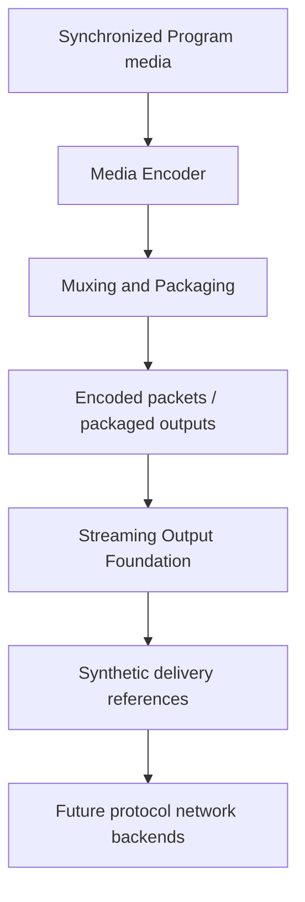

## Relationship to v5.6
Recording and streaming are independent consumers of packaged output through explicit borrowed or owned leases. Streaming runs after Media Encoder order 900, Muxing/Packaging order 950, and Recording order 1000 at order 1050, using the existing TickProcessorFramework and RuntimeCommandHandler shape.

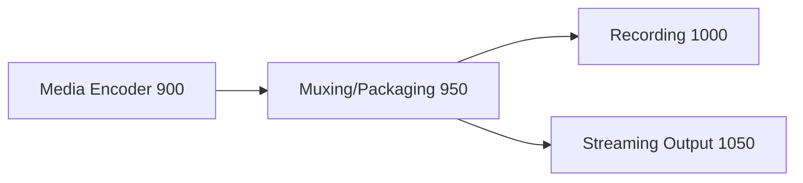

## Protocols, destination classes, and profiles
Supported protocols are RTMP_FOUNDATION, RTMPS_FOUNDATION, SRT_FOUNDATION, WEBRTC_FOUNDATION, HLS_DELIVERY_FOUNDATION, DASH_DELIVERY_FOUNDATION, RIST_METADATA, NDI_METADATA, and CUSTOM_TYPED. Destination classes are GENERIC_STREAM_ENDPOINT, SOCIAL_PLATFORM, CDN_INGEST, PRIVATE_SERVER, CLOUD_MEDIA_SERVICE, LOCAL_NETWORK_METADATA, PEER_TO_PEER_METADATA, and CUSTOM. Profiles are immutable registration records containing protocol, destination class, output role, encoder/package source IDs, delivery mode, queue/backpressure/retry/reconnect/failover/heartbeat/timeout policies, backend preference, criticality, safe metadata, and monotonic generations.

## Destination model, endpoint references, and credential references
Destinations are immutable metadata records with explicit class, protocol, redacted endpoint reference, credential reference, stream-key reference, region metadata, primary/backup role, eligibility, protocol options, failover group, health-check policy, and safe metadata. Endpoint references carry scheme metadata, deterministic redacted host/path identifiers, port metadata, query-present, secure, generation, and safe metadata. Credential and stream-key references are opaque metadata only; no token, password, stream key, OAuth, cookie, authorization header, or secret material is stored or surfaced.

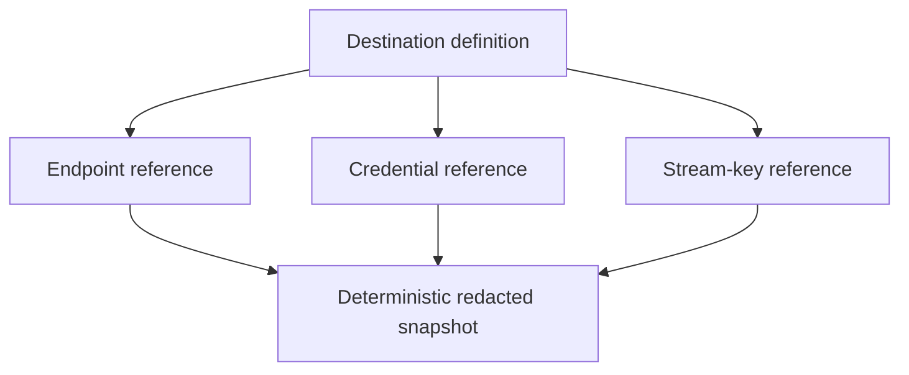

## Session lifecycle and startup policies
Sessions bind one profile generation to destination generations and an output role. Valid states are CREATED, VALIDATING, READY, CONNECTING, CONNECTED, STARTING, STREAMING, DEGRADED, RETRY_WAIT, RECONNECTING, FAILING_OVER, PAUSING, PAUSED, DRAINING, STOPPING, STOPPED, FAILED, DESTROYED, and SHUTDOWN. Program defaults wait for encoder readiness, keyframe, codec config, and all critical media.

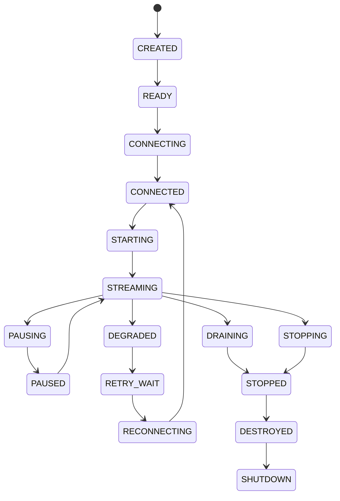

## Input, request, plan, and result
Input envelopes are metadata-only references to encoded packets or packaged outputs and include submission ID, session generation, input type, source generation, output role, media type, codec/container metadata, sequence, PTS/DTS/duration/time base, keyframe, codec-config readiness, A/V correlation generation, timeline generation, discontinuity generation, ownership, estimated bytes, and safe metadata. Send requests include expected generations and deadlines. Send plans deterministically validate session, destination/profile, input generation, protocol compatibility, sequence/timestamp, connection state, queue, pacing, retry/reconnect/failover, ownership, backend invocation, result validation, state update, release, and publication. Results are one per accepted input and always report `realNetworkTransmission: false` for the synthetic backend.

## Connection lifecycle
Connections are synthetic-only and deterministic. States include DISCONNECTED, RESOLVING_METADATA, CONNECTING, HANDSHAKING_METADATA, CONNECTED, AUTHENTICATING_METADATA, READY, DEGRADED, RETRY_WAIT, RECONNECTING, FAILED, and CLOSED.

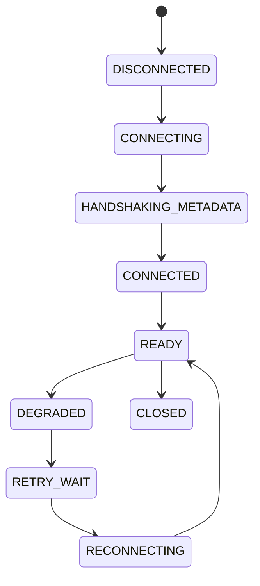

## Retry, reconnect, failover, heartbeat, timeout, and pacing
Retry policies are bounded with fixed, linear, exponential, or custom backoff and deterministic jitter. Reconnect policies are explicit and bounded. Failover groups use deterministic ordered destination IDs and never switch destinations implicitly. Heartbeats and timeouts are tick-based metadata; no independent timer or real keepalive packets exist. Pacing is metadata derived from FrameTick and timestamps, never a sleep loop.

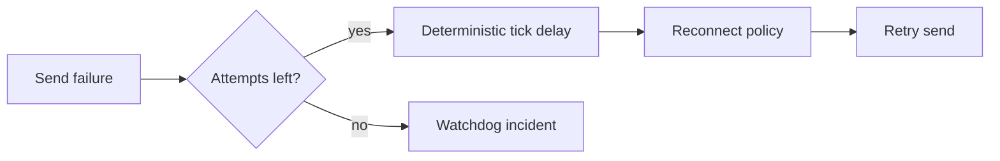

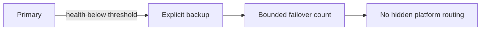

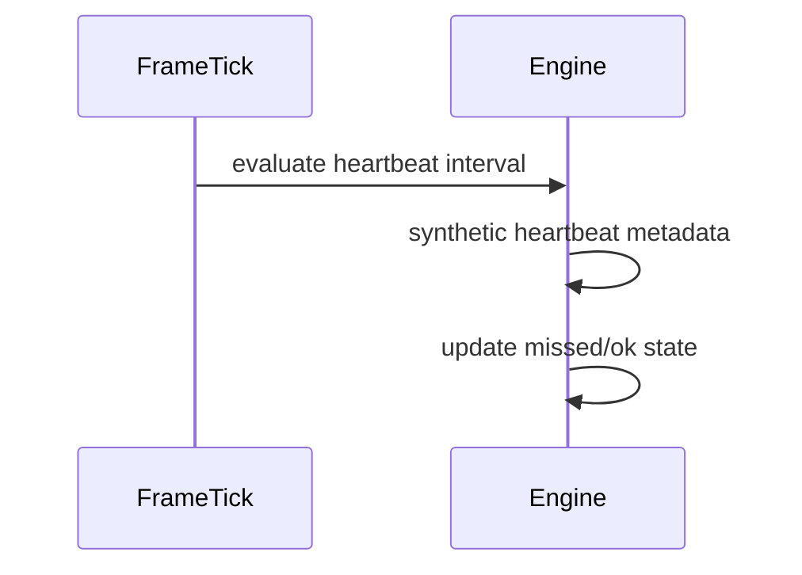

## Ownership, queues, backpressure, bandwidth, and congestion
Ownership supports STREAMER_OWNED, TRANSMISSION_QUEUE_OWNED, DESTINATION_FUTURE_OWNED, BORROWED_READ_ONLY, and RELEASED. Leases release exactly once and released inputs cannot be resent. Per-session queues are bounded by item count, bytes, duration, and latency with explicit overflow policy. Backpressure is immutable and observable. Bandwidth and congestion are deterministic metadata only, with no probing or adaptive bitrate execution.

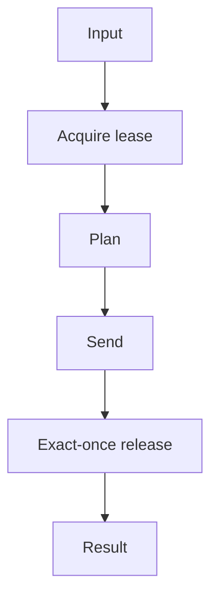

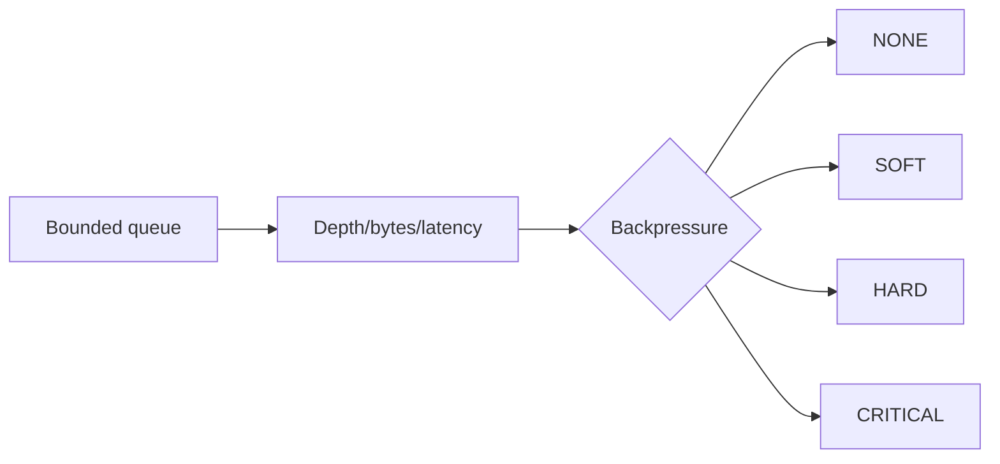

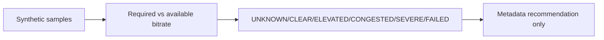

## Protocol option models
RTMP/RTMPS foundation metadata models application, stream-name, chunk-size, acknowledgement-window, enhanced-RTMP, and secure flags. SRT models mode, latency, passphrase reference, stream-id reference, packet filter, and encryption boundary. WebRTC models peer/signaling references, ICE metadata, DTLS/SRTP boundary, track mapping, and data-channel metadata. HLS/DASH model manifest/playlist references, segment upload references, target duration, sequence, discontinuity, and low-latency metadata. All references are opaque.

## Output-role bindings and multi-output streaming
Bindings explicitly connect PROGRAM, PREVIEW_METADATA, HORIZONTAL_PROGRAM, VERTICAL_PROGRAM, SQUARE_PROGRAM, CLEAN_FEED, AUXILIARY, MULTIVIEW_METADATA, or CUSTOM roles to sessions, encoder/package sources, destinations, A/V correlation requirements, and criticality. Program, Preview, Clean Feed, AUX, and aspect-ratio sessions are distinct, preventing writable aliasing and isolating optional failures.

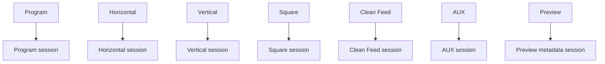

## Drain, flush, reset, and configuration transactions
Drain stops new inputs and processes bounded queued inputs in order before stopped. Flush either sends or discards by explicit policy, releases ownership once, resets queue/retry state, and increments flush generation. Reset invalidates stale results by generation and clears sequence, connection, retry/reconnect/failover/backpressure/bandwidth/queue/cache state. Configuration transactions are atomic, generation-protected, commit once at safe boundaries, and preserve prior valid configuration on failure.

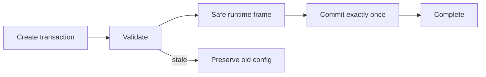

## Backend abstraction and synthetic backend
The backend contract includes descriptor, capabilities, initializeSession, createPlan, connect, send, heartbeat, disconnect, drain, flush, reset, reconfigure, shutdownSession, and shutdown. SyntheticStreamingTransportBackend advertises foundation protocols and input types, deterministic behavior, no real network transmission, and no socket access. It generates deterministic connection IDs, plans, delivery references, acknowledgement metadata, heartbeat metadata, congestion metadata, and failure metadata.

## Commands, events, output registry, health, telemetry, watchdog, and Source Graph
Typed command constants cover backend/profile/destination/session/binding/lifecycle/input/retry/reconnect/failover/heartbeat/drain/flush/reset/reconfigure/policy/cache/validate/shutdown operations. Events cover lifecycle, planning, sent/queued/dropped, retry, reconnect, failover, heartbeat, bandwidth, congestion, backpressure, health, and shutdown. Output registry keys publish bounded snapshots for definitions, states, queues, health, telemetry, backend health, and rejected results. Watchdog incidents cover stale generations, duplicate requests/submissions, sequence/timestamp regression, protocol incompatibility, destination and connection failures, retry/reconnect/failover exhaustion, heartbeat timeout, congestion, queue overflow, critical backpressure, A/V mismatch, backend failure, ownership violation, registry/source-graph mismatch, and invariant failure. Source Graph exposes redacted metadata only.

## Security and production safety
Snapshots, health, telemetry, events, commands, watchdog, errors, and Source Graph never expose raw URLs, hostnames, ports where sensitive, stream keys, passwords, tokens, OAuth data, cookies, authorization headers, SRT passphrases, WebRTC signaling data, ICE credentials, cloud account IDs, payload bytes, native sockets, or native handles. The foundation creates no second media clock, no runtime loop, no scheduler, no DNS/socket/protocol/network behavior, no credential storage, and no adaptive bitrate execution.

## Invariants, validation, determinism replay, and performance
`assertInvariants()` validates unique IDs, valid references, generation safety, one result per accepted input, monotonic sequence/PTS, distinct Program/Preview paths, bounded retry/reconnect/failover/heartbeat/queue state, valid ownership, no stale mutation, health/telemetry consistency, redacted snapshots, and clean shutdown. Long-run validation uses fake ticks, deterministic inputs, synthetic destinations, bounded queues, explicit ownership, fake diagnostics time, 10,000 submissions/results, 100,000 snapshots/ticks, and deterministic replay. Expected complexity is O(1) for lookups, queue operations, validation, retry/reconnect decisions; O(destinations) bounded for failover; O(active sessions) for heartbeat and processor orchestration; and O(profiles + destinations + sessions + bounded state) for snapshots.

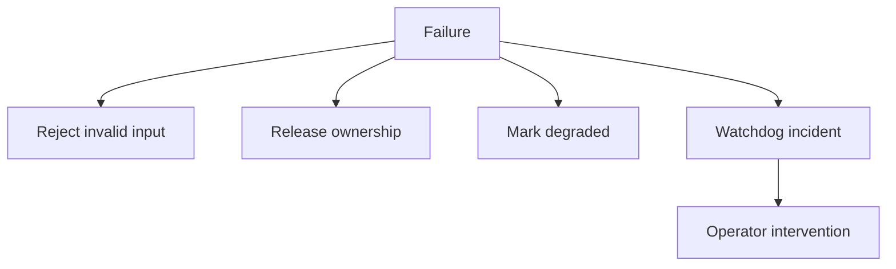

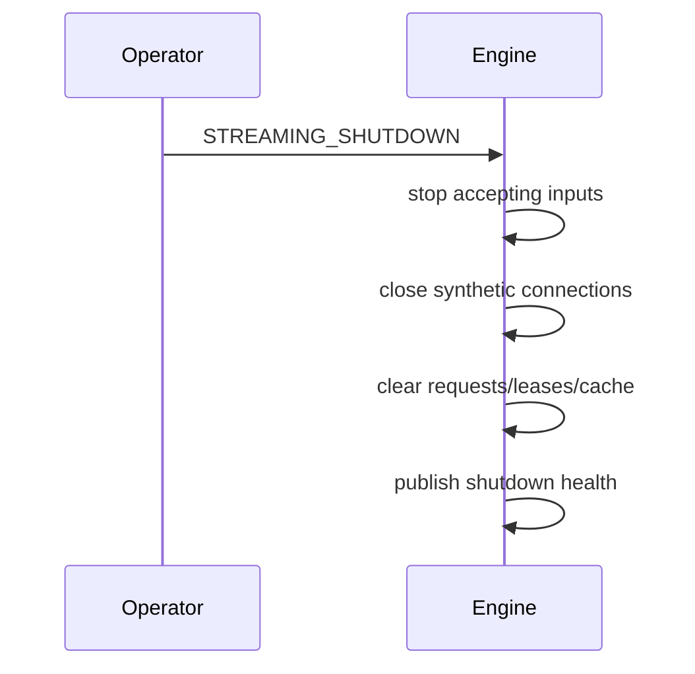

## Limitations and v5.7.2 handoff
This phase is a foundation only: no real network delivery, CDN delivery, social login, OAuth, socket access, RTMP/SRT/WebRTC/HLS/DASH execution, playlist hosting, encryption, DRM, replay, or adaptive bitrate execution. Recommended next task: **UBOS v5.7.2 — Multi-Destination Distribution and Fan-Out Engine**.
