# UBOS v5.7.2 Multi-Destination Distribution and Fan-Out Engine

## Purpose

UBOS v5.7.2 adds the authoritative production-safe distribution layer after the v5.7.1 Streaming Output Foundation. It coordinates one encoded packet, packaged output, segment-foundation output, or metadata input across many synthetic destinations without creating another media clock, encoder, muxer, recorder, scheduler, destination registry, ownership system, protocol implementation, or native network backend.

## Architectural position and relationship to v5.7.1

Synchronized media is encoded, muxed/packaged, optionally recorded, and passed to v5.7.1. v5.7.2 freezes destination membership, validates generations and compatibility, creates one dispatch per eligible destination, delegates delivery metadata to the synthetic streaming foundation, aggregates results, releases the shared input exactly once, and publishes health/telemetry/watchdog/source-graph metadata. v5.7.2 never claims real multi-platform delivery; the synthetic backend reports `realDistribution: false` and `realNetworkFanOut: false`.

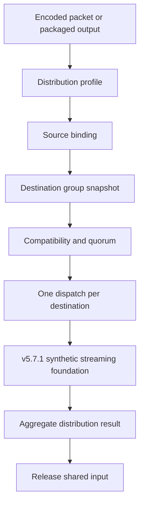

## Distribution modes and input types

Supported modes are `BROADCAST_ALL`, `BEST_EFFORT`, `ALL_OR_NOTHING`, `REQUIRED_DESTINATIONS`, `QUORUM`, `PRIORITY_ORDERED`, `PRIMARY_WITH_MIRRORS`, `ACTIVE_ACTIVE`, `ACTIVE_STANDBY`, and `CUSTOM_TYPED`. Supported input types are `ENCODED_PACKET`, `PACKAGED_OUTPUT`, `SEGMENT_OUTPUT_FOUNDATION`, `METADATA_ONLY`, and `CUSTOM`. Mode and input type are explicit; there is no hidden transcoding, repackaging, resizing, or conversion.

## Profiles, destination groups, and entries

A `DistributionProfile` is immutable after registration and generation-protected on update. It names distribution mode, source output role, input type, group reference/generation, compatibility, quorum, dispatch, retry aggregation, failure, timeout, queue, ownership, completion, degraded-state, backend preference, criticality, and safe metadata.

A `DistributionDestinationGroup` is immutable after registration and generation-protected on update. It contains deterministically ordered `DistributionDestinationEntry` records. Entries carry destination/session IDs and generations, priority, required/optional status, primary/mirror/standby flags, weight, protocol/input compatibility requirements, queue override, retry/timeout overrides, and failure isolation policy.

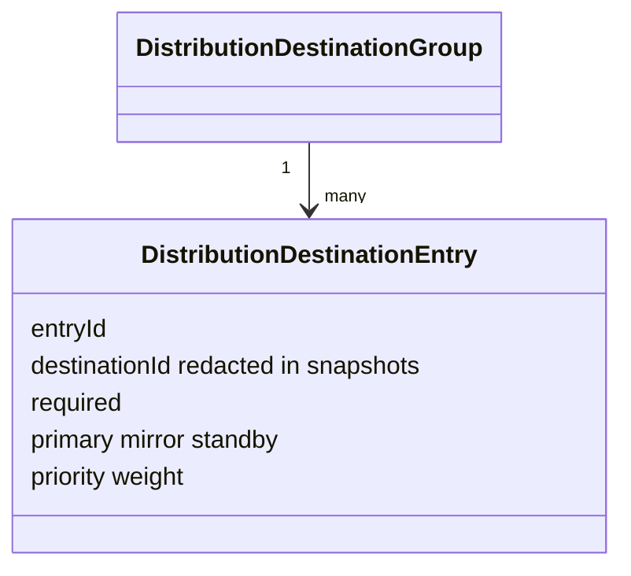

## Quorum, compatibility, dispatch, and results

Quorum policies include `ALL`, `ALL_REQUIRED`, `AT_LEAST_ONE`, `MAJORITY`, `MINIMUM_COUNT`, `MINIMUM_WEIGHT`, `PRIMARY_ONLY`, and `CUSTOM_TYPED`; impossible quorum is rejected. Compatibility policies are explicit and reject incompatible destinations unless a policy explicitly allows degradation. Dispatch policies include parallel deterministic, serial priority, required-first, primary-first, round-robin metadata, weighted metadata, and custom. Aggregate statuses are `COMPLETED`, `PARTIAL`, `DEGRADED`, `QUORUM_REACHED`, `QUORUM_FAILED`, `RETRYING`, `CANCELLED`, `FAILED`, and `REJECTED`.

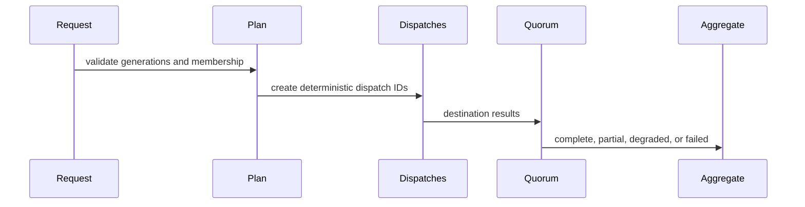

## Session lifecycle and source bindings

Sessions move through explicit states from `CREATED`/`READY` to `DISTRIBUTING`, `PAUSED`, `DRAINING`, `STOPPED`, `FAILED`, `DESTROYED`, and `SHUTDOWN`. Failed or destroyed sessions cannot silently resume. Each session has one authoritative enabled source binding unless a future explicit multi-source mode is introduced.

```mermaid
stateDiagram-v2
  [*] --> READY
  READY --> STARTING
  STARTING --> DISTRIBUTING
  DISTRIBUTING --> PAUSING --> PAUSED
  PAUSED --> RESUMING --> DISTRIBUTING
  DISTRIBUTING --> DRAINING --> STOPPED
  DISTRIBUTING --> STOPPING --> STOPPED
  STOPPED --> READY
  READY --> DESTROYED --> SHUTDOWN
```

## Shared ownership and independent queues

Every accepted input receives one `DistributionInputLease`. Destination borrows are read-only. Release occurs only after the ownership policy is satisfied; double release and released-input reuse are rejected. Destination queues are independent and bounded by item count, bytes, duration, and latency; slow optional destinations do not block Program distribution indefinitely.

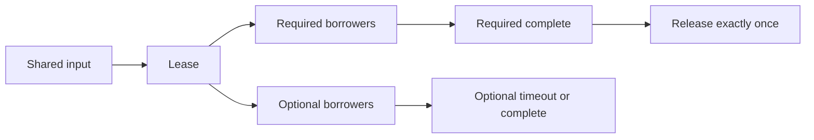

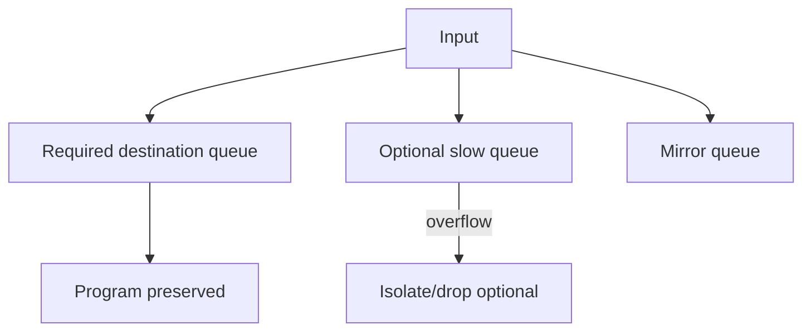

## Dynamic membership, primary/mirror/backup, and transactions

Membership updates are atomic and apply at configured safe boundaries such as next input, keyframe, package boundary, or drain-then-apply. The current plan uses a fixed membership snapshot. Primary identity is explicit; mirrors and standby backups are independent and fail over only when explicitly modeled. Configuration transactions validate requested generations and either commit exactly once or preserve the old configuration.

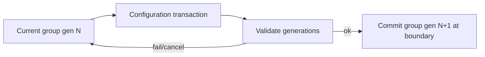

## Failure aggregation, retry aggregation, and completion policies

Failure aggregation supports fail-on-required, fail-on-any, quorum-based, degrade-on-optional, continue-with-available, stop-on-primary, and custom. Retry aggregation is bounded and destination-independent unless an explicit policy synchronizes required retries. Completion can wait for required, wait for all, return on quorum, return on primary, or fire-and-track bounded metadata.

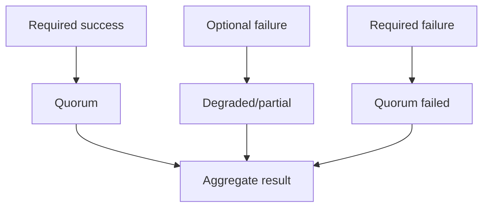

## Program, aspect-ratio, Clean Feed, AUX, and Preview distribution

Program, horizontal Program, vertical Program, square Program, Clean Feed, AUX, and Preview each use independent source bindings, groups, queues, sessions, and ownership records. There is no aliasing between Program/Preview/Clean Feed/AUX and no hidden aspect-ratio conversion.

## Pause/resume, drain, flush, reset, and shutdown

Pause stops new acceptance/dispatch according to policy while preserving ownership. Resume validates generations and resumes at safe boundaries. Drain stops new acceptance, processes bounded required work, releases optional outstanding borrows, and stops. Flush can send required/all or discard optional/all and increments queue generation. Reset invalidates request, plan, dispatch, queue, retry, membership, quorum, and ownership state. Shutdown is idempotent and leaves no active request, dispatch, queue, retry, transaction, lease, callback, timer, or cache state.

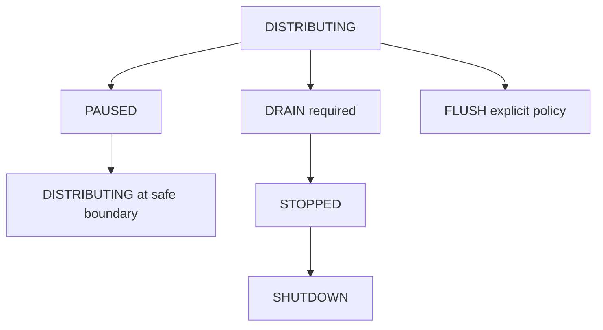

## Backend abstraction and synthetic backend

The backend contract exposes initialization, planning, dispatch preparation, aggregation, pause/resume/drain/flush/reset/reconfigure, and shutdown. `SyntheticDistributionFanOutBackend` deterministically simulates success, optional failure, required failure, retry, slow destination, queue pressure metadata, timeout/backend failure metadata, membership churn, and backup activation without sockets, DNS, platform APIs, credentials, OAuth, or browser automation.

## Processor order

The `MultiDestinationDistributionProcessor` is a TickProcessorFramework processor at order `1075`, after Streaming Output Foundation (`1050`) and after encoder/muxer/recording stages. It does not create a second loop.

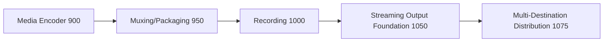

## Output registry, commands, events, health, telemetry, watchdog, and Source Graph

Typed registry keys cover profiles, groups, entries, session definitions/states, bindings, inputs, requests, plans, dispatches, results, leases, queues, destination health, membership snapshots, transactions, engine health, telemetry, backend health, and failed/rejected results. Commands are metadata-only and generation-aware. Events are typed and high-frequency dispatch events are bounded. Health and telemetry expose bounded counters. Watchdog incidents cover duplicates, stale generations, regressions, incompatibility, quorum, slow destination, queue overflow, retained input, backend failure, ownership violation, registry/source-graph mismatch, and invariant failure. Source Graph output is metadata-only and redacted.

## Security and production safety

Snapshots are JSON-safe, deeply immutable, deterministic, bounded, redacted, and free of endpoint URLs, stream keys, credentials, tokens, payload bytes, native handles, and private platform metadata. The engine enforces no duplicate submissions, no duplicate destination dispatches, no duplicate aggregate results, no stale generations, no sequence/timestamp regressions, no impossible quorum, no unbounded queue/cache/history/ownership, no output after cancellation/failure/flush/reset/stop/shutdown, no double release, no false network fan-out claim, and no platform API behavior.

## Invariants, long-run validation, determinism replay, and performance

`assertInvariants()` verifies unique IDs, monotonic generations, valid membership, achievable quorum, bounded queues/history, one dispatch per input/destination, one aggregate result per input, ownership release, redaction, and shutdown cleanup. Validation runs deterministic 10,000-input / 100,000-tick simulations and deterministic replay. Expected complexity is O(1) registry lookup, O(destinations log destinations) deterministic ordering, O(destinations) compatibility/dispatch/quorum/ownership, O(1) queue operation per destination, O(active sessions + dispatches) processor orchestration, and bounded snapshot/watchdog evaluation.

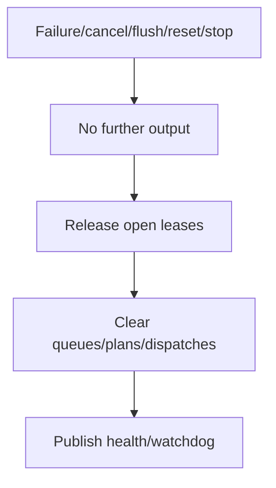

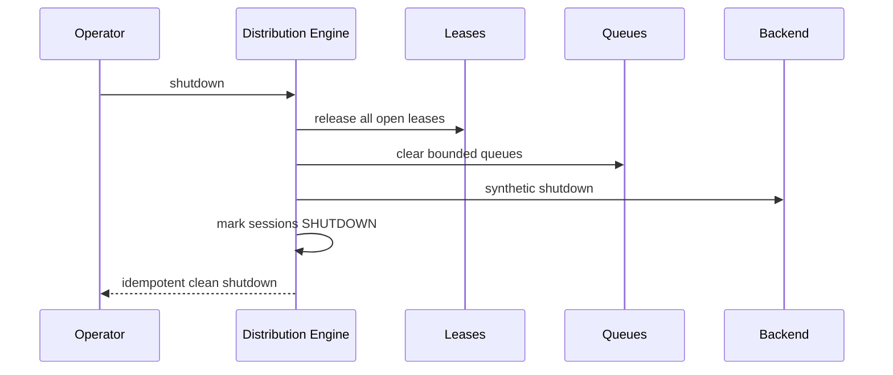

## Limitations and v5.7.3 handoff

v5.7.2 is a synthetic, production-safe fan-out foundation only. It does not implement real packet transmission, sockets, DNS, protocol handshakes, CDN upload, social authentication, adaptive bitrate, transcoding, resolution/frame-rate/sample-rate conversion, relays, DRM, encryption execution, or UI redesign. The next recommended task is **UBOS v5.7.3 — Production-Safe RTMP and RTMPS Output Foundation**.

## Additional required diagrams

### Deterministic dispatch ordering

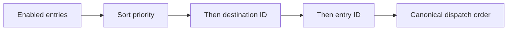

### Quorum evaluation

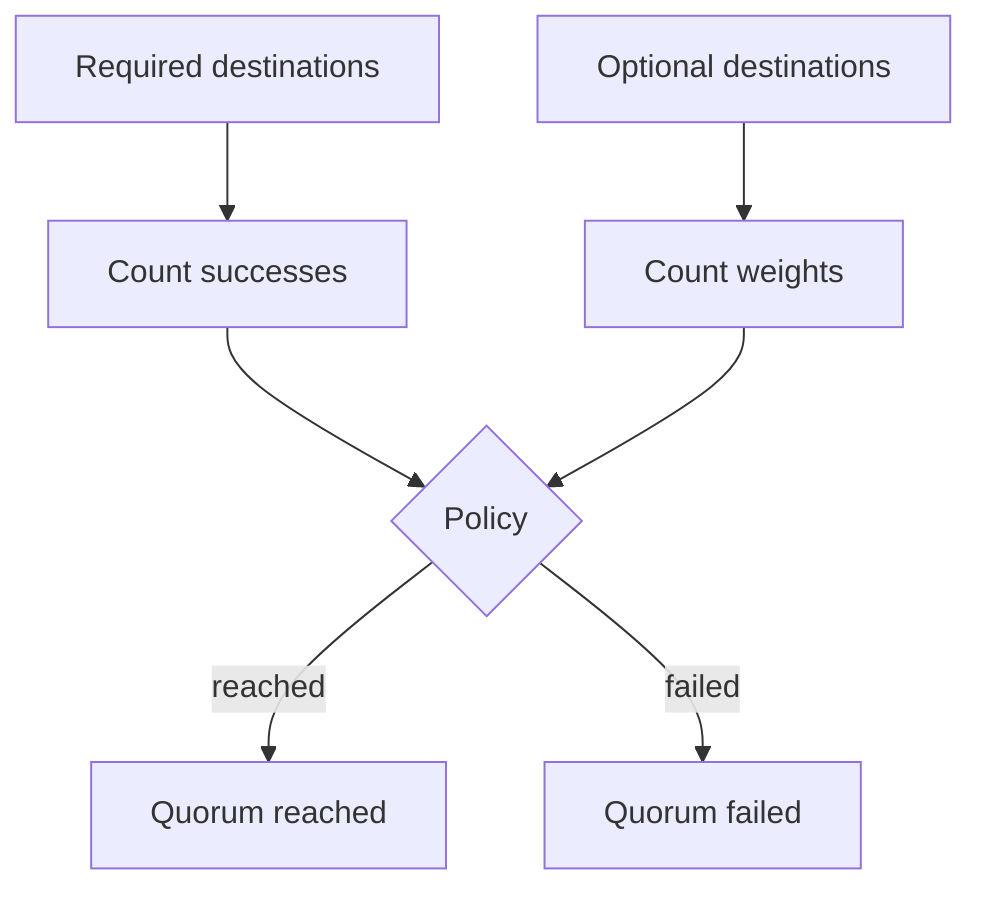

### Primary/mirror/backup flow

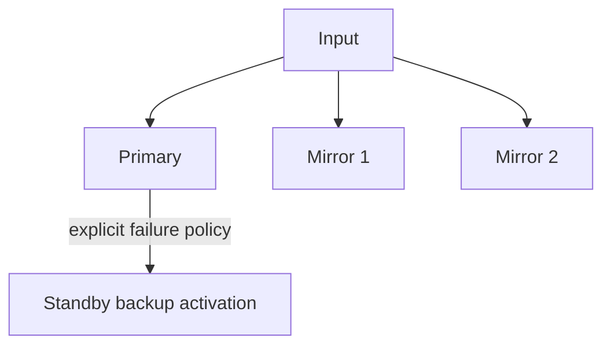

### Aggregate result creation

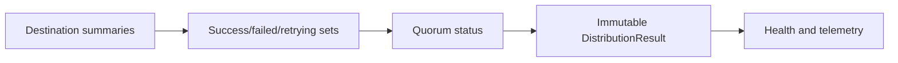
