# UBOS v5.7.3 — Production-Safe RTMP and RTMPS Output Foundation

## Purpose and architectural position
UBOS v5.7.3 specializes the v5.7.1 Streaming Output Foundation and the v5.7.2 Multi-Destination Distribution/Fan-Out layer for RTMP/RTMPS output. It models RTMP profiles, destinations, opaque references, sessions, handshakes, RTMPS TLS metadata, command ordering, chunk streams, timestamps, FLV-tag metadata, acknowledgements, reconnect/republish, queues, health, telemetry, watchdog incidents, Source Graph summaries, snapshots, and deterministic validation. It never opens sockets, resolves DNS, negotiates TLS, serializes AMF/FLV/RTMP bytes, or claims real delivery.

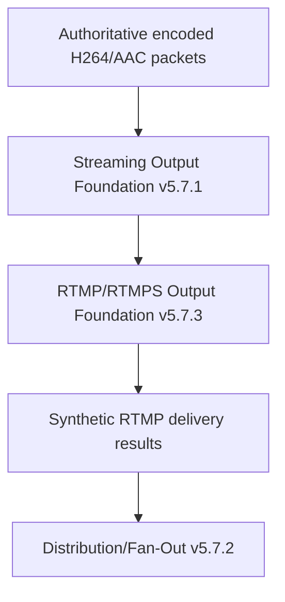

```mermaid
stateDiagram-v2
  [*] --> CREATED --> VALIDATING --> READY --> CONNECTING --> HANDSHAKING --> CONNECTED
  CONNECTED --> CREATING_STREAM --> STREAM_CREATED --> PUBLISHING --> PUBLISHED --> STREAMING
  STREAMING --> DEGRADED --> RECONNECTING --> REPUBLISHING --> PUBLISHED
  STREAMING --> DRAINING --> UNPUBLISHING --> DISCONNECTING --> STOPPED --> SHUTDOWN
  STREAMING --> FAILED
```

```mermaid
stateDiagram-v2
  [*] --> NOT_STARTED --> C0_C1_PLANNED --> S0_S1_METADATA_RECEIVED --> C2_PLANNED --> S2_METADATA_RECEIVED --> COMPLETE
  NOT_STARTED --> FAILED
  COMPLETE --> RESET
```

```mermaid
stateDiagram-v2
  [*] --> NOT_STARTED --> VALIDATING_CONFIGURATION --> CLIENT_HELLO_METADATA --> SERVER_HELLO_METADATA --> CERTIFICATE_METADATA --> ESTABLISHED_METADATA
  VALIDATING_CONFIGURATION --> FAILED
  ESTABLISHED_METADATA --> RESET
```

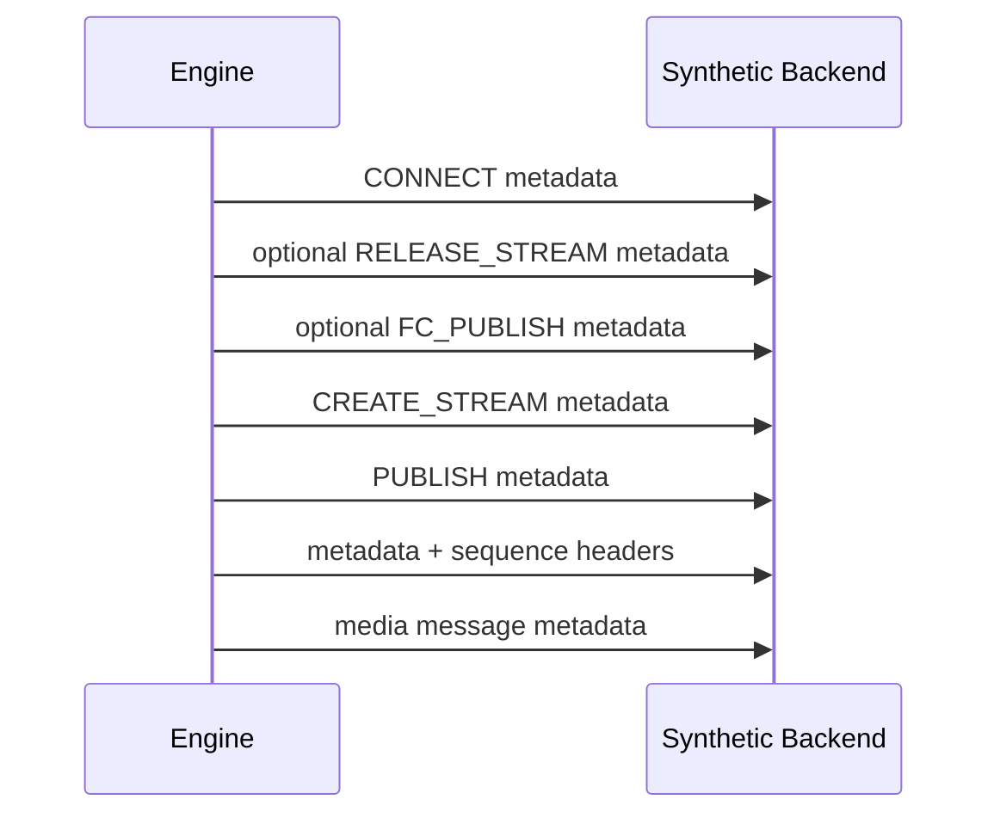

```mermaid
stateDiagram-v2
  DISCONNECTED --> CONNECTING --> HANDSHAKING --> CONNECTED --> COMMAND_NEGOTIATION --> STREAM_READY --> PUBLISHED --> STREAMING
  STREAMING --> DEGRADED --> RECONNECTING --> CONNECTING
  STREAMING --> CLOSING --> CLOSED
```

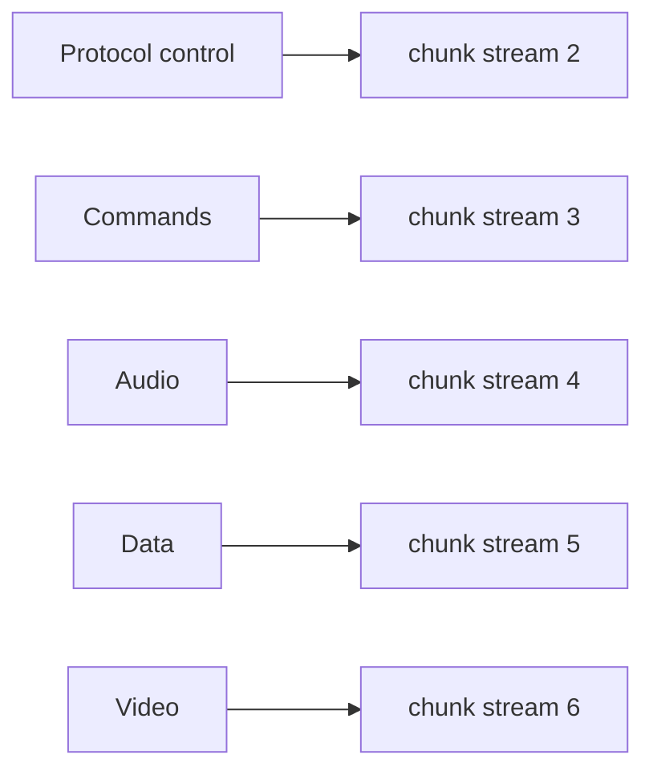

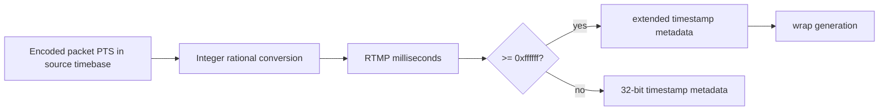

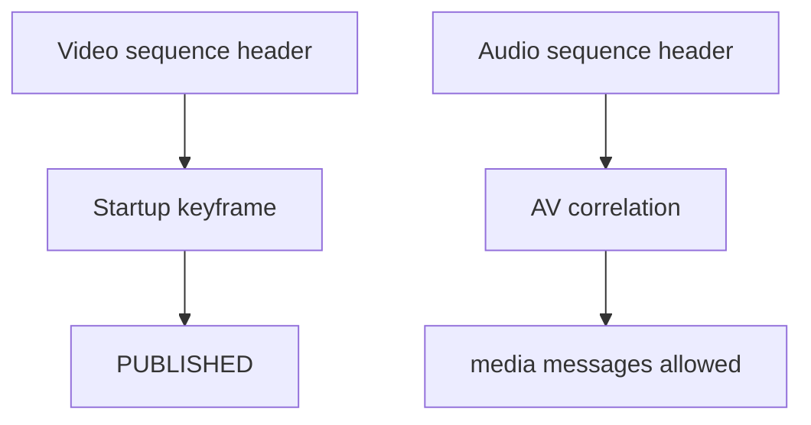

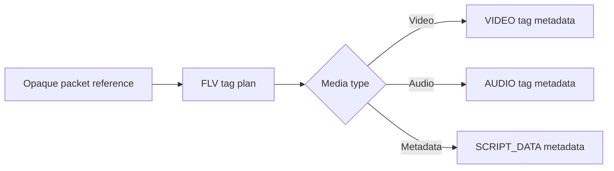

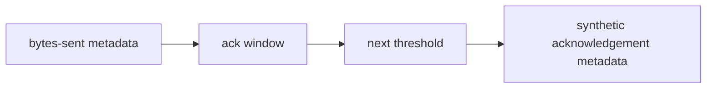

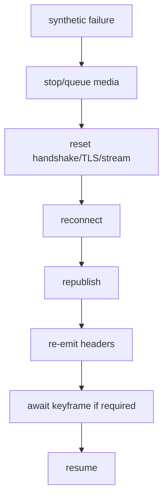

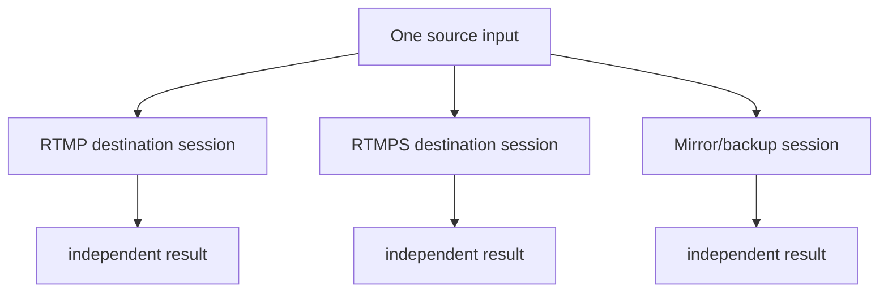

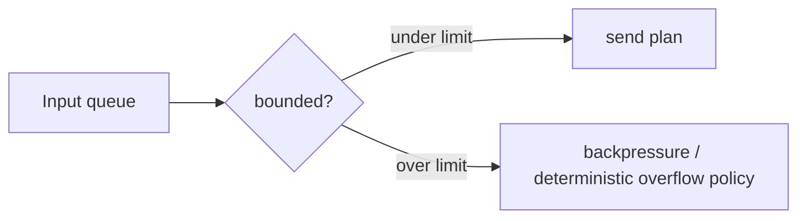

```mermaid
stateDiagram-v2
  CREATED --> VALIDATED --> COMMITTED --> COMPLETED
  CREATED --> CANCELLED
  VALIDATED --> FAILED
```

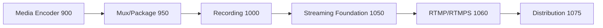

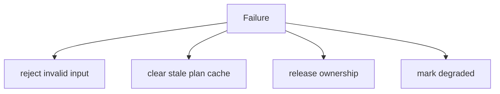

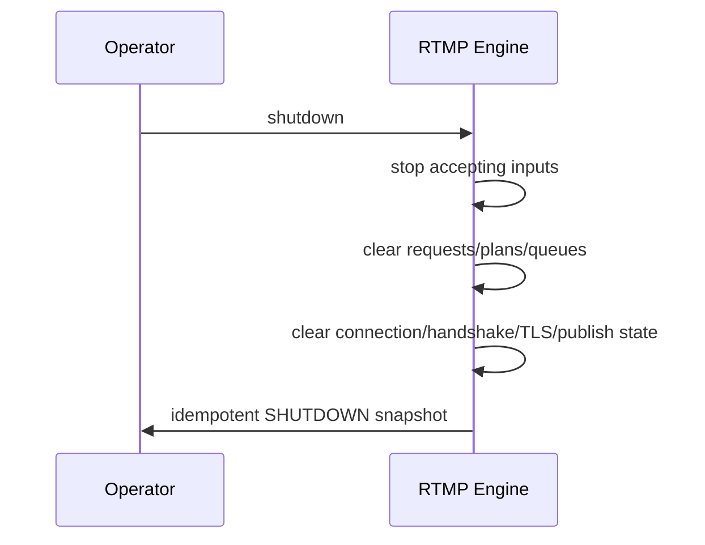

## Protocol, profile, destination, and reference model
Supported protocol types are RTMP, RTMPS, RTMP_ENHANCED_METADATA, and CUSTOM_TYPED_RTMP. RTMPS requires secure endpoint metadata and cannot downgrade to RTMP. Delivery modes are explicit: LIVE, RECORD_METADATA, APPEND_METADATA, LIVE_WITH_BACKUP, and CUSTOM. Profiles and destinations are immutable after registration except generation-protected updates. Endpoint, application, stream name, stream key, authentication, and certificate-policy references are opaque, deterministically redacted, and contain no raw URLs, stream keys, tokens, passwords, or certificate contents.

## Session lifecycle, startup, handshake, TLS, commands, and publish state
Each destination/output-role binding receives one authoritative RTMP session unless an explicit parallel policy exists. Startup policies require sequence headers, keyframe, AV correlation, and Streaming Foundation readiness for strict Program output. The handshake and RTMPS TLS foundations are metadata-only state machines. CONNECT, CREATE_STREAM, and PUBLISH are modeled as deterministic metadata commands; optional legacy commands are profile-controlled and observable. PUBLISHED is required before media planning and STREAMING.

## Messages, timestamps, FLV tags, codecs, and acknowledgements
RTMP messages carry opaque payload references only. H.264 and AAC are the primary deterministic synthetic mappings; H.265, AV1, VP9, and Opus are enhanced-metadata boundaries unless capabilities explicitly allow them. Timestamp conversion is integer/rational and records extended timestamp and wrap metadata. FLV tag plans are metadata-only. Acknowledgement windows, peer bandwidth, user-control events, chunk-size updates, and chunk-stream assignments are bounded synthetic metadata states.

## Input, request, plan, result, queues, backpressure, reconnect, republish
Inputs validate generations, codecs, ownership, sequence, timestamp, and AV correlation. Send plans are deterministic, cache-keyed by relevant generations, and delegate synthetic transport semantics through Streaming Output Foundation contracts. Results always report `realRtmpTransmission: false` and `realTls: false`. Per-session queues are bounded by input count, message count, duration, bytes, and latency. Reconnect and republish are bounded and explicit, re-emitting metadata/sequence headers and waiting for keyframes when policy requires.

## Multi-destination, Program/aspect-ratio/Clean Feed/AUX, drain/flush/reset
Each destination maintains independent session, connection, publish, timestamp, queue, acknowledgement, reconnect, and republish state. One source input can be borrowed across destinations without shared mutable connection state. Horizontal, vertical, square, Clean Feed, and AUX outputs are independent roles with no hidden resize or Program-state mutation. Drain, flush, and reset are bounded, exact-once, and generation-invalidate stale work.

## Commands, events, output registry, health, telemetry, watchdog, Source Graph
The public API adds typed commands, events, registry keys, health snapshots, bounded telemetry counters, watchdog incidents, and Source Graph metadata. High-frequency messages are represented by counters and bounded snapshots. Source Graph output exposes only redacted IDs, protocol type, state summaries, readiness, queue depth, health, and real-transport flags.

## Security, production safety, invariants, validation, performance, limitations
All snapshots are JSON-safe, immutable, deterministically ordered, bounded, and redacted. Invariants assert unique IDs, monotonic generations, RTMPS secure metadata, handshake/TLS/publish ordering, sequence-header/keyframe gating, monotonic sequence/timestamps, bounded queues, no false real transport claims, and clean shutdown. Long-run validation uses fake ticks and deterministic synthetic packet references; determinism replay compares canonical snapshots. Expected complexity is O(1) for registry lookup, handshake update, command progression, chunk assignment, timestamp conversion, message planning, acknowledgements, and queue operations; processor orchestration is O(active sessions), snapshots are O(profiles + destinations + sessions + bounded state), and watchdog evaluation is O(active + bounded incidents). Limitations: v5.7.3 intentionally does not perform real RTMP/RTMPS network delivery, TLS, AMF, FLV, DNS, socket, platform API, OAuth, credential retrieval, transcoding, repackaging, or adaptive bitrate switching. The v5.7.4 handoff is Production-Safe SRT Reliable Transport Foundation.
