# UBOS v5.7.4 — Production-Safe SRT Reliable Transport Foundation

UBOS v5.7.4 adds a deterministic, metadata-only SRT reliable transport foundation behind the Streaming Output Foundation. It models caller, listener, and rendezvous sessions, handshake metadata, stream ID/passphrase references, packet sequencing, ACK/NAK state, retransmission planning, latency windows, congestion windows, keepalives, recovery, drain, flush, reset, shutdown, health, telemetry, and output-registry publication without opening sockets or invoking SRT libraries.

## Production-Safety Contract

The implementation is explicitly synthetic. It creates no UDP sockets, no TCP/TLS/QUIC/HTTP transport, no DNS, no NAT or firewall traversal, no libsrt integration, no AES execution, no key exchange, no packet serialization, no payload-byte storage, no FFmpeg or GStreamer process, no scheduler, no runtime loop, and no media clock. Passphrases, stream IDs, endpoints, and other credentials are represented only as opaque redacted references.

## Encoded Packet → SRT Flow

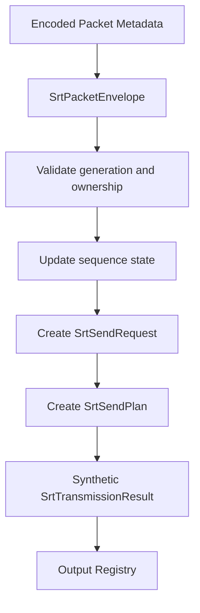

## SRT Session Lifecycle

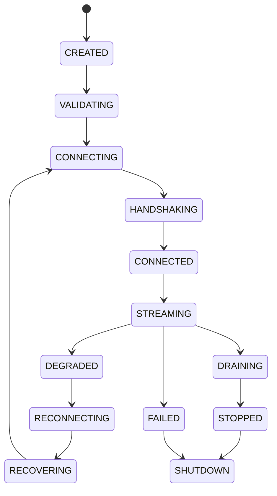

## Handshake

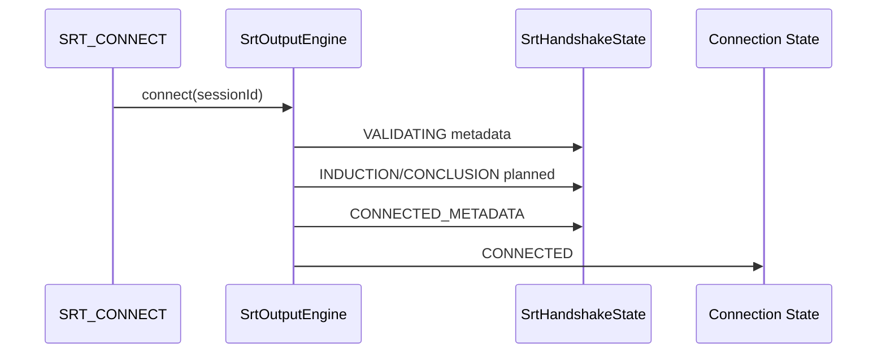

## ACK/NAK Flow

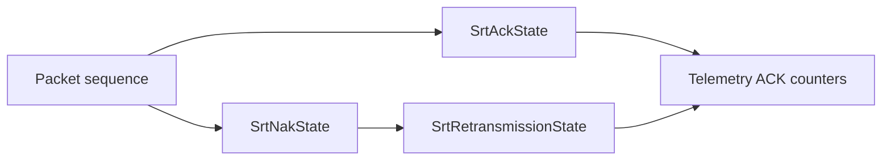

## Retransmission Queue

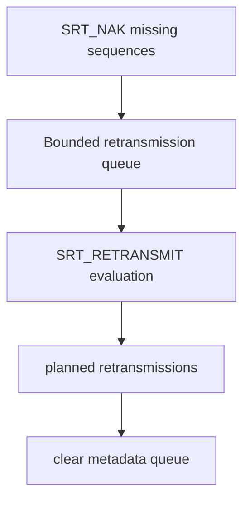

## Latency Window

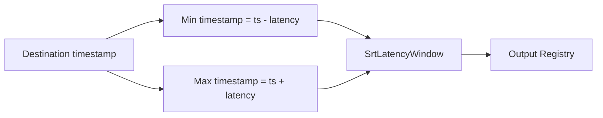

## Congestion Window

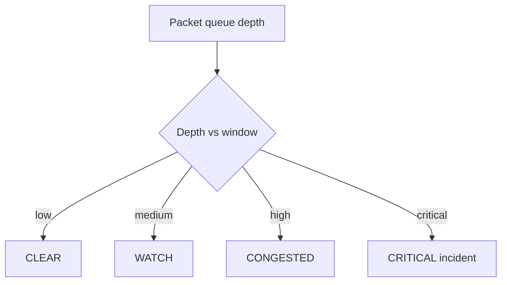

## Packet Sequence

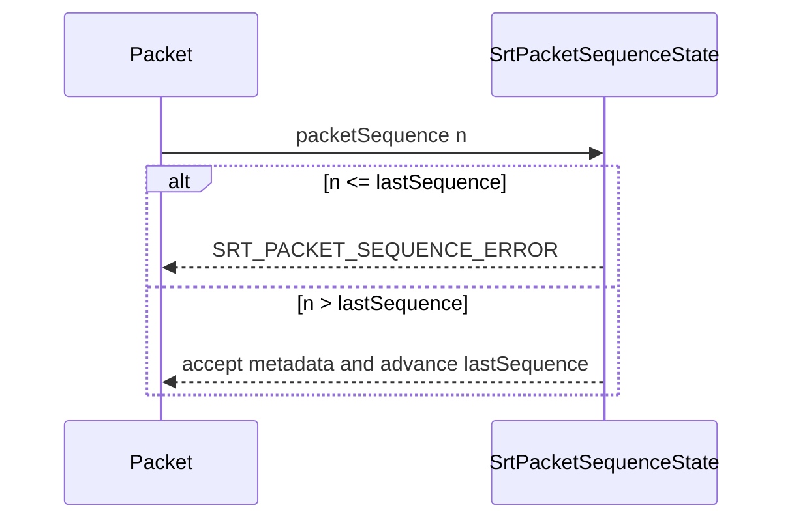

## Processor Order

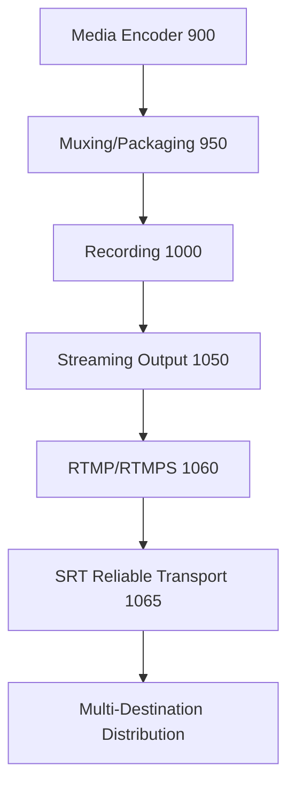

## Failure Recovery

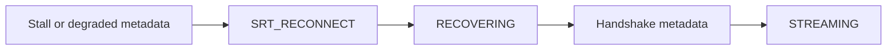

## Shutdown

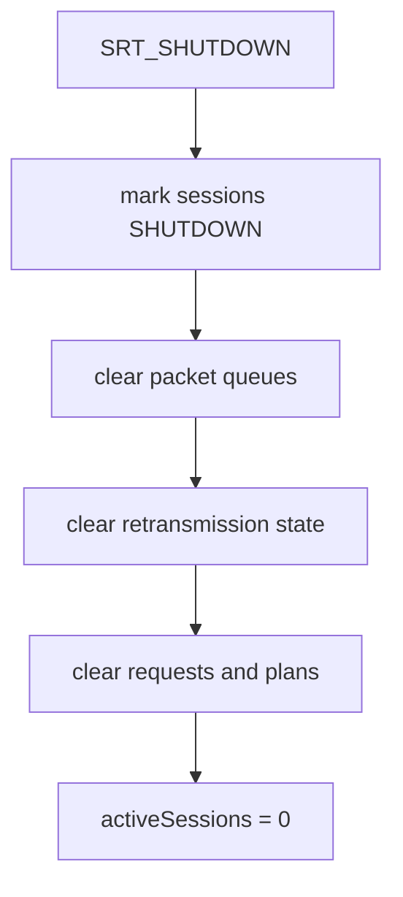

## Multi-Destination SRT Routing

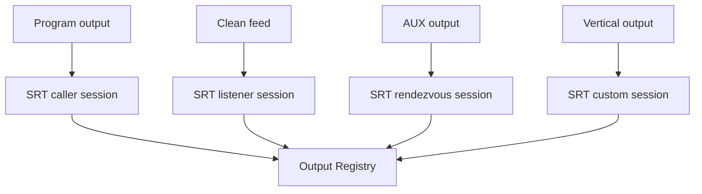

## Public Model Surface

The public model surface includes `SrtOutputProfile`, `SrtDestination`, `SrtSession`, `SrtConnectionState`, `SrtHandshakeState`, `SrtEncryptionState`, `SrtPacketEnvelope`, `SrtPacketSequenceState`, `SrtAckState`, `SrtNakState`, `SrtRetransmissionState`, `SrtLatencyWindow`, `SrtCongestionState`, `SrtStatistics`, `SrtSendRequest`, `SrtSendPlan`, and `SrtTransmissionResult`.

## Commands and Observability

The command surface includes `SRT_REGISTER_PROFILE`, `SRT_REGISTER_DESTINATION`, `SRT_CREATE_SESSION`, `SRT_CONNECT`, `SRT_START`, `SRT_STOP`, `SRT_SUBMIT_PACKET`, `SRT_ACK`, `SRT_NAK`, `SRT_RETRANSMIT`, `SRT_RECONNECT`, `SRT_RESET`, `SRT_FLUSH`, `SRT_DRAIN`, `SRT_VALIDATE`, and `SRT_SHUTDOWN`. Health and telemetry track sessions, handshakes, reconnects, retransmissions, drops, ACKs, NAKs, latency windows, congestion events, queue depth, packet loss, duplicates, stale generations, ownership, and failures.
