# UBOS v5.7.5 — Production-Safe WebRTC Output Foundation

UBOS v5.7.5 adds a deterministic, metadata-only WebRTC output foundation behind the Streaming Output Foundation. It models peer sessions, ICE/SDP/DTLS/SRTP/RTP/RTCP/congestion/jitter/bandwidth/retransmission state and synthetic transmission results. It does not implement browser APIs, Chromium, libwebrtc, sockets, networking, STUN/TURN networking, NAT traversal, DTLS, SRTP, RTP/RTCP serialization, FFmpeg, GStreamer, HTTP, WebSocket, QUIC, or WebTransport.

## Encoded Packet → WebRTC Flow
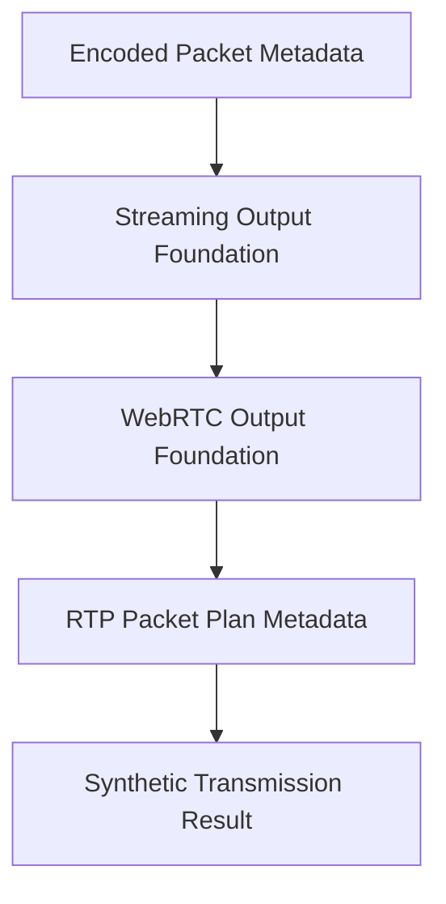

## Peer Lifecycle
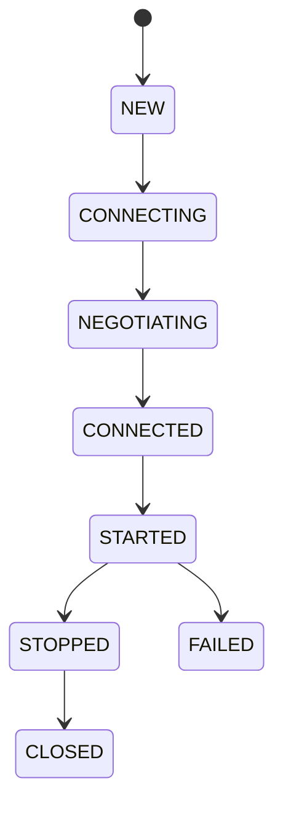

## ICE Lifecycle
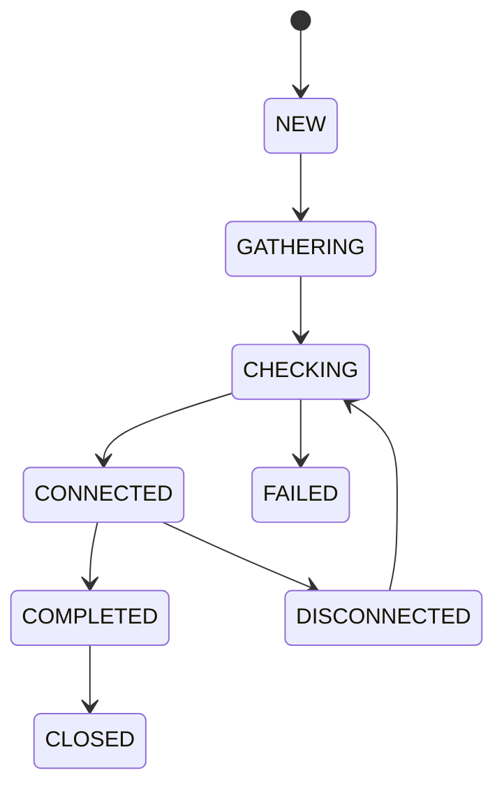

## SDP Negotiation
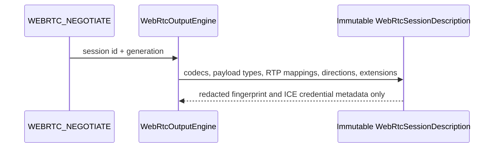

## DTLS Metadata
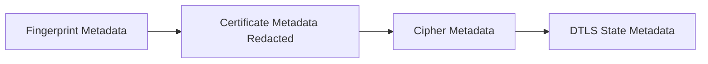

## SRTP Metadata
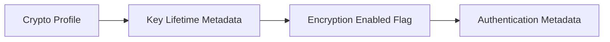

## RTP Packet Planning
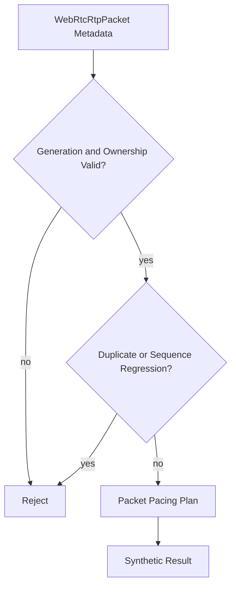

## RTCP Flow
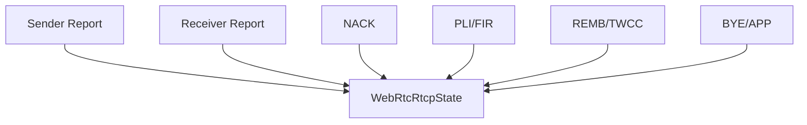

## Congestion Control
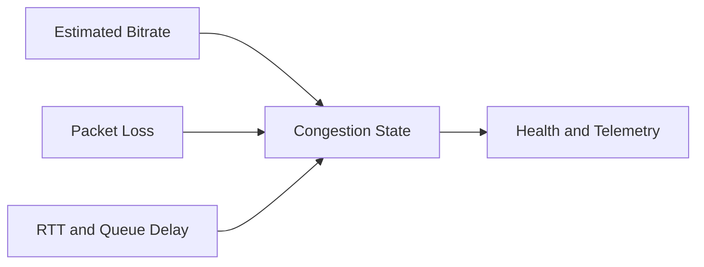

## Jitter Buffer
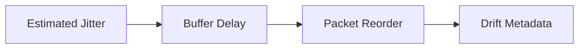

## Retransmission Planning
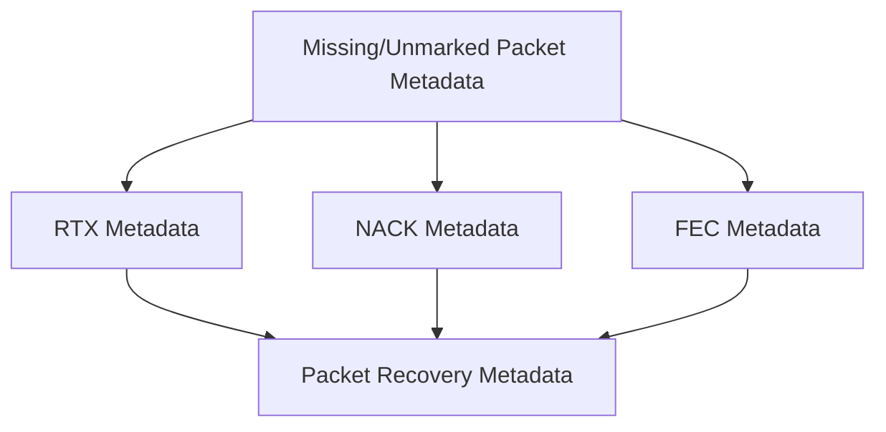

## Processor Order
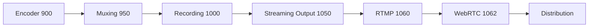

## Failure Recovery
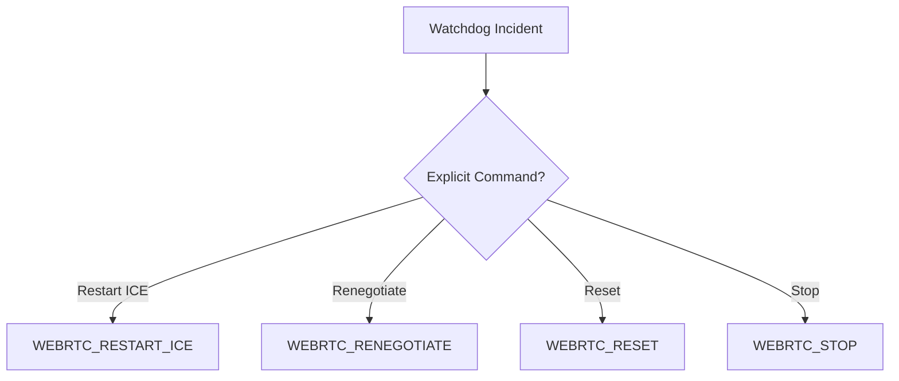

## Shutdown
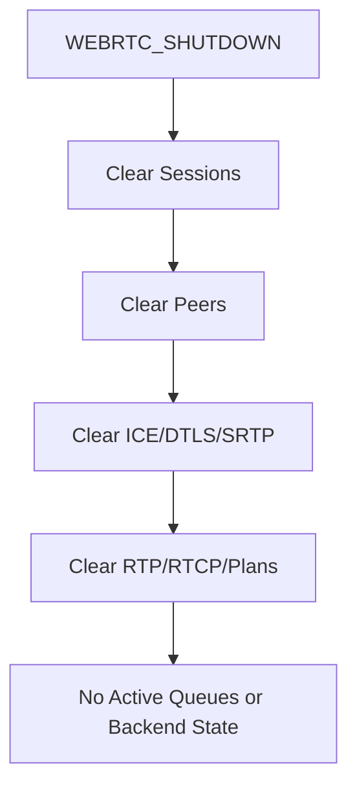

## Public Contract

The foundation exposes immutable models for `WebRtcOutputProfile`, `WebRtcDestination`, `WebRtcPeer`, `WebRtcSession`, `WebRtcIceState`, `WebRtcDtlsState`, `WebRtcSrtpState`, `WebRtcSessionDescription`, `WebRtcRtpPacket`, `WebRtcRtcpState`, `WebRtcCongestionState`, `WebRtcJitterState`, `WebRtcBandwidthState`, `WebRtcRetransmissionState`, `WebRtcSendRequest`, `WebRtcSendPlan`, and `WebRtcTransmissionResult`.

Commands include profile/destination/session registration, connect, negotiate, start, stop, packet submission, ICE restart, renegotiation, reset, drain, flush, validation, and shutdown. The processor uses the existing `TickProcessor` contract and creates no runtime loop.

## Production Safety Guarantees

Snapshots and Source Graph summaries are redacted and JSON-safe. Results explicitly report no real WebRTC transport, no real networking, no real DTLS, and no real SRTP. Shutdown clears active sessions, peers, ICE/DTLS/SRTP state, RTP/RTCP state, packet plans, retransmission state, queues, and backend-like metadata.
