# UBOS v5.7.6 — Production-Safe NDI Output Foundation

UBOS v5.7.6 adds a deterministic, metadata-only NDI output foundation behind the Streaming Output Foundation. It models NDI sender profiles, sender sessions, discovery state, advertisements, receiver compatibility, video/audio stream metadata, metadata channels, tally, PTZ, clock synchronization, frame timing, bandwidth, health, telemetry, watchdog incidents, and synthetic transmission results. It does **not** implement the NewTek/NDI SDK, NDI Advanced SDK, native DLL loading, dynamic libraries, multicast, UDP/TCP sockets, mDNS, Bonjour, DNS-SD, NIC enumeration, GPU DMA, DirectX, CUDA, NVENC, RTP/RTCP, FFmpeg, GStreamer, browser APIs, SRT, RTMP, WebRTC, or actual NDI packets.

## Public Contract

The implementation exposes immutable contracts for `NdiOutputProfile`, `NdiDestination`, `NdiSenderSession`, `NdiDiscoveryState`, `NdiAdvertisement`, `NdiReceiverCompatibility`, `NdiVideoMetadata`, `NdiAudioMetadata`, `NdiMetadataChannel`, `NdiClockState`, `NdiFrameTiming`, `NdiBandwidthState`, `NdiTallyState`, `NdiPtzState`, `NdiSendRequest`, `NdiSendPlan`, and `NdiTransmissionResult`.

Supported output modes are Program, Preview, Clean Feed, AUX, Horizontal, Vertical, Square, Multiview, and Custom. Supported sender types are Video, Audio, Audio/Video, Metadata, PTZ, Tally, and Custom. Supported bandwidth profiles are Highest, High, Medium, Low, Lowest, Audio Only, Metadata Only, and Custom. Discovery modes are Automatic Metadata, Manual Metadata, Static Registration, Hidden, and Custom; hidden is represented only as metadata and does not create hidden discovery behavior.

## 1. Encoded Frame → NDI Flow

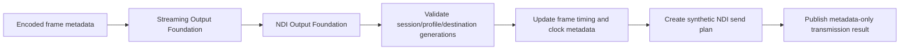

## 2. Sender Lifecycle

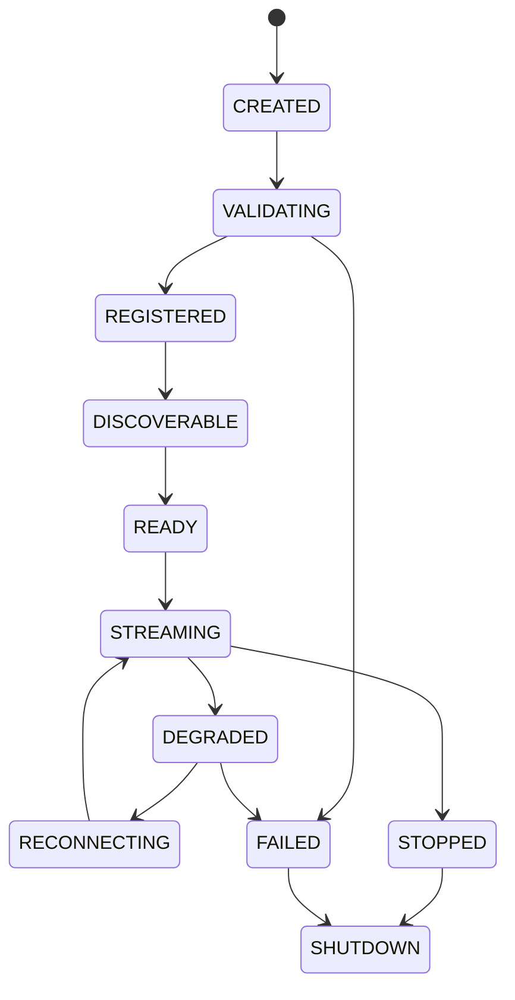

## 3. Discovery Lifecycle

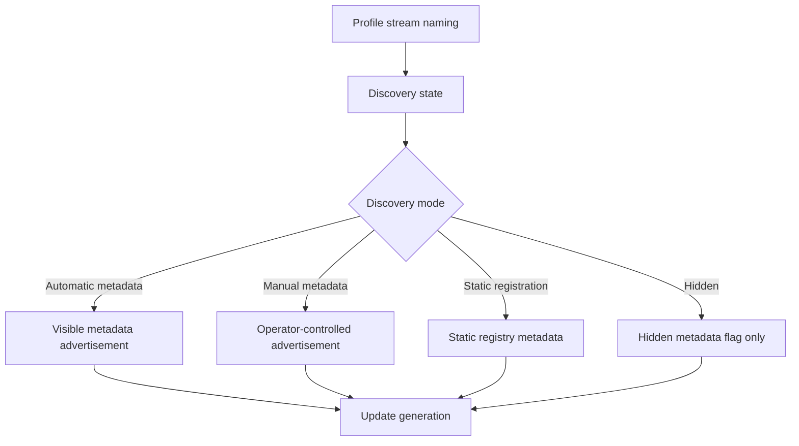

## 4. Advertisement Flow

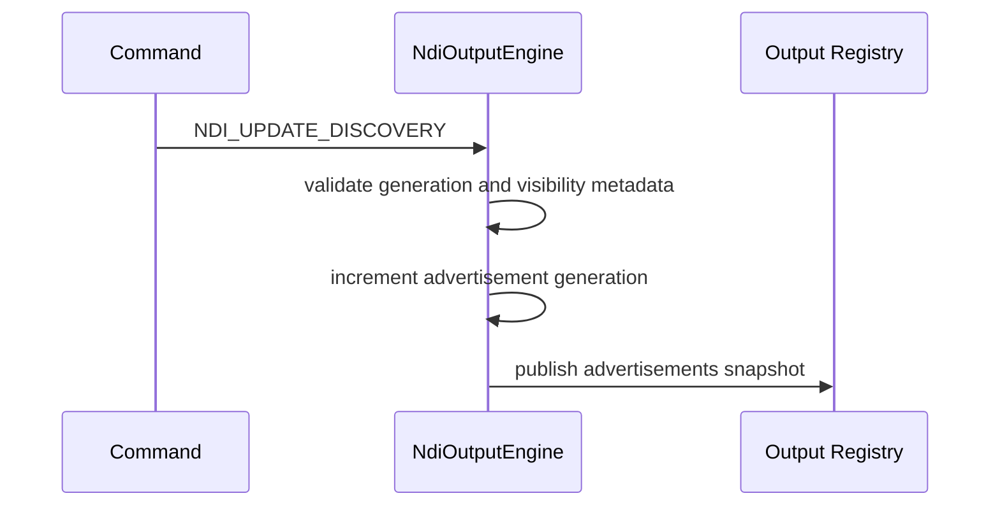

## 5. Metadata Channel

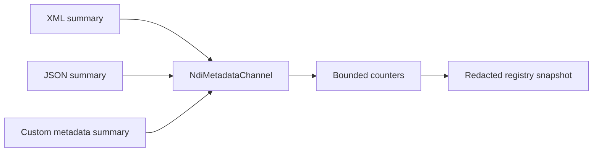

## 6. Tally Flow

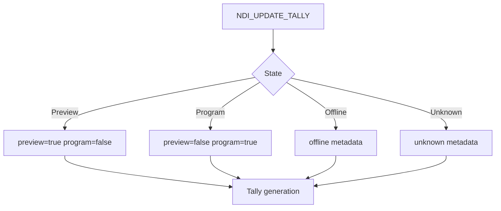

## 7. PTZ Flow

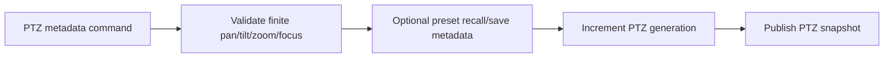

## 8. Frame Timing

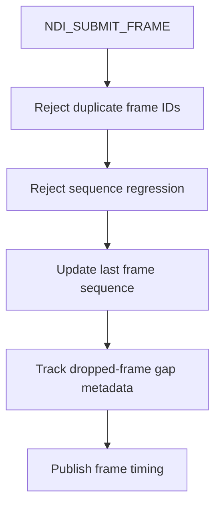

## 9. Clock Synchronization

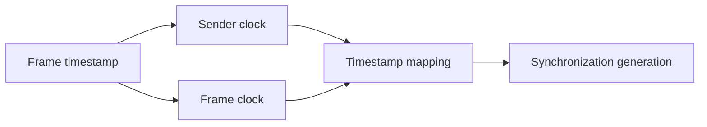

## 10. Processor Order

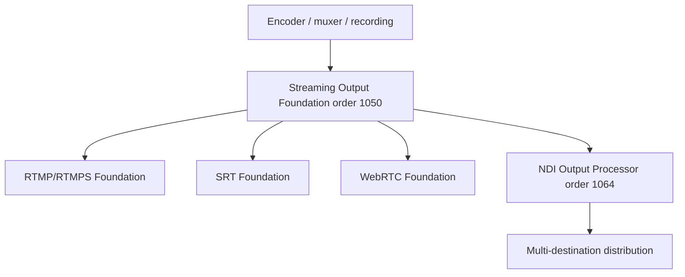

## 11. Failure Recovery

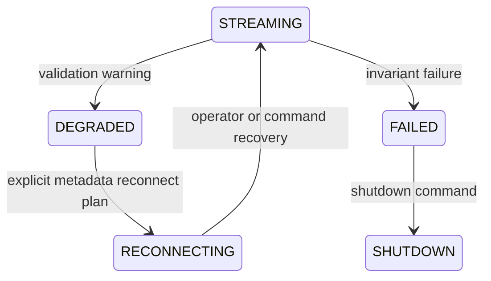

There is no hidden reconnect loop. Reconnects are telemetry and lifecycle metadata only.

## 12. Shutdown

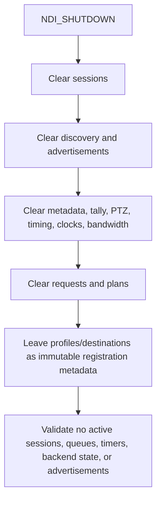

## Commands and Registry Publications

Commands include `NDI_REGISTER_PROFILE`, `NDI_REGISTER_DESTINATION`, `NDI_CREATE_SESSION`, `NDI_START`, `NDI_STOP`, `NDI_SUBMIT_FRAME`, `NDI_UPDATE_DISCOVERY`, `NDI_UPDATE_TALLY`, `NDI_UPDATE_PTZ`, `NDI_RESET`, `NDI_DRAIN`, `NDI_FLUSH`, `NDI_VALIDATE`, and `NDI_SHUTDOWN`.

The output registry publishes profiles, sessions, discovery state, advertisements, tally, PTZ, metadata channels, frame timing, bandwidth, health, telemetry, and transmission results.

## Health, Telemetry, and Watchdog

Health tracks sender count, session count, advertisements, active streams, tally updates, PTZ updates, metadata messages, bandwidth profile, frame timing, and failures. Telemetry maintains bounded counters for sessions, advertisements, metadata updates, tally updates, PTZ updates, stream publications, reconnects, duplicate submissions, stale generations, and dropped frames.

Watchdog incident names include `NDI_ENGINE_STALLED`, `NDI_DISCOVERY_FAILED`, `NDI_DUPLICATE_SESSION`, `NDI_DUPLICATE_FRAME`, `NDI_FRAME_SEQUENCE_ERROR`, `NDI_DISCOVERY_STATE_INVALID`, `NDI_RECEIVER_INCOMPATIBLE`, `NDI_TALLY_STATE_INVALID`, `NDI_PTZ_STATE_INVALID`, `NDI_BANDWIDTH_INVALID`, `NDI_BACKEND_FAILED`, `NDI_OWNERSHIP_VIOLATION`, and `NDI_INVARIANT_FAILURE`.

## Production Safety Guarantees

The foundation guarantees no NDI SDK, no network discovery, no sockets, no multicast, no mDNS, no Bonjour, no GPU access, no packet serialization, no duplicate frames, no stale generations, no ownership leaks, no hidden discovery, no hidden reconnect, no false claim of real NDI transport, no raw metadata payloads in observability, and shutdown cleanup for active sessions, advertisements, queues, timers, and backend state.

After v5.7.6, UBOS has deterministic metadata foundations for RTMP/RTMPS, SRT, WebRTC, and NDI. The next recommended milestone is **UBOS v5.7.7 — Production-Safe Streaming Platform Certification**.
