# UBOS v5.7.8 — Production-Safe Social Platform Destination Coordination

## Purpose and architectural position

UBOS v5.7.8 adds a metadata-only Social Platform Destination Coordination layer after the v5.7 streaming, protocol, and multi-destination fan-out foundations. It coordinates platform capability definitions, redacted account/channel references, social destination profiles, event metadata, output mappings, readiness, compatibility, group aggregation, retry/reconnect intent, health, telemetry, watchdog incidents, Source Graph metadata, immutable snapshots, and deterministic validation.

The layer does **not** own media timing, encoding, muxing, fan-out, transport, OAuth, platform API calls, browser automation, event creation, stream-key retrieval, chat, analytics, followers, uploads, or social publishing.

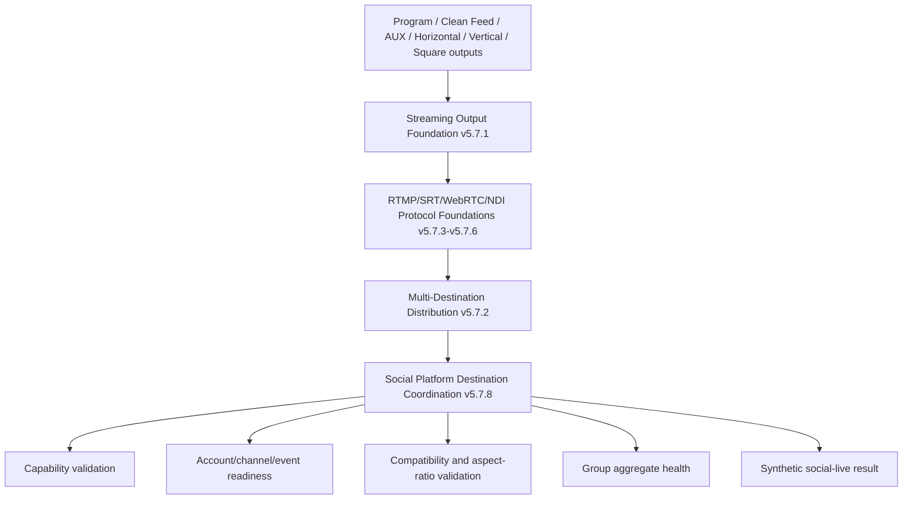

## Relationship to v5.7.1–v5.7.7

The coordinator reuses the existing `FrameTick`, `TickProcessor`, command-handler, processor output publication, streaming protocol enum, output-role enum, synthetic transport behavior, generation checks, bounded telemetry, watchdog naming, and Source Graph redaction patterns. Processor order is `1085`, after Streaming Output (`1050`), protocol foundations (`1060–1066`), and Multi-Destination Distribution (`1075`).

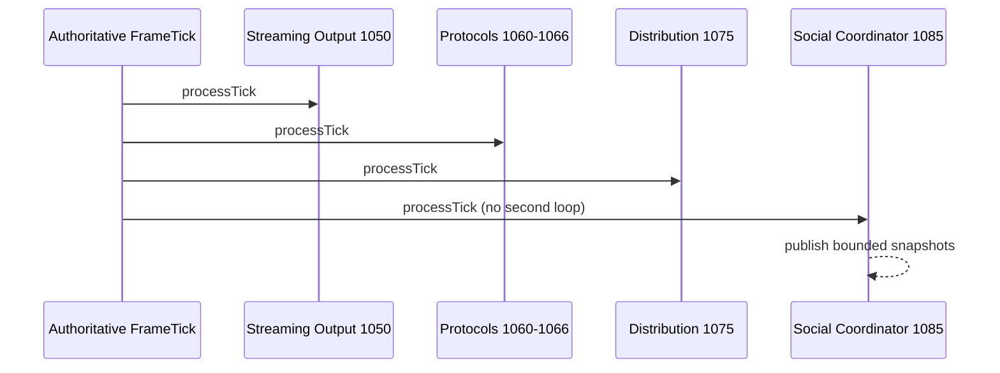

## Supported platform identifiers

The explicit platform set is `YOUTUBE_LIVE`, `FACEBOOK_LIVE`, `TWITCH`, `LINKEDIN_LIVE`, `TIKTOK_LIVE_METADATA`, `INSTAGRAM_LIVE_METADATA`, `X_LIVE_METADATA`, `KICK`, `GENERIC_SOCIAL`, and `CUSTOM_TYPED`. Metadata-only presets are marked for TikTok, Instagram, and X. Unsupported platforms are rejected; there is no hidden fallback.

## Capability definitions and presets

`SocialPlatformCapabilityDefinition` is immutable, versioned, generation-protected, bounded, and synthetic-only. Presets declare supported ingest protocols, codecs, containers, resolutions, aspect ratios, frame rates, audio formats, bitrate ranges, keyframe intervals, secure-transport requirements, metadata feature support, visibility support, and safe metadata flags (`realPlatformApi`, `realOAuth`, `realEventCreation`, `realStreamKeyRetrieval` are false).

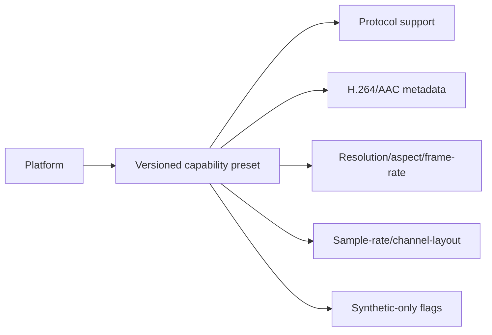

## Account references, channel references, destination profiles, and live-event metadata

Account and channel references store redacted/hashing identifiers only and include generation, availability, classification, health, authorization/token reference metadata boundaries, and no credentials. Destination profiles bind platform/account/channel/output-role/aspect-ratio/preferred-protocol/source-generation references plus explicit codec, bitrate, resolution, audio, keyframe, secure-transport, visibility, metadata, event, readiness, retry, reconnect, failure, criticality, and enabled policies.

Live events store event type, sanitized content metadata, visibility, schedule metadata, thumbnail/cover references, stream/event/chat/engagement/analytics references, lifecycle/readiness policy, and safe metadata. They never claim API-created events and never contain stream keys, URLs, credentials, raw platform IDs, HTML, or binary thumbnails.

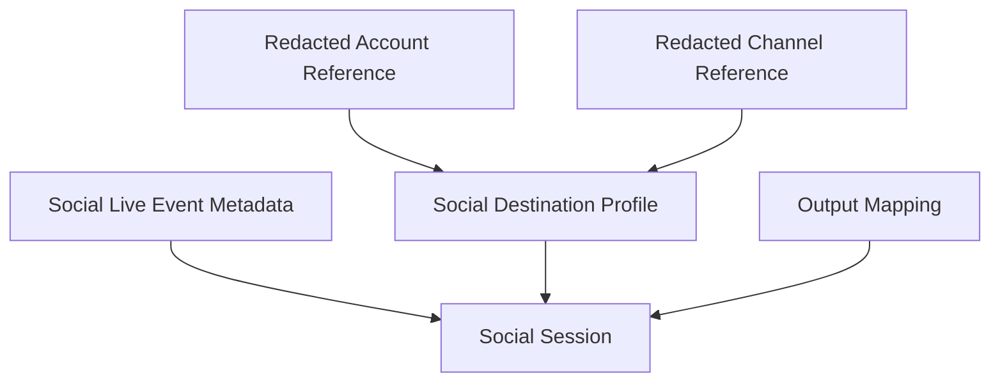

## Content metadata, visibility, thumbnails, and covers

`SocialLiveContentMetadata` bounds and sanitizes title, description, category, language, ordered tags, content rating, audience, branded-content, paid-promotion, synthetic disclosure, caption availability, and safe metadata. Thumbnail and cover references are opaque asset-generation/hash/dimension metadata only; no payload, path, URL, or upload behavior is present.

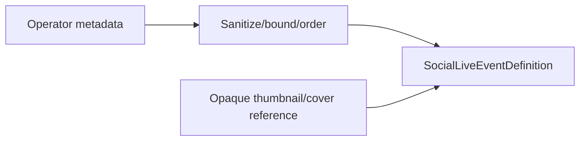

## Social-session lifecycle and readiness

Sessions are immutable after registration and move through explicit states from `CREATED` to readiness, preparation, activation, pause/resume/stop, retry/reconnect, failure, destroy, and shutdown. `ACTIVE` requires underlying stream readiness and overall readiness. Failed or destroyed sessions cannot silently resume.

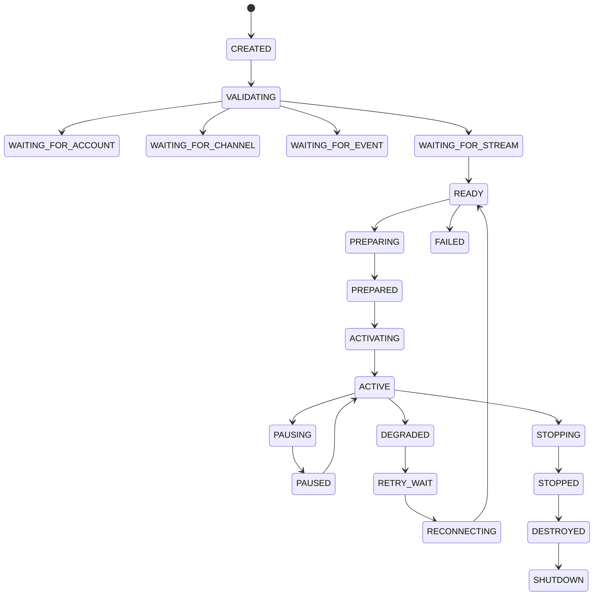

Readiness derives account, channel, event, stream, protocol, codec, audio, bitrate, resolution, frame-rate, keyframe, aspect-ratio, secure-transport, metadata, and destination readiness from explicit policy.

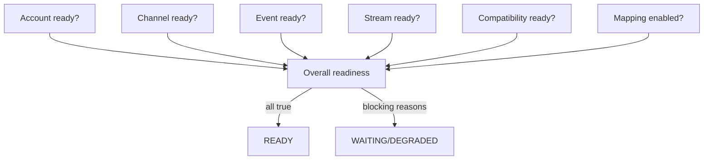

## Compatibility request/result and aspect-ratio output mapping

Compatibility validates stale generations, protocol, codecs, container metadata, resolution, aspect ratio, frame rate, bitrates, audio format, keyframe interval, secure transport, and low-latency metadata. Results are deterministic and never imply hidden transcoding, resizing, frame-rate conversion, sample-rate conversion, or bitrate adjustment.

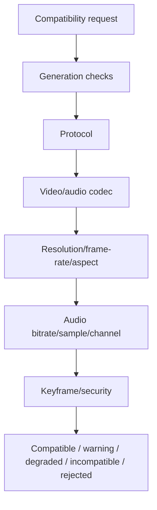

Aspect-ratio roles are explicit and source outputs must already exist.

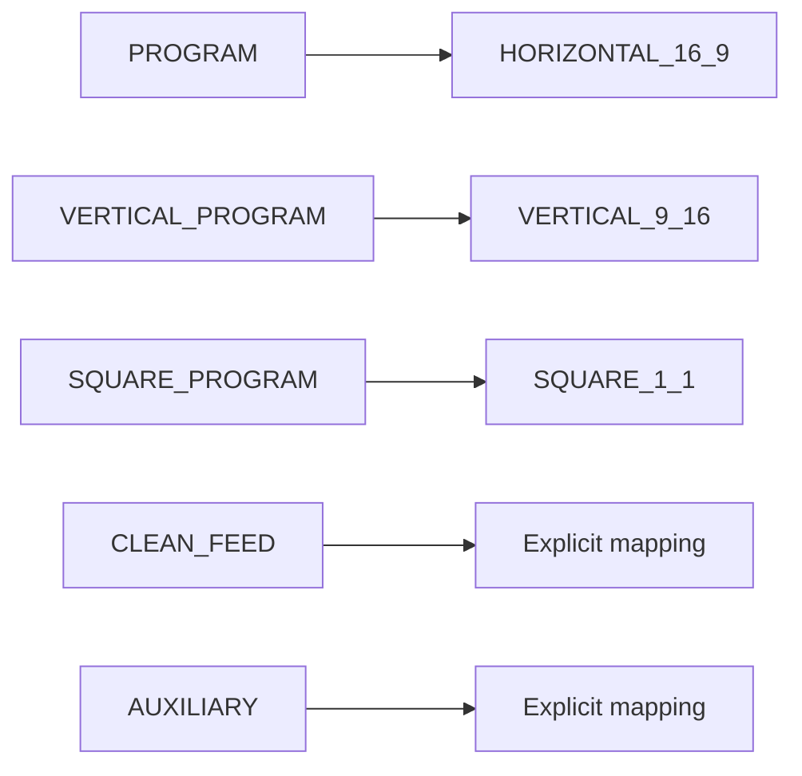

## Cross-platform live groups and policies

Groups define deterministic ordered sessions, required/optional subsets, activation/completion/failure policies, quorum policy, synchronization policy, and enabled state. Required sessions must be a subset of group sessions and quorum must be achievable.

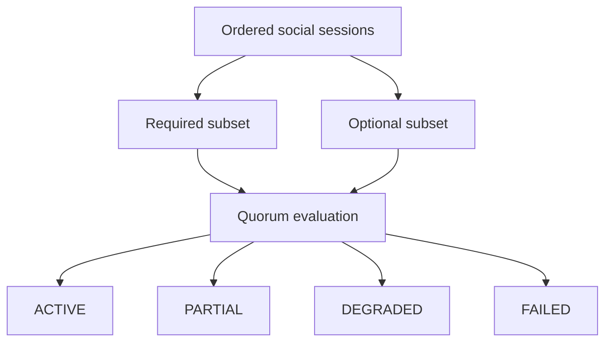

## Coordination requests, plans, and results

Requests carry expected generations and actions (`VALIDATE`, `PREPARE`, `ACTIVATE`, `PAUSE`, `RESUME`, `STOP`, `RETRY`, `RECONNECT`, `REFRESH_READINESS`, `CUSTOM`). Plans deterministically validate session/profile/event/account/channel, mapping, capabilities, underlying summaries, compatibility, readiness, lifecycle action, retry/reconnect intent, group impact, publication, health, and telemetry. Results are synthetic and never claim real platform activation.

## Retry/reconnect coordination and failure isolation

Retry and reconnect produce typed metadata intent for existing streaming/protocol systems and do not create a transport retry engine. Platform failures are independent; optional failures degrade groups without corrupting active platforms, while required failures follow explicit policy.

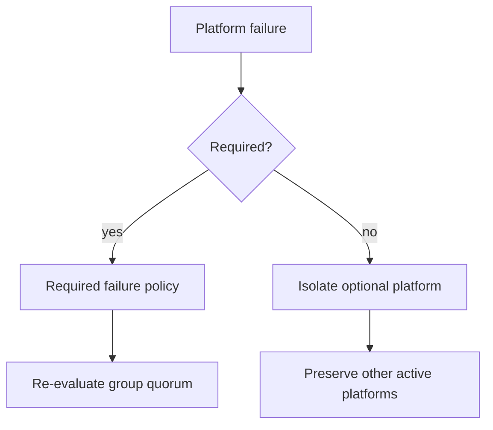

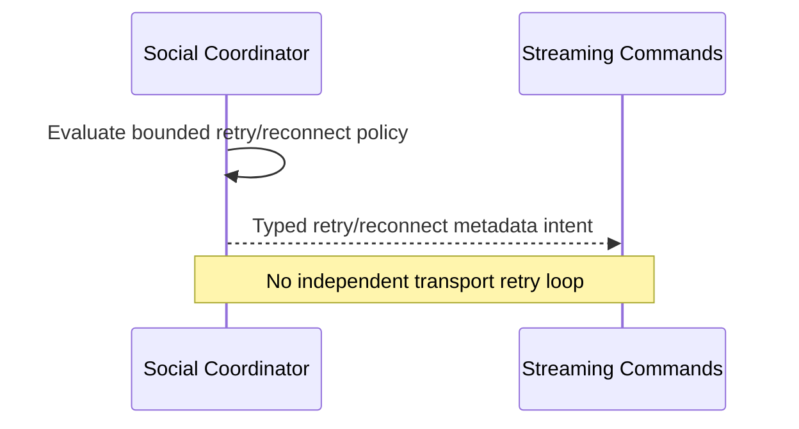

## Chat, engagement, and analytics reference foundations

Chat, engagement, and analytics references are metadata-only eligibility descriptors. They do not ingest messages, send chat, moderate, collect analytics, represent current counts, synchronize followers, or access platform APIs.

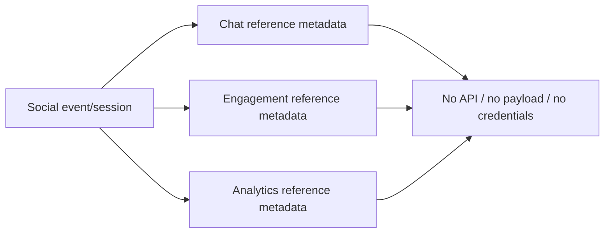

## Health, telemetry, watchdog, Source Graph, and security

Health snapshots count backends, capabilities, accounts, channels, profiles, events, sessions, groups, compatibility/readiness checks, activations, retry/reconnect coordination, duplicate/stale rejections, unavailable references, incompatibilities, and platform failures. Telemetry is bounded and contains no unbounded event history. Watchdog incidents cover stale generations, unsupported platforms, unavailable account/channel/event/stream, compatibility failures, quorum impossible, platform failures, mapping conflicts, metadata invalid, retry/reconnect failure, backend failure, registry/source-graph mismatch, redaction failure, and invariant failure.

Source Graph output is redacted metadata only: platform IDs, social session IDs, output/aspect roles, redacted account/channel references, safe event IDs, states, compatibility, underlying summaries, group quorum state, reference availability, real-platform flags, health, and readiness.

## Drain, reset, configuration transactions, and shutdown

Drain stops new activation requests, releases queued request state, and transitions sessions to stopped. Reset clears readiness, compatibility, activation, retry/reconnect, group aggregate, and plan cache while monotonically advancing session generation. Configuration transactions are modeled as atomic metadata boundaries. Shutdown is idempotent and clears active requests/plans while placing sessions in `SHUTDOWN`.

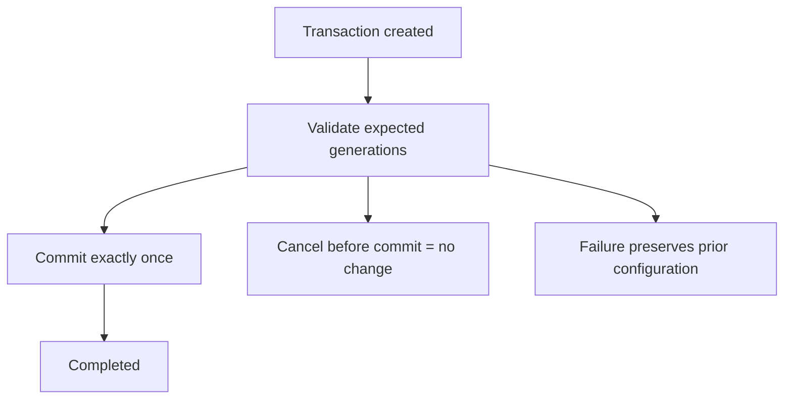

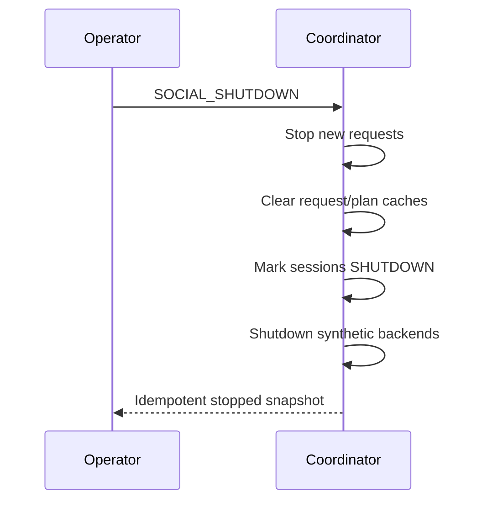

## Backend abstraction and synthetic backend

The `SocialPlatformCoordinationBackend` contract supports initialization, compatibility, readiness, planning, lifecycle actions, retry/reconnect coordination, group aggregation, reset, reconfiguration, session shutdown, and backend shutdown. The deterministic synthetic backend reports `realPlatformApi`, `realOAuth`, `realEventCreation`, and `realStreamKeyRetrieval` as false and performs no HTTP, OAuth, browser automation, credential storage, or platform calls.

## Output registry, commands, events, public exports, and invariants

Typed output keys cover capabilities, references, profiles, events, sessions, states, readiness, compatibility, mappings, groups, requests, plans, results, health, telemetry, backend health, transactions, and failed/rejected results. Commands and events are exported explicitly through the media-plane package. `assertInvariants()` verifies uniqueness, references, quorum, readiness/activation semantics, one request/result behavior, platform isolation, redaction, synthetic-only flags, and shutdown cleanup.

## Production-safety guarantees

No second media clock, no social timing loop, no hidden fallback, no hidden conversion, no incompatible activation, no partial group mislabeled active, no required platform omission, no optional failure corruption, no state overwrite, no unbounded registries/cache/history, no infinite retry, no output after terminal states, no direct transport mutation, no credentials/raw IDs/URLs/secrets in observability, and no false OAuth/API/event/stream-key/chat/analytics/follower claim.

## Long-run validation, determinism replay, and performance

Validation uses fake FrameTicks, deterministic presets, redacted references, synthetic backend, deterministic streaming/distribution/protocol summaries, and no real-time sleeping. Replay compares canonical snapshots. Expected complexity is O(1) for registry lookups, compatibility, readiness, and planning plus bounded summaries; O(sessions log sessions) for group ordering; O(sessions) for quorum; O(active sessions + groups) for processor orchestration; O(platforms + profiles + sessions + bounded state) for snapshots; and O(active + bounded incidents) for watchdog evaluation.

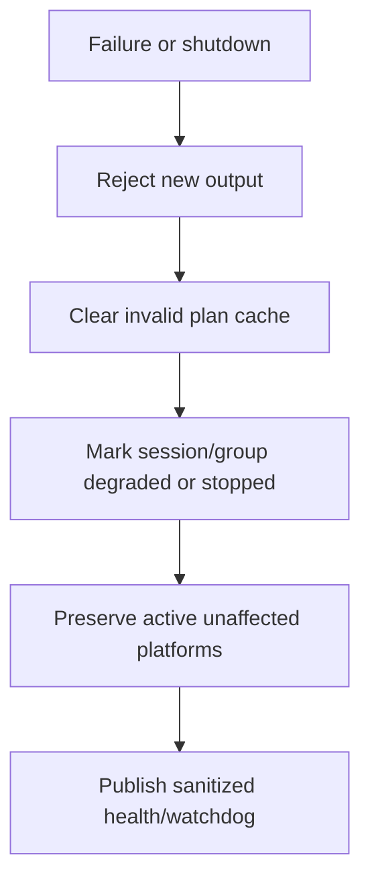

## Limitations and v5.7.9 handoff

This phase is production-safe coordination only. It does not certify real social-live distribution, OAuth, platform event creation, stream-key retrieval, chat, analytics, monetization, thumbnails, or social graph behavior. The next task is **UBOS v5.7.9 — Production-Safe Social Live Distribution Certification**.
