# UBOS v5.7.8 Social Platform Destination Coordination

## Purpose and architectural position
v5.7.8 adds a metadata-only Social Platform Destination Coordination layer after Streaming Output Foundation (1050), protocol foundations (1060-1066), and Multi-Destination Distribution (1075). The processor runs at order 1085 on the authoritative TickProcessorFramework tick. It has no second loop, no media clock, no HTTP, no browser automation, no OAuth, no credentials, and no platform API behavior.

## Relationship to v5.7.1-v5.7.7
The coordinator reads authoritative streaming, distribution, and protocol state summaries and coordinates social-platform sessions without mutating those systems. Retry and reconnect are represented as typed metadata for existing streaming commands.

## Supported platform identifiers and capability definitions
Supported identifiers are YouTube, Facebook, Twitch, LinkedIn, TikTok, Instagram, X, Kick, and Generic. Presets define supported protocol, codec, aspect-ratio, bitrate, visibility, security, and metadata-only behavior with `realPlatformApi`, `realOAuth`, `realEventCreation`, and `realStreamKeyRetrieval` always false.

## References, profiles, events, and metadata
Account and channel references store deterministic redacted identifiers only. Destination profiles bind capability, account, channel, visibility, and required/optional platform policy. Live events contain bounded title, description, visibility, schedule metadata, content metadata, thumbnail references, and cover references. Raw account IDs, channel IDs, event URLs, stream URLs, stream keys, tokens, cookies, OAuth metadata, API payloads, native handles, and private profile data are never stored or emitted.

## Social-session lifecycle and readiness model
Sessions move through created, waiting, ready, preparing, prepared, activating, active, degraded, retrying, reconnecting, paused, stopping, stopped, failed, and shutdown. Readiness checks account availability, channel availability, event readiness, and underlying stream readiness.

## Compatibility requests/results and aspect-ratio output mappings
Compatibility is deterministic and checks protocol, video codec, audio codec, resolution/aspect-ratio role, frame rate, keyframe policy, secure transport, video bitrate, and audio bitrate. Output mappings distinguish Program, Clean Feed, AUX, horizontal Program, vertical Program, and square Program; horizontal/vertical/square aliases are rejected.

## Cross-platform live groups and policies
Live groups order sessions deterministically and evaluate all-ready, all-required-ready, at-least-one-ready, and quorum-ready policies. Required platform failures fail the group; optional platform failures are isolated and may produce a partial/degraded group without corrupting active platforms.

## Coordination requests, plans, and results
Prepare, activate, pause, resume, stop, retry, reconnect, drain, reset, reconfigure, validate, and shutdown are metadata-only commands executed via v5.1 command handlers with exactly-once request tracking and expected-generation validation. Plans and results use deterministic IDs and bounded caches.

## Platform health, aggregate state, telemetry, watchdog, and Source Graph
The coordinator publishes platform health, aggregate group state, coordinator health, telemetry, backend health, failed/rejected results, and metadata-only Source Graph summaries. Watchdog incidents cover duplicate requests, stale generations, unsupported platforms, unavailable accounts/channels/events, stream readiness, protocol/codec/bitrate/aspect-ratio incompatibility, quorum impossibility, required/optional platform failure, retry/reconnect exhaustion, backend failure, redaction failure, registry mismatch, and invariant failure.

## Chat, engagement, and analytics reference foundations
v5.7.8 exposes availability metadata for chat-channel, engagement-channel, and analytics-channel references only. It does not ingest chat, collect analytics, synchronize followers, open endpoints, or store endpoint payloads.

## Drain, reset, configuration transactions, and cleanup
Drain stops sessions without network effects. Reset clears compatibility/readiness/plan/result/request caches. Configuration transactions are metadata snapshots. Shutdown is idempotent and leaves no active request, session work, group work, retry/reconnect work, callback, timer, cache entry, or backend state.

## Backend abstraction and synthetic backend
`SyntheticSocialPlatformCoordinationBackend` validates references/mappings, evaluates compatibility and readiness, creates deterministic plans/results, simulates unavailable accounts/channels/events/streams, simulates incompatible aspect-ratio/bitrate, simulates required/optional failures, retry/reconnect coordination, partial group activation, and quorum outcomes. It never uses native or remote platform backends.

## Output registry, commands, events, health, telemetry, invariants
Typed output keys cover capability definitions, account/channel references, profiles, live events, metadata, thumbnail/cover references, sessions/states, readiness, compatibility, mappings, groups, coordination requests/plans/results, platform health, aggregates, chat/engagement/analytics references, transactions, coordinator health/telemetry, backend health, and failed/rejected results. Commands and events are typed and sampled/aggregated where high frequency. Invariants verify unique IDs, monotonic generations, valid references, request/result exactly-once, platform-state isolation, health/telemetry consistency, Output Registry/Source Graph consistency, and clean shutdown.

## Security and production-safety guarantees
Snapshots are JSON-safe, deeply immutable, bounded, deterministically ordered, redacted, sanitized, and free of credentials, raw IDs, URLs, stream keys, tokens, private account data, API payloads, mutable references, native handles, and unbounded history. The system does not transcode, repackage, resize, convert frame rate, convert sample rate, adjust bitrate, choose hidden fallbacks, or claim real platform activation.

## Long-run validation, determinism replay, and performance
Validation covers 181 deterministic scenarios, 100,000 processor ticks, 10,000 compatibility evaluations, 10,000 readiness evaluations, 10,000 plans, 10,000 results, 10,000 aggregate evaluations, deterministic replay, public export checks, and no credential exposure. Expected complexity: registry lookup O(1), compatibility O(1), readiness O(1), group ordering O(n log n), quorum O(n), planning O(1) plus bounded summaries, orchestration O(active social sessions + groups), snapshots O(platforms + profiles + sessions + bounded state), watchdog O(active + bounded incidents).

## Limitations and v5.7.9 handoff
This release is synthetic and metadata-only. v5.7.9 should certify production-safe Social Live Distribution behavior while preserving the same no-credential, no-OAuth, no-platform-API, deterministic safety envelope.

## Mermaid diagrams

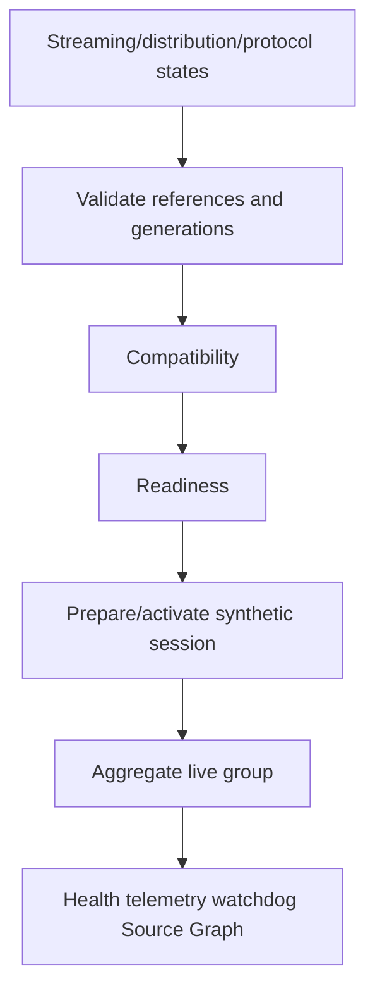

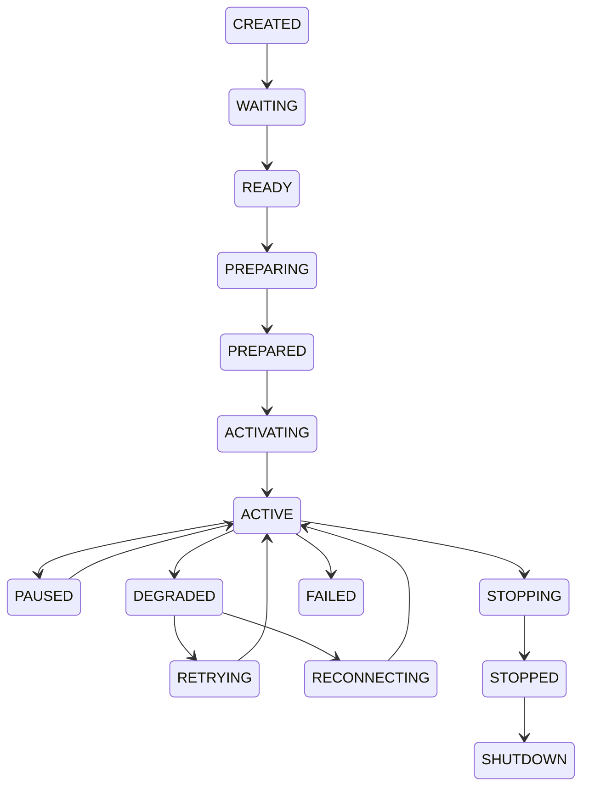

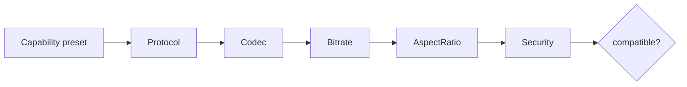

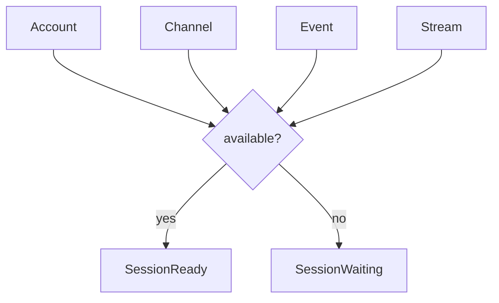

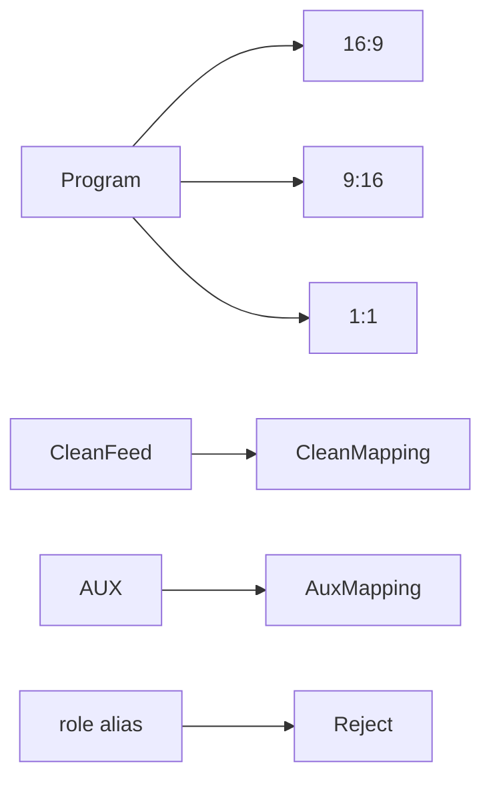

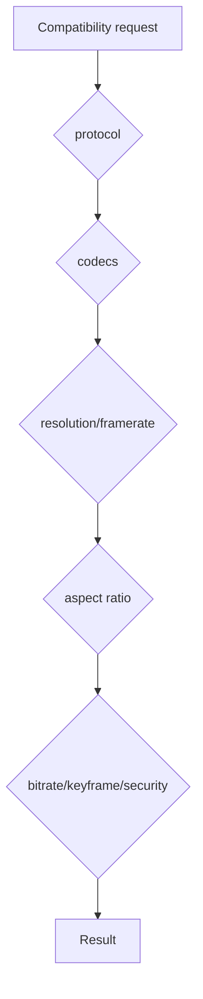

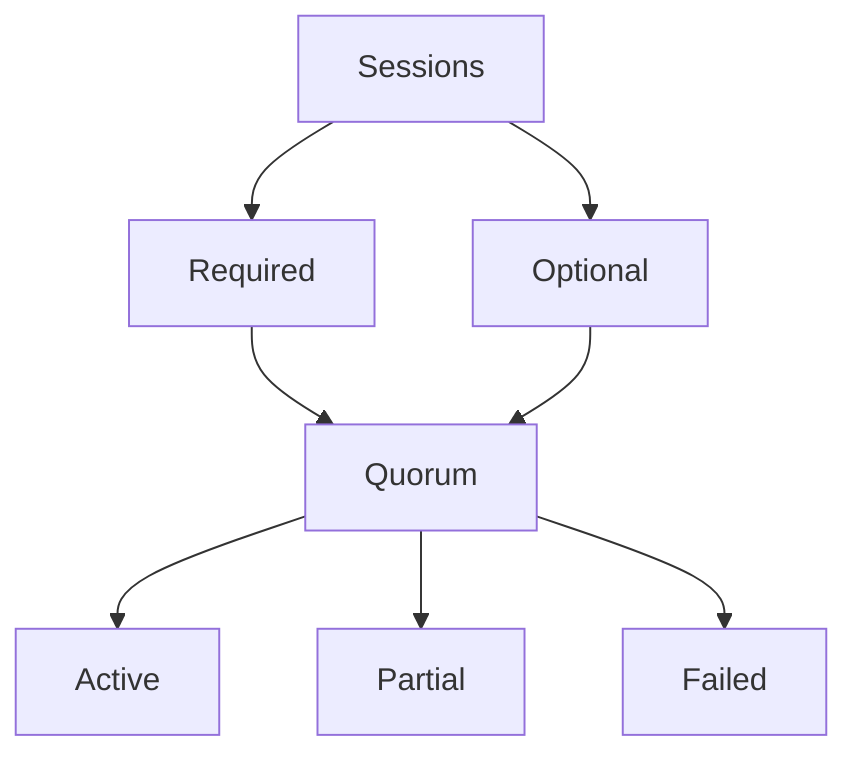

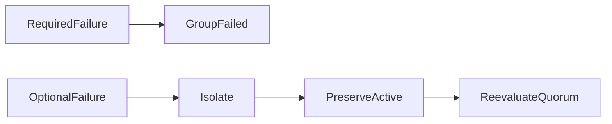

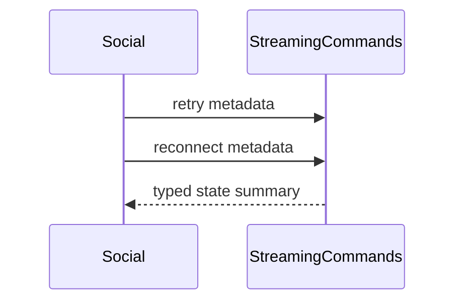

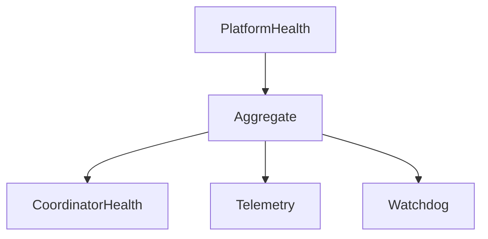

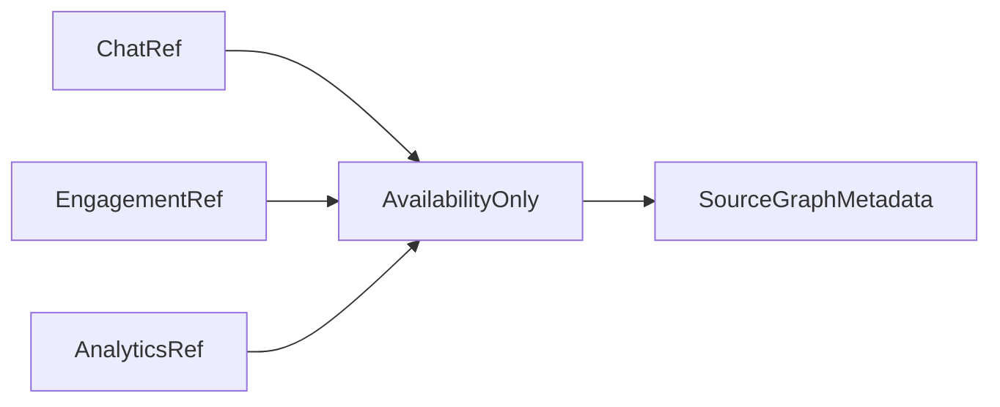

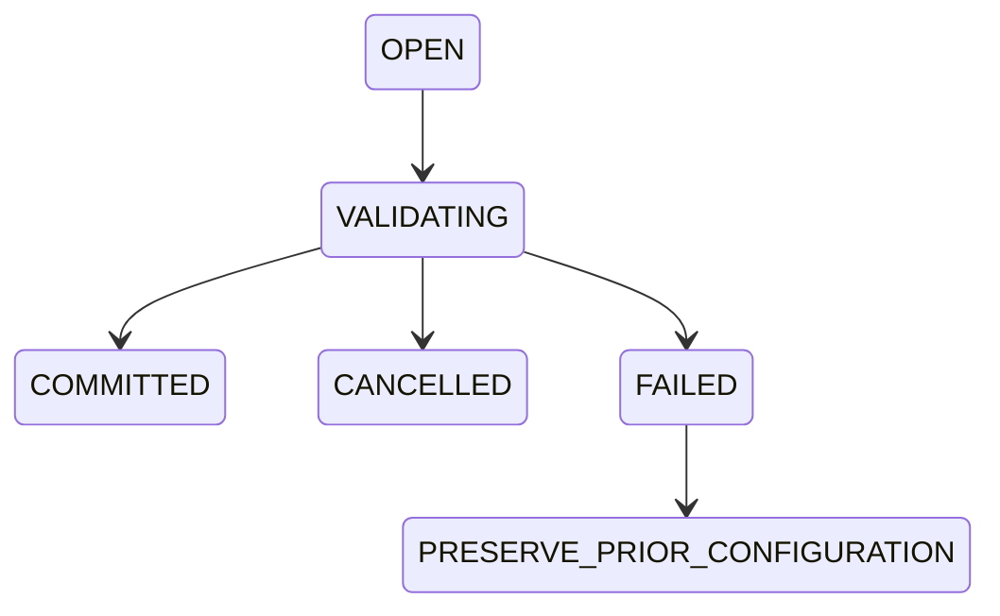

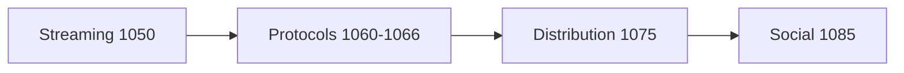

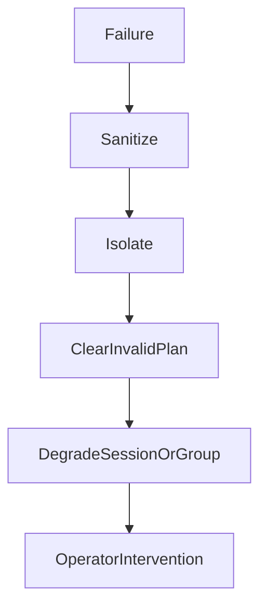

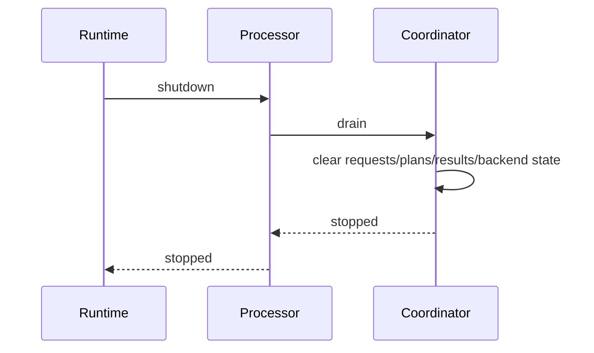
