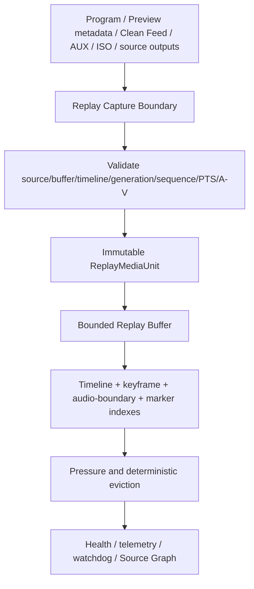
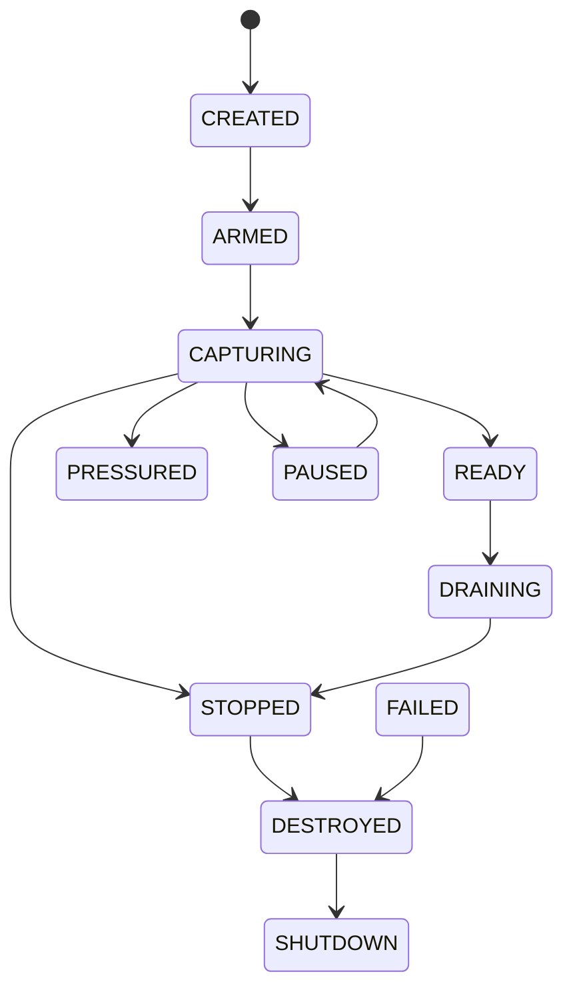
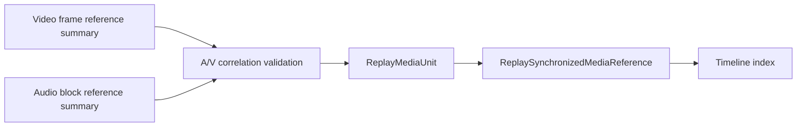
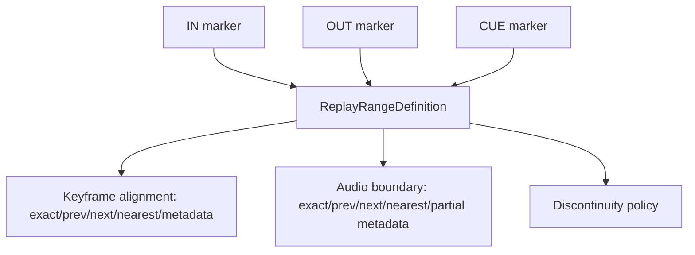
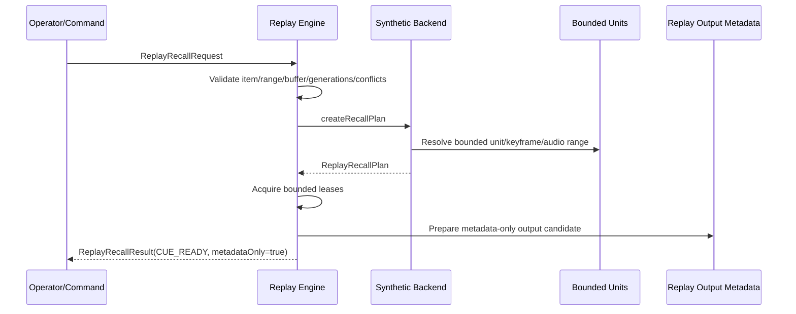
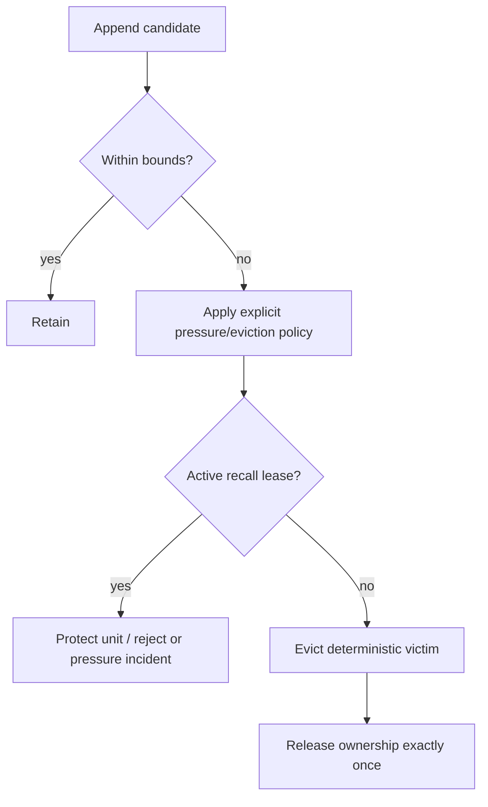
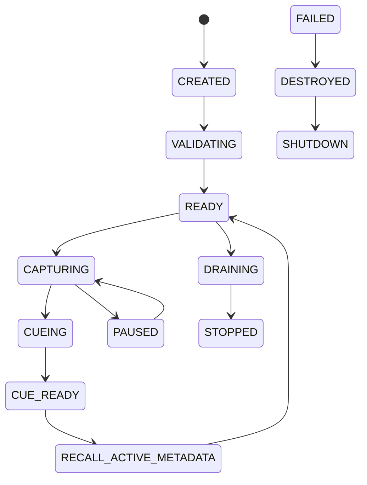
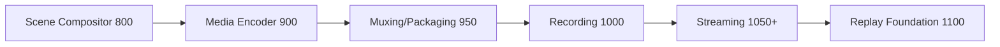
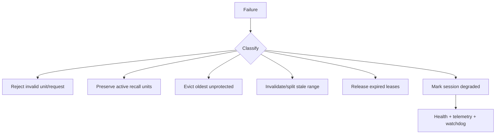
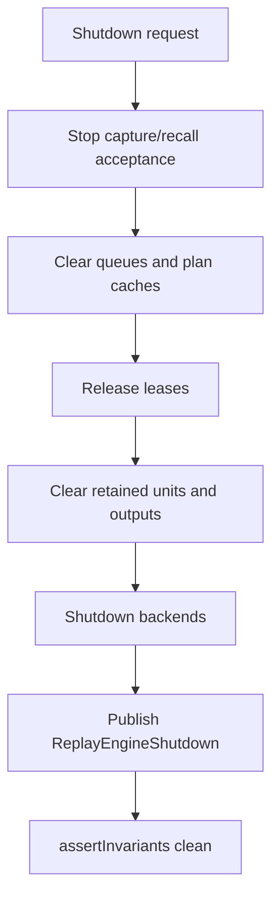

# UBOS v5.8.1 Replay and Media Recall Foundation

UBOS v5.8.1 introduces the authoritative metadata-only replay and media recall foundation. It registers replay sources, owns bounded replay buffers, indexes immutable media references, creates markers/ranges/items/banks, plans deterministic recalls, prepares replay output candidates, tracks leases, and publishes health, telemetry, watchdog, output-registry, and Source Graph metadata. It follows v5.7 streaming/distribution and reuses the v5.1 `FrameTick`, `TickProcessor`, runtime command handler, generation, immutable snapshot, bounded queue, health, telemetry, watchdog, and Source Graph patterns.

It does **not** create a media clock, FrameTick source, runtime loop, scheduler, memory manager, encoder, muxer, recorder, compositor, Program/Preview bus, decoder, GPU path, native replay backend, file-system store, cloud store, reverse/variable-speed playback, slow motion, clip editor, graphics, audio ducking, or Program insertion.

## Architectural position

Replay capture runs after final authoritative media publication at processor order `1100`, after compositor/encoder/muxer/recording/streaming conventions. Earlier frame/audio references may be submitted explicitly, but their authoritative timestamps and generation metadata are preserved.



## Source types, media forms, and source definitions

Supported source types are `PROGRAM`, `PREVIEW_METADATA`, `CLEAN_FEED`, `AUXILIARY`, `CAMERA_ISO`, `GUEST_ISO`, `SCREEN_SHARE_ISO`, `AUDIO_ISO`, `VIDEO_ISO`, `ENCODED_PACKET_SOURCE`, `PACKAGED_OUTPUT_SOURCE`, and `CUSTOM_TYPED`. Supported media forms are `FRAME_AUDIO_PAIR`, `VIDEO_FRAME_REFERENCE`, `AUDIO_BLOCK_REFERENCE`, `ENCODED_PACKET_PAIR`, `PACKAGED_OUTPUT_REFERENCE`, `METADATA_ONLY`, and `CUSTOM`.

`ReplaySourceDefinition` is immutable and generation-protected. It contains source/output IDs and generations, optional video/audio/encoder/package IDs, A/V correlation requirements, capture policy, discontinuity policy, criticality, enabled flag, sanitized safe metadata, and timestamps. Registration does not start capture.

## Capture policies, replay buffers, and lifecycle

Capture policies are explicit: continuous rolling, event-triggered metadata, manual armed, Program-only, selected sources, always-on bounded, or custom. Event-triggered capture remains metadata-only unless explicit event input is supplied.

`ReplayBufferDefinition` is immutable and bounded by duration, item/frame/audio/packet/package counts, bytes, indexing policy, pressure policy, eviction policy, and ownership policy. One authoritative buffer per source/form is expected unless future multi-buffer policy is explicit.



## Replay media units and synchronized references

Each submission creates at most one immutable `ReplayMediaUnit` with buffer/source generations, media form, runtime frame, timeline generation, normalized PTS/DTS/duration/time-base metadata, video/audio/packet/package reference IDs and generations, A/V correlation generation, discontinuity generation, sequence, keyframe/audio-boundary metadata, completeness, ownership state, byte estimate, checksum signature, and redacted safe metadata. Raw pixels, PCM, packet bytes, package bytes, paths, credentials, and native handles are never stored.



## Timeline indexing, markers, and ranges

The bounded `ReplayTimelineIndex` tracks earliest/latest PTS, duration, sequence range, discontinuities, keyframes, audio boundaries, marker IDs, unit count, bytes, and ready ranges. Appends are monotonic and eviction updates earliest retained state without O(n²) rebuilds across unrelated buffers.

Markers include in/out/cue/event/scene/source/tally/operator/score/chapter/discontinuity/custom metadata. Labels and event metadata are bounded and sanitized.

Ranges reference marker generations and resolve start/end PTS/sequence, duration, keyframe alignment, audio-boundary policy, discontinuity policy, and validity. Cross-discontinuity behavior is explicit: reject, split, start after, end before, metadata-only allow, or custom.



## Replay items, cue modes, playback metadata boundaries, audio policies, banks, and playlists

Replay items bind source/buffer/range/bank generations to cue mode, playback direction metadata, playback-rate metadata, audio policy, output role, optional transition/graphics metadata, priority, and enabled state. Only forward 1.0x is executable in the metadata model; reverse, ping-pong, slow/fast/custom rates are metadata-only and make no decode/playback claim.

Cue modes are cue-to-in, cue-to-cue-point, cue-to-keyframe, cue-to-latest-safe, cue-to-event-marker, and custom. Audio policies are follow replay audio, mute replay audio, Program audio continues metadata, duck Program metadata, mix metadata, audio-only replay, and custom; no Program audio is mutated.

Replay banks are deterministic bounded ordered item lists with one active item and no duplicates. Playlists are metadata-only ordered foundations with bounded entries and no automatic looping in v5.8.1.

## Capture and recall planning



Capture plans validate source, buffer, input generations, timeline/A-V correlation, sequence and timestamps, build the unit, evaluate pressure, resolve eviction, retain ownership, append, update the index, update observability, and release evicted ownership exactly once.

Recall plans validate request/item/range/markers, resolve keyframe and audio boundaries, validate discontinuities, resolve media-unit sequences, validate ownership/readiness, prepare output references, publish cue-ready state, delegate future playback/take metadata, and retain required units under bounded leases.

## Replay outputs and output roles

Output roles are `REPLAY_PREVIEW`, `REPLAY_PROGRAM_CANDIDATE`, `REPLAY_AUX`, `REPLAY_CLEAN_FEED`, `REPLAY_MULTIVIEW_METADATA`, and `CUSTOM`. A Program candidate is not Program until a future switch/take authority accepts it. No direct Program insertion, switch, TAKE, writable alias, frames, or audio are emitted.

```mermaid
flowchart LR
  P[ReplayRecallPlan] --> O[ReplayOutputState metadataOnly]
  O --> R[Replay Preview]
  O --> C[Replay Program candidate]
  C -.future delegation only.-> S[Scene switching authority]
  S -.not executed in v5.8.1.-> Program[Program]
```

## Pressure, eviction, ownership, queues, and sessions

Pressure states are normal/elevated/high/critical/exhausted/failed. Eviction policies are oldest-first, oldest non-marked, oldest non-keyframe preferred, preserve active recall, preserve marked ranges/events, reject new, fail buffer, or custom. Pressure policies may evict, reject, pause capture, drop optional sources, preserve Program, fail, request operator intervention, or custom. There is no OS storage polling or disk spill.



Ownership states are buffer-owned, recall-leased, output-leased, borrowed read-only, and released. Leases are exact-once acquisition/release and bounded; released units cannot be recalled. Shutdown clears requests, outputs, queues, leases, retained units, caches, and backend state.



Conflict policies are reject-new recall, cancel-existing recall, priority-wins, queue recall, one-per-output-role, or custom. Capture, marker, recall, and output-preparation queues are bounded by count, duration, bytes, and latency.

## Backend abstraction and synthetic backend

`ReplayFoundationBackend` exposes descriptor/capabilities, initialize session, capture plan, append unit, recall plan, prepare output, add marker, create range, reset, drain, shutdown session, and shutdown. The deterministic synthetic backend validates metadata, creates deterministic IDs/plans, models keyframe/audio/discontinuity/pressure/eviction/ownership behavior, can simulate failure metadata, and reports `realReplayPlayback=false`, `realDecode=false`, `realDiskBuffer=false`, `reversePlayback=false`, and `variableSpeedPlayback=false`.

## Processor order and output registry



Typed output keys publish sources, buffers, states, sessions, units, synchronized refs, indexes, markers, ranges, items, banks, playlists, requests, plans, results, outputs, leases, pressure, evictions, queues, health, telemetry, backend health, and failed/rejected results.

## Commands, events, health, telemetry, watchdog, and Source Graph

Commands cover backend/source/buffer/session lifecycle, capture, media submission, markers, ranges, items, banks, selection, recall, cancellation, output preparation/release, eviction, clear, drain, reset, validation, and shutdown. Command records are metadata-only and generation-protected.

Events are typed and high-frequency capture events are intended to be sampled/aggregated. Health covers backend/source/buffer/session/item/bank/unit/recall/marker/range counts, duplicate/stale/regression/mixed-tick/overflow/ownership counters, retained units/bytes/duration, peaks, last PTS/cue/failure, and update time. Telemetry is bounded and contains counters only.

Watchdog incidents cover stalls, timeouts, duplicate capture/recall, stale generations, regressions, mixed ticks, invalid A/V, pressure/exhaustion, active-range eviction attempts, invalid/evicted ranges, keyframe/audio/discontinuity conflicts, output conflicts, queues, backend/allocation/ownership failures, registry/Source Graph mismatch, and invariants.



Source Graph exposes only replay IDs/types, roles, buffer states, retained duration/count, pressure, PTS ranges, counts, active selection, cue/recall state, output roles, metadataOnly, health, and readiness.

## Security, production safety, snapshots, and invariants

Commands, telemetry, events, watchdog, snapshots, and Source Graph redact sensitive source identifiers, operator labels, event metadata, file/storage/device references, payload references, native handles, credentials, and private production metadata. Snapshots are JSON-safe, deeply immutable, deterministically ordered, bounded, and free of raw media or native resources.



`assertInvariants()` verifies unique IDs, monotonic generations, valid references, sequence/timestamp order, synchronized timeline state, timeline/index agreement, markers/ranges validity or invalidation, active recall protection, item/bank references, no duplicate captures/results, one output per role, bounded queues/leases, no released active units, no stale mutation, health/telemetry agreement, registry/Source Graph consistency, and clean shutdown.

## Validation, determinism, performance, limitations, and v5.8.2 handoff

The validation harness uses fake FrameTicks, deterministic Program/Preview/Clean Feed/AUX/ISO references, synchronized frame/audio references, encoded packet/package references, synthetic backend, bounded buffers/queues, explicit ownership, and no real-time sleeping. It covers the 173 requested scenarios, a 10,000 submission long run, 100,000 processor ticks, deterministic replay comparison, clean shutdown, Source Graph metadata, output registry publication, and invariant checks.

Expected complexity remains O(1) for registry lookup, unit append, index append amortized, lease operations, and common validation; O(log n) or bounded scans for marker/range/keyframe/audio-boundary resolution within a single buffer; O(1) or O(log n) eviction; O(active sources + bounded requests) processor orchestration; O(sources + buffers + bounded retained state) snapshot generation; and O(active + bounded incidents) watchdog evaluation.

Limitations are intentional: no real frame/audio decoding, no disk replay store, no GPU/native replay, no reverse/variable-speed playback, no time stretching, no clip editing/export, no social publishing, no automatic highlight/AI detection, no replay graphics/wipes, no Program insertion, and no switch/take execution. The next phase is **UBOS v5.8.2 — Production-Safe Replay Playback and Program Insertion Foundation**.
