# UBOS v5.8.2 Replay Playback and Program Insertion Foundation

## Purpose and architectural position

UBOS v5.8.2 adds the metadata-only replay playback and Program insertion foundation between v5.8.1 replay media recall and the existing v5.5 Program/Preview, scene-switching, transition, tally, and audio-follow control paths. It owns replay playback-session lifecycle, FrameTick-derived playback position, deterministic 1.0x unit selection metadata, Replay Preview, Replay Program candidate, Program insertion requests, completion, abort, return-to-live metadata, health, telemetry, watchdog incidents, Source Graph metadata, snapshots, and invariants. It does not decode media, read files, create a clock, create a scheduler, render transitions, mutate Program/Preview directly, or mix audio.

## Relationship to v5.8.1

v5.8.1 remains authoritative for replay source, buffer, range, item, recall plan, recall result, retained units, and replay output candidate metadata. v5.8.2 consumes cue-ready candidates and validates item/plan/output/buffer/range generations before planning playback. Active ranges, current units, and bounded lookahead are protected by explicit playback ownership metadata.

## Playback modes, sessions, and lifecycle

Supported modes are `FORWARD_1X`, `REVERSE_METADATA`, `SLOW_MOTION_METADATA`, `FAST_MOTION_METADATA`, `FREEZE_METADATA`, `LOOP_METADATA`, `PLAYLIST_METADATA`, and `CUSTOM_TYPED`; only `FORWARD_1X` is executable in v5.8.2. Sessions are immutable after registration and include replay item, recall plan, replay output, buffer, range, source, rate, direction, output role, audio policy, start/end/return policies, conflict and queue policies, criticality, enabled flag, safe metadata, and timestamps. Lifecycle states are explicit: `CREATED`, `VALIDATING`, `READY`, `CUED`, `PREROLLING`, `ARMED`, `TAKING`, `PLAYING`, metadata pause states, `COMPLETING`, `COMPLETE`, `RETURNING_TO_LIVE`, `ABORTING`, `ABORTED`, `DEGRADED`, `FAILED`, `DESTROYED`, and `SHUTDOWN`.

## Policies

Start policies include cue, in point, selected keyframe, next safe frame, next Program tick, after transition-in, and custom. End policies include out point, end sequence, hold-last-frame metadata, return-to-live, advance-playlist metadata, loop metadata, and custom. Return-to-live policies include cut/transition to previous live, cut/transition to current Preview, hold replay Program candidate metadata, operator required, and custom. All policies are explicit; no hidden preroll, loop, hold, fallback, or live-source choice is allowed.

## Requests, plans, and FrameTick positions

Playback requests are immutable, exactly-once records with expected session, replay, bus, switch, transition, timeline, and A/V sync generations. Plans are deterministic, bounded, registration-order independent, and include start/end sequence and PTS, selected keyframe and audio boundary, Program/Preview summaries, previous-live snapshot, transition delegation, audio and A/V sync actions, ownership action, operation order, score, warnings, and safe metadata. Playback position is derived only from `FrameTick`, uses integer/rational progression, prevents sequence and PTS regression, is duplicate-tick idempotent, and never progresses beyond end.

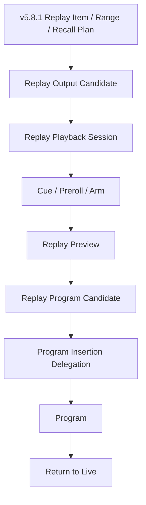

```mermaid
stateDiagram-v2
  [*] --> CREATED
  CREATED --> VALIDATING --> READY --> CUED --> PREROLLING --> ARMED
  ARMED --> TAKING --> PLAYING --> COMPLETING --> COMPLETE
  PLAYING --> RETURNING_TO_LIVE --> COMPLETE
  PLAYING --> ABORTING --> ABORTED
  READY --> DEGRADED
  VALIDATING --> FAILED
  COMPLETE --> SHUTDOWN
  ABORTED --> SHUTDOWN
```

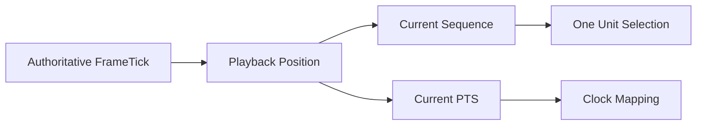

## Unit selection, clock mapping, and replay A/V synchronization

Each active playback session gets one authoritative unit selection per playback tick. Selected units must be retained and generation-valid; stale units, missing units, and mixed-tick A/V selections are rejected or routed to underrun handling. Clock mapping is rational and metadata-only. Replay A/V sync reuses existing master-audio conventions and reports video PTS, audio PTS, skew, drift, tolerance, synchronized/degraded state, held metadata, and discontinuity generation without resampling, interpolation, time stretching, or timestamp mutation.

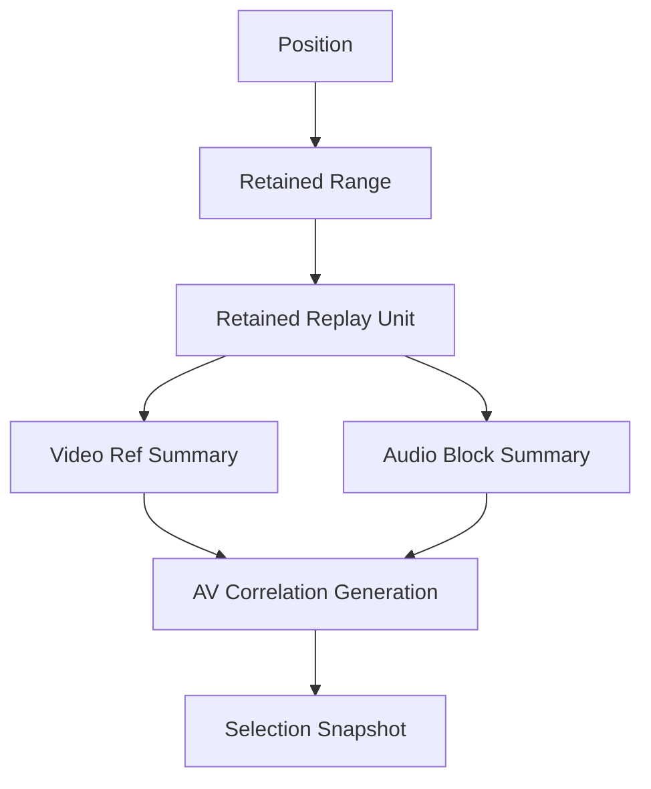

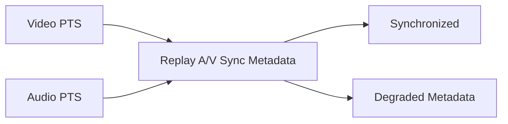

## Replay audio coordination and Audio-Follow-Replay

Audio policies are explicit: follow replay when on Program, follow replay when on Preview metadata, keep Program audio, mute replay, replay audio only, operator controlled, and custom. v5.8.2 delegates typed metadata commands only and never mutates a mixer directly. It tracks replay audio availability, Program audio availability, selected audio source, AFV request, duck/continuation metadata, mute request, mixer command delegation state, and master-audio generation.

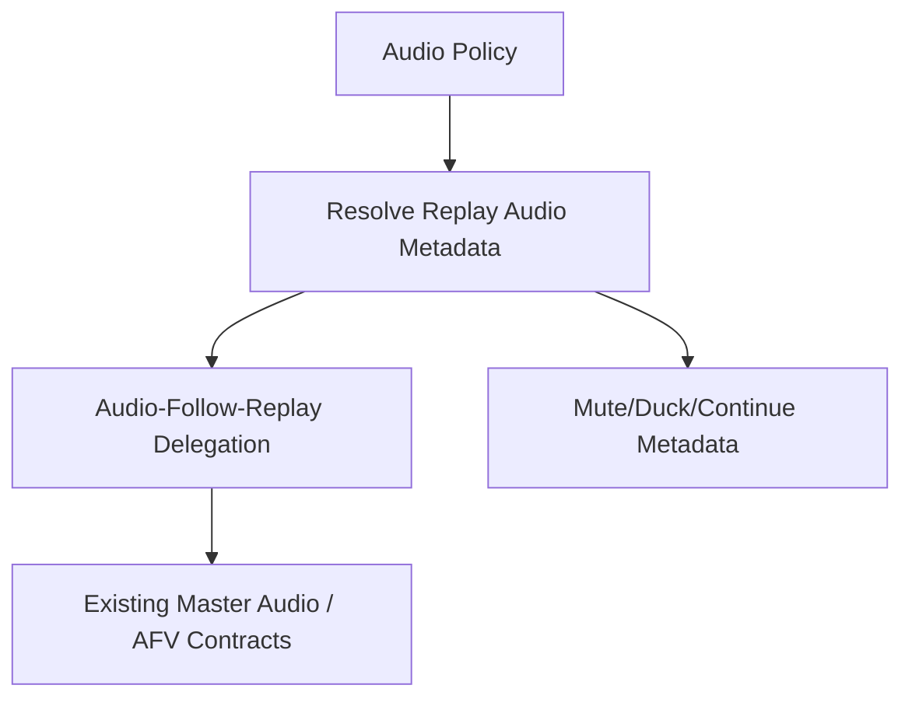

## Preroll, Replay Preview, Program candidate, and insertion

Preroll is bounded and deterministic and validates selected keyframe, audio boundary, required/available units, duration, readiness, and missing requirements without decoding or prefetch. Replay Preview is generation-protected and isolated from Program. Replay Program candidate is prepared and retained but not on-air. Program insertion is exactly-once and delegates through authoritative Program/Preview bus and scene-switch/transition contracts; no direct Program assignment is allowed.

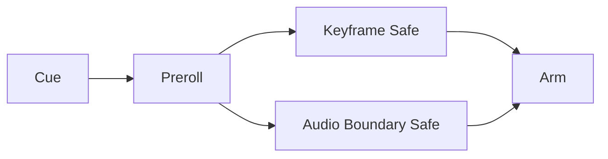

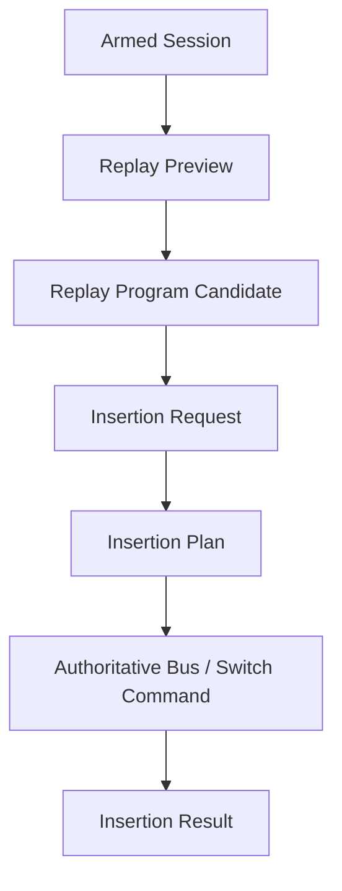

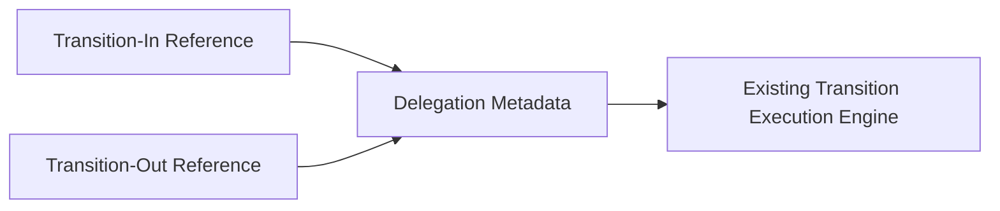

## Completion, return to live, abort, and underrun

Completion stops at the resolved end boundary, publishes exactly once, stops unit selection, releases ownership under policy, optionally triggers return-to-live, releases Audio-Follow-Replay metadata, preserves definitions, and transitions to COMPLETE. Return-to-live validates previous-live generations and delegates through authoritative switching. Abort cancels pending insertion/return actions, releases leases, preserves diagnostics, and marks ABORTED. Underrun policies are explicit and bounded: fail playback, hold-last-frame metadata, skip-next-available, return-to-live, abort-replay, operator intervention, and custom.

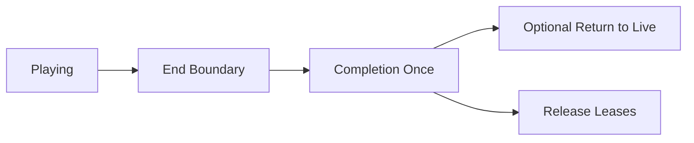

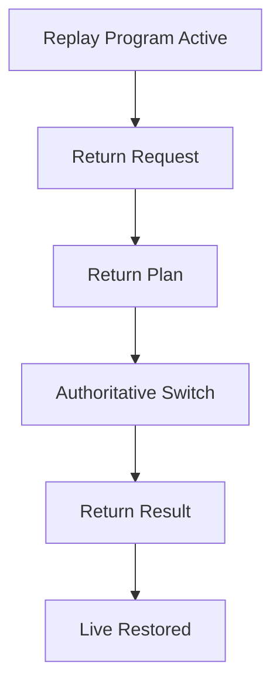

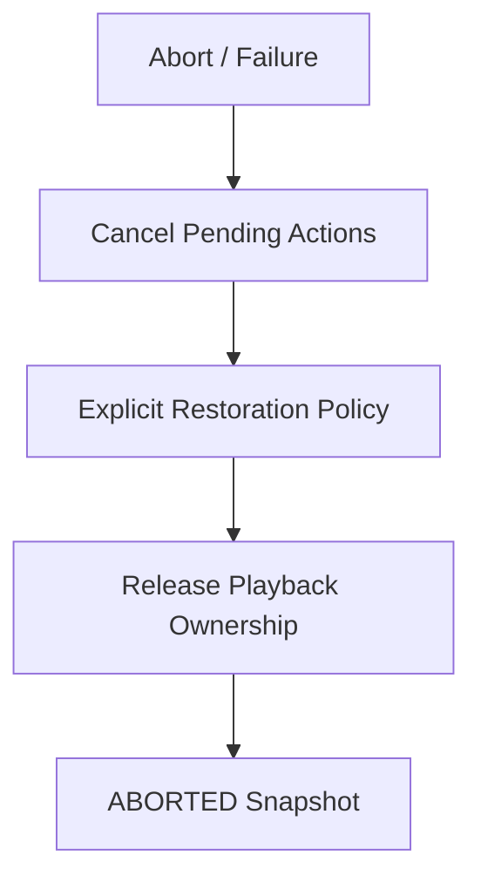

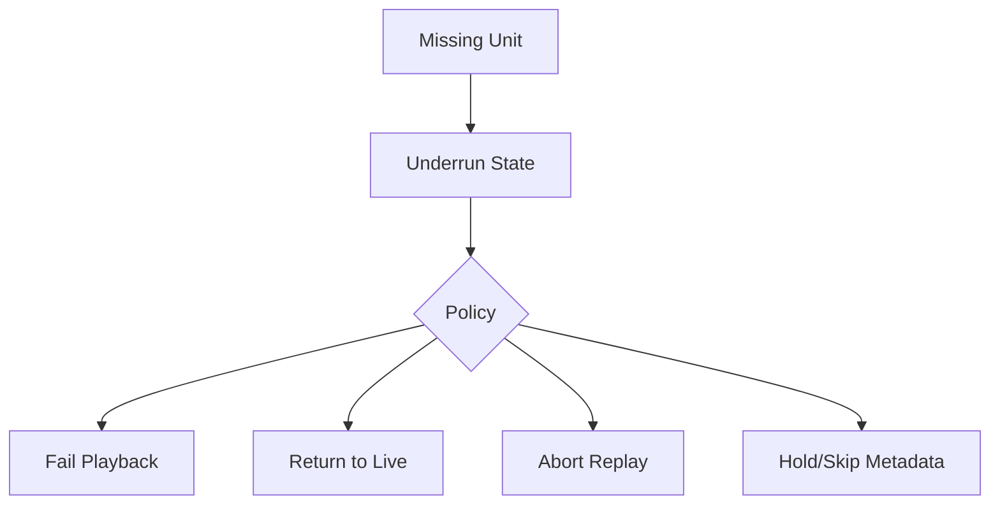

## Active-range protection, lookahead, roles, playlists, macros, ownership, queues, conflicts

Active playback range, current unit, and bounded lookahead are protected by exact ownership leases. Output roles are explicit: Replay Preview, Replay Program Candidate, Replay Program Active, Replay AUX, Replay Clean Feed, Replay Multiview Metadata, and Custom. Playlist execution is metadata-only and bounded; v5.8.2 has no automatic loop. Replay take macros model cue, prepare Preview, arm, take to Program, wait for completion metadata, return to live, and release output through v5.1/v5.5 typed commands only. Queues are bounded by count, duration, estimated bytes, and latency. Conflict policies are deterministic and keep one Program replay authority.

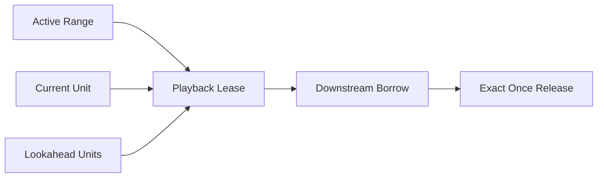

## Backend, processor, registry, commands, events, health, telemetry, watchdog

`ReplayPlaybackBackend` defines capabilities and metadata-only operations. `SyntheticReplayPlaybackBackend` is deterministic and reports `realPlayback`, `realDecode`, `realFrameOutput`, `realAudioOutput`, and `realTransitionRendering` as false. `ReplayPlaybackProcessor` runs at order 1120 after replay recall and before variable-speed metadata. Output registry keys, typed commands, typed events, bounded telemetry, health snapshots, and watchdog incidents are exported publicly while mutable registries remain private.

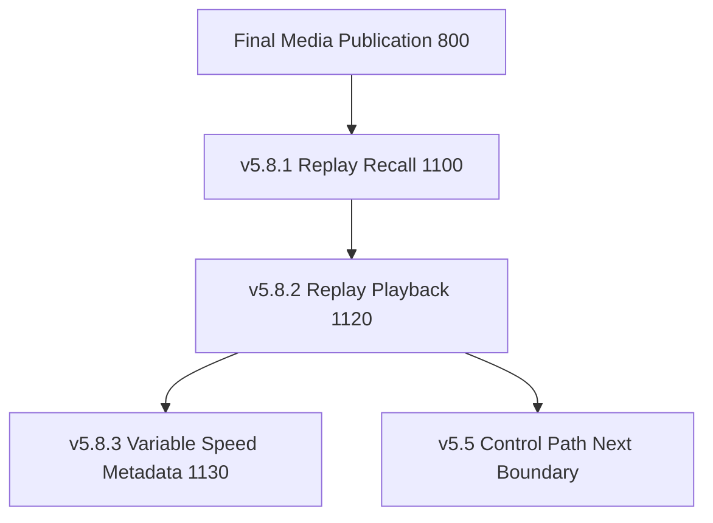

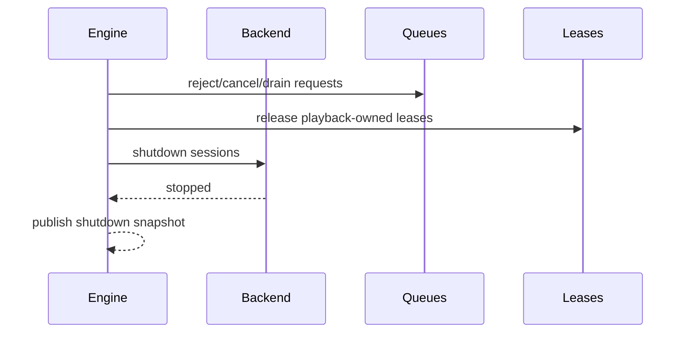

## Source Graph, security, invariants, validation, performance, and limitations

Source Graph exposes only bounded metadata: session states, replay item/range summaries, mode/rate/direction, cue/preroll/armed/playing, current sequence/PTS, remaining duration, Preview/candidate/active states, insertion/return states, audio policy, A/V sync summary, underrun, protected units, realPlayback=false, health, and readiness. Observability is sanitized and excludes pixels, PCM, packet payloads, file paths, credentials, native handles, mutable leases, and private transition internals. `assertInvariants()` verifies unique IDs, monotonic generations, valid references, one unit per tick, retained units, one active Program replay, exact-once results, bounded queues/leases, sanitized snapshots, Output Registry agreement, Source Graph agreement, and clean shutdown. Long-run validation uses deterministic fake FrameTicks and operation counts, not wall-clock thresholds. v5.8.2 intentionally remains metadata-only; UBOS v5.8.3 builds variable-speed and slow-motion metadata foundations on top.

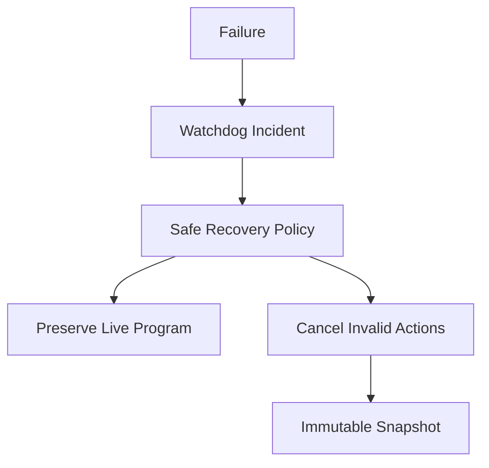
