# UBOS v5.8.3 — Production-Safe Variable-Speed Replay and Slow-Motion Metadata Foundation

## Purpose and architectural position

UBOS v5.8.3 adds a synthetic, metadata-only variable-speed replay planning layer between the replay playback session and the Program candidate path. It reuses the v5.1 `FrameTick` execution model and processor registry, the replay recall/playback boundaries, and existing audio/program orchestration contracts. It does **not** decode media, synthesize frames, stretch audio, mutate Program/Preview, create a second clock, or create another replay loop.

## Relationship to v5.8.1 and v5.8.2

v5.8.1 owns retained replay ranges and media recall metadata. v5.8.2 owns playback session and Program insertion contracts. v5.8.3 consumes those immutable states and publishes speed-aware plans, positions, selections, cadence, audio/A/V metadata, readiness, health, telemetry, and Program-eligibility metadata.

## Models

- **Playback-rate model:** rational numerator/denominator is authoritative; normalized fractions are deterministic; zero is freeze metadata only; negative numerators are rejected so reverse remains explicit.
- **Rational timing:** source/output mappings use integer and rational remainders; no floating-point accumulation is authoritative.
- **Rate classes:** freeze, ultra-slow metadata, slow-motion metadata, normal, fast-motion metadata, ultra-fast metadata, and custom.
- **Directions:** forward, reverse metadata, ping-pong metadata, and custom. Reverse is never inferred from a negative rate.
- **Video strategies:** exact, nearest, previous, next, repeat metadata, drop metadata, blend required, interpolation required, optical-flow required, HFR-native metadata, and custom.
- **Audio strategies:** follow at 1x, mute nonstandard rates, continue Program audio metadata, time-stretch required, pitch-preservation required, resample required, reverse-audio required, audio-only metadata, operator-controlled, and custom.
- **Speed profiles and built-ins:** normal 1x, half, quarter, three-quarter, double, four-times, freeze, reverse 1x, reverse half, ping-pong, HFR half, HFR quarter, and custom are immutable profiles.
- **Source motion capabilities:** source frame rate, time base, HFR metadata, motion-vector availability metadata, optical-flow eligibility metadata, reverse-decode eligibility metadata, and real-capability flags are recorded without exposing payloads.
- **Slow-motion readiness:** readiness combines requested rate/direction, HFR metadata, retained density, keyframe/lookahead sufficiency, interpolation/optical-flow requirements, audio requirements, and Program policy.
- **Requests/plans/results:** variable-speed requests are generation-checked and deduplicated; plans resolve explicit policies; results mark real processing flags false for the synthetic backend.
- **Clock mapping and position:** mappings are FrameTick-derived, output PTS monotonic, source position bounded, forward source movement nondecreasing, and reverse metadata movement explicit.
- **Frame selection and cadence:** exactly one selection/cadence plan is created per session/tick boundary; repeat, drop, interpolation, optical-flow, and HFR requirements are observable metadata.
- **Speed ramps and rate-change points:** ramps are bounded, deterministic, generation-protected, and metadata-only; no zero crossing or direction reversal is implicit.
- **Freeze and reverse foundations:** freeze holds immutable source references as metadata; reverse decrements source sequence metadata while output PTS remains monotonic.
- **Audio/A/V sync:** audio policy is explicit; unsupported altered-speed replay audio is muted or metadata-only; A/V sync reuses existing conventions and marks degraded states.
- **Duration/lookahead/protection:** duration is rational; lookahead is bounded and direction-aware; protection is bounded and releases exactly once.
- **Program eligibility:** normal forward 1x can be Program-ready; metadata-only altered-speed, reverse, interpolation, optical-flow, and altered audio are Preview metadata only unless a real backend exists.
- **Configuration transactions:** updates are atomic, generation-checked, and cannot mutate the active tick.
- **Backend abstraction:** the synthetic backend validates and plans deterministic metadata while reporting no real variable-speed, interpolation, optical-flow, reverse decode, audio stretch, pitch preservation, or reverse audio support.
- **Processor order:** `ReplayVariableSpeedProcessor` runs at order 1130 after replay playback and before Program eligibility finalization.
- **Output registry, commands, events, health, telemetry, watchdog:** v5.8.3 publishes typed keys, typed command handlers, typed event names, bounded health/telemetry counters, and watchdog incident names.
- **Source Graph and security:** snapshots are bounded, immutable, JSON-safe, redacted, and free of pixels, PCM, payload bytes, paths, credentials, motion-vector payloads, mutable leases, and native handles.
- **Production safety:** no second clock, loop, scheduler, decoder, GPU, audio processor, file access, Program mutation, hidden policy, output after failure/shutdown, ownership leak, or false real-processing claim.
- **Invariants:** `assertInvariants()` verifies unique IDs, rational validity, generation discipline, bounded queues, source range, output monotonicity, Program eligibility, snapshot consistency, and clean shutdown.
- **Long-run validation/determinism/performance:** validation uses fake ticks, 10,000 requests, 100,000 processor ticks, repeated canonical snapshots, deterministic operation counts, and expected O(1)/bounded complexity.
- **Limitations and v5.8.4 handoff:** real media generation, playlist playback, highlight assembly, clip assembly, graphics, and controller integration are deferred to later phases; the next recommended phase is UBOS v5.8.4 Production-Safe Replay Playlist, Highlight, and Clip Assembly Foundation.

## Diagrams

### 1. Replay Playback to Variable-Speed planning flow

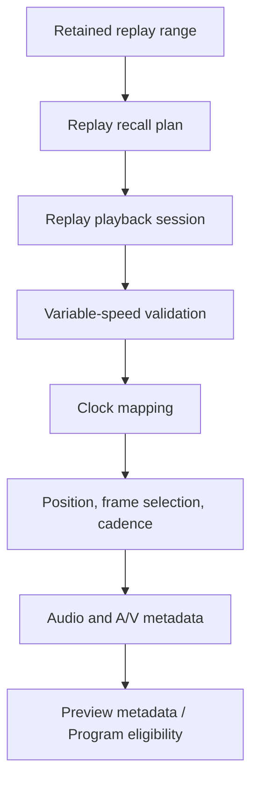

### 2. Rational source/output clock mapping

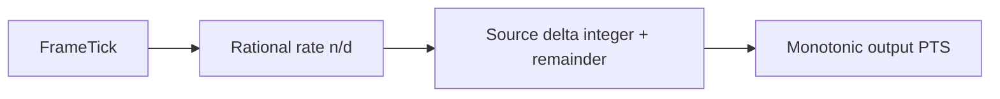

### 3. Speed-profile resolution

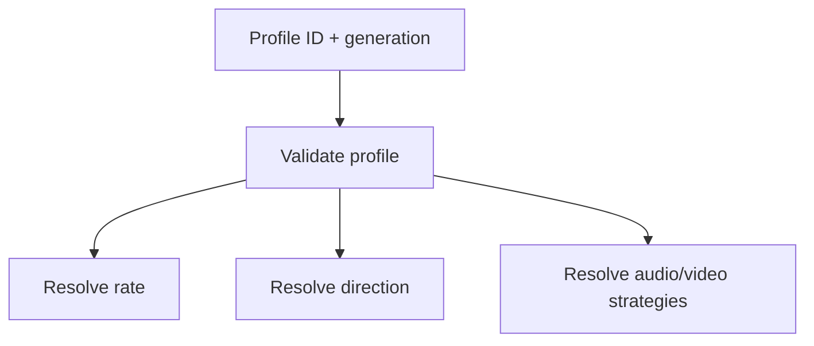

### 4. Frame-selection planning

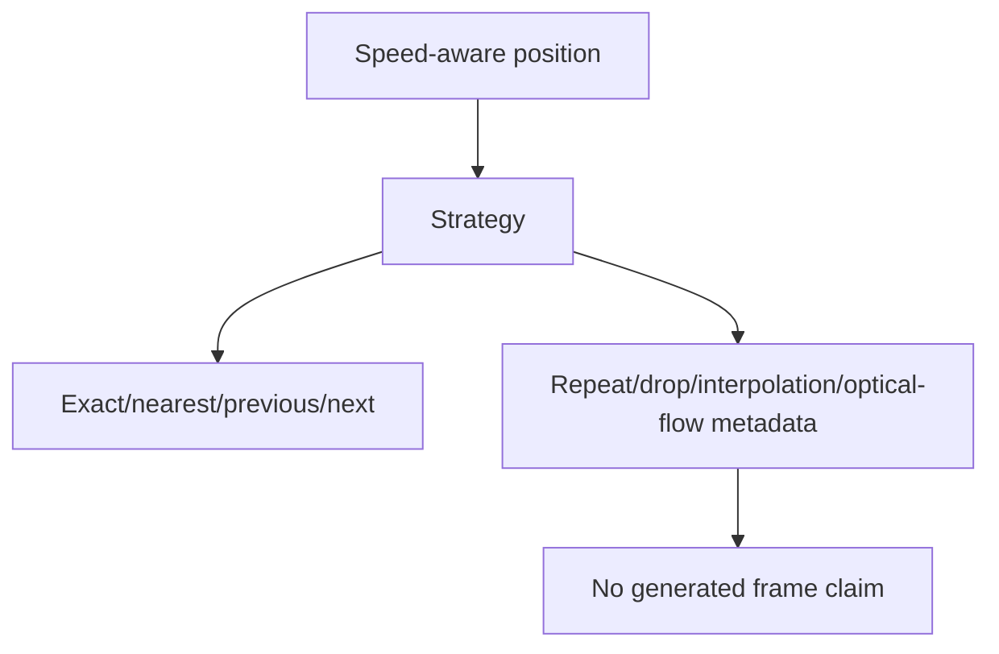

### 5. Cadence generation

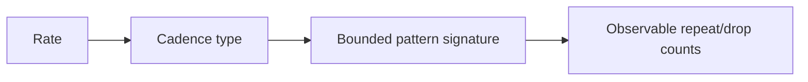

### 6. Slow-motion readiness

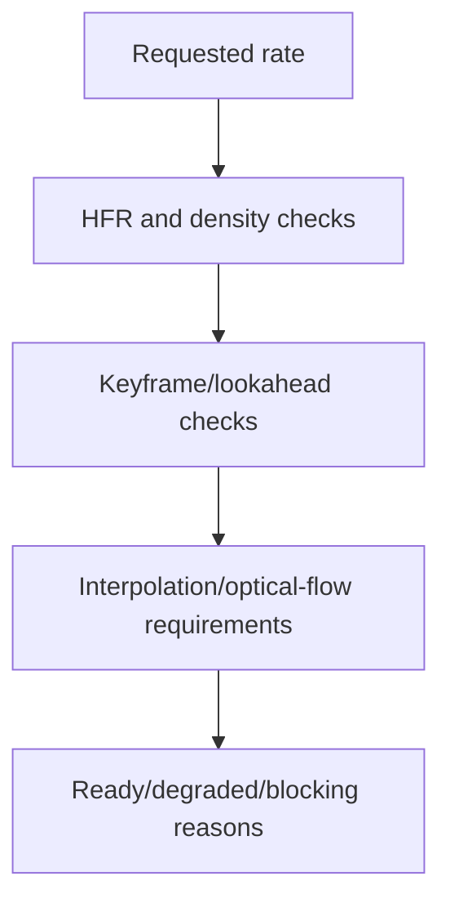

### 7. HFR source evaluation

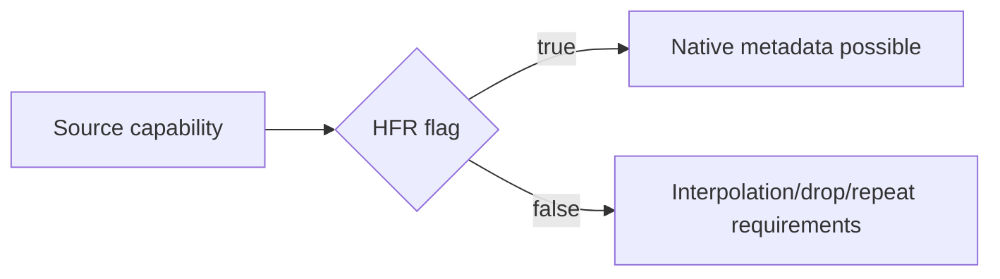

### 8. Speed-ramp lifecycle

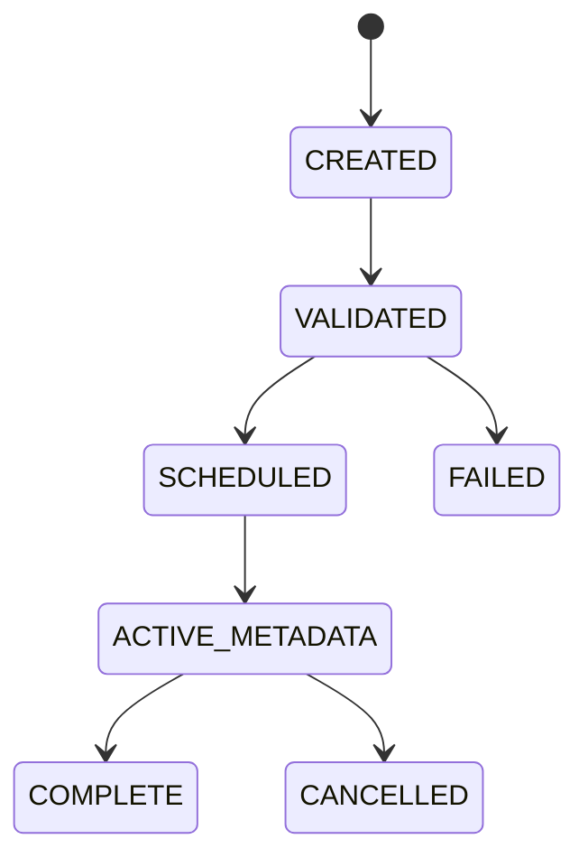

### 9. Freeze metadata lifecycle

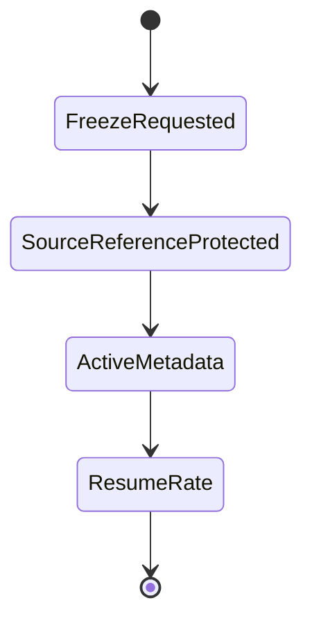

### 10. Reverse metadata lifecycle

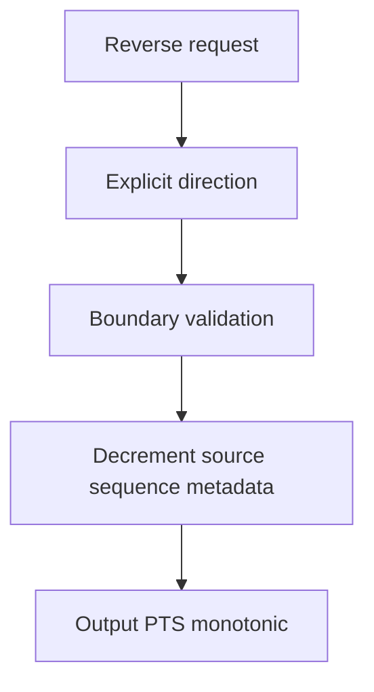

### 11. Altered-speed audio coordination

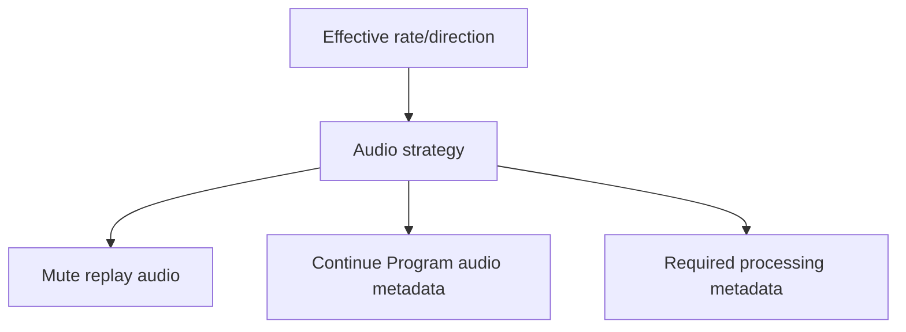

### 12. Speed-aware A/V sync

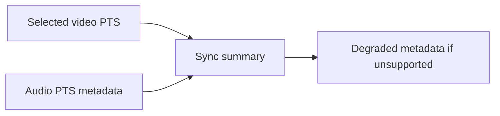

### 13. Lookahead and buffer protection

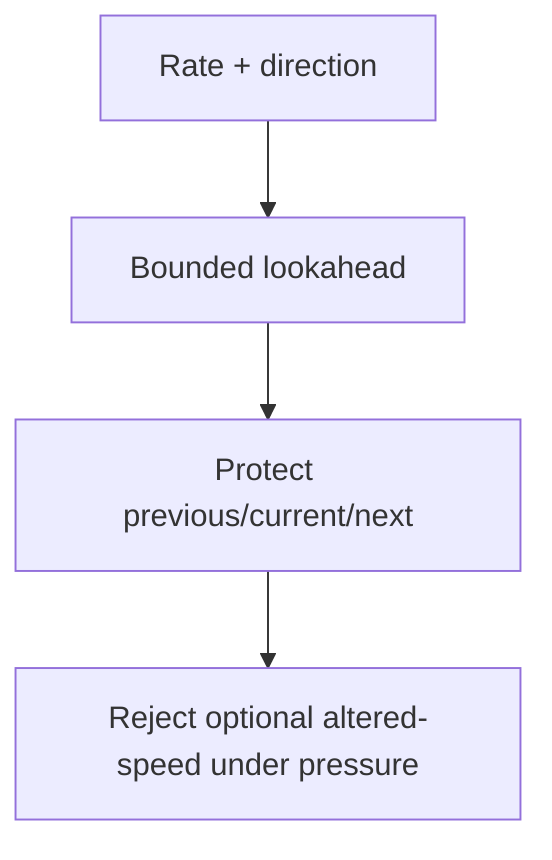

### 14. Program-eligibility decision

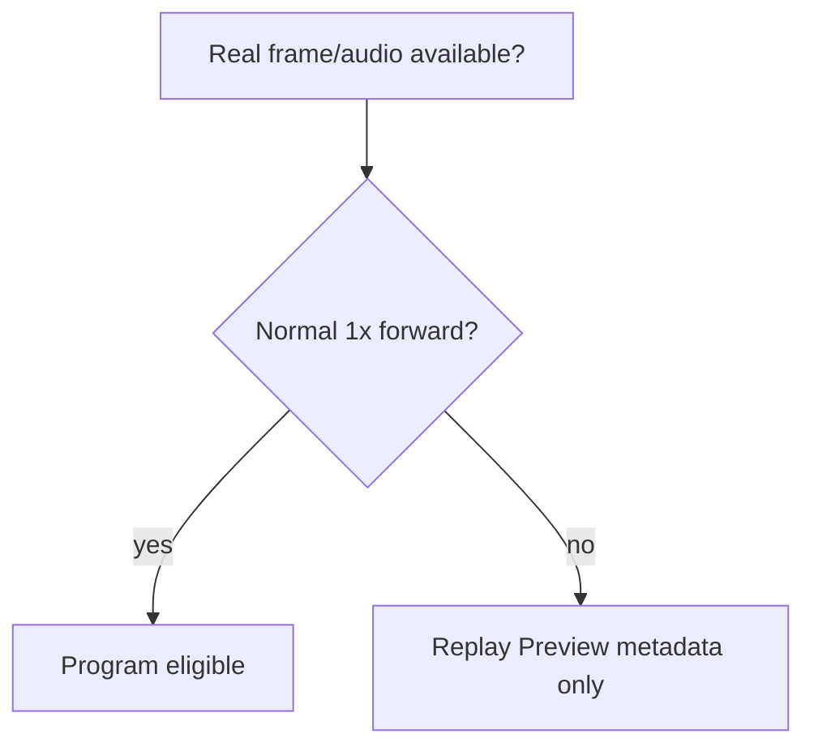

### 15. Processor order

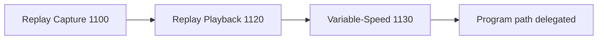

### 16. Failure cleanup

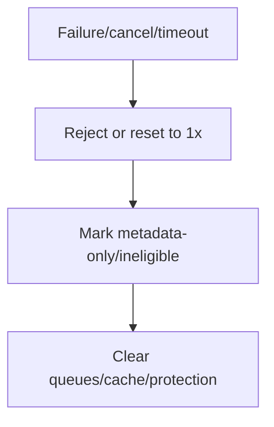

### 17. Shutdown sequence

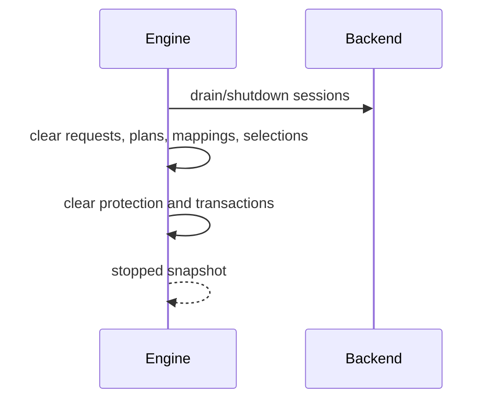
