# UBOS v5.8.4 Replay Playlist, Highlight, and Clip Assembly Foundation

## Purpose and architectural position
UBOS v5.8.4 adds a production-safe, metadata-only foundation that orders replay items and retained ranges into replay playlists, highlight packages, and clip assembly plans. It reuses the v5.1 tick processor and command model, follows v5.8.1 replay recall metadata, delegates any playback to v5.8.2, and references v5.8.3 speed profiles without creating another media clock, playback engine, encoder, muxer, renderer, recorder, file writer, GPU path, or media payload buffer.

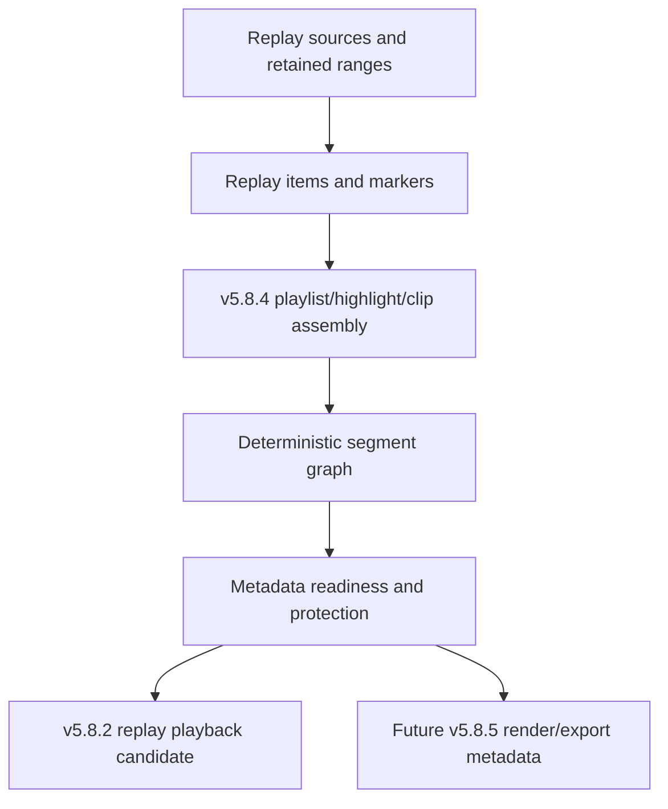

## Assembly, playlist, and highlight types
Assembly types are explicit: `REPLAY_PLAYLIST`, `HIGHLIGHT_REEL`, `HIGHLIGHT_COLLECTION`, `CLIP`, `CLIP_PACKAGE`, `EVENT_PACKAGE`, `SOURCE_PACKAGE`, `PROGRAM_SUMMARY_METADATA`, `SOCIAL_CLIP_METADATA`, and `CUSTOM_TYPED`. Playlist types are deterministic metadata: manual, event, chronological, reverse chronological metadata, priority, source grouped, program summary, and custom. Highlight types include single or multi event, player/team/speaker metadata, top plays metadata, program/chapter/source summary, operator collection, and custom. Event references are supplied explicitly; there is no AI, computer-vision, identity, scoring, or caption inference.

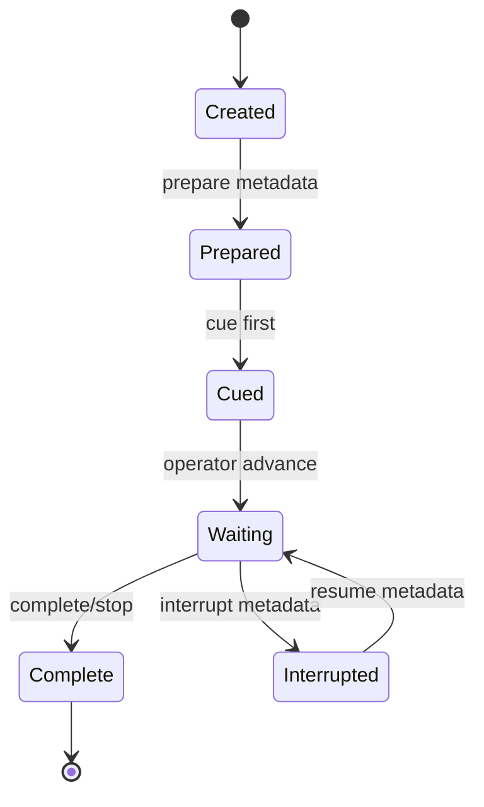

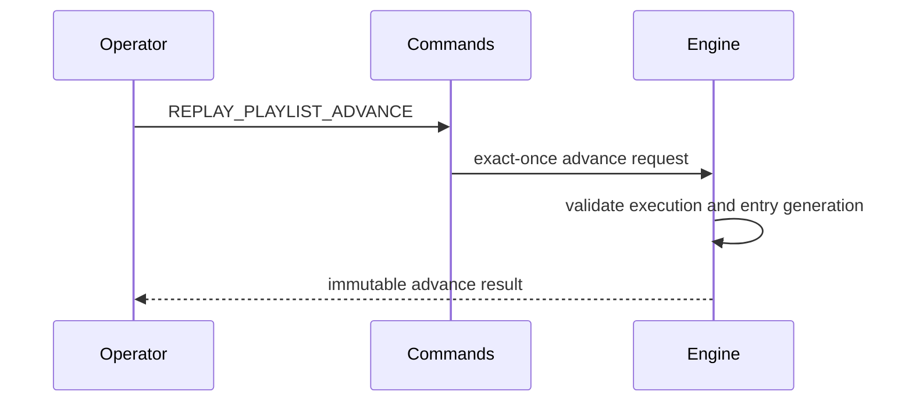

## Playlist and entry model
Playlists are immutable definitions with generation-protected updates, bounded entry counts, default output/playback/speed/audio/transition references, explicit advancement, interruption, resume, completion, and loop-policy metadata. Entries bind deterministic positions to replay items, clips, sources, and ranges with required/optional and skip policy metadata. Duplicate active positions, stale generations, hidden sort behavior, automatic activation, and automatic loop execution are rejected.

## Clip, segment, lineage, and revision model
Clips are immutable metadata records containing ordered segment IDs, source replay item/buffer/range/marker IDs, aspect-ratio role, output role, playback/speed/audio/transition/graphics references, caption/thumbnail/export/publication metadata boundaries, lineage, revision, readiness policy, and safe metadata. Segments carry deterministic indexes, source type, replay source/buffer/item/range generation references, PTS and sequence bounds, direction, video strategy, audio/transition/graphics/caption references, required/enabled flags, and retained-range metadata.

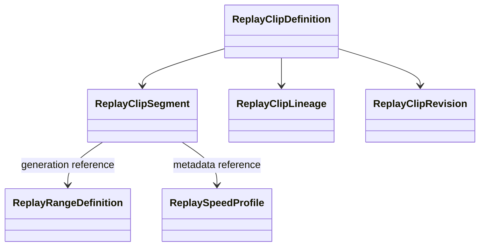

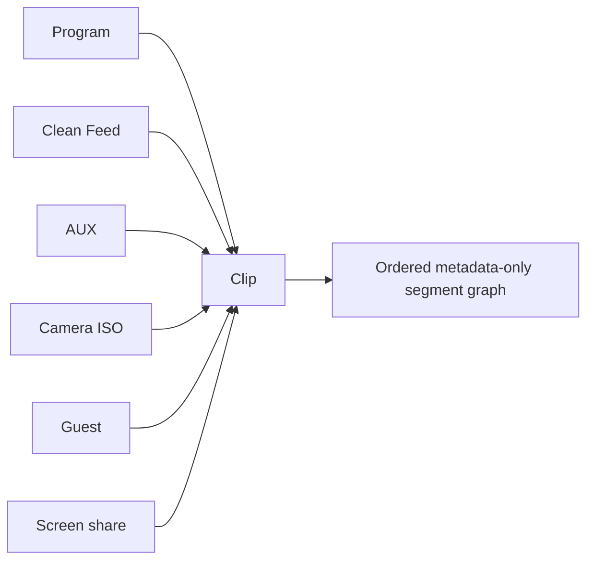

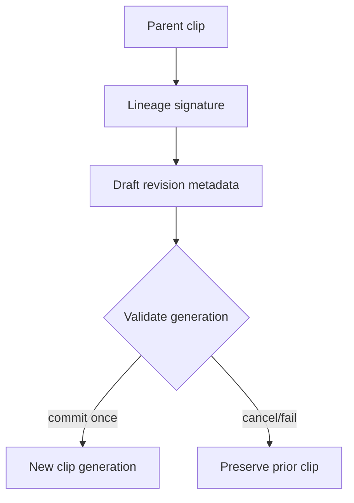

## Assembly requests, plans, results, readiness, and packages
Assembly requests are immutable and exact-once. Plans validate definitions, segments, source/buffer/range/marker generations, speed profiles, transition/graphics references, discontinuities, duration metadata, protection, leases, readiness, and publication/export eligibility. Results accurately state `metadataOnly: true` and `realClipAssembly`, `realRender`, and `realExport` as false for the synthetic backend. Highlight packages are deterministic metadata only and do not publish socially, generate thumbnails, or export media.

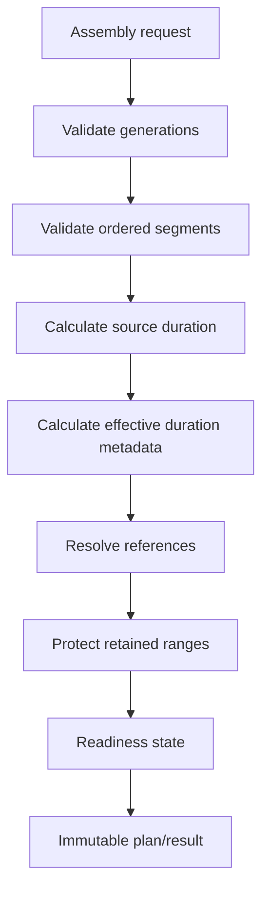

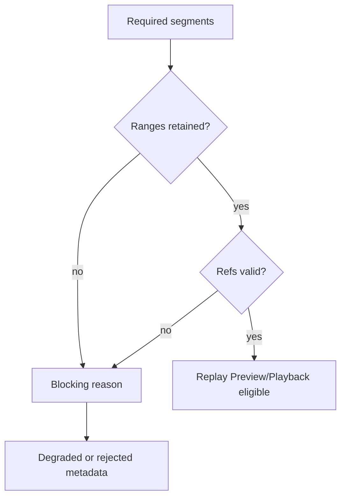

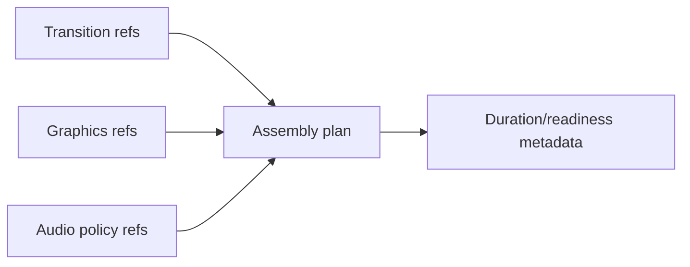

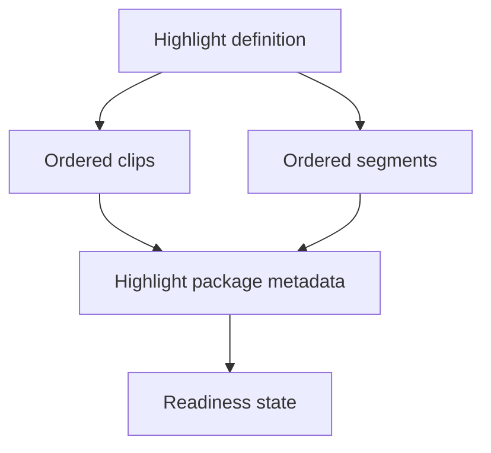

## Source retention, ownership, queues, conflicts, backend, and processor
The engine creates bounded protection states and exact-once leases. Active assembly sources cannot be silently evicted, leases cannot be double released, and shutdown releases all ownership metadata. Bounded queues cover assembly requests, playlist advancement, highlight package preparation, revisions, protection updates, and publication metadata. Conflict policies are explicit and deterministic. The backend abstraction supports metadata-only playlist, highlight, multi-source clip assembly, speed/transition/graphics/audio references, source retention protection, replay preview/playback preparation, and program-candidate metadata; the synthetic backend reports no real assembly, rendering, encoding, muxing, file output, thumbnail, or waveform generation.

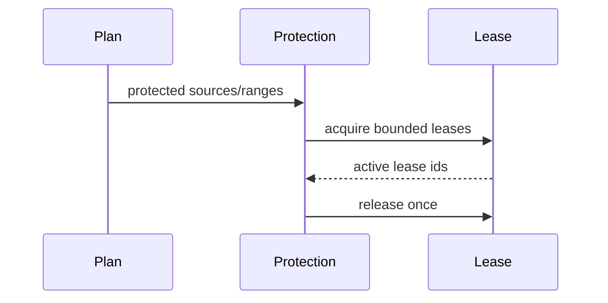

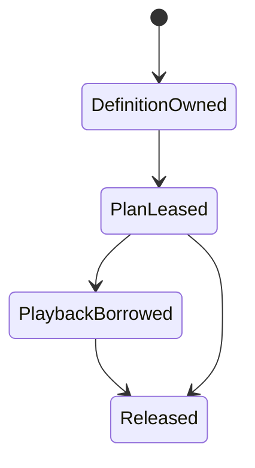

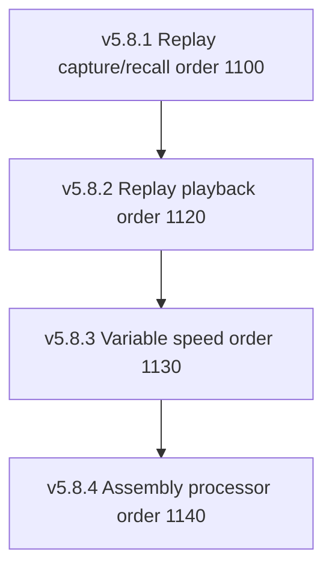

## Commands, events, output registry, health, telemetry, watchdog, and Source Graph
The public API exports typed command names, event names, watchdog incident names, output registry keys, engine, processor, backend, snapshots, and source-graph projection. Health and telemetry are bounded counters/summaries. Watchdog incidents cover stale generations, duplicates, invalid order, evicted ranges, missing required segments, invalid references, revision conflicts, protection failures, queue overflow, backend failure, ownership violation, registry/source-graph mismatch, and invariant failure. Source Graph exposes only sanitized metadata summaries: playlist/highlight/clip IDs, states, segment counts, durations, aspect ratio, readiness, missing/protected counts, metadata-only and false real-render/export flags.

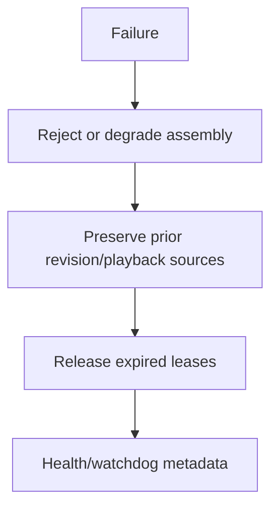

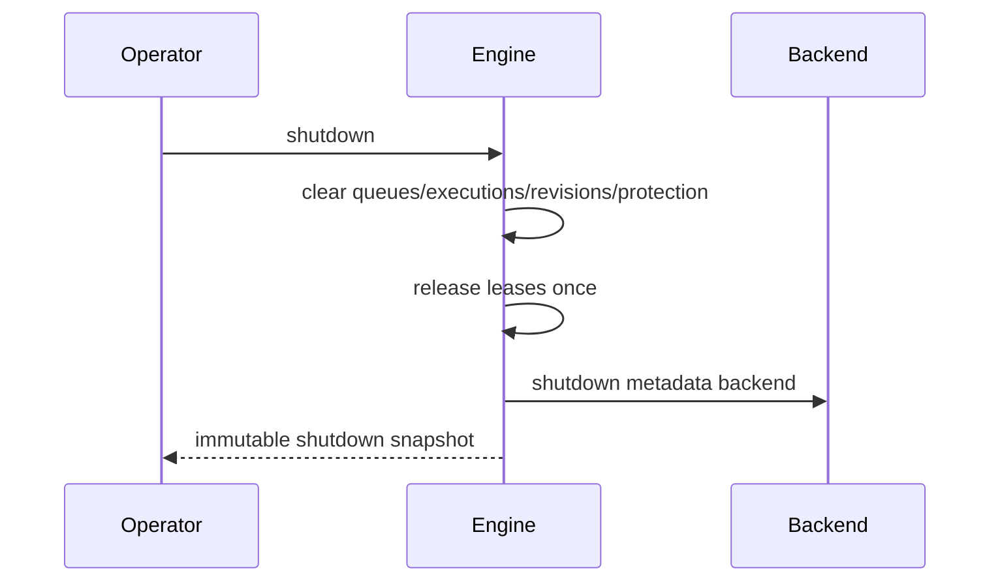

## Security, invariants, validation, performance, limitations, and v5.8.5 handoff
Snapshots are JSON-safe, deeply immutable, bounded, deterministic, and redacted. They contain no pixels, PCM, packet contents, payload bytes, file paths, credentials, native handles, mutable leases, private operator notes, or unbounded titles/descriptions. Invariants verify uniqueness, monotonic generations, valid references, deterministic ordering, segment timing, retained ranges, no lineage cycles, one active revision per clip, one result per request, one advancement per request, bounded queues/leases, health/telemetry agreement, and clean shutdown. Performance expectations are O(1) registry lookup, O(entries) playlist validation, O(segments) validation/duration, O(n log n) deterministic ordering, O(parent depth) lineage validation, O(changed segments) revision comparison, O(protected segments) protection, O(1) advancement, and bounded processor orchestration. Remaining limitations are intentional: no media editing, rendering, encoding, muxing, export, thumbnails, waveform, transition rendering, graphics rendering, audio mixing, social publishing, captions, UI, decoder, GPU, or disk output. v5.8.5 can consume the metadata contracts for production-safe clip rendering/export metadata without changing these guarantees.
