# UBOS v5.8.5 — Production-Safe Clip Rendering, Export, and Media Delivery Metadata Foundation

UBOS v5.8.5 converts validated v5.8.4 replay clip, highlight, playlist, and package assemblies into deterministic **metadata-only** render, export, manifest, and delivery plans. It never renders, decodes, encodes, muxes, writes, uploads, delivers, publishes, thumbnails, waveforms, proxies, encrypts, or calls native/cloud/social APIs.

## Architectural position and relationship to v5.8.1–v5.8.4

The foundation runs after replay recall, playback/program insertion, variable-speed metadata, and playlist/highlight/clip assembly. It reuses FrameTick, TickProcessorFramework, RuntimeCommandHandler, ProcessorOutputRegistry, v5.8.4 assembly readiness, and typed delegation references to encoder, packaging, streaming, distribution, and social coordination contracts. It introduces no second media clock, loop, scheduler, recorder, encoder, muxer, storage client, network client, or native media backend.

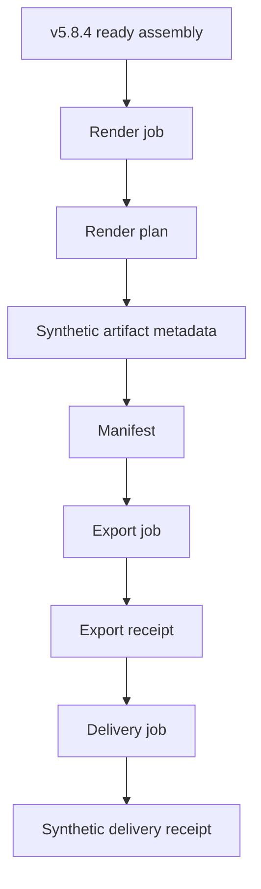

## Job types

Supported render job types are `CLIP_RENDER`, `HIGHLIGHT_RENDER`, `PLAYLIST_RENDER`, `EVENT_PACKAGE_RENDER`, `PROGRAM_SUMMARY_RENDER`, `SOCIAL_CLIP_RENDER_METADATA`, `ARCHIVE_RENDER_METADATA`, `PROXY_RENDER_METADATA`, `THUMBNAIL_RENDER_METADATA`, `AUDIO_ONLY_RENDER_METADATA`, and `CUSTOM_TYPED`. All type selection is explicit.

## Render profiles and media format metadata

`ReplayRenderProfile` is immutable, generation protected, and declares job types, source assembly types, output role, aspect ratio, dimensions, frame rate, video/audio codecs, container, bitrate policies, sample rate, channel layout, pixel/color/transfer/range metadata, alpha, graphics, transition, caption, audio, variable-speed, encoder, and packaging policies. Supported containers include MP4, MOV, MPEG-TS, Matroska, WebM, HLS/DASH package metadata, audio-only metadata, image-sequence metadata, and custom. Supported video codec metadata includes H.264, H.265 metadata, AV1 metadata, VP9 metadata, ProRes metadata, DNx metadata, raw metadata, none, and custom. Supported audio codec metadata includes AAC, PCM metadata, Opus metadata, MP3 metadata, FLAC metadata, none, and custom.

## Export and delivery profiles

`ReplayExportProfile` binds an export mode, naming policy, overwrite/revision/checksum/manifest/sidecar policy, sidecar thumbnail/waveform/proxy metadata, retention, and delivery handoff to a render profile generation. Export modes are local, archive, object-storage, CDN, download, streaming handoff, social handoff, and custom metadata references only.

`ReplayMediaDeliveryProfile` binds delivery type, export profile generation, destination class/reference, optional streaming/distribution/social references, required/priority, retry/failure/completion/receipt policies, authorization-reference metadata, and expiry metadata. Delivery types are archive, download, object-storage, CDN, streaming, social platform, internal library, review link, and custom metadata.

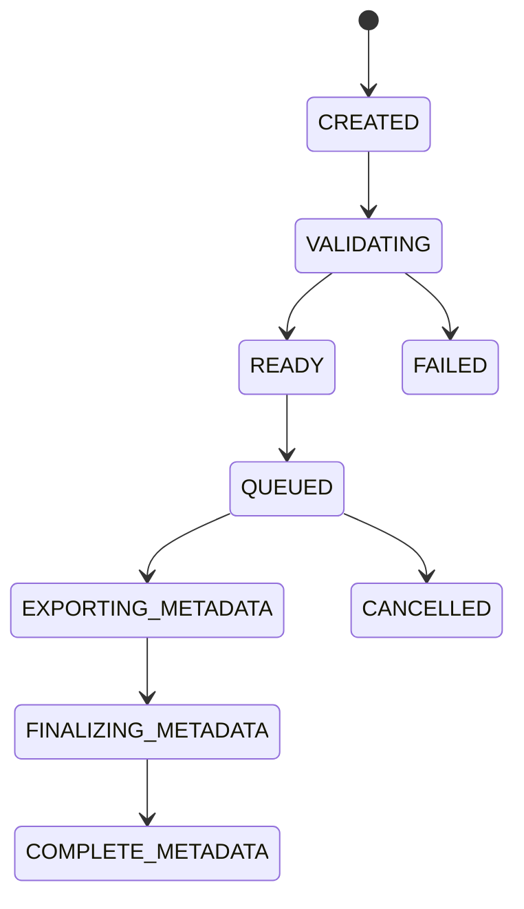

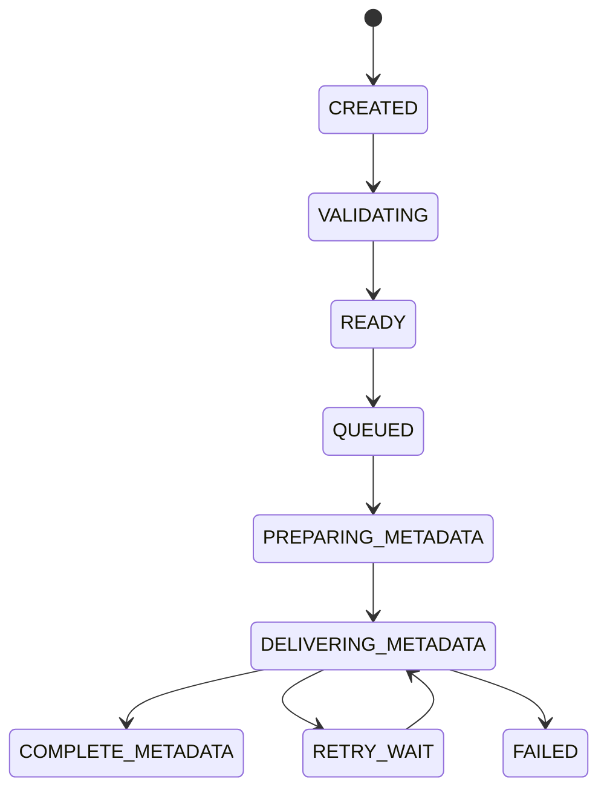

## Destination references and redaction

`ReplayDeliveryDestinationReference` is opaque and carries destination class, provider metadata, deterministic redacted identifier, availability, authorization-reference metadata, expiry metadata, and safe metadata. It stores no path, URL, bucket name, token, credential, account ID, authorization header, payload, or native handle.

## Render jobs, requests, plans, artifacts, results

Render jobs reference ready v5.8.4 assembly plan/result generations and a render profile generation. Render requests reject duplicate IDs, stale job/profile/assembly/source/speed/transition/graphics/encoder/packaging/timeline generations, missing sources, evicted ranges, unsupported requirements, queue overflow, cancellation, failure, destruction, and shutdown. Render plans include ordered segment summaries, output video/audio/color/alpha specifications, graphics/transition/caption/variable-speed requirements, encoder and packaging delegation metadata, operation order, deterministic score, artifact metadata, and manifest metadata. Results use `COMPLETE_METADATA` only and keep all real-media flags false.

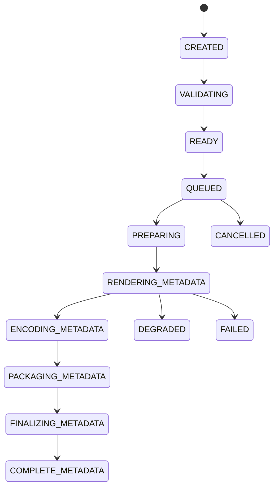

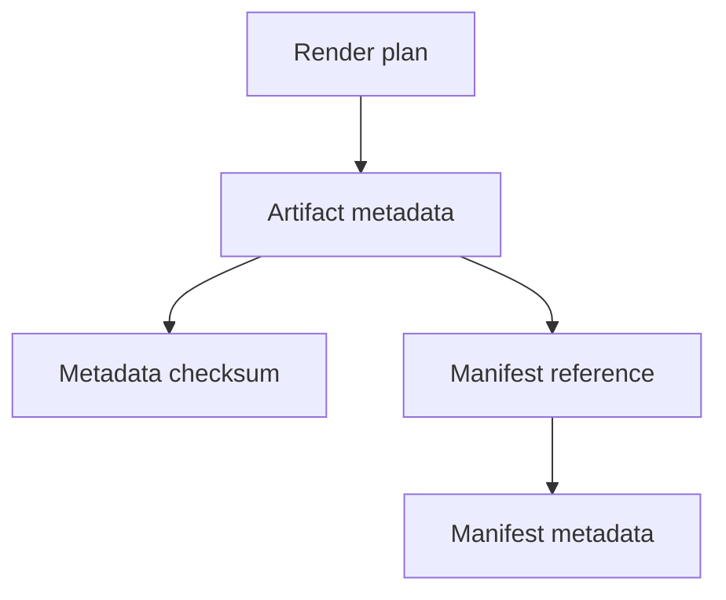

## Output naming, manifests, progress, retries, ownership, queues

Output naming is deterministic and sanitized with explicit collision policies: reject, append revision, append sequence, append metadata hash, replace metadata only, or custom. Manifests are JSON-safe, bounded, deterministically ordered, metadata-only, and include source, segment, profile, output specification, duration, estimated byte, transition/graphics/audio, variable-speed, lineage, revision, and checksum metadata. Progress is rational, monotonic within generation, and terminal-safe. Retry/failure policies are explicit and bounded. Ownership leases are exact-once acquired/released. Queues are count/metadata/latency bounded and never indefinite.

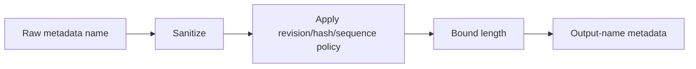

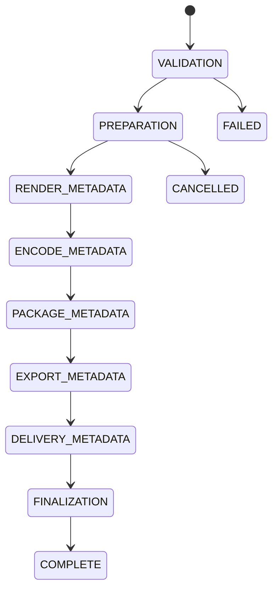

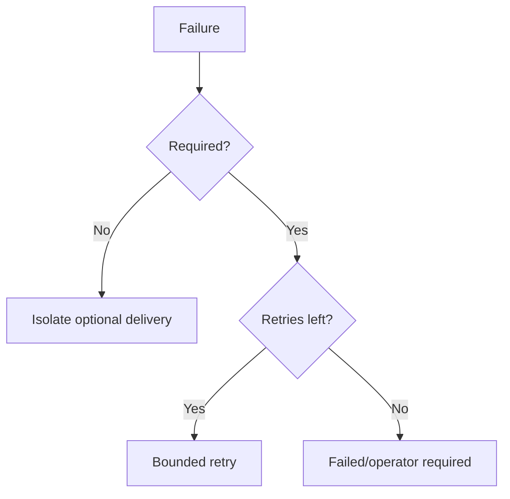

## Backend abstraction and synthetic backend

`ReplayClipMediaOutputBackend` validates profiles, creates render/export/delivery plans, creates artifact/export/delivery receipts, updates progress, cancels, retries, drains, resets, reconfigures, and shuts down. The deterministic synthetic backend reports false for real rendering, encoding, muxing, file output, upload, delivery, platform publication, thumbnail generation, and waveform generation.

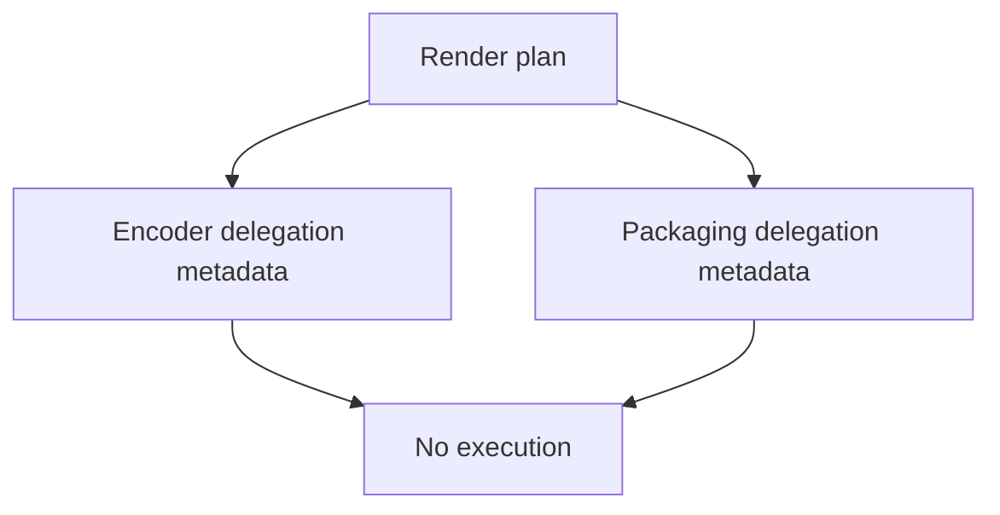

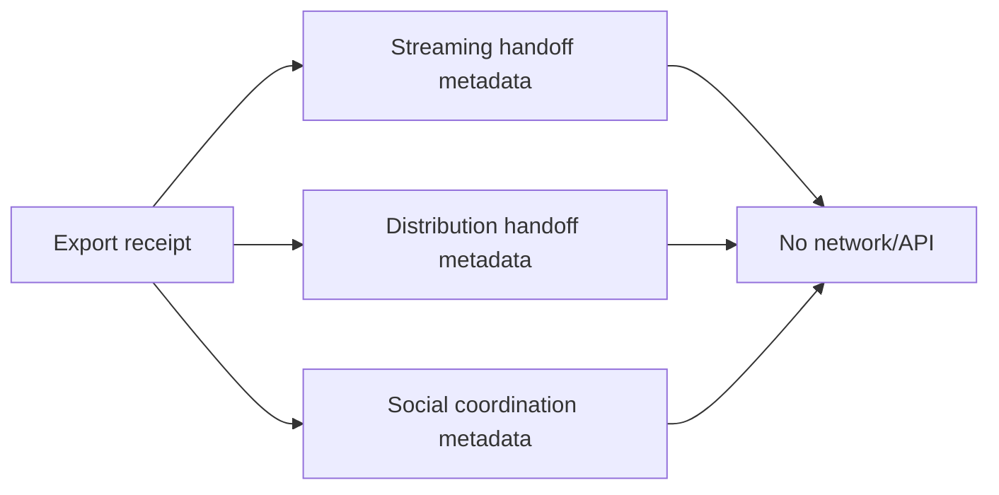

## Processor order, commands, events, output registry

The processor order is replay capture 1100, playback 1120, variable speed 1130, clip assembly 1140, and clip rendering/export/delivery metadata 1150. Commands are v5.1 command-engine compatible and mutate only metadata registries. Events cover engine/backend/profile/job/plan/result/manifest/progress/retry/cancel/degrade/fail/health/shutdown activity. Output registry keys publish bounded snapshots for profiles, jobs, plans, artifacts, manifests, receipts, progress, queues, leases, transactions, health, telemetry, backend health, and failed/rejected results.

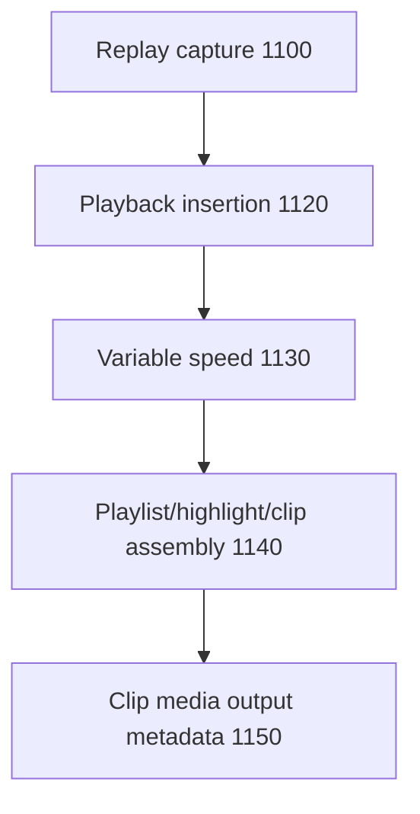

## Health, telemetry, watchdog, Source Graph, security

Health includes backend/profile/destination/job/queue/plan/artifact/manifest/receipt counts, duplicate/stale/unsupported/missing/evicted/delegation/destination/retry/timeout/ownership counters, active leases, queue depth, estimated output bytes, last IDs, last failure, and update time. Telemetry is bounded. Watchdog incidents cover stalls, duplicate requests/jobs/results, stale generations, source missing/evicted, codec/container incompatibility, unsupported requirements, invalid delegation, unavailable destinations, invalid/colliding names, invalid manifests, progress regression, queue overflow, retry exhaustion, backend failure, ownership violation, registry/source-graph mismatch, redaction failure, and invariants. Source Graph exposes only bounded redacted metadata and real-media false flags.

## Configuration transactions, invariants, validation, performance

Configuration transactions are atomic and generation checked. `assertInvariants()` checks uniqueness, monotonicity, valid references, compatibility, deterministic naming, terminal-result cardinality, metadata-only capability agreement, bounded queues/retries/leases, released-reference inactivity, health/telemetry agreement, registry/source-graph consistency, and clean shutdown. Deterministic replay compares canonical snapshots. Expected complexity is O(1) lookup, O(segments) assembly validation/plan/manifest generation, O(metadata size) checksums, O(name length) naming, O(1) export/delivery planning/progress/retry, and O(active + bounded state) snapshots/watchdog.

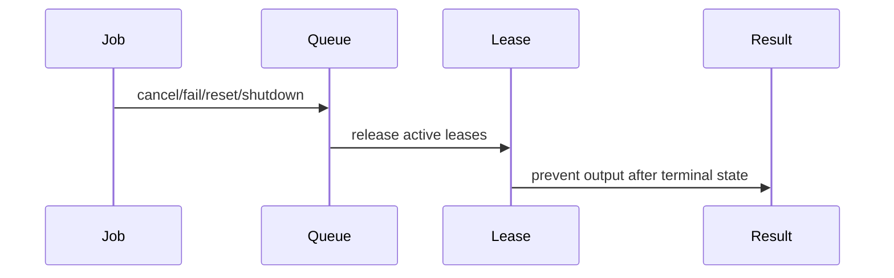

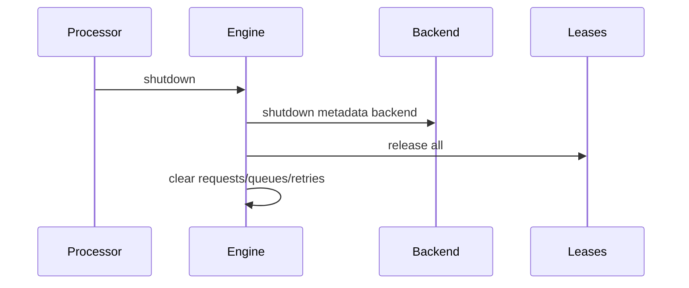

## Limitations and v5.8.6 handoff

This is a metadata foundation. Native rendering, decoding, encoding, muxing, storage, CDN, upload, social publication, DRM, encryption, thumbnail, waveform, and proxy generation remain future work. The next recommended phase is **UBOS v5.8.6 — Production-Safe Replay, Highlight, and Clip Workflow Certification**.
