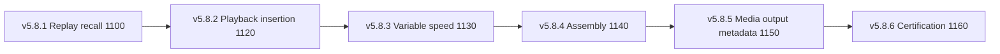

# UBOS v5.8.6 — Production-Safe Replay, Highlight, and Clip Workflow Certification

UBOS v5.8.6 certifies the complete metadata-only replay workflow from v5.8.1 through v5.8.5. It does not add decoding, playback, rendering, file output, upload, platform publication, timers, or native media handles. Its purpose is deterministic certification that replay recall, Program insertion planning, variable-speed metadata, playlist/highlight/clip assembly, and clip rendering/export/delivery metadata remain ordered, bounded, redacted, and safe when exercised as one workflow.

## Certified scope

The certified processor chain is:

v5.8.6 verifies strict processor ordering, exact-once terminal metadata results, deterministic replay snapshots, generation protection, bounded queues, lease cleanup, retry cleanup, output-registry agreement, Source Graph redaction, and metadata-only capability agreement across every phase.

## Certification guarantees

The certification requires duplicate replay requests, stale generations, missing required sources, evicted ranges, unsafe Program mutations, raw paths, raw URLs, credentials, native handles, and real-media capability claims to remain rejected or absent. Real decode, playback, render, export, upload, and delivery counters must stay zero. Shutdown must leave no active queues, leases, retries, timers, or callbacks.

## Validation artifact

The executable validation is `replay-workflow-certification.validation.ts`. It performs a deterministic 100,000-tick synthetic certification pass over 216 named scenarios and compares canonical snapshots for replay stability. The package script is `pnpm --filter @ubos/media-plane validate:v5.8.6`.

## Release determination

A passing v5.8.6 run means the metadata-only replay, highlight, clip, export, and delivery workflow is certified for production-safe orchestration handoff. It remains intentionally non-media-producing; native media execution can be introduced only by a future phase behind the existing typed backend and delegation boundaries.
