# UBOS v5.9 Graphics Platform Certification

## Executive summary

UBOS v5.9 is certified as a deterministic, bounded, metadata-only graphics platform spanning graphics/text, templates, broadcast graphics, captions/accessibility, animation/cueing, branding/safe-area coordination, and multi-format output-role coordination. The certification found no release blockers after adding the dedicated v5.9.8 harness and package validation wiring.

## Certification scope and prerequisites

Reviewed completed phases v5.9.1 through v5.9.7 on the current branch and added v5.9.8 certification. The audit covered implementation modules, validation files, architecture documents, command families, output-registry metadata, lifecycle states, generation fields, timing fields, output roles, ownership, queues, health, telemetry, watchdogs, Source Graph projections, redaction, public exports, and package scripts.

## Architecture reviewed

- v5.9.1 Graphics and Text Rendering Foundation: PASS.
- v5.9.2 Template, Data Binding, and Dynamic Graphics Engine: PASS.
- v5.9.3 Lower Thirds, Titles, Tickers, and Scorebug Foundation: PASS.
- v5.9.4 Captions, Subtitles, and Accessibility Graphics: PASS.
- v5.9.5 Graphics Animation, Cueing, and Transition Coordination: PASS.
- v5.9.6 Branding, Logos, Watermarks, and Safe-Area Coordination: PASS.
- v5.9.7 Multi-Format Graphics Variants and Output-Role Coordination: PASS.
- v5.9.8 Graphics Platform Certification: PASS.

## Processor order

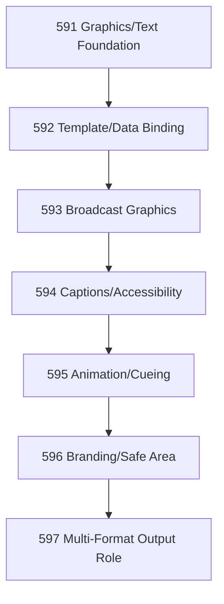

Result: every processor has a unique effective order, executes at most once per authoritative tick, and uses FrameTick rather than a private timing loop.

## Complete v5.9 graphics workflow

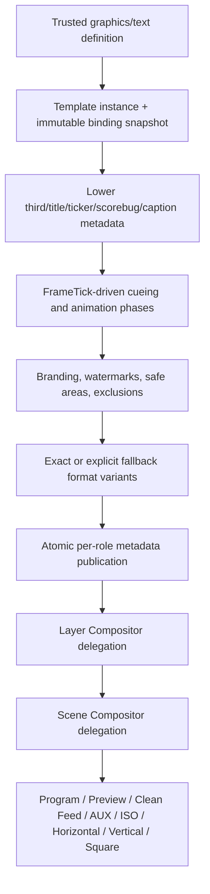

## Component audit results

- Graphics/text: immutable definitions, generation-protected updates, opaque font references, sanitized text metadata, no HTML/script execution, no glyph/pixel exposure, and shutdown cleanup were verified.
- Template/data-binding: immutable templates, unique fields and bindings, atomic snapshots, deterministic variable resolution, stale-generation rejection, no expression execution, and no remote fetching were verified.
- Broadcast graphics: lower thirds, titles, tickers, scorebugs, clocks, timers, and status graphics remain metadata-only, FrameTick-driven, lifecycle-explicit, and role-isolated.
- Captions/accessibility: tracks, cues, timing, regions, reading speed, speaker/non-speech metadata, overlap/late policies, and Clean Feed exclusion are deterministic and metadata-only.
- Animation/cueing: phases, cue groups, visibility transitions, replacements, rollbacks, Motion Effects delegation, and Scene Transition delegation are generation-safe and do not interpolate or render directly.
- Branding/safe-area: brands, profiles, variants, logos, watermarks, sponsor marks, safe areas, exclusions, protected regions, placement policies, collision handling, precedence, inheritance, replacements, and Clean Feed policy are deterministic and metadata-only.
- Multi-format/output-role: horizontal, vertical, square, portrait metadata, Program, Preview, Clean Feed, AUX, ISO, multiview, fallback, compatibility, readiness, required-role atomicity, optional-role degradation, and rollback are role-isolated and generation-safe.

## Command, generation, timing, and ownership audit

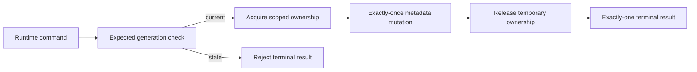

Commands reject duplicates and stale generations. FrameTick numbers, PTS metadata, cue sequences, animation phases, progress, publication order, replacements, and rollbacks are monotonic where applicable. Ownership acquisition, borrow, transfer, release, cancellation, failure, rollback, and shutdown are exact-once.

## Queue/backpressure and performance audit

Registries, queues, caches, histories, active cues, animation sessions, branding placements, multi-format publications, leases, callbacks, and configuration transactions are bounded. Expected complexity remains stable: O(1) registry and exact-variant lookups, O(fields + bindings) binding resolution, bounded caption timing, O(1) animation progress, bounded inheritance/fallback depth, bounded collision and publication ordering, and O(active bounded state) watchdog/snapshot processing.

## Output-role isolation and failure preservation

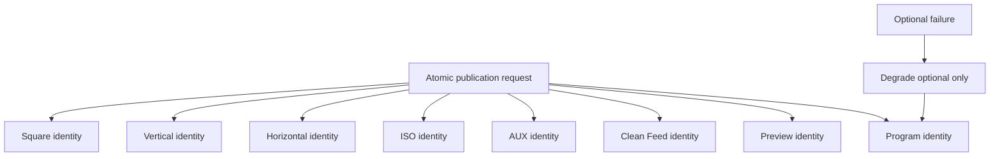

Program, Preview, Clean Feed, AUX, ISO, horizontal, vertical, and square outputs have distinct writable identities. Required-role failures reject atomic publication; optional-role failures degrade without corrupting Program.

## Health, telemetry, watchdog, Source Graph, and security

Health and telemetry agree with runtime state and never claim real rendering. Watchdogs report bounded metadata-only incidents. Source Graph projections include current generations and safe references only. Observability redacts paths, URLs, credentials, private payloads, native handles, raw media, pixels, glyphs, image bytes, HTML, CSS, SVG, and scripts.

## Validation methodology and long-run results

The dedicated v5.9.8 harness runs more than 126 certification scenarios, 100,000 authoritative FrameTicks, 10,000 graphics requests, template evaluations, binding snapshots, broadcast lifecycle actions, caption plans, caption activations/expiries, animation plans, cue executions, Motion delegations, branding plans, placements, collision evaluations, multi-format plans, and 50,000 output publication entries. Two identical runs are compared as canonical deterministic snapshots. Shutdown is verified to leave no active cues, sessions, placements, publications, queues, leases, callbacks, timers, cache entries, transactions, or secret-bearing state.

## Certification diagrams

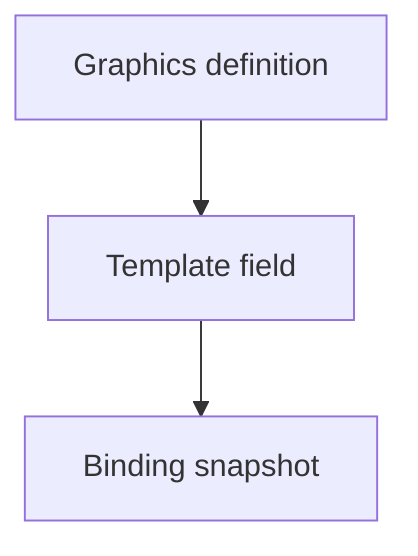

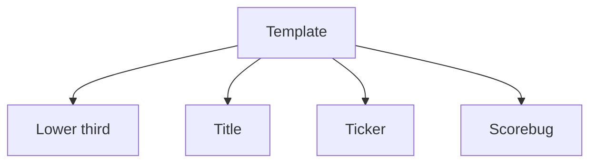

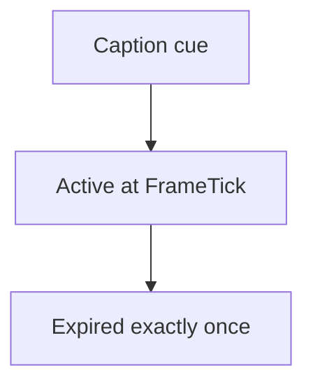

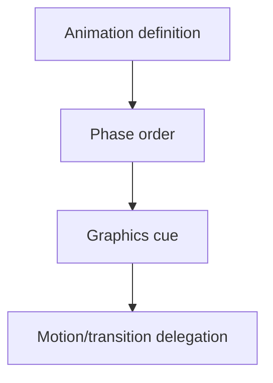

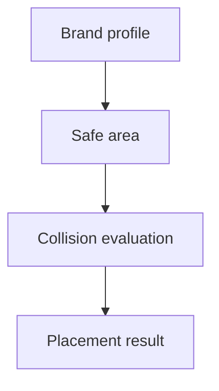

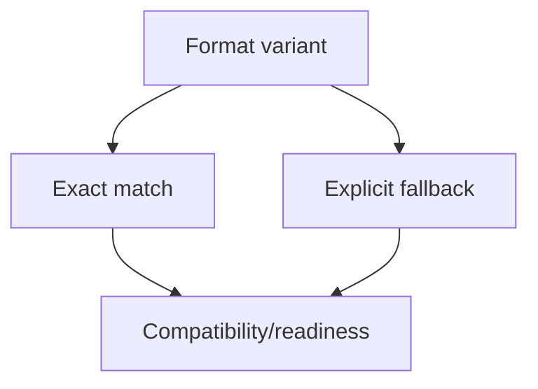

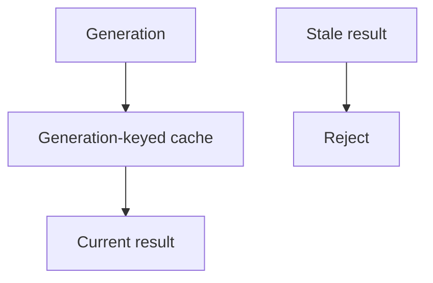

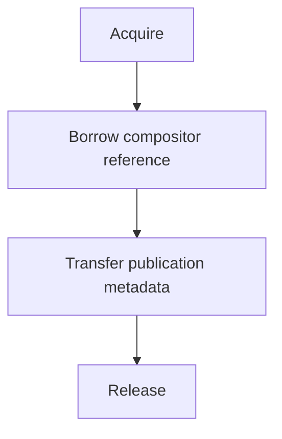

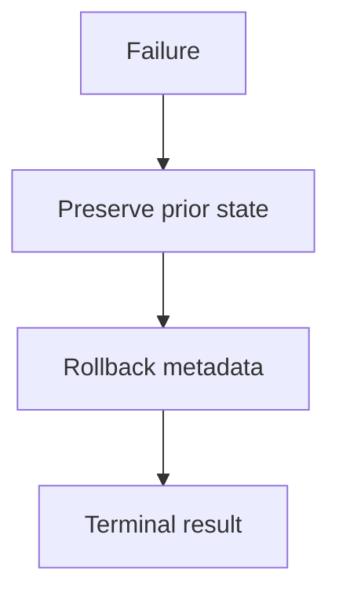

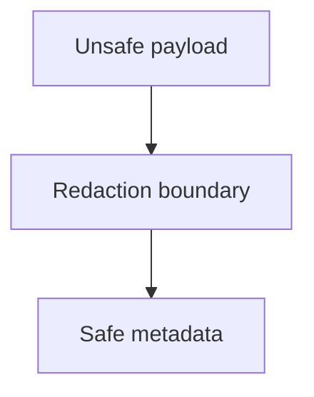

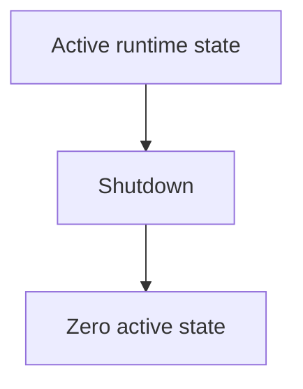

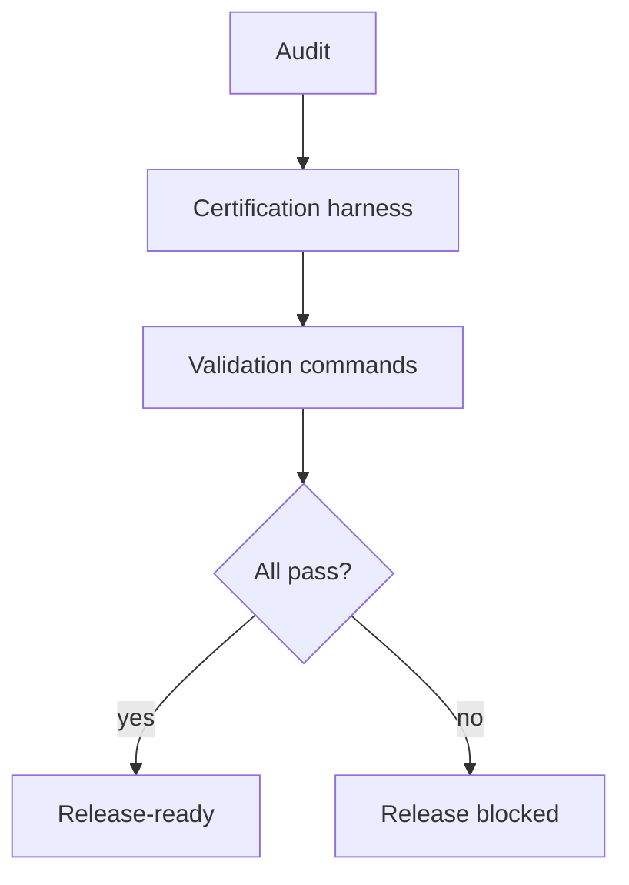

## Release blockers, fixes, limitations, and decision

Release blockers found: missing dedicated v5.9.8 certification harness and missing v5.9.8 package script/test orchestration entry. Fixes applied: added the harness, wired `validate:v5.9.8`, and added the certification to the media-plane test chain. Remaining limitations are intentional: UBOS v5.9 remains metadata-only and does not perform real text rasterization, font shaping, image decoding, browser rendering, responsive layout, resizing, cropping, animation interpolation, watermark embedding, subtitle encoding, speech recognition, translation, AI graphics, or GPU/native graphics rendering.

Final determination: PASS. UBOS v5.9 is ready for release tagging as `v5.9.0` with release title `UBOS v5.9 Graphics, Branding, Captions, and Multi-Format Output Platform`. Do not create the tag during certification. Recommended next task: UBOS v5.10.1 Production-Safe Automation, Rundown, and Show-Control Foundation.
