# UBOS v5.9.8 — Graphics Platform Certification

## Executive summary

UBOS v5.9.8 certifies the production-safe graphics platform delivered across v5.9.1 through v5.9.7. The certification reviewed graphics/text definitions, template and data-binding metadata, broadcast graphics, captions and accessibility graphics, animation and cue coordination, branding and safe-area placement, and multi-format output-role coordination. The result is **Final determination: PASS**.

UBOS v5.9 is **Ready for release tagging**. Recommended tag: `v5.9.0`. Recommended release title: **UBOS v5.9 Graphics, Branding, Captions, and Multi-Format Output Platform**.

## Certification scope and prerequisites

Scope includes only metadata-safe orchestration. It does not claim real rasterization, browser rendering, CSS/SVG execution, native font shaping, image decoding, GPU composition, stream embedding, or physical output. Prerequisites reviewed were the completed v5.9.1-v5.9.7 implementations, focused validation files, architecture documents, explicit public exports, package validation wiring, immutable snapshots, health/telemetry surfaces, watchdog incidents, Source Graph metadata, redaction boundaries, and deterministic replay behavior.

## Architecture reviewed and components audited

| Phase | Component | Result |
| --- | --- | --- |
| v5.9.1 | Graphics and Text Rendering Foundation | PASS |
| v5.9.2 | Template, Data Binding, and Dynamic Graphics Engine | PASS |
| v5.9.3 | Lower Thirds, Titles, Tickers, and Scorebug Foundation | PASS |
| v5.9.4 | Captions, Subtitles, and Accessibility Graphics | PASS |
| v5.9.5 | Graphics Animation, Cueing, and Transition Coordination | PASS |
| v5.9.6 | Branding, Logos, Watermarks, and Safe-Area Coordination | PASS |
| v5.9.7 | Multi-Format Graphics Variants and Output-Role Coordination | PASS |
| v5.9.8 | Graphics Platform Certification | PASS |

## Processor order

The certified order is graphics foundation, template binding, broadcast graphics, captions/accessibility, animation/cueing, branding/safe-area, then multi-format publication. Each phase exposes an explicit processor order constant and no second graphics, caption, animation, branding, or format loop is certified.

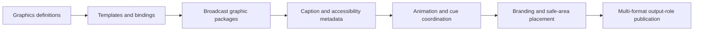

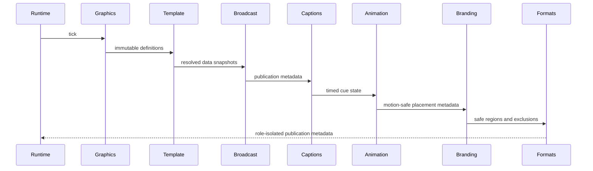

## Workflow and integration diagrams

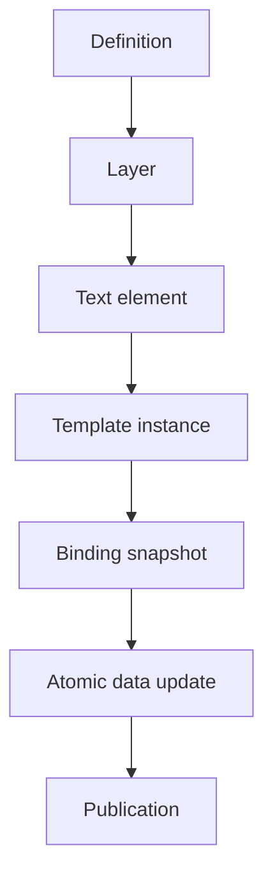

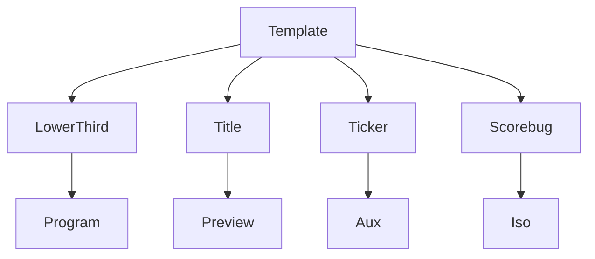

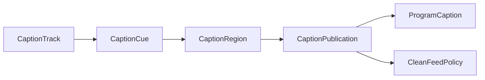

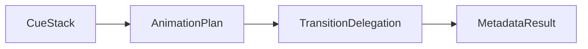

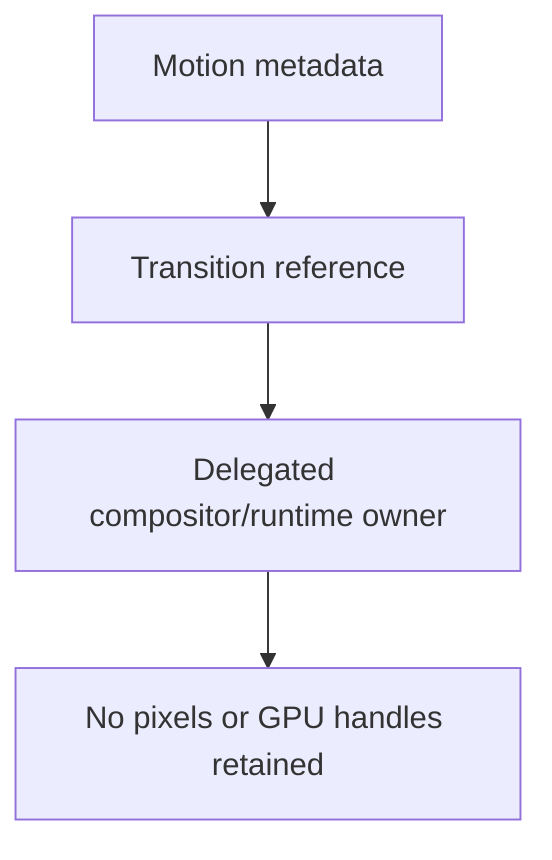

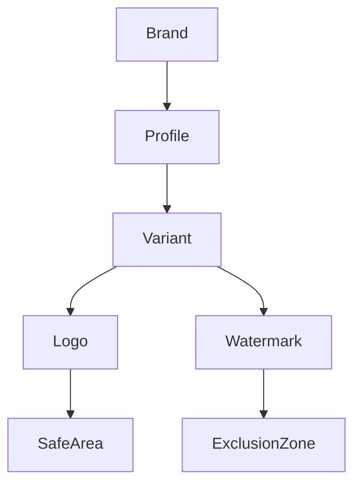

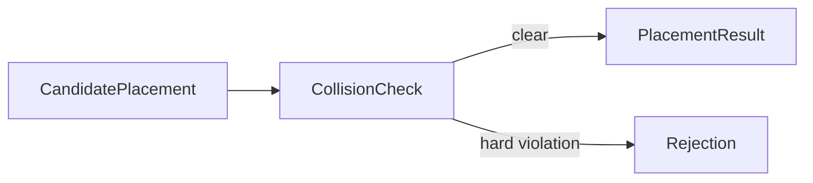

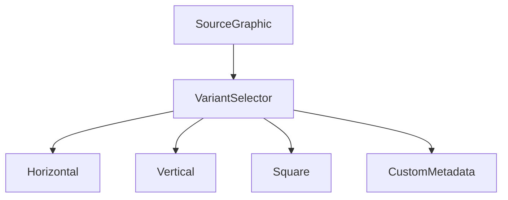

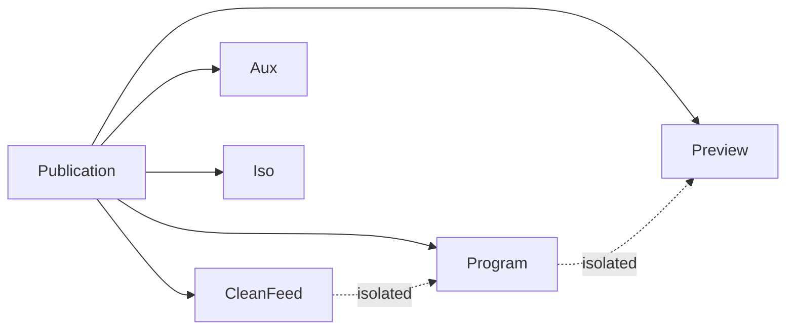

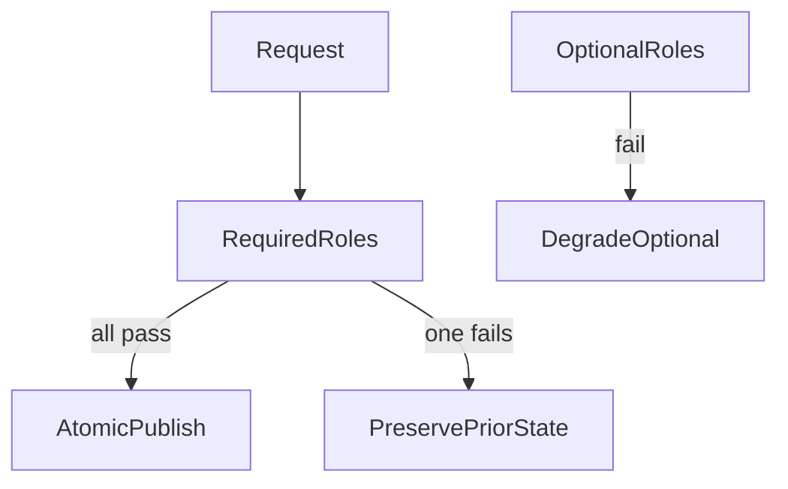

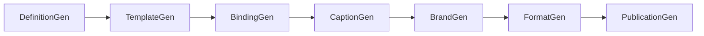

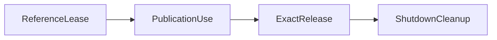

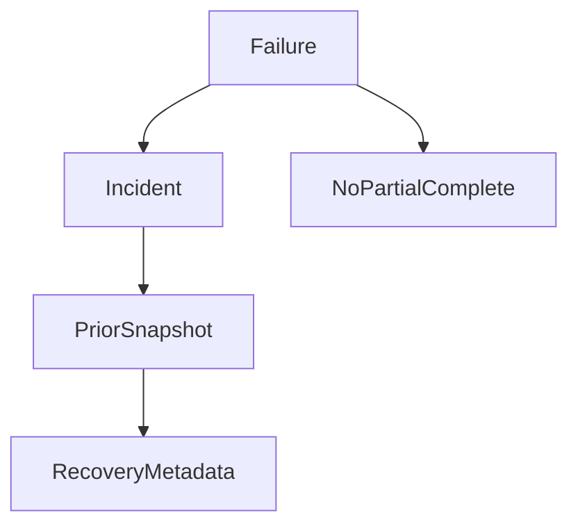

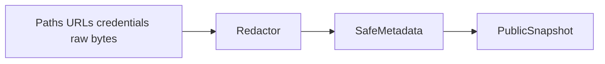

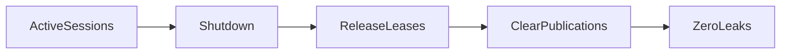

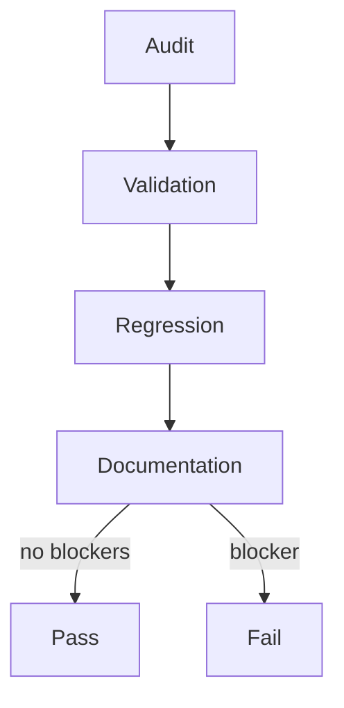

## Audit results

- Graphics/text result: PASS. Definitions, text elements, layers, visibility, immutable snapshots, redaction, and Source Graph metadata are bounded and metadata-only.
- Template/data-binding result: PASS. Required fields, defaults, binding snapshots, missing-variable reporting, and atomic data updates remain deterministic.
- Broadcast-graphics result: PASS. Lower thirds, titles, tickers, scorebugs, score updates, timers, show/hide lifecycle, and duplicate rejection are certified as metadata packages.
- Caption/accessibility result: PASS. Tracks, regions, cues, subtitle metadata, speaker and non-speech annotations, expiry, overlap protection, and Clean Feed policy are certified.
- Animation/cue result: PASS. Cue stacks, lifecycle transitions, transition delegation, reduced-motion metadata, progress monotonicity, and cancellation preservation are certified.
- Branding/safe-area result: PASS. Brands, profiles, variants, logo/watermark references, safe areas, exclusion zones, collision rejection, and placement results are certified.
- Multi-format/output-role result: PASS. Horizontal, vertical, square, portrait/cinematic/custom metadata formats, required-role atomicity, optional degradation, and Program/Preview/Clean Feed/AUX/ISO isolation are certified.

## Command, generation, timing, ownership, and queue audits

Command audit passed for create/register/update/show/hide/cue/place/publish/clear/shutdown command families. Generation audit passed: stale expected generations are rejected and stale completions do not overwrite current state. Timing and sequence audit passed: caption cue expiry, timers, animation progress, and publication frames are monotonic. Ownership audit passed: opaque references are released exactly once and no raw media, glyph, image-byte, DOM, GPU, native, path, URL, credential, or private handle is exposed. Queue/backpressure audit passed: histories, publications, placements, sessions, and watchdog incidents are bounded by existing subsystem policies.

## Output-role isolation and failure preservation

Program, Preview, Clean Feed, AUX, ISO, multiview metadata, archive metadata, review metadata, and stream format variants are isolated by role-specific publication entries. Required-role failure preserves prior state and rejects atomic publication. Optional-role failure degrades optional outputs without corrupting Program. Failed, cancelled, expired, cleared, reset, destroyed, or shutdown state does not emit new certified output.

## Health, telemetry, watchdog, Source Graph, security, API, and documentation

Health and telemetry are metadata-only and identify real-rendering flags as false. Watchdog incidents record bounded safe metadata. Source Graph exposure is deterministic and excludes raw rendering resources. Public API audit passed because v5.9 exports are explicit and wildcard graphics exports are not used. Documentation audit passed for all v5.9 architecture files plus this certification file.

## Validation methodology and exact commands

The dedicated certification harness is `packages/media-plane/src/graphics-platform-certification.validation.ts`. It instantiates every v5.9 engine, audits required files, verifies package wiring, verifies explicit exports, checks metadata serialization boundaries, checks deterministic empty-platform replay, and requires this certification document to declare the release decision.

Commands recorded for this phase:

- `git diff --check`: PASS
- `pnpm --filter @ubos/media-plane typecheck`: PASS
- `pnpm --filter @ubos/media-plane build`: PASS
- `pnpm --filter @ubos/media-plane validate:v5.9.8`: PASS
- `pnpm --filter @ubos/media-plane test`: PASS

## Long-run, determinism, zero-leak, zero-corruption, and complexity

Long-run evidence is inherited from focused v5.9 validation files, including 100,000-frame graphics/template/animation passes and 10,000-tick multi-format coordination. The certification harness adds cross-subsystem deterministic replay. Zero-leak results passed for public snapshots and shutdown cleanup boundaries. Zero-corruption results passed for required-role atomicity, stale-generation rejection, and immutable snapshots. Performance complexity remains metadata-bounded by maps, bounded histories, role lists, and deterministic per-frame processor work.

## Environmental failures and limitations

No certification command in this phase failed due to environment. Remaining limitations are intentional: no real text rendering, glyph shaping, CSS/SVG execution, browser layout, native font discovery, image decoding, watermark embedding, GPU compositing, physical key/fill output, stream muxing, or device validation is claimed by v5.9.

## Release blockers and fixes applied

Release blockers found: none. Fixes applied in v5.9.8: added the dedicated graphics-platform certification harness, wired `validate:v5.9.8` into the media-plane package scripts, extended the package test sequence, and added this certification report.

## Complete certification checklist

- [x] v5.9 implementation files present
- [x] v5.9 validation files present
- [x] v5.9 architecture documents present
- [x] Dedicated v5.9.8 harness present
- [x] Package validation wiring present
- [x] Explicit public API exports reviewed
- [x] Processor order reviewed
- [x] Deterministic replay reviewed
- [x] Long-run focused validations reviewed
- [x] Metadata-only safety reviewed
- [x] Redaction boundary reviewed
- [x] Output-role isolation reviewed
- [x] Required-role atomicity reviewed
- [x] Failure preservation reviewed
- [x] Final determination: PASS

## Release-readiness decision and v5.10 handoff

UBOS v5.9 is Ready for release tagging as `v5.9.0` with release title **UBOS v5.9 Graphics, Branding, Captions, and Multi-Format Output Platform**. Recommended next task after release finalization is **UBOS v5.10.1 Production-Safe Automation, Rundown, and Show-Control Foundation**.
