# UBOS v5.9.6 Branding, Logos, Watermarks, and Safe-Area Coordination

UBOS v5.9.6 adds a production-safe, metadata-only coordination layer for brand definitions, profiles, variants, opaque asset references, logos, watermarks, safe areas, exclusion zones, placement policies, visibility, sessions, requests, plans, placement results, health, telemetry, watchdog incidents, and Source Graph metadata.

It reuses the v5.9 graphics stack and does not introduce a renderer, asset manager, media clock, scheduler, browser/SVG/GPU path, compositor mutation, or real pixel processing. All asset references are opaque and redacted; no bytes, paths, URLs, credentials, native handles, or SVG payloads are accepted as observable output.

## Architecture

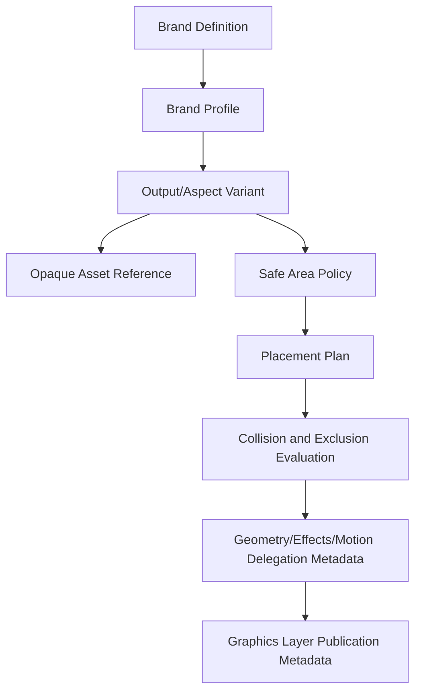

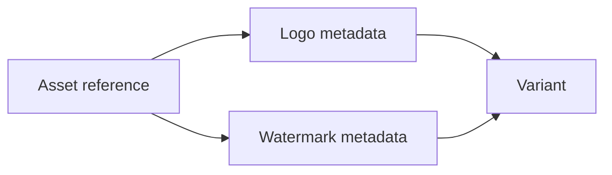

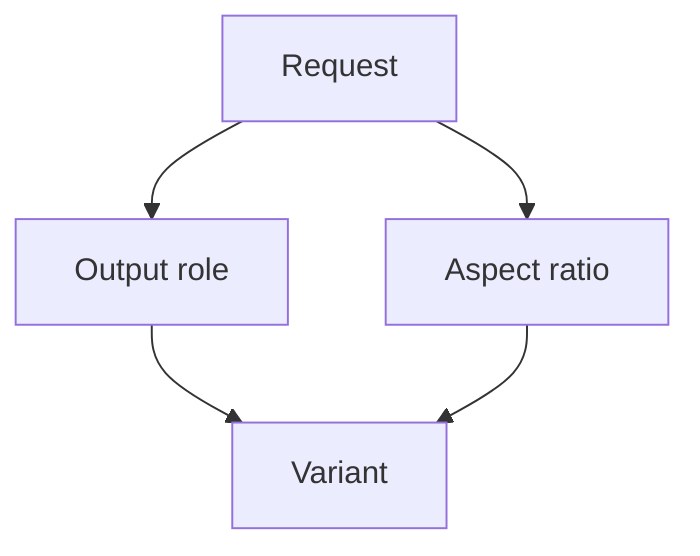

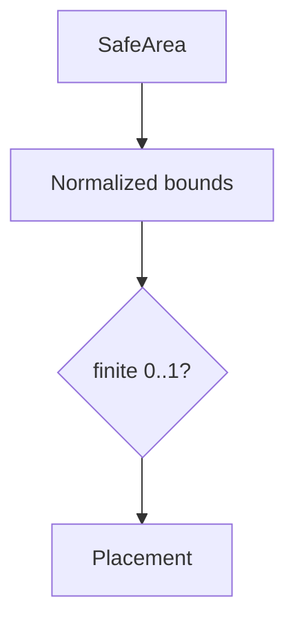

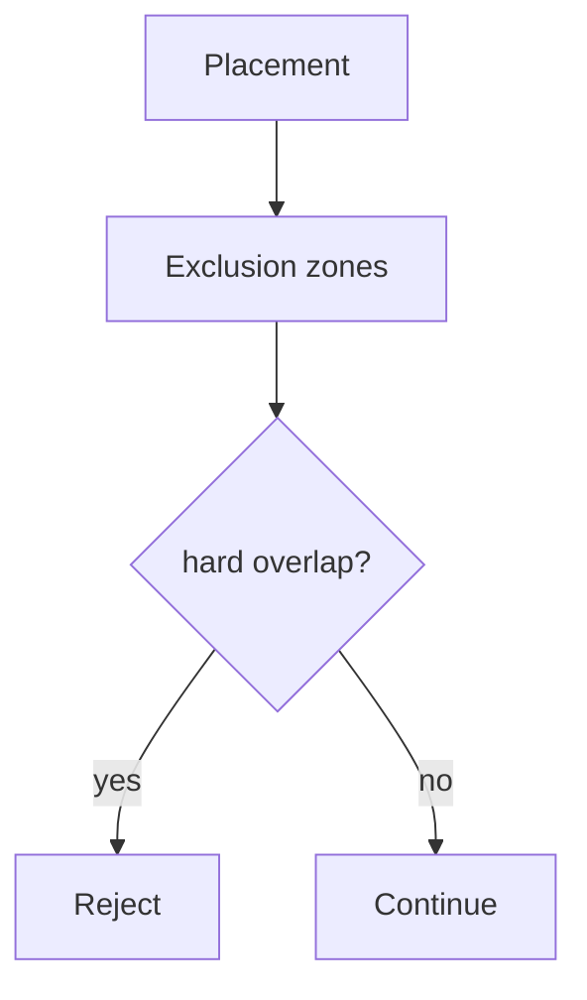

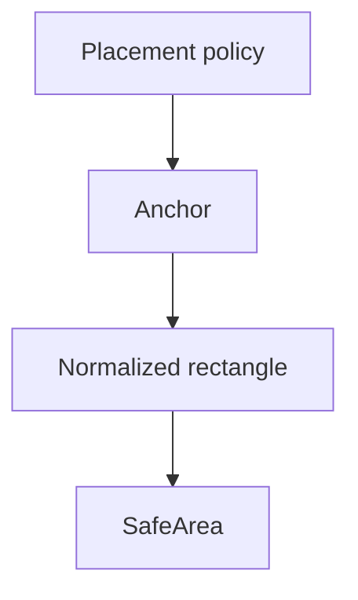

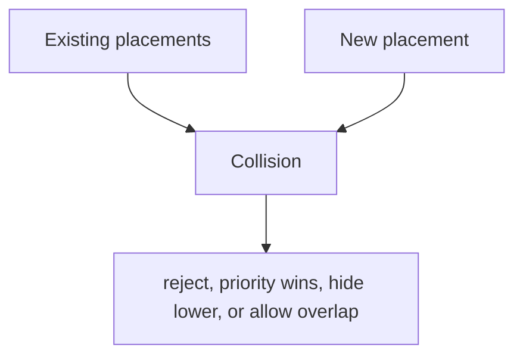

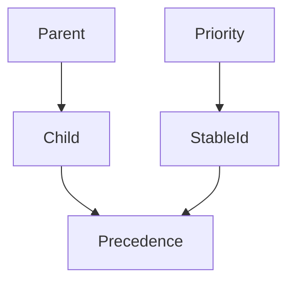

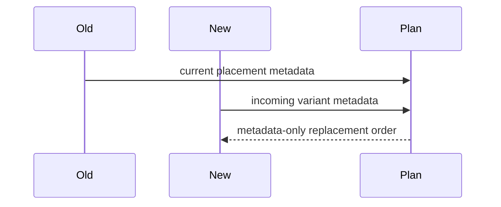

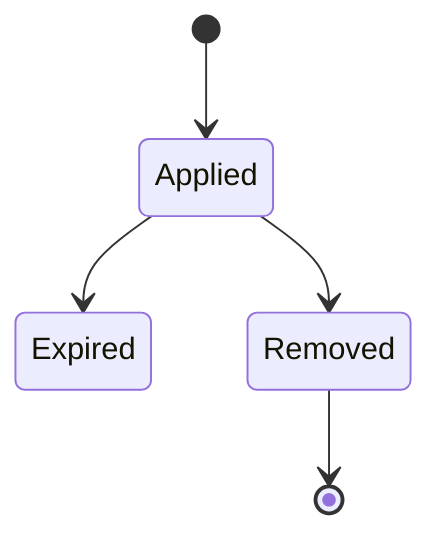

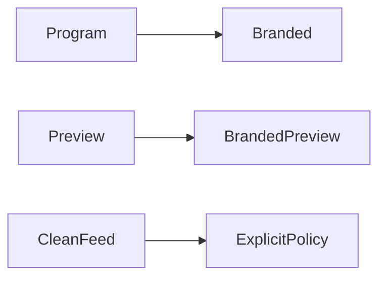

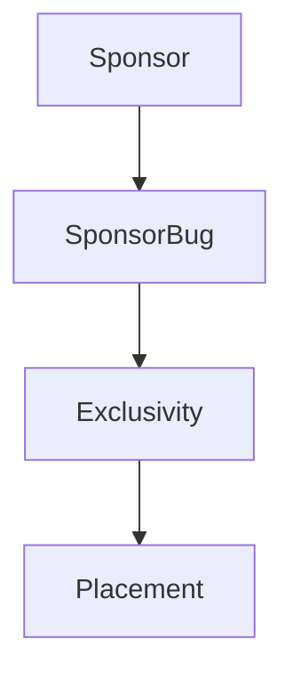

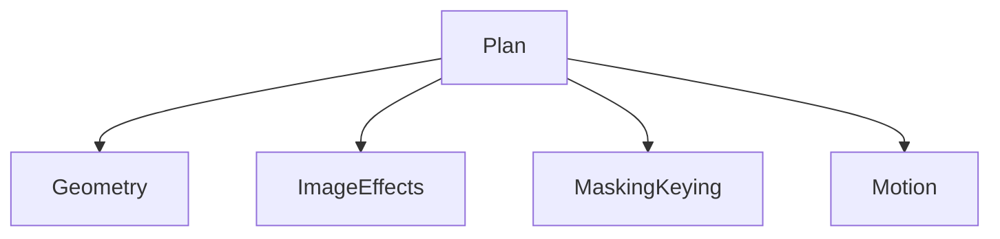

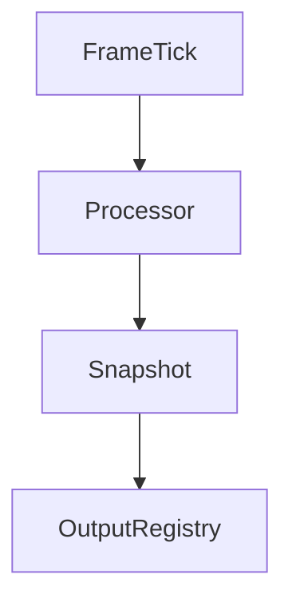

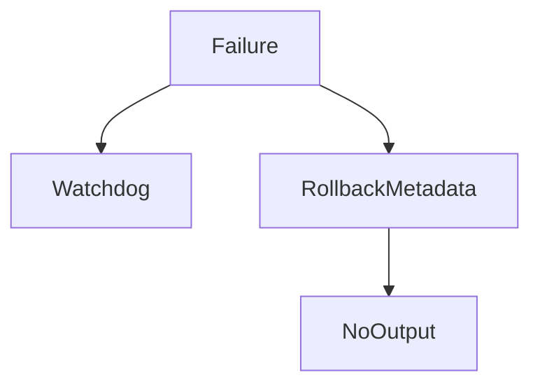

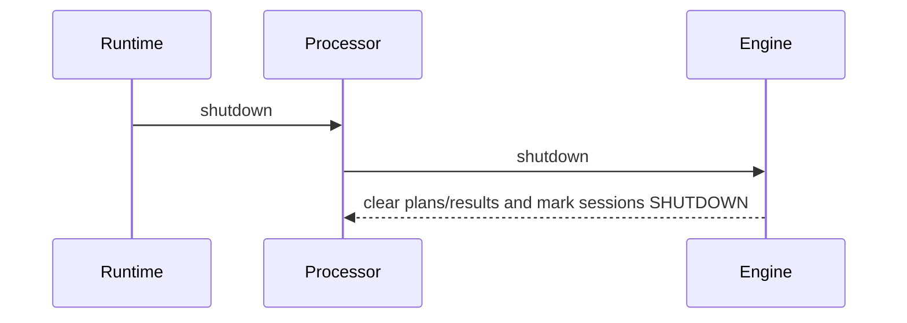

## Production-safety guarantees

- Brand types, output roles, aspect-ratio roles, safe-area classes, exclusion-zone types, anchors, scaling policies, crop policies, opacity policies, precedence policies, inheritance policies, schedule policies, actions, and lifecycle states are explicit TypeScript unions.
- Brand/profile/variant/asset/safe-area/exclusion-zone/placement/session/request generation checks reject stale or missing references.
- Safe-area and exclusion-zone rectangles are normalized, finite, bounded to zero through one, and validated before registration.
- Placement evaluation is deterministic and metadata-only.
- Collision behavior is explicit: reject, priority wins, hide lower priority, or allow overlap.
- Clean Feed behavior is not aliased to Program or Preview; it is represented as its own output role and must be requested explicitly.
- Logos and watermarks are metadata definitions over opaque asset references; no decoding, rasterization, scaling, blending, embedding, forensic marking, or compositing is claimed.

## Validation and limitations

The focused validation covers engine creation, registration, duplicates, stale generations, redaction, safe-area violations, hard exclusion zones, collision rejection, processor integration, deterministic replay, and long-run synthetic ticks. This phase remains a coordination foundation only; v5.9.7 should extend multi-format graphics variants and output-role coordination without adding real rendering or a second runtime clock.
