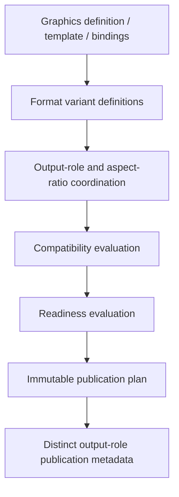
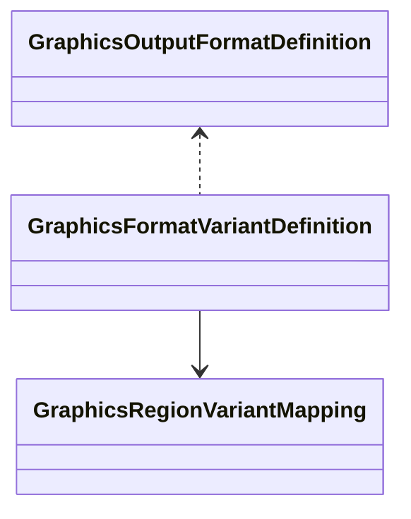
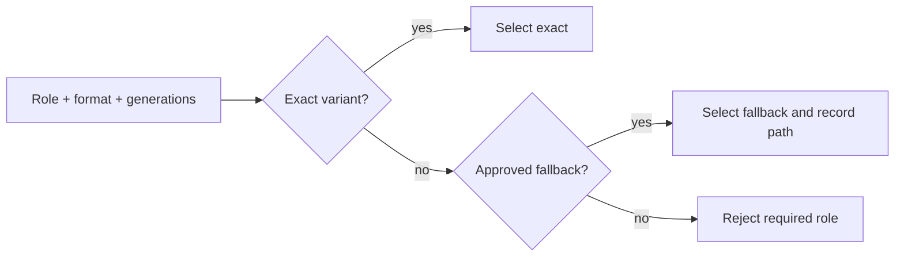
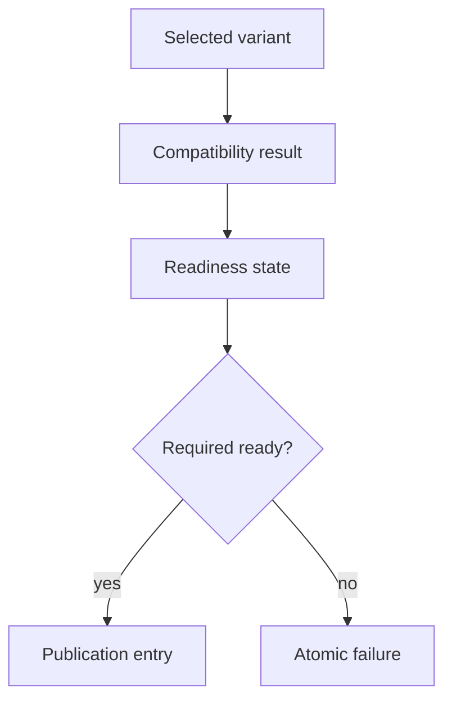
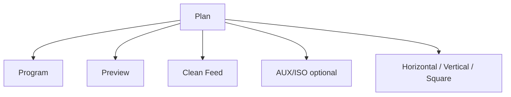
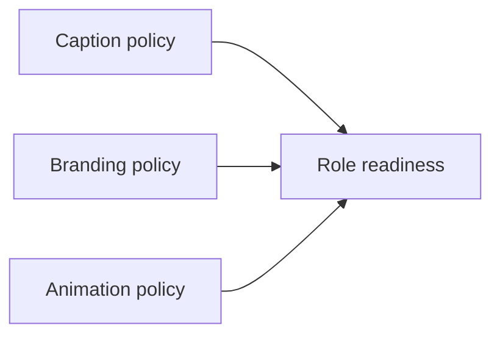
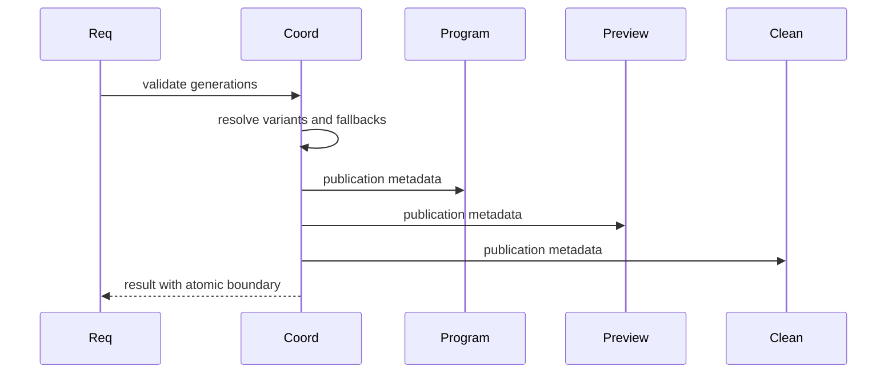
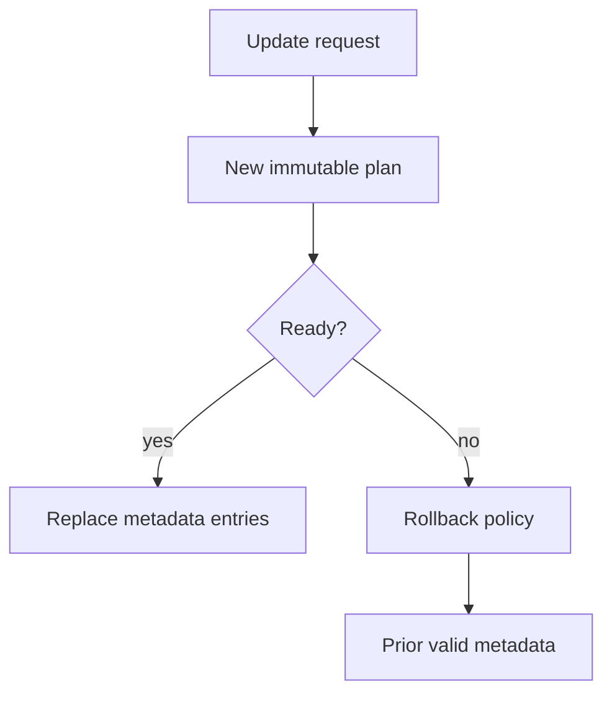
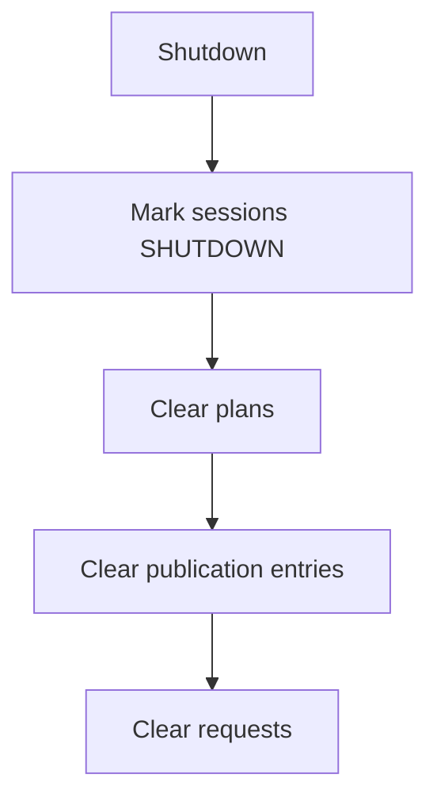
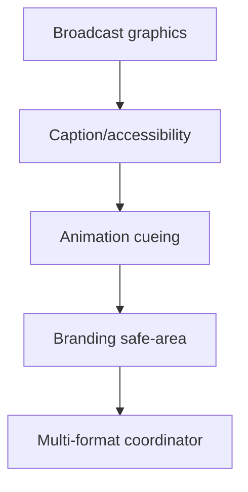

# UBOS v5.9.7 Multi-Format Graphics Output-Role Coordination

UBOS v5.9.7 adds a metadata-only coordinator for production-safe graphics variants across output roles and formats. It reuses the runtime FrameTick processor model, graphics foundations, template/data-binding, caption/accessibility graphics, animation cueing, and branding/safe-area coordination. It does not render, resize, crop, reflow, rasterize, composite, publish to platforms, or allocate canvases.

## Format and variant model

Formats are immutable `GraphicsOutputFormatDefinition` records with explicit type, dimensions, orientation, normalized safe canvas, supported output roles, generation, and redacted metadata. Supported types include horizontal 16:9, vertical 9:16, square 1:1, portrait metadata, cinematic metadata, standard 4:3 metadata, source-native, and custom typed formats.

Variants are immutable `GraphicsFormatVariantDefinition` records tied to source graphics generation, target format generation, target output role, variant class, policies, mappings, fallback policy, priority, and generation. Unsupported variants cannot be activated.

## Exact-variant and fallback resolution

Resolution is deterministic: exact enabled variants sort ahead of metadata variants, then by priority and ID. If no exact variant exists, explicit fallback policies may select a safe metadata fallback. Required roles reject missing variants.

## Compatibility and readiness

Compatibility checks canvas/format, aspect-ratio metadata, region mappings, typography/field/asset/caption/branding/animation metadata, safe area, and collisions. Readiness keeps template, binding, field, asset, caption, branding, animation, safe-area, collision, and output-layer dependencies explicit.

## Output-role isolation

Program, Preview, Clean Feed, AUX, ISO, Multiview metadata, horizontal, vertical, square, archive, and review metadata use distinct publication-entry identities. Optional-role degradation cannot mutate Program state.

## Caption, branding, and animation variants

Caption variant policies reference authoritative caption timing. Branding variant policies reference v5.9.6 brand/safe-area outcomes. Animation variant policies reference v5.9.5 motion/timeline metadata. No cue duration, logo, text, or animation is modified directly.

## Atomic multi-output publication

A coordination request creates exactly one immutable plan and one authoritative result. Required roles can be atomic while optional roles degrade according to policy.

## Updates, replacement, rollback, ownership, and shutdown

Update, replace, rollback, and clear actions use the same request path so stale generations and duplicate requests are rejected consistently. Ownership is metadata-borrowed and released by shutdown; shutdown clears active requests, plans, and publications.

## Processor order, commands, events, health, telemetry, watchdog, Source Graph

The `MultiFormatGraphicsCoordinatorProcessor` runs after branding/safe-area, graphics animation, caption/accessibility, and broadcast graphics processors. Commands register definitions and coordinate requests. Snapshots expose health, telemetry, watchdog incidents, and Source Graph metadata with redaction.

## Security, production safety, invariants, validation, and performance

Snapshots are deeply immutable, JSON-safe, bounded, sorted, and sanitized. Public capability flags state that real rendering, responsive layout, resizing, cropping, and compositing are false. Invariants verify unique IDs, monotonic generations, valid regions, disjoint roles, unique publication identities, and clean shutdown. Validation covers deterministic replay and a 10,000-tick synthetic long run. Registry and exact lookups are bounded; publication ordering is deterministic by role and format.

## Limitations and v5.9.8 handoff

This phase is a synthetic coordination layer only. UBOS v5.9.8 should certify the complete graphics platform across v5.9.1 through v5.9.7 without adding rendering or platform publication behavior.
