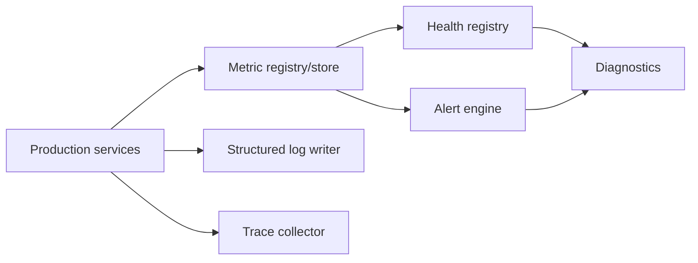

# UBOS v5.11.1 Observability Architecture

UBOS v5.11.1 adds the metadata-only core observability foundation owned by `@ubos/core`.

## Production safety

- Telemetry is metadata-only and does not own media frames, device handles, credentials, queues, or live output state.
- Metric labels are allow-listed to prevent unbounded cardinality and label injection.
- Logs, traces, telemetry attributes, and operator notes are redacted before storage.
- Metric, log, and sample buffers are bounded so observability pressure cannot grow without limit.
- Unknown or low-confidence health is represented as `Unknown`, never `Healthy`.
- Alerts provide deterministic threshold evaluation, required-duration handling, acknowledgement, suppression support, and runbook-oriented guidance.
- Diagnostics correlate health and alert evidence without executing production actions.
