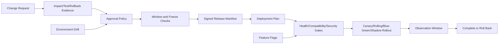

# UBOS v5.11.5 Change Management, Release Governance, Feature Flags, and Deployment Control

## Ownership

`@ubos/core/change-management` owns metadata-only change governance. It does not deploy media workloads directly and never runs on media-processing threads. It coordinates requests, approvals, manifests, deployment plans, rollout progress, rollback evidence, feature flags, freezes, promotions, migrations, and drift findings as immutable snapshots.

## Architecture

## Generation and Lifecycle

Change requests reject stale generations. Lifecycle transitions are explicit: draft, submitted, assessing, testing, awaiting approval, approved, scheduled, deploying, validating, monitoring, completed, failed, rolling back, rolled back, rejected, or cancelled.

## Safety Invariants

- Unknown compatibility is unsafe.
- Unsigned or unhashed manifests cannot become releases.
- High-risk and critical changes can require impact, test, rollback, and dual approval evidence.
- Self-approval can be prohibited by policy.
- Deployment windows and active freezes block unsafe production timing.
- Deployment gates must pass before rollout execution.
- Observation windows must elapse before completion.
- Feature flags require ownership, deterministic local evaluation, audit history, and safe fallback.
- Rollback plans include trigger conditions, compatible versions, and validation checks.

## Integrations

The engine reuses `@ubos/core` redaction, health status, and alert severity abstractions from observability. Deployment failures and change risks can be mapped into incident response through sanitized event/audit streams. Analytics can consume audit counts for deployment success rate, rollback rate, emergency change rate, stale flags, and drift.

## Security and Redaction

Requester, approver, owner, reason, and component metadata fields pass through the existing observability redactor. Snapshots expose only metadata and do not include credentials, private paths, raw handles, or media data.

## Validation

Focused validation is wired as `pnpm --filter @ubos/core validate:v5.11.5` and covers risk scoring, approval policy enforcement, self-approval rejection, test/rollback/impact prerequisites, deployment windows, change freezes, manifest integrity, signature checks, compatibility, canary rollout, observation windows, feature-flag targeting, kill-switch fallback, promotion validation, migration registration, drift detection, audit coverage, and long-run deterministic flag evaluation.

## Known Limitations

This phase is a core governance foundation. It records and validates deployment intent, evidence, and rollout state; concrete infrastructure adapters, UI dashboards, external signature verification providers, and incident-ticket creation adapters are intentionally left to later integration phases.
