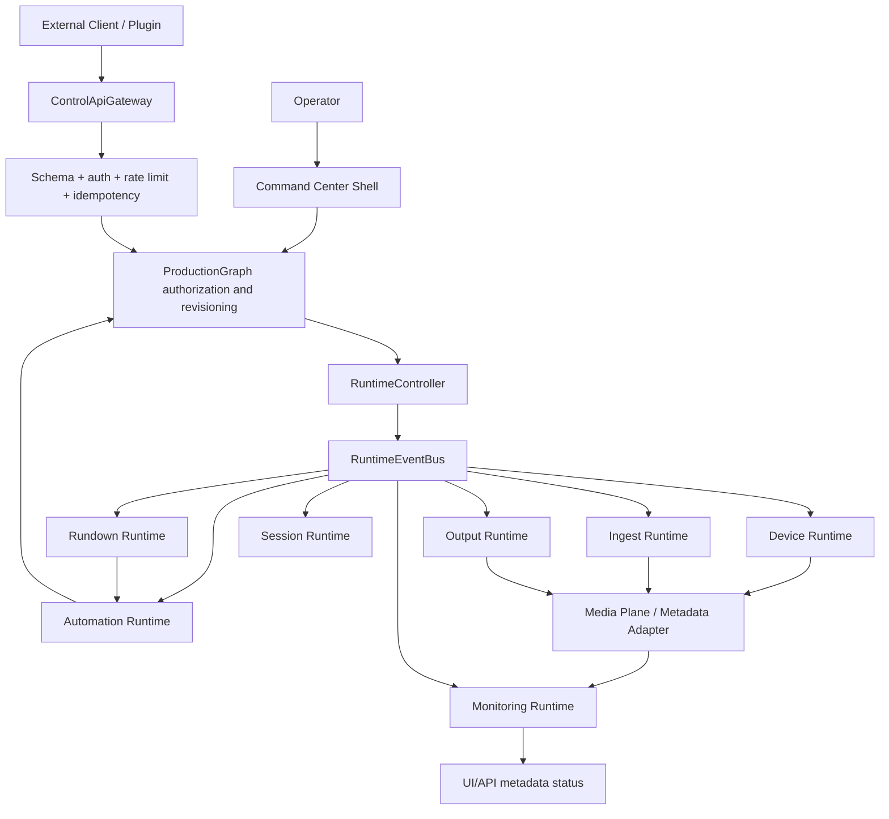

# UBOS v4.11 Active Dependency Graph

## Verification

| Rule | Result | Evidence / note |
|---|---|---|
| No circular runtime dependencies | PASS | RuntimeController performs DAG validation and throws on cycles. |
| No runtime-to-UI dependency | PASS | Media-plane runtime search did not identify React/Next imports in frozen runtime core. |
| No Media Plane-to-UI dependency | PASS | Media-plane packages expose runtime metadata, not app routes/components. |
| No plugin-to-internal-object dependency | PASS | Plugin SDK exposes metadata gateway/manifest contracts, not DOM/media/process handles. |
| No direct subsystem lifecycle control | PASS WITH WARNING | Central RuntimeController exists; targeted search found lifecycle calls mostly inside runtime implementations/tests. |
| No ProductionGraph bypass for production-changing commands | PASS | Control API command definitions support ProductionGraph authorization and stale revision rejection. |

## Complexity risks

- Core `RuntimeEventBus.replay()` is unbounded in memory; external Control API subscription history is bounded separately.
- Some runnable web routes under `/control-room/*` are diagnostics/runtime pages. They are not alternate full Control Room shells but must remain read/control panels rather than ownership points.

## Evidence Reviewed

- Runtime core and integration: `packages/media-plane/src/broadcast-runtime-core.ts`.
- Production authority: `packages/shared/src/production-graph.ts`, `packages/shared/src/authority.ts`, `packages/shared/src/production-graph.validation.ts`.
- Control API: `packages/shared/src/control-api/index.ts`, `packages/shared/src/control-api/validation.ts`, `docs/api/*`.
- Plugin SDK and extension registry: `packages/shared/src/plugin-sdk/index.ts`, `packages/shared/src/plugin-sdk/validation.ts`, `docs/sdk/*`, `examples/plugins/lower-third-demo/ubos.plugin.json`.
- Domain runtimes: `packages/shared/src/*runtime*/`, `packages/media-plane/src/*runtime*`, and `docs/runtime/*`.
- UI freeze checks: `apps/web/app/control-room/*`, `packages/shared/src/workspace-manager/*`.
- Targeted searches captured raw-handle, direct-mutation, lifecycle, plugin-safety, boundedness, duplicate-owner, and shell-path evidence.
