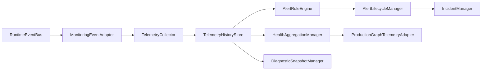

# Alert Rule Engine

UBOS v4.9 introduces a metadata-only Monitoring Runtime owned by `MonitoringRuntimeController`. It observes existing runtime events and subsystem metadata without changing media processing, UI behavior, ProductionGraph switching, or RuntimeEventBus delivery semantics.

## Architecture diagram

## Ownership boundaries

- Existing subsystems remain authoritative for their own health and metrics.
- `TelemetryRegistry` is authoritative for telemetry source metadata.
- Monitoring stores serializable metadata only and rejects fabricated unavailable values.
- ProductionGraph receives summary metadata only; no telemetry history is stored there.

## Lifecycle

Initialize creates registries and adapters, start subscribes to the event bus, pause/resume preserve alert state, stop removes subscriptions, and dispose clears runtime-only state.

## Telemetry contract examples

A telemetry sample includes `sampleId`, `timestamp`, `sourceId`, `sourceType`, `metricName`, `metricKind`, `status`, `severity`, dimensions, correlation IDs, availability, confidence, collection method, expiry, and `metadataVersion`.

## Aggregation rules

Health aggregation orders critical, error, degraded, warning, informational, and healthy. Offline, unavailable, stale, and unknown remain visible but do not automatically become errors.

## Alert state machine

Alerts move only through legal transitions among inactive, pending, firing, acknowledged, suppressed, resolved, expired, and cancelled. Duplicate alert storms are prevented with deduplication keys, debounce, cooldown, and suppression windows.

## Incident state machine

Incidents move through open, acknowledged, investigating, mitigated, resolved, and closed. Incidents group related alerts by source or correlation metadata and never make production changes.

## Deduplication strategy

Alert deduplication uses rule ID, source ID, metric name, and correlation ID. Cooldown windows suppress repeated firing for the same key.

## Recursion prevention

Monitoring events are marked as monitoring events and are not re-ingested unless explicitly flagged safe for re-ingest.

## Retention model

Telemetry history is bounded by max sample count and retention milliseconds with latest-sample indexes for efficient queries.

## Known limitations and future storage adapters

External observability vendors, OpenTelemetry, Prometheus, paging, AI anomaly detection, and long-term warehouses are deferred to later milestones. The in-memory store is intentionally abstracted for future backends.
