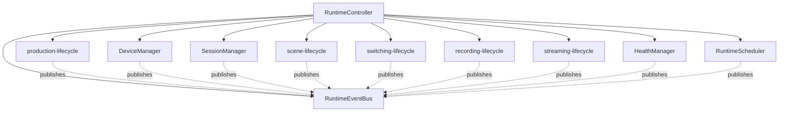

# UBOS v4.1 Broadcast Runtime Core Certification

**Certification date:** 2026-07-10  
**Scope:** Verification of `packages/media-plane/src/broadcast-runtime-core.ts`, exports, validation coverage, and `docs/runtime/Broadcast_Runtime_Architecture.md`.  
**Decision:** 🟡 Certified with Minor Issues

This certification is verification-only. No runtime feature changes or UI redesign were performed.

## Architecture Diagram



## Ownership Graph

Verified from implementation:

- `RuntimeController` owns the lifecycle state, revision counter, runtime bus reference, scheduler, session manager, device manager, health manager, and subsystem registry.
- The controller constructs the default subsystem set: production, device, session, scene, switching, recording, streaming, health, and scheduler lifecycles.
- `RuntimeController.register()` rejects duplicate subsystem IDs and publishes registration through the event bus.
- `createBroadcastRuntimeCore()` returns a new `RuntimeController`, making the controller the root ownership object.

**Result:** Pass.

## Event Bus Verification

Verified from implementation and dependency audit:

- `RuntimeEventBus.publish()` assigns monotonic sequence numbers, timestamps, immutable event IDs, and stores replayable events.
- `RuntimeStateMachine.transition()` publishes each subsystem lifecycle transition to the bus.
- `RuntimeController.run()` publishes scheduled and completed controller events to the bus.
- No direct subsystem-to-subsystem references were found. `SessionManager`, `DeviceManager`, `HealthManager`, and `RuntimeScheduler` extend `RuntimeStateMachine` and receive only the bus reference.
- `broadcast-runtime-core.ts` has no imports, so no external subsystem dependency is introduced by the core.

**Direct coupling violations:** None found.

**Result:** Pass.

## State Machine Verification

Verified lifecycle API:

- `RuntimeSubsystem` requires `initialize()`, `start()`, `pause()`, `resume()`, `stop()`, `dispose()`, and `getSnapshot()`.
- `RuntimeStateMachine` implements every required lifecycle method.
- `RuntimeScheduler`, `SessionManager`, `DeviceManager`, and `HealthManager` inherit the complete lifecycle API.
- `RuntimeController` exposes the same lifecycle commands and applies them deterministically to all registered subsystems.

Verified transition table:

| Command | Allowed From | Target |
| --- | --- | --- |
| initialize | uninitialized, stopped, disposed, failed | initialized |
| start | initialized, stopped, paused | running |
| pause | running | paused |
| resume | paused | running |
| stop | running, paused, initialized, failed | stopped |
| dispose | initialized, stopped, failed, uninitialized | disposed |

Illegal transitions are rejected by `assertTransition()`, which throws synchronously when a command is not permitted from the current state.

**Result:** Pass.

## Dependency Audit

Commands used:

```bash
rg '^import ' packages/media-plane/src/broadcast-runtime-core.ts
rg 'React|next|Next|CommandCenterShell|Workspace Manager|WorkspaceManager|SceneWorkspace|Control Room|ControlRoom|ProductionGraph|Program|Preview|Audio|Graphics|Replay|Recording|Streaming|Automation' packages/media-plane/src/broadcast-runtime-core.ts docs/runtime/Broadcast_Runtime_Architecture.md
rg "broadcast-runtime-core|createBroadcastRuntimeCore|RuntimeController|RuntimeEventBus" packages/media-plane/src -g '*.ts'
```

Findings:

- No imports exist in `broadcast-runtime-core.ts`.
- Runtime core references are limited to the implementation file, package exports, and validation coverage.
- Forbidden UI terms appear only in the architecture document as explicit negative constraints, not in runtime code.
- No circular source-level dependency was found for the runtime core because the core imports nothing.

**Result:** Pass.

## UI Independence Audit

Verified that runtime core imports none of the following:

- React
- Next.js
- CommandCenterShell
- Workspace Manager
- SceneWorkspace
- Control Room UI

No UI package, component, shell, workspace, route, or layout import exists in the runtime core.

**Result:** Pass.

## Production Safety

Verified that `broadcast-runtime-core.ts` does not import, reference, mutate, or call:

- `ProductionGraph`
- Workspace Manager
- Command Center
- Program
- Preview
- Audio
- Graphics
- Replay
- Recording pipelines
- Streaming pipelines
- Automation systems

The runtime core models recording and streaming lifecycle domains only as metadata state machines; it does not call existing recording or streaming runtime systems.

**Result:** Pass.

## Thread Safety

Verified characteristics:

- No circular dependencies: runtime core has no imports.
- No recursive event loops: `RuntimeEventBus.publish()` notifies listeners but does not republish internally.
- No event storms in built-in lifecycle path: controller emits one scheduled event, each subsystem emits one lifecycle event, then controller emits one completed event per command.
- No synchronous deadlocks: no locks, waits, promises, blocking IO, or cross-thread primitives are used.

Caveat: external subscribers registered via `RuntimeEventBus.subscribe()` run synchronously. This is acceptable for the current core but should remain documented as an integration constraint for future subscribers.

**Result:** Pass with integration caveat.

## Documentation Verification

Reviewed `docs/runtime/Broadcast_Runtime_Architecture.md` against implementation:

- Ownership description matches `RuntimeController` construction of lifecycle managers and subsystem state machines.
- Event bus contract matches transition publication through `RuntimeEventBus`.
- Required lifecycle API matches `RuntimeSubsystem` and `RuntimeStateMachine`.
- Transition table matches implementation.
- UI independence statement matches dependency audit.

**Result:** Pass.

## Test Coverage

Existing validation in `packages/media-plane/src/media-plane.validation.ts` covers:

- Lifecycle: initialize, start, pause, resume, stop.
- Event bus: monotonic sequence ordering.
- State propagation: every default subsystem reaches stopped state after controller stop.
- Metadata-only snapshot safety: `containsRuntimeHandles === false`.

Coverage gaps identified:

- Scheduler behavior is covered indirectly by controller execution, but there is no dedicated assertion for `RuntimeScheduler.schedule()`, `drain()`, or queue depth.
- Device manager and session manager lifecycle are covered through default subsystem propagation, but there are no dedicated manager-specific assertions.
- Health manager events are emitted through lifecycle propagation, but no test asserts a health-domain event exists in bus replay.
- Illegal transition rejection is implemented but not directly asserted in validation.
- Device registration / duplicate registration rejection is implemented by `RuntimeController.register()` but not directly asserted in validation.

**Result:** Minor test coverage issues only. No architecture defect found.

## Known Issues

1. **Minor test coverage gaps:** Dedicated tests should be added later for scheduler queue behavior, illegal transition rejection, duplicate registration rejection, and health-domain event replay. This is not an architecture blocker because the implementation contains the required mechanisms and existing validation covers the primary lifecycle path.
2. **Synchronous subscriber caveat:** Event bus subscribers execute synchronously. No recursive loop exists in the core, but future integrations should avoid republishing recursively from subscribers without guards.

## Recommendation

🟡 **Certified with Minor Issues**

The UBOS v4.1 Broadcast Runtime Core satisfies the requested architecture boundaries: centralized controller ownership, event-bus-only subsystem communication, deterministic lifecycle state machines, UI independence, production safety, and no direct mutation of protected runtime systems. Minor follow-up work is recommended for more granular validation coverage, but architecture changes are not required.
