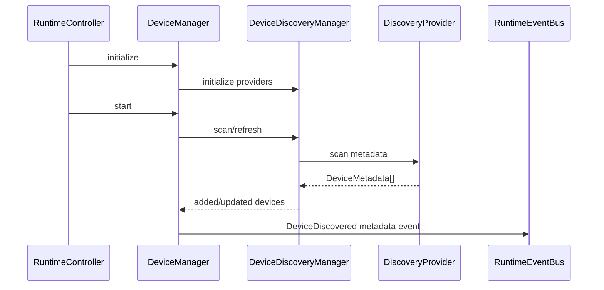

# Device Discovery

Providers are pluggable: browser media devices, screen capture, network sources, native desktop placeholder, capture-card placeholder, and PTZ placeholder. Browser discovery may use `mediaDevices.enumerateDevices()` in host integrations, but must not request camera or microphone access merely to populate the registry.

Provider unavailable states are explicit and do not claim native support.
