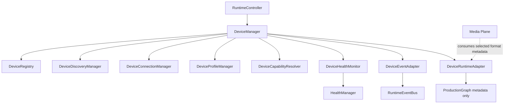

# UBOS v4.3 Device & Hardware Architecture

UBOS v4.3 adds a metadata-only hardware abstraction layer. DeviceManager remains the sole lifecycle coordinator; the Media Plane owns processing; ProductionGraph receives serializable device metadata only.

No runtime handles may be persisted or serialized: MediaStream, MediaStreamTrack, USBDevice, HIDDevice, SerialPort, RTCPeerConnection, AudioContext, native handles, FFmpeg process handles, sockets, or DOM nodes.
