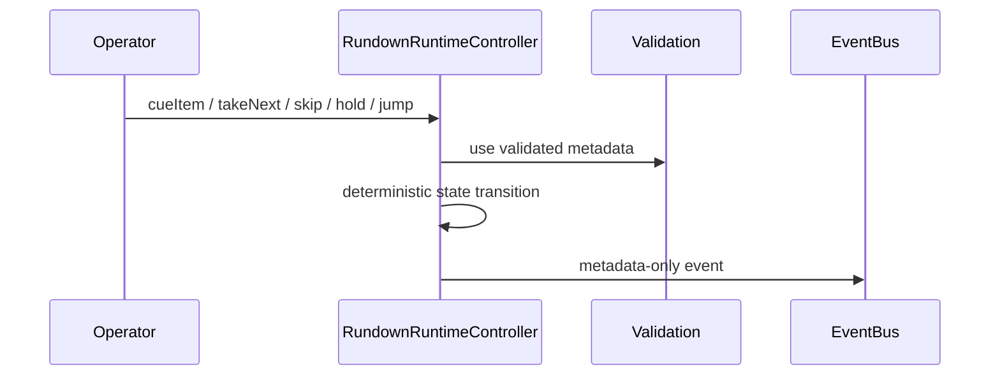

# Rundown Execution

## Command flow

Execution modes are manual, operator-confirmed, timed, scheduled, triggered, automatic-safe, and rehearsal-only.

## TAKE authorization boundary

Rundown take-next changes item execution metadata only. Any Program-changing operation must still be submitted to existing authorized ProductionGraph commands; automatic or rehearsal execution never bypasses production safety guards.
