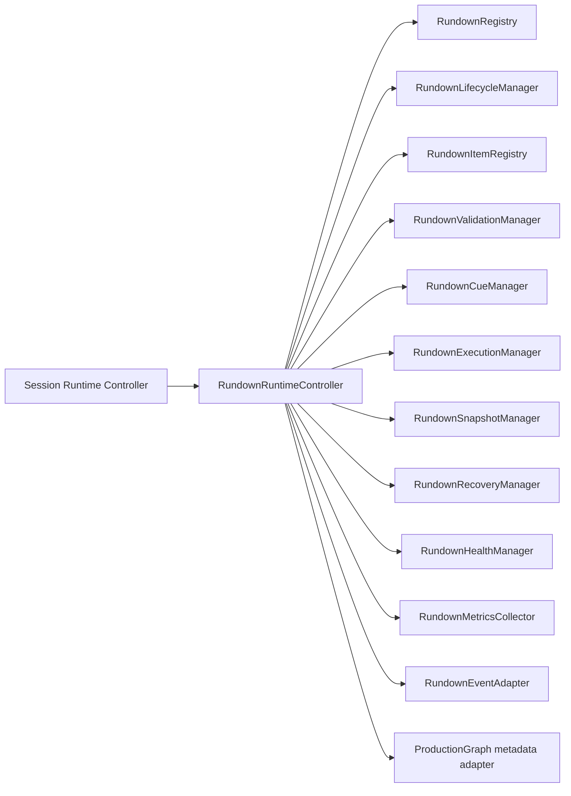

# Rundown Runtime Architecture

UBOS v4.7 adds a metadata-only show-control runtime. `RundownRuntimeController` is the sole owner of rundown lifecycle and item execution orchestration inside the active session; `SessionRuntimeController` remains the owner of the production session.

## Ownership boundaries

- Rundown Runtime owns rundown state, ordered items, cue/next/current pointers, validation state, audit history, snapshots, recovery metadata, health, and metrics.
- ProductionGraph remains authoritative for Program/Preview switching and CUT/TAKE/AUTO commands.
- Device, ingest, output, session, media, audio, graphics, replay, recording, streaming, and automation engines are not rewritten or bypassed.
- No runtime media handles are accepted in items, events, graph metadata, or snapshots.

## Deferred UI work

No rundown UI, teleprompter UI, scheduling UI, collaborative editing, or timeline redesign is implemented in this phase.
