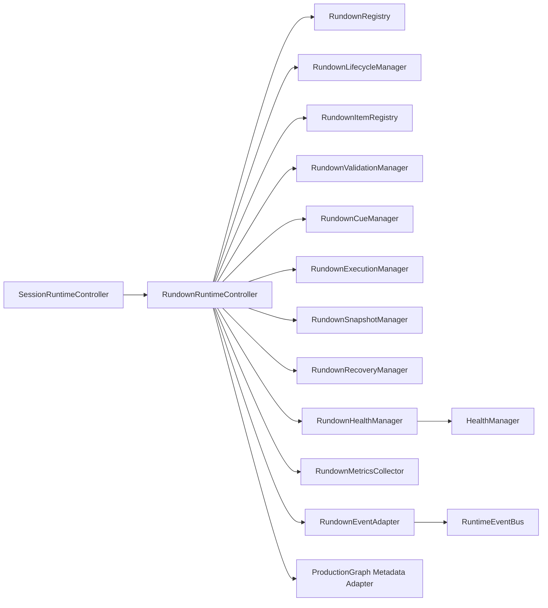

# Rundown Runtime Architecture

SessionRuntimeController remains the production-session owner. RundownRuntimeController owns only rundown lifecycle, metadata validation, cueing, execution state, audit history, snapshots, recovery metadata, health, and metrics inside an active session.

## Ownership boundaries

- No Program switching is performed by rundown APIs.
- CUT, TAKE, AUTO, ProductionGraph switching, media planes, engines, and device runtimes remain owned by existing systems.
- Rundown integration is metadata-only through events and `attachRundownMetadataToGraph`.
- Deferred UI work: no new rundown UI, teleprompter UI, or timeline redesign is implemented.
