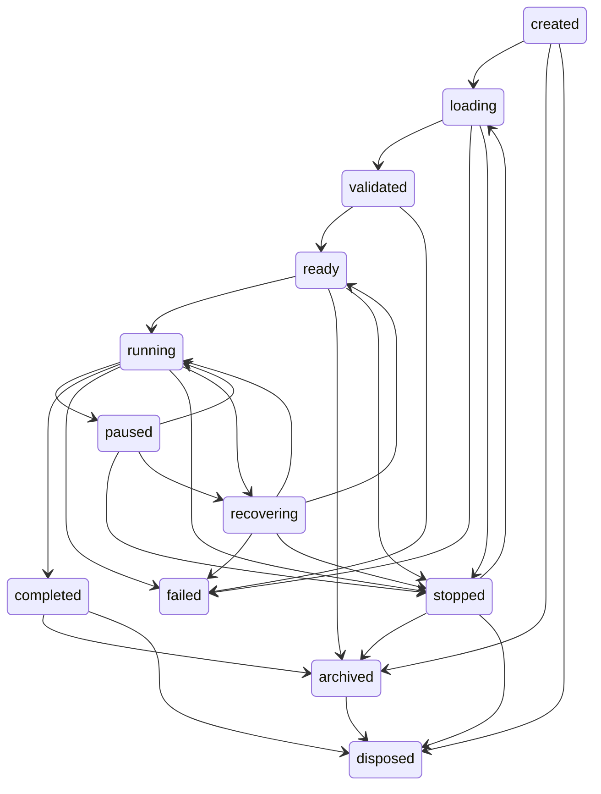

# Rundown State Machine

## Lifecycle diagram

Illegal transitions are rejected by `RundownLifecycleManager`.

## Item state table

| State | Allowed next states |
|---|---|
| pending | validating, ready, cancelled |
| validating | ready, invalid |
| invalid | validating, cancelled |
| ready | cued, next, held, skipped, executing, cancelled |
| cued | next, ready, held, skipped, executing, cancelled |
| next | executing, cued, skipped, held, cancelled |
| executing | completed, failed, held, cancelled |
| completed | recovered |
| skipped | recovered |
| held | ready, cued, executing, skipped, cancelled |
| failed | recovered, cancelled |
| recovered | ready, completed |
| cancelled | none |
