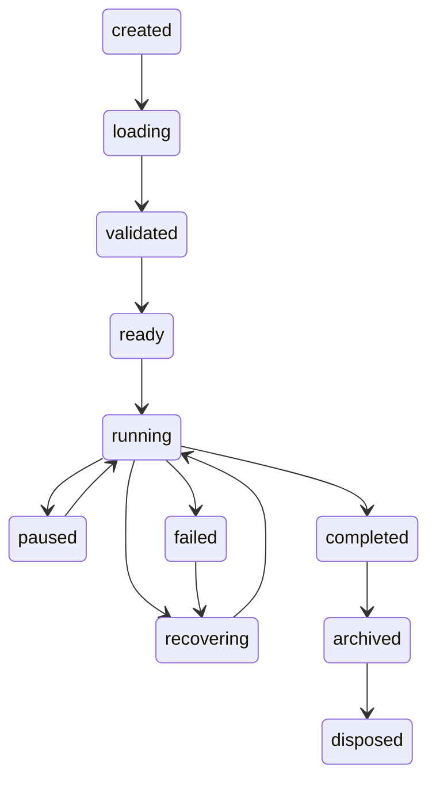

# Rundown State Machine

## Rundown transitions

| State | Allowed next states |
|---|---|
| created | loading, archived, disposed |
| loading | validated, failed, stopped |
| validated | ready, failed, stopped |
| ready | running, archived, stopped, failed |
| running | paused, completed, stopped, failed, recovering |
| paused | running, stopped, failed, recovering |
| recovering | paused, running, failed, stopped, disposed |
| completed | archived, disposed |
| stopped | ready, archived, disposed |
| archived | disposed |
| failed | recovering, stopped, archived, disposed |
| disposed | none |

Illegal transitions throw errors and are audited as rejected/failed command attempts by API callers.

## Item transitions

| State | Allowed next states |
|---|---|
| pending | validating, ready, cancelled |
| validating | ready, invalid |
| invalid | validating, cancelled |
| ready | cued, next, executing, skipped, held, cancelled |
| cued | next, executing, ready, skipped, held, cancelled |
| next | executing, cued, skipped, held, cancelled |
| executing | completed, failed, held |
| completed | recovered |
| skipped | ready, recovered |
| held | ready, executing, skipped, cancelled |
| failed | validating, recovered, cancelled |
| recovered | ready, completed |
| cancelled | none |

