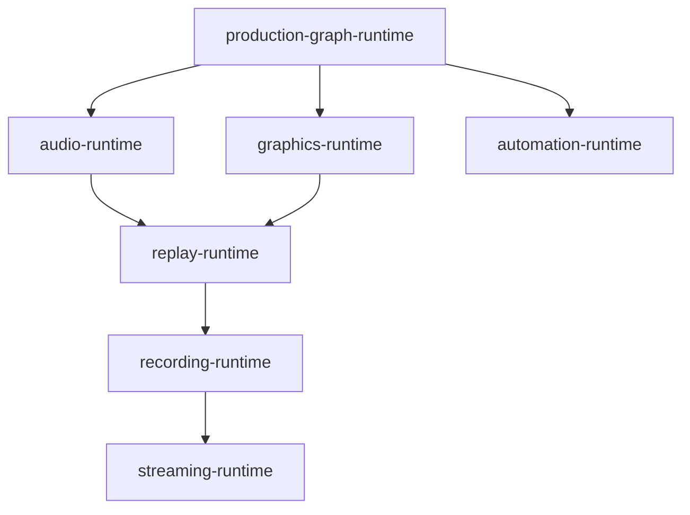
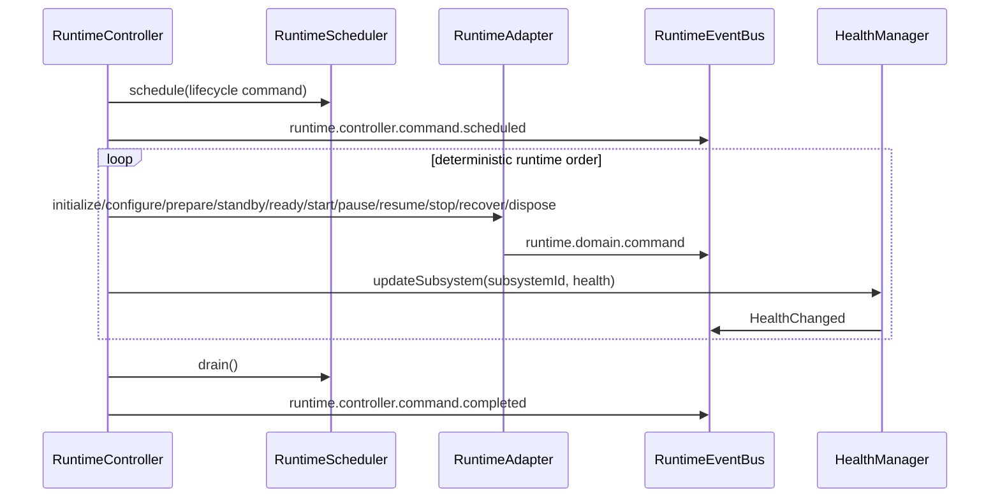

# UBOS Version 4.2 — Runtime Integration Layer

## Runtime integration architecture

The Broadcast Runtime Core is the single production lifecycle coordinator. Existing production systems remain owners of their internal processing, rendering, encoding, switching, media, and UI behavior. The integration layer adds metadata-only runtime adapters that wrap production subsystems without duplicating or replacing subsystem logic.

The `RuntimeController` owns subsystem registration, dependency validation, lifecycle sequencing, event propagation, and runtime dashboard metadata. Runtime adapters expose lifecycle state, health status, startup priority, shutdown priority, dependencies, and recovery hooks. The `RuntimeEventBus` is the required path for lifecycle notifications, and the `HealthManager` is the authoritative aggregate health source.

## Runtime subsystem registration map

| Adapter | Domain | Dependencies | Startup priority | Shutdown priority | Health source |
| --- | --- | --- | ---: | ---: | --- |
| `production-graph-runtime` | production | none | 10 | 70 | `production-graph-runtime:health` |
| `audio-runtime` | audio | `production-graph-runtime` | 25 | 60 | `audio-runtime:health` |
| `graphics-runtime` | graphics | `production-graph-runtime` | 30 | 50 | `graphics-runtime:health` |
| `automation-runtime` | automation | `production-graph-runtime` | 35 | 40 | `automation-runtime:health` |
| `replay-runtime` | replay | `graphics-runtime`, `audio-runtime` | 40 | 30 | `replay-runtime:health` |
| `recording-runtime` | recording | `replay-runtime` | 50 | 20 | `recording-runtime:health` |
| `streaming-runtime` | streaming | `recording-runtime` | 60 | 10 | `streaming-runtime:health` |

Core managers (`DeviceManager`, `SessionManager`, `HealthManager`, and `RuntimeScheduler`) are also lifecycle participants, but they are not adapters for existing production subsystems.

## Dependency graph

Dependency validation rejects missing dependencies and cycles before a registration snapshot is accepted. Startup order is topological with startup-priority tie breaking. Shutdown order is deterministic by shutdown priority so downstream outputs stop before upstream dependencies.

## Lifecycle sequence

Supported lifecycle states are `initialize`, `configure`, `prepare`, `standby`, `ready`, `running`, `paused`, `stopping`, `stopped`, `failed`, and `recovering` equivalents in the runtime state machine. Recovery hooks (`onRecover`, `onRestart`, and `onHealthChange`) are infrastructure only; no automatic recovery behavior is enabled in this phase.

## Runtime dashboard data

Runtime snapshots expose backend/API-only metadata for future dashboards:

- active subsystems and registered adapters
- lifecycle state and revision
- startup and shutdown order
- startup and shutdown duration
- runtime health
- dependency graph
- event count and queued scheduler depth
- metadata-only safety marker (`containsRuntimeHandles: false`)

## Integration certification

Phase 4.2 is certified as non-destructive integration because it introduces adapters and lifecycle wiring only. ProductionGraph, Workspace Manager, Command Center, monitor surfaces, media pipelines, recording, streaming, graphics, replay, and audio implementation logic remain untouched. Existing subsystems continue to own their work; the runtime coordinates lifecycle and health metadata only.
