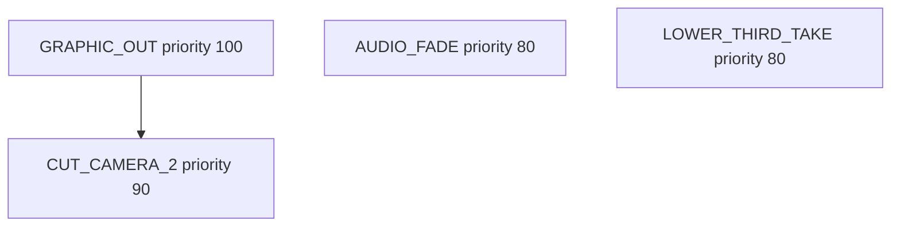
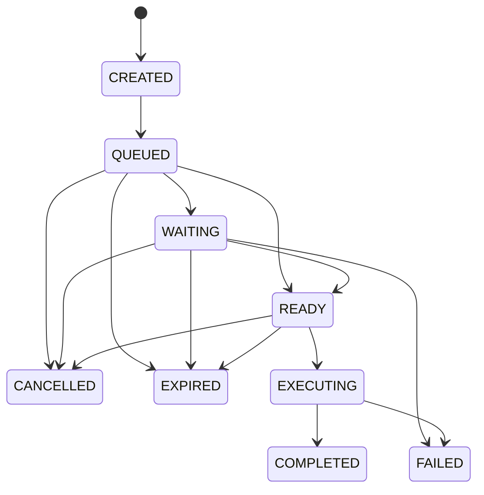

# UBOS v5.1.3 — Deterministic Runtime Scheduler

UBOS v5.1.3 extends the v5.1.1 runtime execution engine and the v5.1.2 Master Frame Clock without redesigning the runtime lifecycle. The scheduler remains metadata-only: it decides command order, readiness, expiry, cancellation, and telemetry, while media acquisition, processing, graphics rendering, recording, streaming, replay, and UI behavior remain out of scope.

## Architecture

The `RuntimeExecutionEngine` still owns lifecycle state, command handlers, processors, telemetry, event publication, and the tick loop. The `RationalMasterFrameClock` remains the authoritative frame source, and `DeterministicCommandScheduler` now owns scheduler records, command lifecycle state, dependency indexes, cancellation, inspection, and queue metrics.

```mermaid
flowchart LR
  Clock[Master Frame Clock] -->|FrameTick| Runtime[RuntimeExecutionEngine]
  Runtime -->|collectDue(frame, now)| Scheduler[DeterministicCommandScheduler]
  Scheduler -->|READY commands| Runtime
  Runtime --> Handlers[CommandHandlerRegistry]
  Runtime --> Telemetry[RuntimeTelemetryCollector]
  Runtime --> Events[RuntimeEventPublisher]
```

## Ordering guarantees

Commands are collected and executed deterministically using:

1. Target frame
2. Scheduled timestamp
3. Priority, highest first
4. Dependency resolution
5. Sequence number
6. Command ID

A due command with dependencies is only emitted when all dependencies are either already completed or are due earlier in the same deterministic batch. This allows scene-switch groups such as `GRAPHIC_OUT -> CUT_CAMERA_2 -> AUDIO_FADE -> LOWER_THIRD_TAKE` to execute on one frame without races.



## Command lifecycle

Every scheduled command is tracked with a validated lifecycle:



Invalid lifecycle transitions raise `InvalidCommandState`.

## Scheduling modes and policies

The scheduler supports immediate commands, target-frame commands, absolute monotonic timestamp commands, and relative frame or nanosecond delay commands. Supported execution policies are:

- `EXECUTE_ONCE`
- `EXECUTE_IF_PRESENT`
- `EXECUTE_UNTIL_SUCCESS`
- `DROP_IF_LATE`
- `RUN_IMMEDIATELY_IF_MISSED`

Missed-frame policy: if `targetFrame <= currentFrame`, the command becomes due, executes once when dependencies are satisfied, and contributes queue-latency/lateness telemetry. It is never discarded silently. `DROP_IF_LATE` is the explicit opt-in exception and expires late commands.

## Dependency model

Dependencies are declared by command ID. The scheduler rejects duplicate IDs, duplicate sequence numbers, invalid priorities, invalid policies, and dependency cycles. During due collection it marks commands with missing, failed, cancelled, or expired dependencies as dependency failures, ensuring unmet dependencies never execute.

## Cancellation and groups

Cancellation is deterministic and ID-sorted. APIs support:

- Cancel by ID
- Cancel subtree, meaning a command and all dependents
- Cancel dependency chain, meaning a command and prerequisites still in the queue
- Cancel group by `groupId`

Groups are optional and inspectable for composite operations such as `SCENE_SWITCH`.

## Inspection API

Inspection calls never mutate scheduler state:

- `listPending()`
- `listWaiting()`
- `listReady()`
- `lookupById(id)`
- `lookupByGroup(groupId)`
- `lookupByDependency(dependencyId)`
- `snapshot()`

## Telemetry and events

Scheduler telemetry is merged into runtime telemetry: pending, ready, waiting, completed, failed, cancelled, expired, queue latency, dependency wait count, commands per second, and maximum queue depth.

Runtime events now include scheduler-specific notifications: `CommandQueued`, `CommandReady`, `CommandExecuting`, `CommandCompleted`, `CommandFailed`, `CommandCancelled`, `CommandExpired`, `DependencySatisfied`, `DependencyFailed`, `SchedulerIdle`, and `SchedulerBusy`.

## Performance characteristics

Insertion and lookup are map-backed. Cancellation uses deterministic sorted ID sets. Cycle checks and due collection walk only queued records. Dependency resolution uses a per-tick candidate map to avoid repeated full-queue scans for each command in typical broadcast batches.

## Future automation support

The scheduler is designed to orchestrate future automation and macro commands without introducing subsystem-owned clocks or media behavior. UBOS v5.1.4 can build command execution retries, transactional behavior, and runtime isolation on top of these deterministic scheduling guarantees.
