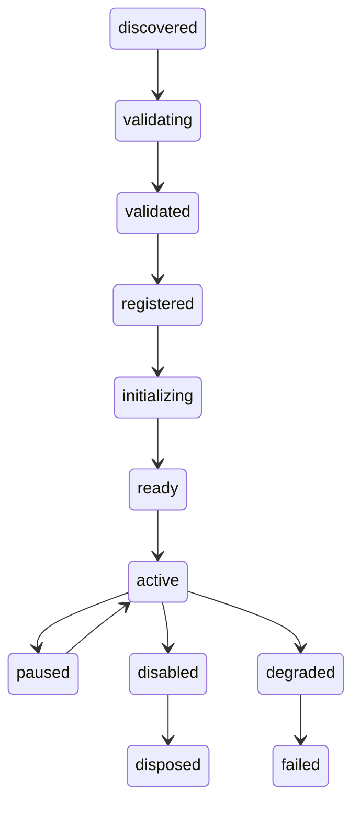

# Plugin Lifecycle

UBOS v4.10 Plugin SDK is a metadata-only, capability-gated extension layer. Plugins declare versioned manifests and interact only through safe SDK helpers: `definePlugin`, `defineManifest`, `registerCommand`, `registerQuery`, `subscribeEvent`, `publishEvent`, `reportHealth`, `publishTelemetry`, `getConfiguration`, `requireCapability`, and `createAuditContext`.



## Manifest example

```json
{ "pluginId": "ubos.system-status-metadata", "sdkVersion": "4.10.0", "sandboxMode": "metadata-only", "requestedCapabilities": ["monitoring.read"], "providedQueries": ["ubos.system-status-metadata.status"] }
```

## Security boundaries
Plugins must not receive DOM, React tree, MediaStream, MediaStreamTrack, AudioContext, RTCPeerConnection, native handles, sockets, filesystem handles, process handles, FFmpeg objects, GPU contexts, encoders, decoders, hardware handles, database clients, secret stores, or raw environment variables.

## Lifecycle, configuration, and health
Lifecycle transitions are deterministic, configuration values are versioned metadata with secret references only, and plugin health is published as metadata for Monitoring Runtime ownership.

## Future adapters and sandbox modes
HTTP, WebSocket, local IPC, and gRPC are boundary adapters in this phase. Isolated worker, native host, and remote extension modes are documented placeholders and are not claimed as implemented.
