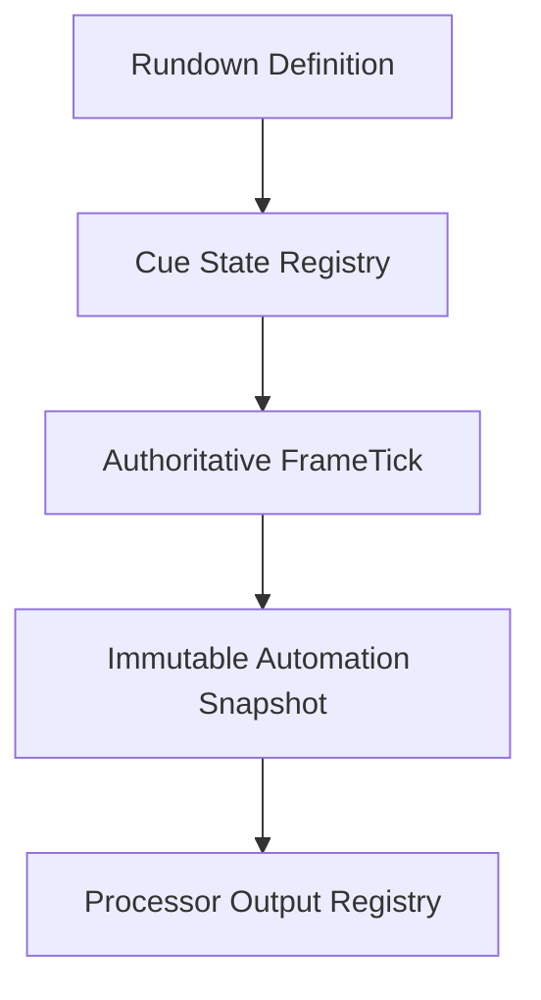

# UBOS v5.10.1 — Production-Safe Automation, Rundown, and Show-Control Foundation

UBOS v5.10.1 adds a metadata-only automation and show-control foundation for deterministic rundown cue coordination.

## Production-safety scope

- Coordinates rundown definitions, cue ordering, cue arming, exact-once takes, holds, skips, completion, health, telemetry, and Source Graph metadata.
- Publishes immutable metadata snapshots from the existing TickProcessor framework.
- Redacts unsafe metadata keys and rejects stale rundown generations.

## Explicit limitations

This phase does not control real devices, send network commands, execute GPI/GPIO/MIDI/OSC, mutate Program directly, render graphics, play media, switch hardware, or create a release tag.
