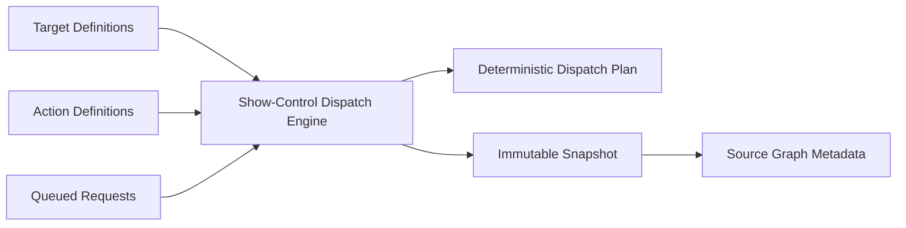

# UBOS v5.10.4 — Show-Control Action Dispatch and Target Coordination

This phase adds a production-safe, metadata-only show-control action dispatch layer. The implementation coordinates target definitions, action definitions, queued action requests, deterministic dispatch ordering, blocked/expired/acknowledged/failed state transitions, Source Graph metadata, runtime telemetry, command handlers, and TickProcessor publication.

The phase remains intentionally metadata-only: it never opens device handles, sends network control, invokes native show-control APIs, or stores raw command payloads. Sensitive metadata keys are redacted before snapshots are published.
