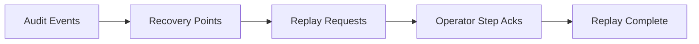

# UBOS v5.10.6 — Automation Recovery, Replay, and Audit Coordination

UBOS v5.10.6 adds a metadata-only recovery, deterministic replay, and audit coordination layer for the automation/show-control platform.

## Production-safety scope

- Stores only redacted metadata; secret-like keys, endpoints, paths, buffers, streams, and native handles are removed.
- Requires generation checks for audit events and recovery points to reject stale writes.
- Uses deterministic recovery hashes over selected audit event IDs and frames before accepting recovery points.
- Replays audit events exactly once and blocks for operator acknowledgements before continuing.
- Publishes immutable snapshots with health, telemetry, and Source Graph identifiers.

## Limitations

This phase does not execute real device, network, or media commands. Replay output is an auditable coordination plan intended for higher-level orchestration and operator-supervised recovery.
