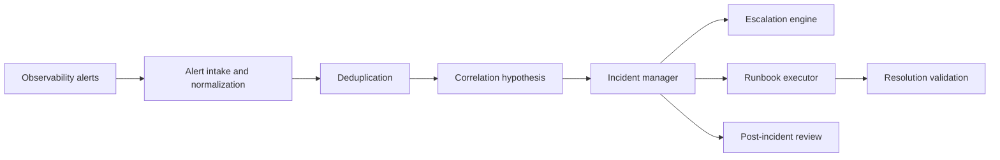

# UBOS v5.11.2 Incident Response, Escalation, and Runbooks

## Architecture

UBOS v5.11.2 adds `packages/core/src/incident-response/` as a metadata-only operational response layer above v5.11.1 observability. It consumes normalized monitoring alerts and creates authoritative incident records without owning media clocks, schedulers, command execution, graphics, audio, replay, recording, streaming, or automation engines.

## Ownership and generation behavior

The `IncidentResponseEngine` owns bounded in-memory metadata for alerts, incidents, assignments, timers, escalation events, runbook definitions, runbook executions, communications, reviews, and audit strings. Public readers use immutable snapshot copies. State changes are attributed to identities, include reasons for sensitive transitions, and preserve audit history for severity changes, acknowledgements, assignments, escalations, status updates, resolution, closure, reopening, and review completion.

## Lifecycle

The lifecycle is alert ingestion, deduplication, correlation, incident creation, severity assignment, ownership, escalation, runbook execution, communication, stabilization, resolution validation, post-incident review, closure, and metrics reporting. Sev0/Sev1 incidents are marked as major incidents and require post-incident review before closure.

## Commands and events

The engine exposes typed methods for alert ingest, correlation, incident creation, acknowledgement, assignment, severity changes, escalation policy registration, escalation evaluation, suppression, runbook registration, runbook start, runbook step completion, status publication, stabilization, resolution, closure, reopening, review creation/completion, metrics, and snapshots. Audit strings mirror the phase event model with metadata-only payloads.

## Health, telemetry, and watchdog behavior

The phase records response timers, acknowledgement deadlines, escalation evaluations, incident metrics, runbook progress, and review requirements. Alert storms are bounded through deduplication keys and recurring observation counts rather than unbounded active incident creation.

## Source Graph and subsystem integration

Incident metadata carries production, site, node, component, output, correlation, and evidence references. It does not expose raw media, credentials, external URLs, native handles, or private transport state. Future Source Graph consumers can join on component and production identifiers without direct subsystem mutation.

## Security and redaction

Sensitive evidence, messages, titles, descriptions, notes, status updates, and runbook results pass through the shared observability redaction helper. Severity changes, escalation suppression, resolution overrides, closure, and reopening require attributable identities and reasons where required. Confirmed root-cause reviews require evidence references.

## Known limitations

This phase provides the deterministic core model and validation harness. External paging, ticketing, mobile response, durable persistence, HA replication, command-bus remediation dispatch, and UI surfaces are represented as metadata boundaries for later integration phases.

## Validation

Required local validation for this phase:

- `pnpm --filter @ubos/core typecheck`
- `pnpm --filter @ubos/core validate:v5.11.2`
- `pnpm --filter @ubos/core lint`
- `git diff --check`
